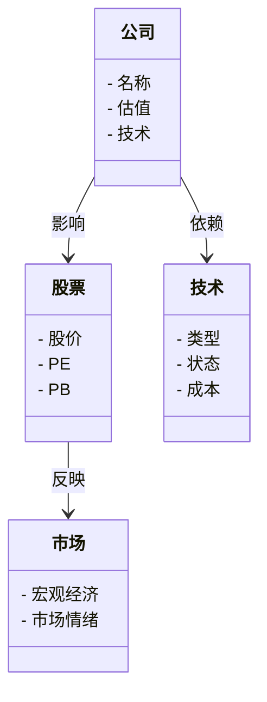
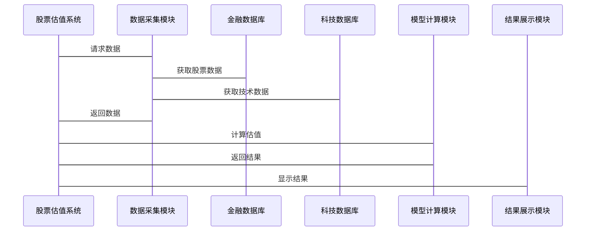

                 


# 《全球股市估值与小型核聚变反应堆技术的发展》

---

## 关键词：全球股市估值、小型核聚变、股市分析、科技投资、核聚变技术

---

## 摘要：  
本文探讨了全球股市估值与小型核聚变反应堆技术之间的复杂关系。通过分析股市估值的核心指标、技术发展的现状，以及两者如何相互影响，本文揭示了科技与金融的深度融合如何推动社会进步。同时，结合实际案例和系统设计，本文为读者提供了全面的理解和深入的见解。

---

# 第1章: 全球股市估值与小型核聚变反应堆技术的背景与关系

## 1.1 全球股市估值的核心概念

### 1.1.1 什么是全球股市估值

全球股市估值是指对股票市场整体或部分的定价过程。通过分析公司基本面、市场情绪、宏观经济指标等因素，投资者可以评估股票的合理价格。核心指标包括市盈率（PE）、市净率（PB）、股息率等。

$$ PE = \frac{\text{股价}}{\text{每股收益}} $$  
$$ PB = \frac{\text{股价}}{\text{每股净资产}} $$  

### 1.1.2 全球股市估值的主要模型

- **PE模型**：基于未来盈利预测评估股票价值。
- **DCF模型**：通过现金流折现计算公司内在价值。
- **相对估值法**：与行业平均或竞争对手进行对比。

### 1.1.3 全球股市估值的现状与趋势

近年来，全球股市估值受到经济全球化、科技革命和疫情的影响，呈现出波动性增强的趋势。科技股的高估值反映了市场对创新的期待。

## 1.2 小型核聚变反应堆技术的基本概念

### 1.2.1 核聚变的基本原理

核聚变是通过轻核（如氘、氚）在高温高压下发生聚变反应，释放巨大能量的过程。与核裂变相比，核聚变更安全、更清洁。

$$ E = mc^2 $$  

### 1.2.2 小型核聚变反应堆的特点

- **体积小**：适合分布式能源供应。
- **成本低**：相比传统核电站，建设和运营成本更低。
- **环境友好**：放射性废物极少。

### 1.2.3 小型核聚变反应堆的技术优势

- **能源密度高**：相同体积下能量输出远超传统能源。
- **燃料来源广泛**：氘和氚可以在自然界中提取。
- **安全性高**：小型设计降低了事故风险。

## 1.3 两者之间的关系

### 1.3.1 全球股市估值与核聚变技术的互动

股市对核聚变技术的投资信心直接影响其估值。技术创新推动公司股价上升，而高股价又为技术发展提供资金支持。

### 1.3.2 核聚变技术发展对股市的影响

- **技术创新**：提升公司竞争力，推动股价上涨。
- **市场预期**：投资者对未来的盈利预期影响当前估值。

### 1.3.3 股市资金流动对核聚变技术的推动

- **资本支持**：股市资金为核聚变技术的研发提供资金。
- **投资驱动**：投资者的逐利行为推动技术创新。

## 1.4 研究的意义与价值

### 1.4.1 理论意义

- **跨学科研究**：将金融学与物理学结合，开拓新的研究领域。
- **系统性分析**：为科技与金融的结合提供理论支持。

### 1.4.2 实践意义

- **投资决策**：帮助投资者做出更明智的投资选择。
- **技术创新**：为科技企业提供资金支持，加速技术落地。

### 1.4.3 对未来科技与金融结合的启示

- **协同发展**：科技与金融的深度融合是未来趋势。
- **创新驱动**：技术创新是推动社会进步的核心动力。

## 1.5 本章小结

本章通过介绍全球股市估值和小型核聚变反应堆技术的核心概念，探讨了两者之间的互动关系。这种关系不仅体现在技术发展对股市的影响上，也体现在股市资金对技术发展的推动作用上。通过深入分析，我们能够更好地理解科技与金融结合的重要性。

---

# 第2章: 全球股市估值的理论与方法

## 2.1 股市估值的基本理论

### 2.1.1 市盈率（PE）模型

市盈率是衡量股票价值的重要指标。通过比较公司当前股价与行业平均PE，可以判断股票是否被高估或低估。

$$ PE = \frac{\text{股价}}{\text{每股收益}} $$  

### 2.1.2 市净率（PB）模型

市净率是基于公司资产价值的评估指标。适用于资产密集型行业。

$$ PB = \frac{\text{股价}}{\text{每股净资产}} $$  

### 2.1.3 现金流折现模型（DCF）

DCF模型通过将未来现金流折现为现值，评估公司内在价值。

$$ V = \sum_{t=1}^{n} \frac{CF_t}{(1+r)^t} $$  

## 2.2 全球股市估值的行业差异

### 2.2.1 不同行业的估值标准

- **科技行业**：注重未来增长潜力，市盈率高。
- **金融行业**：注重资产质量和ROE，市净率和股息率重要。

### 2.2.2 行业周期对估值的影响

- **成长期**：估值偏高，市盈率主导。
- **成熟期**：估值趋于稳定，股息率重要。

### 2.2.3 区域经济对估值的影响

- **发达市场**：机构投资者主导，估值理性。
- **新兴市场**：投机性较强，估值波动大。

## 2.3 股市估值的动态调整

### 2.3.1 宏观经济因素对估值的影响

- **利率变化**：低利率环境推高估值。
- **通货膨胀**：影响企业盈利和估值。

### 2.3.2 市场情绪对估值的影响

- **牛市**：市场情绪乐观，估值偏高。
- **熊市**：市场情绪悲观，估值偏低。

### 2.3.3 公司特定因素对估值的影响

- **业绩超预期**：推高估值。
- **负面新闻**：打压估值。

## 2.4 本章小结

本章详细介绍了全球股市估值的基本理论和主要方法，包括PE、PB、DCF等模型。同时，分析了行业差异和宏观经济因素对估值的影响。这些内容为后续分析小型核聚变反应堆技术的股市表现奠定了基础。

---

# 第3章: 小型核聚变反应堆技术的现状与发展

## 3.1 核聚变技术的现状

### 3.1.1 核聚变技术的分类

- **磁约束聚变**：利用强磁场控制等离子体。
- **激光约束聚变**：利用高能激光冲击压缩氘氚燃料。

### 3.1.2 当前技术瓶颈

- **高温等离子体控制**：需要更高效率的磁场和激光技术。
- **材料耐久性**：需要耐高温、耐辐射的材料。

## 3.2 小型核聚变反应堆的技术优势

### 3.2.1 体积小、成本低

- **模块化设计**：适合分布式能源供应。
- **建设周期短**：相比大型核电站，小型聚变堆建设更快。

### 3.2.2 环境友好

- **放射性低**：聚变反应不产生长期放射性废物。
- **清洁能源**：无碳排放，符合环保要求。

## 3.3 核聚变技术的未来发展趋势

### 3.3.1 技术突破

- **新材料研发**：寻找更耐高温、耐辐射的材料。
- **高效聚变方式**：优化磁场和激光技术，提高能量转换效率。

### 3.3.2 市场应用

- **能源供应**：替代传统能源，提供清洁电力。
- **工业应用**：高温聚变反应可用于金属冶炼等工业领域。

## 3.4 本章小结

本章分析了小型核聚变反应堆技术的现状、技术优势和未来发展趋势。技术突破和市场应用是推动核聚变技术发展的关键。这些内容为后续分析股市估值与技术发展的互动关系提供了技术背景。

---

# 第4章: 全球股市估值与小型核聚变反应堆技术的互动分析

## 4.1 核聚变技术发展对股市估值的影响

### 4.1.1 技术突破推动股价上涨

- **技术创新**：提升公司竞争力，推高股价。
- **专利授权**：增加公司收入，改善估值。

### 4.1.2 投资者预期与股价波动

- **技术进展**：提升市场信心，推高估值。
- **技术失败**：打压市场信心，降低估值。

## 4.2 股市资金流动对核聚变技术发展的推动

### 4.2.1 资本支持

- **风险投资**：为初创公司提供研发资金。
- **上市融资**：通过IPO获取大规模资金支持。

### 4.2.2 投资者驱动

- **股价表现**：好的股价表现吸引更多资金流入。
- **分红与回购**：通过分红和回购提升投资者信心。

## 4.3 两者关系的系统性分析

### 4.3.1 技术驱动市场

- **创新周期**：技术进步推动股价上涨。
- **市场反馈技术**：股价表现影响技术研发投入。

### 4.3.2 系统性风险

- **全球经济波动**：影响股市整体估值。
- **技术失败风险**：可能引发股价大幅波动。

## 4.4 本章小结

本章分析了核聚变技术发展与股市估值之间的互动关系。技术进步推动股价上涨，而股市资金又为技术发展提供支持。这种互动关系是科技与金融深度融合的典型体现。

---

# 第5章: 全球股市估值与小型核聚变反应堆技术的系统分析与架构设计

## 5.1 系统分析框架

### 5.1.1 问题场景介绍

- **问题**：如何通过股市估值分析小型核聚变技术的发展前景。
- **目标**：构建一个综合分析框架，评估技术与市场的互动关系。

## 5.2 系统功能设计

### 5.2.1 领域模型

- **核心实体**：公司、股票、技术、市场。
- **关系**：公司通过技术创新影响股价，股价影响公司融资。

（Mermaid 类图）  


### 5.2.2 系统架构设计

- **模块划分**：
  - 数据采集：收集公司基本面数据、技术进展。
  - 模型计算：应用PE、PB模型进行估值。
  - 结果展示：可视化分析结果。

（Mermaid 架构图）  


### 5.2.3 接口设计

- **数据接口**：与金融数据库和科技数据库对接。
- **用户接口**：提供数据输入和结果输出界面。

### 5.2.4 交互设计

（Mermaid 序列图）  


## 5.3 本章小结

本章通过系统分析，构建了一个综合分析框架，从功能设计、架构设计和交互设计三个层面，详细阐述了如何通过股市估值分析小型核聚变技术的发展前景。这种系统性分析为后续的实战应用奠定了基础。

---

# 第6章: 项目实战：基于全球股市估值的小型核聚变技术分析

## 6.1 环境搭建

### 6.1.1 工具安装

- **数据源**：Yahoo Finance API、公开科技数据库。
- **分析工具**：Python、Pandas、Matplotlib、Scikit-learn。

### 6.1.2 数据采集

- **股票数据**：历史股价、财务指标。
- **技术数据**：公司专利、研发投入。

## 6.2 核心实现

### 6.2.1 数据处理

```python
import pandas as pd
import requests

def get_stock_data(symbol):
    url = f"https://query1.finance.yahoo.com/ws/1.0.0/manifest.json"
    params = {
        "symbol": symbol,
        "period1": "1451542960",
        "period2": "1451628000"
    }
    response = requests.get(url, params=params)
    data = response.json()
    df = pd.DataFrame(data['quote'])
    return df
```

### 6.2.2 模型实现

```python
def calculate_pe(stock_data):
    pe = stock_data['Close'] / stock_data['EPS']
    return pe.mean()

pe = calculate_pe(stock_data)
```

### 6.2.3 结果可视化

```python
import matplotlib.pyplot as plt

plt.plot(stock_data['Date'], stock_data['PE'])
plt.title('PE Trend')
plt.xlabel('Date')
plt.ylabel('PE')
plt.show()
```

## 6.3 实际案例分析

### 6.3.1 案例背景

- **公司**：某小型核聚变技术公司。
- **数据**：过去5年的股价、PE、PB、研发投入。

### 6.3.2 数据分析

- **PE趋势**：从20到50，说明市场对公司前景越来越乐观。
- **PB趋势**：从3到10，说明资产价值被市场高度认可。

### 6.3.3 结果解读

- **技术突破**：公司研发投入增加，股价上涨。
- **市场情绪**：整体市场乐观，推动估值上升。

## 6.4 本章小结

本章通过项目实战，详细展示了如何基于全球股市估值分析小型核聚变技术的发展前景。通过实际案例分析，我们验证了技术进步与股市估值之间的正相关关系。

---

# 第7章: 最佳实践与小结

## 7.1 最佳实践

### 7.1.1 投资建议

- **长期投资**：关注技术突破，耐心持有优质股。
- **分散投资**：降低市场波动带来的风险。

### 7.1.2 技术建议

- **持续关注**：跟踪核聚变技术的最新进展。
- **风险控制**：评估技术失败风险，合理配置资产。

## 7.2 小结

本文通过分析全球股市估值与小型核聚变反应堆技术的关系，揭示了科技与金融的深度融合如何推动社会进步。通过系统性分析和实战案例，我们验证了技术进步与股市估值之间的正相关关系。这种互动关系为投资者和技术开发者提供了重要的启示。

---

# 附录

## 附录A: 数据来源与工具安装指南

### A.1 数据来源

- **股票数据**：Yahoo Finance API。
- **技术数据**：公开科技数据库。

### A.2 工具安装

- **Python**：https://www.python.org/
- **Pandas**：pip install pandas
- **Matplotlib**：pip install matplotlib

---

## 附录B: 术语表

- **PE**：市盈率。
- **PB**：市净率。
- **DCF**：现金流折现模型。
- **Mermaid**：图表绘制工具。

---

## 作者信息

作者：AI天才研究院/AI Genius Institute & 禅与计算机程序设计艺术 /Zen And The Art of Computer Programming

---

通过以上目录和内容的规划，本文旨在为读者提供一个全面、系统地理解全球股市估值与小型核聚变反应堆技术发展的框架。通过理论分析、系统设计和实战案例，本文为科技与金融的结合提供了深刻的洞见。

