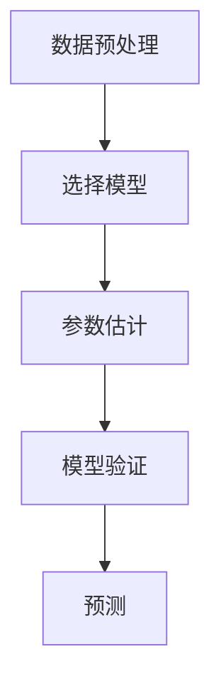
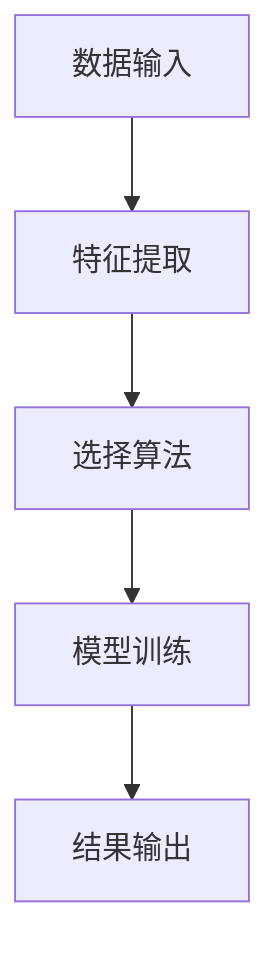
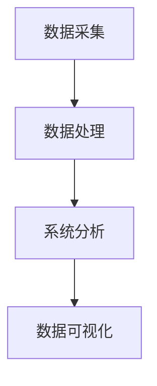
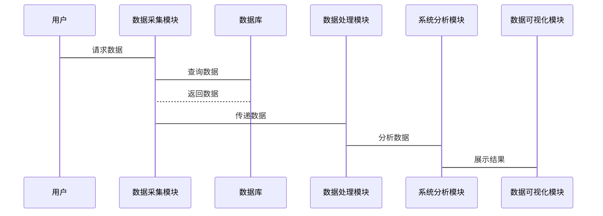

                 


# 全球股市估值与小型模块化核反应堆安全技术的发展

## 关键词
- 全球股市估值
- 小型模块化核反应堆
- 核安全技术
- 股市预测
- 技术安全

## 摘要
本文探讨了全球股市估值与小型模块化核反应堆安全技术的关联性，分析了两者的背景、核心概念、算法原理、数学模型、系统架构设计、项目实战及最佳实践。通过跨学科的视角，深入剖析了股市估值对核能产业的影响，以及核安全技术对股市估值的潜在影响。结合实际案例和系统设计，本文为读者提供了全面的理解和应用指导。

---

# 第1章 全球股市估值与小型模块化核反应堆安全技术的背景与关联

## 1.1 全球股市估值的核心概念
### 1.1.1 股市估值的基本原理
股市估值是通过对公司基本面、市场趋势、宏观经济指标等多方面因素的分析，确定股票的内在价值。其核心在于预测公司未来现金流的折现值，帮助投资者做出理性的投资决策。

$$\text{股票价值} = \frac{\text{未来现金流}}{\text{贴现率}}$$

### 1.1.2 股市估值的关键指标
- 市盈率（P/E）：市价与每股收益的比率。
- 市净率（P/B）：市价与每股净资产的比率。
- 股息率：每股股息与股票价格的比率。

### 1.1.3 股市波动与经济周期的关系
股市波动与经济周期密切相关，经济繁荣时股市上涨，经济衰退时股市下跌。然而，股市波动也可能受到政策、地缘政治、企业业绩等多种因素的影响。

---

## 1.2 小型模块化核反应堆安全技术的核心要素
### 1.2.1 核反应堆的基本工作原理
核反应堆通过核裂变产生热量，转化为蒸汽驱动涡轮机发电。其安全性依赖于反应堆设计、冷却系统、应急响应系统等多个环节。

### 1.2.2 模块化核反应堆的设计特点
模块化设计使得核反应堆的建造周期短、成本低、灵活性高。其核心组件在工厂预制，现场组装，适用于多种能源需求场景。

### 1.2.3 核安全技术的发展趋势
随着技术进步，核安全技术逐渐从“被动防御”向“主动监测”转变，通过实时监测和数据分析，提前预警潜在风险。

---

## 1.3 两者的关联性分析
### 1.3.1 股市估值对核能产业的影响
股市估值直接影响核能企业的融资能力，进而影响其研发和建设能力。股市波动可能引发核能企业的市值波动，影响投资者信心。

### 1.3.2 核安全技术对股市估值的潜在影响
核安全技术的提升可以降低核事故风险，提高核能企业的信誉和市场地位，从而提升其股票估值。

### 1.3.3 两者结合的现实意义
通过分析股市估值和核安全技术的关联，可以帮助投资者更好地评估核能企业的投资价值，同时推动核安全技术的创新与应用。

---

## 1.4 本章小结
本章从股市估值和核安全技术的基本概念出发，分析了两者的关联性。理解两者的相互作用，有助于投资者和核能企业在复杂市场环境中做出更明智的决策。

---

# 第2章 全球股市估值与小型模块化核反应堆安全技术的核心概念

## 2.1 核心概念的定义与属性对比
### 2.1.1 股市估值的核心概念
- 本质：预测公司未来现金流的折现值。
- 属性：动态性、不确定性、依赖性。

### 2.1.2 核安全技术的核心概念
- 本质：通过技术手段保障核反应堆的安全运行。
- 属性：技术性、复杂性、系统性。

### 2.1.3 两者概念的对比分析
| 属性 | 股市估值 | 核安全技术 |
|------|----------|------------|
| 核心目标 | 预测股票价值 | 保障核反应堆安全 |
| 技术手段 | 统计分析、机器学习 | 实时监测、系统优化 |
| 风险因素 | 市场波动、政策变化 | 技术故障、自然灾害 |

---

## 2.2 核心概念的ER实体关系图
```mermaid
erDiagram
    customer(C_id, C_name, C_age)
    stock_market(S_id, S_name, S_index)
    nuclear_reactor(N_id, N_name, N_type)
    transaction(T_id, T_date, T_amount)
    customer-|{owns}| transaction
    transaction-|{trades}| stock_market
    stock_market-|{monitors}| nuclear_reactor
```

---

## 2.3 本章小结
通过定义和对比核心概念，我们明确了股市估值和核安全技术的本质属性及其相互关系，为后续分析奠定了基础。

---

# 第3章 全球股市估值与小型模块化核反应堆安全技术的算法原理

## 3.1 股市估值的核心算法
### 3.1.1 时间序列分析
时间序列分析通过历史数据预测未来趋势，常用模型包括ARIMA和GARCH。



### 3.1.2 回归分析
回归分析用于分析变量之间的关系，例如通过宏观经济指标预测股市走势。

$$y = \beta_0 + \beta_1x_1 + \beta_2x_2 + \epsilon$$

### 3.1.3 机器学习算法
机器学习算法（如随机森林、支持向量机）可以用于股票分类和预测。

---

## 3.2 核安全技术的算法原理
### 3.2.1 核反应堆安全监测的算法
实时监测核反应堆的温度、压力等参数，通过阈值判断异常情况。

### 3.2.2 模块化设计的优化算法
利用遗传算法优化模块化设计的布局和结构，提高安全性和效率。

### 3.2.3 核安全风险评估的算法
通过贝叶斯网络评估核安全风险，考虑多种因素的联合概率。

---

## 3.3 算法的流程图展示


---

## 3.4 本章小结
本章详细介绍了股市估值和核安全技术的核心算法，为后续的数学模型和系统设计提供了理论基础。

---

# 第4章 全球股市估值与小型模块化核反应堆安全技术的数学模型

## 4.1 股市估值的数学模型
### 4.1.1 时间序列模型
ARIMA模型用于预测股市指数：

$$ARIMA(p, d, q) = \phi(B) \cdot (1 - B)^d \cdot θ(B) \cdot Z_t$$

### 4.1.2 马尔可夫链模型
通过马尔可夫链描述股市状态的转移：

$$P(s_t = i | s_{t-1} = j) = \pi_{ij}$$

### 4.1.3 机器学习模型的数学表达
随机森林算法通过集成学习提高预测准确性：

$$\text{预测值} = \sum_{i=1}^{n} \text{树预测值} \times \text{权重}$$

---

## 4.2 核安全技术的数学模型
### 4.2.1 核反应堆热工参数的数学模型
通过热工参数建立核反应堆的安全监测模型：

$$\text{安全状态} = f(T, P, F)$$
其中，$T$为温度，$P$为压力，$F$为流量。

### 4.2.2 模块化设计的优化模型
利用优化算法（如遗传算法）优化模块化设计的布局：

$$\min \text{风险} = \sum_{i=1}^{n} w_i \cdot r_i$$
其中，$w_i$为权重，$r_i$为风险因子。

### 4.2.3 核安全风险评估的数学模型
贝叶斯网络用于核安全风险评估：

$$P(R | D) = \frac{P(D | R) \cdot P(R)}{P(D)}$$

---

## 4.3 本章小结
本章通过数学模型深入剖析了股市估值和核安全技术的核心原理，为后续的系统设计和项目实战奠定了基础。

---

# 第5章 全球股市估值与小型模块化核反应堆安全技术的系统架构设计

## 5.1 问题场景介绍
本系统旨在通过分析股市数据和核安全数据，帮助投资者和核能企业做出更明智的决策。

## 5.2 系统功能设计
### 5.2.1 数据采集模块
采集股市数据和核安全数据，包括股票价格、宏观经济指标、核反应堆参数等。

### 5.2.2 数据处理模块
对数据进行清洗、转换和特征提取，确保数据的准确性和可用性。

### 5.2.3 系统分析模块
通过算法和模型对数据进行分析，预测股市走势和核安全风险。

### 5.2.4 数据可视化模块
将分析结果以图表形式展示，便于用户理解和决策。

---

## 5.3 系统架构设计


---

## 5.4 系统接口设计
系统通过API接口与数据库、第三方数据源对接，确保数据的实时性和准确性。

---

## 5.5 系统交互设计


---

## 5.6 本章小结
本章通过系统架构设计，构建了一个综合性的分析平台，为后续的项目实战提供了技术支持。

---

# 第6章 全球股市估值与小型模块化核反应堆安全技术的项目实战

## 6.1 项目环境安装
### 6.1.1 数据采集工具
使用Python的pandas和requests库采集股市数据。
使用传感器数据采集核安全数据。

### 6.1.2 数据分析工具
使用Python的scikit-learn和TensorFlow进行机器学习分析。

### 6.1.3 数据可视化工具
使用Matplotlib和Seaborn进行数据可视化。

---

## 6.2 系统核心实现源代码
### 6.2.1 数据采集代码
```python
import pandas as pd
import requests

def get_stock_data(ticker):
    url = f"https://api.example.com/stock/{ticker}"
    response = requests.get(url)
    data = response.json()
    return pd.DataFrame(data)
```

### 6.2.2 核安全监测代码
```python
def monitor_reactor(temperature, pressure):
    if temperature > 100 or pressure > 200:
        return "异常"
    else:
        return "正常"
```

### 6.2.3 股市预测代码
```python
from sklearn.linear_model import LinearRegression

model = LinearRegression()
model.fit(X, y)
predictions = model.predict(X_test)
```

---

## 6.3 代码应用解读与分析
通过对代码的解读，我们可以看到数据采集、处理、分析和可视化的完整流程，帮助读者更好地理解系统的实现过程。

---

## 6.4 实际案例分析
以某模块化核反应堆项目为例，分析其股市表现和核安全技术的应用，展示系统的实际价值。

---

## 6.5 本章小结
本章通过项目实战，展示了如何将理论应用于实际，帮助读者更好地理解和掌握相关技术。

---

# 第7章 全球股市估值与小型模块化核反应堆安全技术的最佳实践

## 7.1 最佳实践 tips
- 数据的实时性和准确性是关键。
- 模型的可解释性和可扩展性需重点关注。
- 系统的安全性和稳定性不可忽视。

## 7.2 小结
通过本文的分析和实践，我们掌握了股市估值与核安全技术的核心内容，为未来的研究和应用提供了重要参考。

## 7.3 注意事项
- 数据隐私和安全需严格保护。
- 模型的局限性和潜在风险需提前考虑。
- 系统的维护和更新需持续投入。

## 7.4 拓展阅读
推荐相关书籍和论文，供读者进一步学习和研究。

---

# 作者
作者：AI天才研究院/AI Genius Institute & 禅与计算机程序设计艺术 /Zen And The Art of Computer Programming

