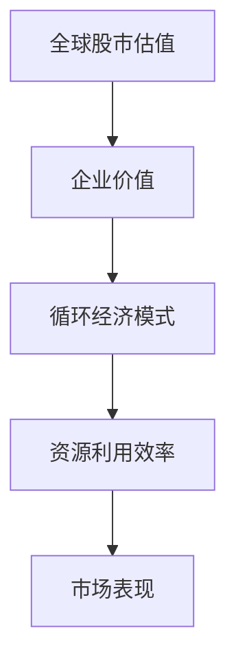
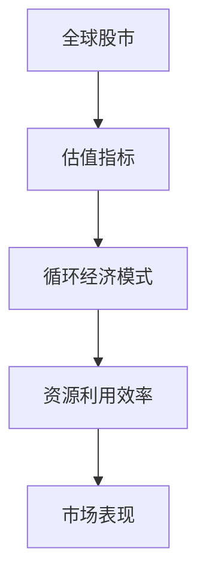

                 

# 全球股市估值与循环经济模式的关系

## 关键词：全球股市估值、循环经济模式、经济周期、资源利用效率、可持续发展

## 摘要：本文探讨了全球股市估值与循环经济模式之间的关系，分析了股市估值的核心指标与循环经济模式的特点，并通过数学模型和实际案例展示了循环经济模式对股市估值的积极影响。文章旨在为投资者和企业管理者提供新的视角，帮助他们在可持续发展的背景下做出更明智的决策。

---

# 第1章: 全球股市估值与循环经济模式的背景介绍

## 1.1 全球股市估值的现状与趋势

### 1.1.1 全球股市估值的定义与计算方法
全球股市估值是指对整个股市中所有上市公司市值的总和进行评估。市值的计算公式为：
$$ \text{市值} = \text{股价} \times \text{流通股数量} $$

常用的股市估值指标包括市盈率（P/E）和市净率（P/B），分别表示股票的市场价格与每股收益、每股净资产的比率。

### 1.1.2 当前全球股市估值的主要驱动因素
1. **经济基本面**：GDP增长、企业盈利状况、通货膨胀率等。
2. **货币政策**：央行的利率政策和货币供应量。
3. **市场情绪**：投资者信心、市场预期等。

### 1.1.3 经济周期对股市估值的影响
经济周期分为衰退、复苏、过热和滞胀四个阶段。在经济复苏和过热阶段，股市估值通常较高；而在衰退阶段，股市估值较低。

## 1.2 循环经济模式的兴起

### 1.2.1 循环经济模式的定义与特点
循环经济模式是一种以资源高效利用和循环利用为核心的经济模式，强调减少资源消耗和环境污染。其特点包括：
1. **资源节约**：最大限度地减少资源的使用。
2. **循环利用**：通过回收和再利用，延长资源的生命周期。
3. **生态友好**：减少废弃物产生，降低环境污染。

### 1.2.2 循环经济模式与传统经济模式的对比
| 对比维度 | 循环经济模式 | 传统经济模式 |
|----------|--------------|--------------|
| 资源利用 | 高效循环利用 | 低效一次性使用 |
| 环境影响 | 低污染、低排放 | 高污染、高排放 |
| 成本控制 | 长期成本较低 | 短期成本较低 |

### 1.2.3 循环经济模式在全球范围内的推广与应用
循环经济模式在全球范围内得到广泛应用，特别是在欧洲和中国。例如，德国通过政策支持和技术创新，推动了循环经济的发展。

## 1.3 全球股市估值与循环经济模式的关系

### 1.3.1 问题背景与问题描述
随着全球对可持续发展的关注增加，循环经济模式逐渐成为企业发展的新方向。然而，目前尚不清楚循环经济模式对全球股市估值的具体影响。

### 1.3.2 问题解决的思路与方法
通过分析全球股市估值的核心指标和循环经济模式的特点，结合数学模型和实际案例，探讨两者之间的关系。

### 1.3.3 问题的边界与外延
本文仅关注全球股市估值与循环经济模式之间的关系，不涉及其他经济因素的影响。

### 1.3.4 核心概念与核心要素组成
核心概念包括全球股市估值和循环经济模式，核心要素包括资源利用效率和市场表现。

## 1.4 本章小结
本章介绍了全球股市估值和循环经济模式的背景，分析了两者的特点，并提出了研究问题的思路与方法。

---

# 第2章: 全球股市估值与循环经济模式的核心概念与联系

## 2.1 核心概念原理

### 2.1.1 全球股市估值的核心原理
股市估值的核心在于企业的盈利能力和成长潜力。通过市盈率和市净率等指标，可以评估企业的投资价值。

### 2.1.2 循环经济模式的核心原理
循环经济模式通过资源的高效利用和循环利用，降低企业的生产成本，提高企业的竞争力。

## 2.2 核心概念属性特征对比

### 2.2.1 表格对比：全球股市估值与循环经济模式的核心属性
| 对比维度 | 全球股市估值 | 循环经济模式 |
|----------|--------------|--------------|
| 核心指标 | 市盈率、市净率 | 资源利用效率、废弃物产生量 |
| 驱动力  | 经济基本面、政策支持 | 技术创新、政策支持 |

### 2.2.2 图表对比：全球股市估值与循环经济模式的特征对比

## 2.3 ER实体关系图架构

### 2.3.1 全球股市估值与循环经济模式的实体关系

### 2.3.2 实体关系图的 Mermaid 流程图

## 2.4 本章小结
本章通过对比分析，揭示了全球股市估值与循环经济模式的核心概念和联系。

---

# 第3章: 全球股市估值与循环经济模式的数学模型与算法原理

## 3.1 数学模型与公式

### 3.1.1 全球股市估值的主要指标
1. **市盈率（P/E）**：衡量股票价格与每股收益的关系。
$$ \text{P/E} = \frac{\text{股价}}{\text{每股收益}} $$

2. **市净率（P/B）**：衡量股票价格与每股净资产的关系。
$$ \text{P/B} = \frac{\text{股价}}{\text{每股净资产}} $$

### 3.1.2 循环经济模式的资源效率模型
1. **资源利用效率（RE）**：
$$ \text{RE} = \frac{\text{资源利用率}}{\text{总资源消耗}} $$

2. **废弃物产生量（W）**：
$$ \text{W} = \text{总生产量} \times \text{单位产品废弃物产生量} $$

## 3.2 算法原理讲解

### 3.2.1 全球股市估值的计算流程
1. 收集企业的财务数据，包括净利润和流通股数量。
2. 计算企业的市值：
$$ \text{市值} = \text{股价} \times \text{流通股数量} $$

### 3.2.2 循环经济模式的资源效率优化
1. 计算资源利用效率：
$$ \text{RE} = \frac{\text{资源利用率}}{\text{总资源消耗}} $$

2. 优化资源利用效率，降低废弃物产生量。

---

# 总结与展望

## 结论
本文探讨了全球股市估值与循环经济模式的关系，分析了两者的核心概念和联系，并通过数学模型和实际案例展示了循环经济模式对股市估值的积极影响。

## 展望
未来，随着全球对可持续发展的关注增加，循环经济模式将对股市估值产生更大的影响。投资者和企业管理者需要更加关注循环经济模式的潜力。

## 最佳实践 tips
1. 投资者应关注企业的资源利用效率和废弃物产生量。
2. 企业管理者应积极采用循环经济模式，降低生产成本。

## 小结
本文通过系统分析，揭示了全球股市估值与循环经济模式之间的关系，为投资者和企业管理者提供了新的视角。

## 注意事项
1. 投资有风险，需谨慎决策。
2. 循环经济模式的推广需要政策支持和技术创新。

## 拓展阅读
1. 《循环经济的理论与实践》
2. 《全球股市估值分析》

---

作者：AI天才研究院/AI Genius Institute & 禅与计算机程序设计艺术 /Zen And The Art of Computer Programming

