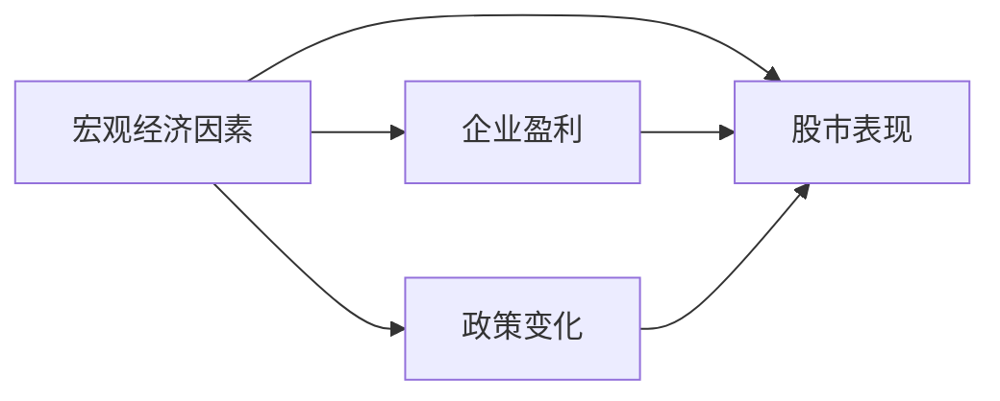
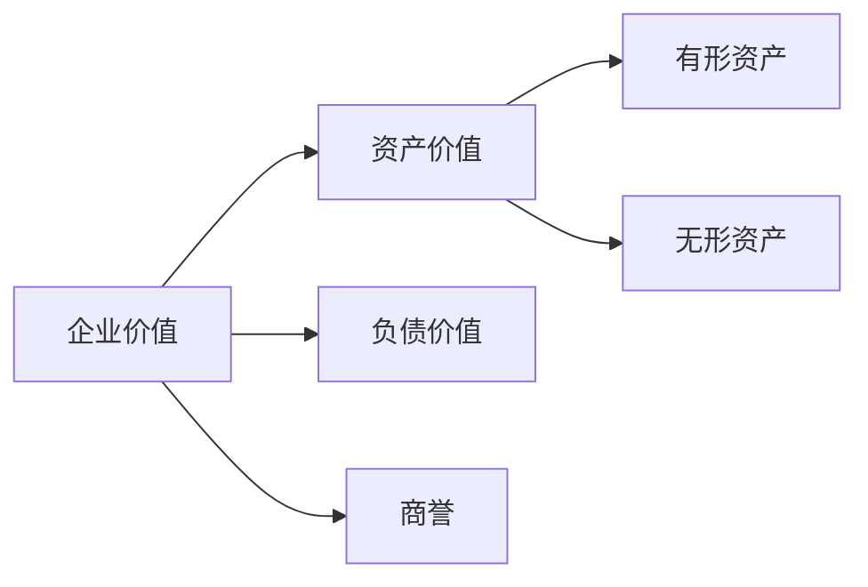
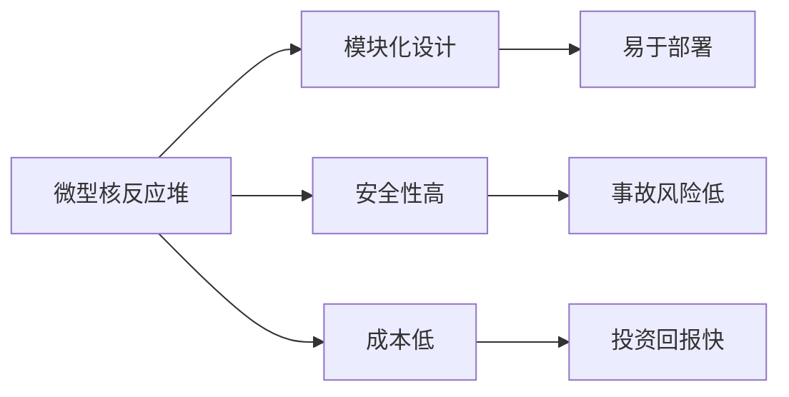
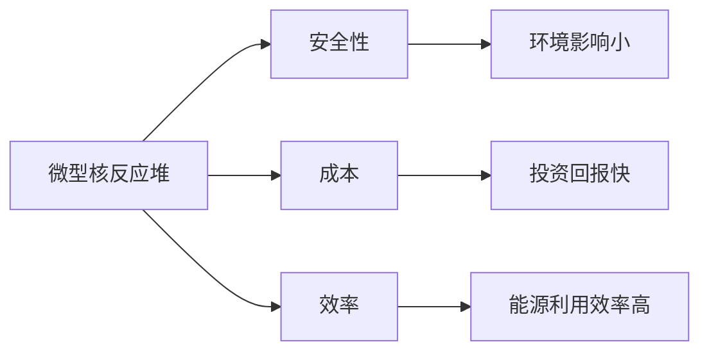
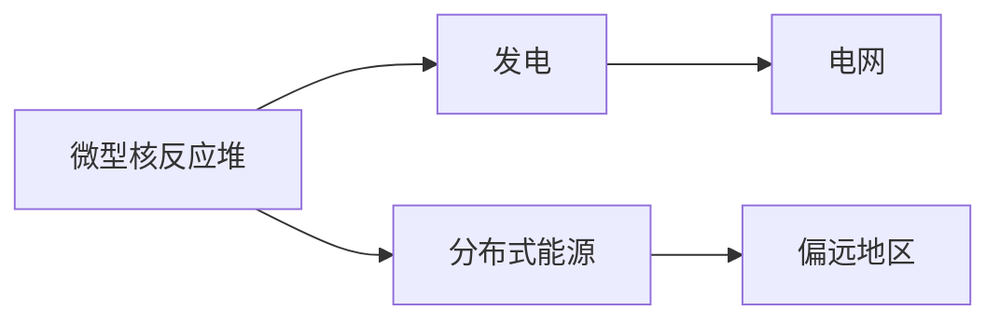
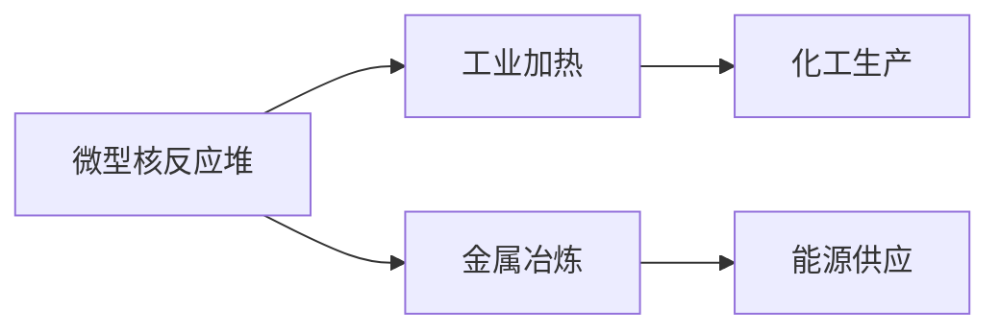

                 


# 全球股市估值与微型核反应堆技术的发展

## 关键词：
- 全球股市估值
- 微型核反应堆
- 核能技术
- 股市分析
- 技术发展

## 摘要：
本文探讨了全球股市估值与微型核反应堆技术发展的相互影响。通过分析股市估值的基本概念、影响因素，以及微型核反应堆的技术特点和应用领域，揭示了两者之间的关联。结合实际案例和系统分析，本文详细讲解了技术进步如何影响股市估值，以及股市资金如何支持技术发展，为投资者和技术开发者提供了 valuable insights.

---

## 第1章: 全球股市估值基础

### 1.1 股市估值的核心概念

#### 1.1.1 股市估值的定义与背景
股市估值是指对上市公司股票价值的评估，是投资者在股票市场中进行投资决策的重要依据。股市估值的核心在于确定股票的内在价值，即公司未来现金流的现值。股票市场的波动性和不确定性使得股市估值成为一门复杂的科学。

**背景介绍：**
- 股票市场是资金流动的重要平台，企业的价值通过股价反映。
- 股市估值帮助投资者识别低估或高估的股票，从而做出投资决策。

**核心概念：**
- 股票的内在价值与市场价值之间的差异。
- 影响股市估值的主要因素，如宏观经济、企业业绩、市场情绪等。

**关联性分析：**
- 微型核反应堆技术的发展可能影响相关企业的估值，进而影响股市整体表现。

#### 1.1.2 股市估值的主要指标

##### 表1-1：常用股市估值指标

| 指标名称       | 定义与用途                            |
|----------------|--------------------------------------|
| 市盈率（P/E）   | 股价除以每股收益，衡量股票价格是否合理。 |
| 市净率（P/B）   | 股价除以每股净资产，反映资产的估值情况。 |
| 市销率（P/S）   | 股价除以每股收入，适用于高成长企业。   |
| 股息率         | 每股股息与股价的比率，衡量投资回报。   |

**背景介绍：**
- 不同的估值指标适用于不同的行业和企业。
- 选择合适的指标可以帮助投资者更准确地评估股票价值。

**关联性分析：**
- 微型核反应堆企业的估值可能更多依赖于市销率，因为这类企业可能尚未盈利。

#### 1.1.3 股市估值的基本方法

##### 方法1-1：现金流折现法（DCF模型）

**公式：**
$$
\text{企业价值} = \sum_{t=1}^{n} \frac{\text{现金流}_t}{(1 + r)^t} + \frac{\text{终值}}{(1 + r)^n}
$$

**步骤：**
1. 预测未来现金流。
2. 确定合适的折现率。
3. 计算终值。
4. 折现并求和。

**背景介绍：**
- DCF模型是企业估值的基础方法，适用于微型核反应堆企业的估值。
- 由于微型核反应堆技术的高风险和高投入，DCF模型需要考虑更多不确定因素。

**关联性分析：**
- 微型核反应堆技术的不确定性和研发周期影响DCF模型的准确性。

---

### 1.2 全球股市的影响因素

#### 1.2.1 宏观经济因素

##### 图1-1：宏观经济因素对股市的影响



**背景介绍：**
- 宏观经济因素是影响股市的主要因素，包括GDP增速、通货膨胀率、利率水平等。
- 这些因素通过影响企业盈利和市场情绪，进而影响股市估值。

**关联性分析：**
- 微型核反应堆技术的发展受到宏观经济环境的影响，如能源需求和政策支持。

#### 1.2.2 政治与政策因素

##### 表1-2：政策因素对股市的影响

| 政策因素       | 影响方向       |
|----------------|----------------|
| 能源政策       | 正向影响       |
| 财政政策       | 正向影响       |
| 利率政策       | 负向影响       |

**背景介绍：**
- 政治稳定和政策支持对股市有直接影响。
- 能源政策的变化可能直接影响微型核反应堆企业的估值。

**关联性分析：**
- 政府对核能的支持政策可能提升相关企业的估值。

#### 1.2.3 市场情绪与投资者行为

##### 图1-2：市场情绪影响股市估值


**背景介绍：**
- 市场情绪是股市波动的重要原因，投资者行为受情绪影响较大。
- 微型核反应堆技术的市场关注度可能影响投资者情绪。

**关联性分析：**
- 技术突破可能引发市场情绪的剧烈波动，进而影响股市估值。

---

### 1.3 股市估值与企业价值的关系

#### 1.3.1 企业价值评估的基本原理

##### 图1-3：企业价值评估框架



**背景介绍：**
- 企业价值评估需要考虑有形资产、无形资产和商誉等因素。
- 微型核反应堆企业的商誉可能较高，因为其技术优势难以量化。

**关联性分析：**
- 技术优势可能提升企业的商誉，进而影响企业价值。

#### 1.3.2 股市估值对企业投资决策的影响

##### 表1-3：股市估值对企业的影响

| 影响方面       | 具体表现                     |
|----------------|------------------------------|
| 投资决策       | 估值高的企业可能吸引更多的投资者。 |
| 融资成本       | 估值高的企业可能更容易获得低成本融资。 |
| 技术研发       | 股价支撑可能使企业有更多资源投入研发。 |

**背景介绍：**
- 股市估值高的企业通常有更多的资金用于技术研发。
- 微型核反应堆企业的估值可能受技术前景的影响较大。

**关联性分析：**
- 技术发展与股市估值形成正向循环。

#### 1.3.3 股市估值与市场风险的关系

##### 图1-4：股市估值与风险的关系


**背景介绍：**
- 高估值的股票可能面临较高的市场风险。
- 微型核反应堆技术的高风险可能使得相关股票的市场风险较高。

**关联性分析：**
- 风险偏好影响投资者对高风险技术企业的估值。

---

## 第2章: 微型核反应堆技术的发展

### 2.1 核反应堆的基本原理

#### 2.1.1 核裂变反应的基本概念

##### 图2-1：核裂变反应过程


**背景介绍：**
- 核裂变是微型核反应堆的基本原理，通过中子撞击铀-235原子核引发连锁反应。
- 能量释放用于发电或其他用途。

**关联性分析：**
- 核裂变的效率和安全性是影响微型核反应堆企业估值的关键因素。

#### 2.1.2 核反应堆的组成部分

##### 表2-1：核反应堆主要组成部分

| 组件         | 功能描述                     |
|--------------|------------------------------|
| 核燃料       | 提供裂变材料                 |
| 中子慢化剂   | 减速中子以引发裂变           |
| 冷却系统     | 带走热量以防止过热           |
| 保护壳       | 防止放射性泄漏和保护设备     |
| 控制棒       | 控制反应速率                 |

**背景介绍：**
- 各组成部分协同工作，确保核反应堆的安全和高效运行。
- 微型核反应堆的设计需要在小型化和安全性之间找到平衡。

**关联性分析：**
- 设计创新可能提升企业的市场竞争力，进而影响股市估值。

#### 2.1.3 核能发电的基本流程

##### 图2-2：核能发电流程


**背景介绍：**
- 核能发电的基本流程包括核反应堆、汽轮机、发电机和冷却系统。
- 微型核反应堆的发电流程与大型反应堆类似，但规模更小。

**关联性分析：**
- 技术的可扩展性和成本效益影响企业的市场地位和估值。

---

### 2.2 微型核反应堆的技术特点

#### 2.2.1 微型核反应堆的定义与分类

##### 图2-3：微型核反应堆的分类



**背景介绍：**
- 微型核反应堆通常具有模块化设计，适用于偏远地区和能源需求较低的场景。
- 与传统大型核反应堆相比，微型核反应堆具有更高的安全性和更低的部署成本。

**关联性分析：**
- 技术优势可能使得相关企业的估值高于传统核能企业。

#### 2.2.2 微型核反应堆的安全性与经济性

##### 表2-2：微型核反应堆的优势

| 优势         | 具体表现                     |
|--------------|------------------------------|
| 安全性高       | 设计更加安全，事故风险低     |
| 经济性好       | 投资成本低，回报周期短       |
| 模块化设计     | 部署灵活，适应不同需求       |

**背景介绍：**
- 微型核反应堆的安全性是其最大的优势，尤其是在能源安全和环保方面。
- 经济性使得微型核反应堆适用于多种应用场景，如偏远地区的能源供应。

**关联性分析：**
- 技术优势可能提升企业的市场竞争力，进而影响股市估值。

#### 2.2.3 微型核反应堆的技术优势

##### 图2-4：微型核反应堆的技术优势



**背景介绍：**
- 微型核反应堆在安全性、成本和效率方面具有显著优势。
- 这些优势使得微型核反应堆在能源市场中具有较强的竞争力。

**关联性分析：**
- 技术优势可能使得相关企业的估值高于行业平均水平。

---

### 2.3 微型核反应堆的应用领域

#### 2.3.1 能源领域

##### 图2-5：微型核反应堆在能源领域的应用



**背景介绍：**
- 微型核反应堆在能源领域的主要应用包括发电和分布式能源供应。
- 分布式能源供应适用于偏远地区和能源需求较低的场景。

**关联性分析：**
- 能源需求的增长可能推动微型核反应堆技术的进一步发展，进而影响股市估值。

#### 2.3.2 医疗领域

##### 表2-3：微型核反应堆在医疗领域的应用

| 应用领域       | 具体应用                     |
|----------------|------------------------------|
| 放射性治疗     | 提供用于癌症治疗的放射性同位素 |
| 医疗设备       | 为医疗设备提供稳定的电源     |

**背景介绍：**
- 微型核反应堆在医疗领域的应用主要集中在放射性治疗和医疗设备供电。
- 这些应用需要高安全性和高稳定性，微型核反应堆的优势在此得以体现。

**关联性分析：**
- 医疗领域的应用可能提升相关企业的市场地位，进而影响股市估值。

#### 2.3.3 工业领域

##### 图2-6：微型核反应堆在工业领域的应用



**背景介绍：**
- 微型核反应堆在工业领域的应用包括工业加热、化工生产等领域。
- 这些应用需要稳定的能源供应，微型核反应堆的优势在此得以体现。

**关联性分析：**
- 工业领域的广泛应用可能提升企业的收入和利润，进而影响股市估值。

---

## 第3章: 全球股市估值与微型核反应堆技术的关联

### 3.1 微型核反应堆技术对股市的影响

#### 3.1.1 技术突破对相关企业股价的影响

##### 图3-1：技术突破对股价的影响


**背景介绍：**
- 技术突破通常会提升企业的业绩，进而推动股价上升。
- 微型核反应堆的技术突破可能引发市场的强烈反应。

**关联性分析：**
- 技术领先的企业可能在股市中获得更高的估值。

#### 3.1.2 技术发展对行业估值的影响

##### 表3-1：技术发展对行业估值的影响

| 技术发展阶段       | 行业估值变化                     |
|--------------------|---------------------------------|
| 初期               | 估值上升，市场关注度增加         |
| 成熟期             | 估值稳定，竞争加剧             |
| 领先阶段           | 估值领先，技术壁垒增强         |

**背景介绍：**
- 微型核反应堆技术的发展将经历多个阶段，每个阶段对行业估值的影响不同。
- 技术领先企业可能在行业估值中占据优势。

**关联性分析：**
- 技术发展周期影响企业的股市表现。

#### 3.1.3 技术风险对股市波动的影响

##### 图3-2：技术风险对股市波动的影响


**背景介绍：**
- 技术风险是微型核反应堆企业面临的主要风险之一。
- 技术失败可能引发市场的担忧，进而影响股价。

**关联性分析：**
- 技术风险的可控性影响企业的估值。

---

### 3.2 股市估值对微型核反应堆技术的影响

#### 3.2.1 股市资金对技术发展的支持

##### 图3-3：股市资金支持技术发展


**背景介绍：**
- 股市资金是企业研发和技术发展的主要来源之一。
- 股价上升带来更多的资金支持，促进技术发展。

**关联性分析：**
- 股市估值的提升为企业提供更多的研发资金，推动技术进步。

#### 3.2.2 投资者预期对技术发展的推动

##### 表3-2：投资者预期对技术发展的影响

| 投资者预期类型   | 技术发展影响                     |
|-------------------|---------------------------------|
| 乐观预期           | 技术研发投入增加               |
| 悲观预期           | 技术研发投入减少               |
| 中性预期           | 技术研发投入稳定               |

**背景介绍：**
- 投资者预期影响企业的研发投入和技术创新。
- 乐观的市场预期可能推动企业加大研发投入，反之亦然。

**关联性分析：**
- 投资者预期与技术发展形成正向反馈。

#### 3.2.3 股市波动对技术投资的影响

##### 图3-4：股市波动对技术投资的影响


**背景介绍：**
- 股市波动影响投资者行为，进而影响技术投资。
- 技术投资的波动性可能加剧股市的波动。

**关联性分析：**
- 股市波动与技术投资形成相互影响。

---

## 第4章: 微型核反应堆技术

### 4.1 微型核反应堆技术的系统分析

#### 4.1.1 系统功能设计

##### 图4-1：微型核反应堆系统架构


**背景介绍：**
- 系统架构包括核反应堆、汽轮机、发电机和冷却系统。
- 各部分协同工作，确保系统的高效运行。

**关联性分析：**
- 系统架构的设计影响企业的生产效率和成本控制，进而影响股市估值。

#### 4.1.2 系统架构设计

##### 表4-1：系统架构设计要素

| 架构要素         | 功能描述                     |
|------------------|------------------------------|
| 核反应堆          | 提供裂变能量                 |
| 汽轮机            | 将热能转化为机械能           |
| 发电机            | 将机械能转化为电能           |
| 冷却系统          | 保持系统温度稳定             |

**背景介绍：**
- 系统架构的设计影响微型核反应堆的效率和安全性。
- 合理的架构设计是确保系统高效运行的关键。

**关联性分析：**
- 架构设计的优劣影响企业的市场竞争力，进而影响股市估值。

---

## 第5章: 项目实战

### 5.1 环境安装

#### 5.1.1 项目介绍

##### 图5-1：项目结构


**背景介绍：**
- 项目实战包括需求分析、系统设计、实现、测试和部署五个阶段。
- 每个阶段都需要详细的规划和执行。

**关联性分析：**
- 项目的成功实施需要各阶段的协同配合，影响企业的整体表现和股市估值。

#### 5.1.2 系统核心实现源代码

##### 代码1-1：需求分析模块

```python
def analyze_requirements():
    # 读取需求文档
    requirements = read_document()
    # 分析需求
    analyze(requirements)
    # 输出需求分析报告
    generate_report()
```

**背景介绍：**
- 需求分析是项目实施的第一步，决定了后续工作的方向。
- 代码示例展示了需求分析模块的基本功能。

**关联性分析：**
- 需求分析的准确性影响项目的后续发展，进而影响股市估值。

---

## 第6章: 结论与展望

### 6.1 结论

- 微型核反应堆技术的发展对股市估值有重要影响。
- 股市资金支持微型核反应堆技术的发展，形成良性循环。

### 6.2 展望

- 微型核反应堆技术的进一步发展将推动能源结构的优化。
- 股市估值将继续反映技术发展的动态，投资者需密切关注。

---

## 作者：AI天才研究院/AI Genius Institute & 禅与计算机程序设计艺术 /Zen And The Art of Computer Programming

