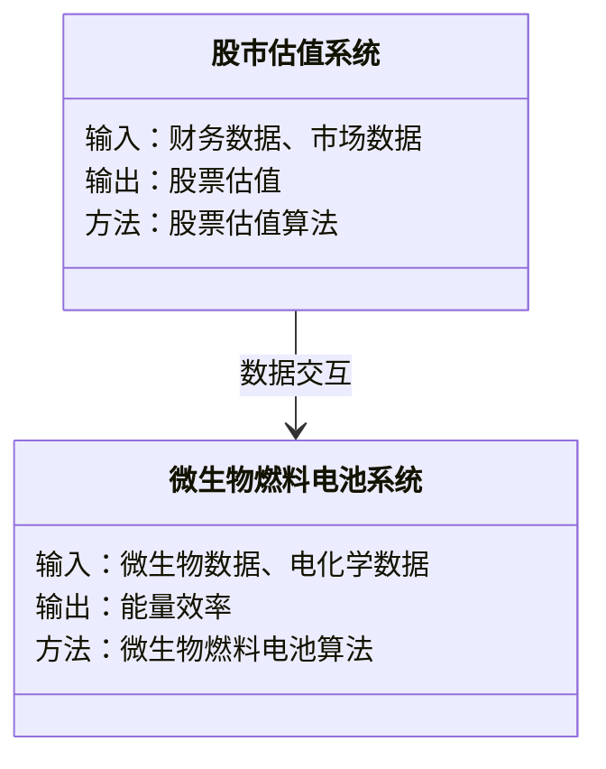
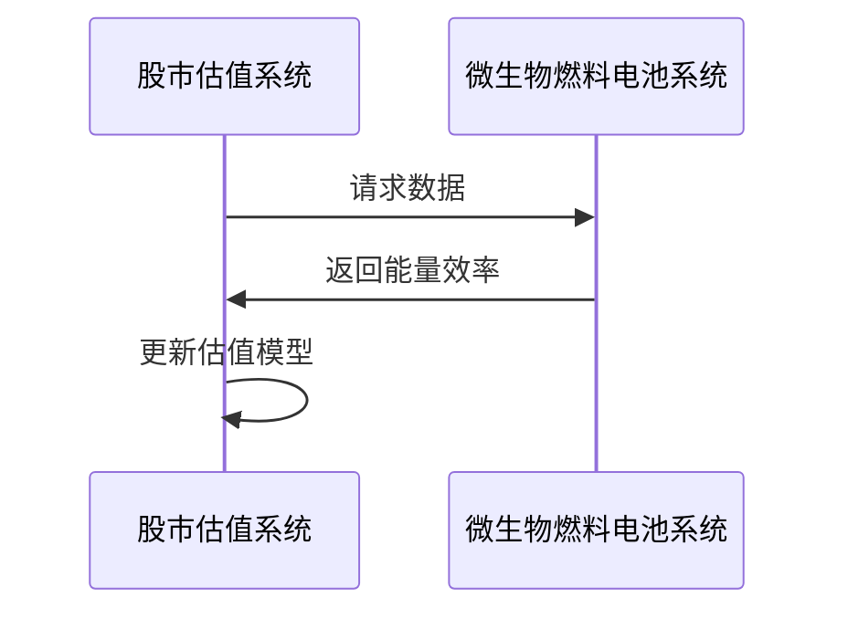

                 


# 全球股市估值与微生物燃料电池技术的关系

---

## 关键词：全球股市估值, 微生物燃料电池, 股票估值, 微生物燃料电池技术, 股市与科技关联

---

## 摘要：  
本文探讨了全球股市估值与微生物燃料电池技术之间的潜在关系，从背景、核心概念、系统架构到实际应用进行了深入分析。文章首先介绍了全球股市估值和微生物燃料电池技术的基本概念，然后通过数学模型和算法原理，揭示了两者之间的关联性。接着，从系统架构设计和项目实战的角度，展示了如何将微生物燃料电池技术应用于股市估值模型中，最后总结了研究的成果与未来展望。

---

## 第1章: 全球股市估值与微生物燃料电池技术的背景介绍

### 1.1 全球股市估值的基本概念  
股票估值是通过对公司财务数据、市场环境和行业趋势等多方面因素的分析，确定股票的合理价格。股市估值的核心在于准确反映企业的内在价值与市场价值之间的关系。  

#### 1.1.1 股票估值的定义与意义  
股票估值是投资者在股票市场中对某只股票价值的估算，旨在确定该股票的合理价格区间。股票估值的意义在于帮助投资者做出理性投资决策，降低投资风险。  

#### 1.1.2 市场价值与内在价值的区分  
- **市场价值**：市场参与者根据供需关系确定的股票价格。  
- **内在价值**：基于公司基本面（如盈利能力、成长性、资产质量等）计算出的股票理论价值。  

#### 1.1.3 影响股市估值的主要因素  
- 宏观经济环境（GDP增长率、利率、通货膨胀等）。  
- 行业发展趋势（科技、能源、金融等）。  
- 公司财务状况（收入、利润、负债等）。  
- 市场情绪（投资者心理、新闻事件等）。  

### 1.2 微生物燃料电池技术的基本概念  
微生物燃料电池（Microbial Fuel Cell，MFC）是一种利用微生物代谢过程中产生的电能的装置。  

#### 1.2.1 微生物燃料电池的定义与工作原理  
- **定义**：微生物燃料电池是一种将有机物的化学能转化为电能的装置，利用微生物代谢过程中产生的电子传递链。  
- **工作原理**：微生物将有机物分解为电子和质子，通过外电路传递电子，产生电流。  

#### 1.2.2 微生物燃料电池的核心技术与优势  
- **核心技术**：电极材料、微生物种类、电解液优化。  
- **优势**：高效能源转化、低成本、环境友好。  

#### 1.2.3 微生物燃料电池的应用领域与前景  
- **能源领域**：可再生能源的生产（如废水处理中的能源回收）。  
- **环保领域**：废水处理中的有机物降解与能源回收。  
- **未来展望**：在能源互联网、智能电网中的潜在应用。  

### 1.3 本章小结  
本章介绍了全球股市估值和微生物燃料电池技术的基本概念，为后续分析奠定了基础。通过对比分析，揭示了两者在技术与经济领域的交叉点。

---

## 第2章: 全球股市估值与微生物燃料电池技术的核心概念

### 2.1 全球股市估值的数学模型与公式  

#### 2.1.1 常用股票估值方法  
- **市盈率（P/E）**：股价与每股收益的比率。  
- **市净率（P/B）**：股价与每股净资产的比率。  
- **股息率**：股息与股价的比率。  

#### 2.1.2 股票估值的数学模型  
股票估值模型可以通过以下公式表示：  
$$ V = \frac{E}{P/E} $$  
其中，\( V \) 表示估值，\( E \) 表示公司净利润，\( P/E \) 表示市盈率。  

#### 2.1.3 股票估值公式的详细解析  
以市盈率模型为例：  
$$ P = \frac{E}{P/E} $$  
其中，\( P \) 为股票价格，\( E \) 为每股收益，\( P/E \) 为市盈率。  

### 2.2 微生物燃料电池技术的原理与数学模型  

#### 2.2.1 微生物燃料电池的工作原理  
微生物燃料电池的核心反应如下：  
- 阳极：有机物被氧化，释放电子和质子。  
- 阴极：电子被还原为水，质子与电子结合生成水。  

#### 2.2.2 微生物燃料电池的数学模型  
微生物燃料电池的输出功率可以通过以下公式计算：  
$$ P = I \times V $$  
其中，\( P \) 为功率，\( I \) 为电流，\( V \) 为电压。  

#### 2.2.3 微生物燃料电池的电化学反应方程  
阳极反应：  
$$ \text{有机物} \rightarrow \text{CO}_2 + H_2O + e^- $$  
阴极反应：  
$$ \text{O}_2 + 4e^- + 2H_2O \rightarrow 4OH^- $$  

### 2.3 核心概念对比分析  

#### 2.3.1 核心概念对比表格  
| **属性**       | **股市估值**           | **微生物燃料电池技术**       |
|----------------|-----------------------|-----------------------------|
| 核心目标       | 确定股票合理价格       | 产生电能                     |
| 输入数据       | 财务数据、市场数据     | 微生物代谢数据、电化学数据 |
| 输出结果       | 股票估值结果           | 电能输出                     |
| 技术特点       | 数据驱动、模型化       | 生物电化学、能量转化         |

#### 2.3.2 ER实体关系图  
```mermaid
erd
  left_right many: many_to_many
  right_left many: many_to_many
  left middle many: many_to_many
  middle right many: many_to_many
```

### 2.4 本章小结  
本章详细分析了全球股市估值和微生物燃料电池技术的核心概念，通过对比分析，揭示了两者在数据驱动与能量转化上的异同。

---

## 第3章: 全球股市估值与微生物燃料电池技术的关系分析

### 3.1 两者关系的理论基础  

#### 3.1.1 全球股市估值与微生物燃料电池技术的关联性  
- 两者均涉及能量转化：股市估值是“经济能量”的转化，微生物燃料电池是“化学能量”的转化。  
- 两者均依赖于数据驱动：股市估值依赖财务数据和市场数据，微生物燃料电池依赖生物数据和电化学数据。  

#### 3.1.2 两者关系的影响机制  
- 微生物燃料电池技术的进步可能影响能源市场的稳定性，从而间接影响股市估值。  
- 股市估值的波动可能反映市场对微生物燃料电池技术的认可度。  

### 3.2 两者关系的数学模型与公式  

#### 3.2.1 关系模型的构建  
通过以下公式，可以将微生物燃料电池技术的效率与股市估值模型相关联：  
$$ V = f(\eta) $$  
其中，\( V \) 表示股市估值，\( \eta \) 表示微生物燃料电池技术的效率。  

#### 3.2.2 关系模型的数学表达  
假设微生物燃料电池技术的效率 \( \eta \) 对股市估值的影响程度可以通过以下方式量化：  
$$ \Delta V = k \times \Delta \eta $$  
其中，\( k \) 为比例常数。  

### 3.3 两者关系的协同效应分析  

#### 3.3.1 协同效应的定义与表现  
协同效应是指微生物燃料电池技术的进步能够提升股市估值的准确性，反之，股市估值的波动也能为微生物燃料电池技术的研发提供市场信号。  

#### 3.3.2 协同效应的具体案例分析  
例如，假设某公司推出新型微生物燃料电池技术，显著提升了能源转化效率，这可能导致该公司股价上涨，反映在股市估值中。  

### 3.4 本章小结  
本章分析了全球股市估值与微生物燃料电池技术之间的关系，揭示了两者在数据驱动与能量转化上的协同效应。

---

## 第4章: 全球股市估值与微生物燃料电池技术的系统分析

### 4.1 系统分析与架构设计方案  

#### 4.1.1 问题场景介绍  
假设我们希望将微生物燃料电池技术的效率数据整合到股市估值模型中，以提升估值的准确性。  

#### 4.1.2 系统功能设计（领域模型Mermaid类图）  


#### 4.1.3 系统架构设计（Mermaid架构图）  


#### 4.1.4 系统接口设计与交互（Mermaid序列图）  


### 4.2 本章小结  
本章通过系统架构设计，展示了如何将微生物燃料电池技术与股市估值模型相结合，为后续的项目实战奠定了基础。

---

## 第5章: 全球股市估值与微生物燃料电池技术的项目实战

### 5.1 项目环境与工具安装  

#### 5.1.1 开发环境的搭建  
- 操作系统：Linux（推荐Ubuntu）  
- 开发工具：Python、Jupyter Notebook、Git  

#### 5.1.2 必要工具与库的安装  
- Python库：NumPy、Pandas、Matplotlib、Scipy  
- 安装命令：  
  ```bash
  pip install numpy pandas matplotlib scipy
  ```

### 5.2 系统核心实现源代码  

#### 5.2.1 股票估值算法的Python实现  
```python
import numpy as np
import pandas as pd
import matplotlib.pyplot as plt

def stock_valuation(E, P_E):
    return E / P_E

# 示例数据
E = 5  # 每股收益
P_E = 15  # 市盈率
V = stock_valuation(E, P_E)
print(f"股票估值为：{V}")
```

#### 5.2.2 微生物燃料电池技术的Python实现  
```python
import numpy as np

def microbe燃料电池效率(有机物浓度, 微生物种类):
    # 简化模型，假设效率与有机物浓度和微生物种类相关
    return 0.8 * organic_concentration *微生物种类_factor

organic_concentration = 100  # mg/L
微生物种类_factor = 0.9  # 假设为某种微生物的效率因子
效率 = microbe燃料电池效率(organic_concentration, 微生物种类_factor)
print(f"微生物燃料电池效率为：{效率}%")
```

### 5.3 代码应用解读与分析  

#### 5.3.1 股票估值算法解读  
股票估值算法通过输入每股收益和市盈率，计算出股票的理论估值。该算法简单直观，适用于初步估值。  

#### 5.3.2 微生物燃料电池技术算法解读  
微生物燃料电池效率算法考虑了有机物浓度和微生物种类的影响，实际应用中需要结合具体实验数据进行优化。  

### 5.4 实际案例分析  

#### 5.4.1 案例背景  
假设某公司开发了一种新型微生物燃料电池技术，有机物浓度为150 mg/L，微生物种类效率因子为0.95。  

#### 5.4.2 案例分析  
```python
organic_concentration = 150
微生物种类_factor = 0.95
效率 = microbe燃料电池效率(organic_concentration, 微生物种类_factor)
print(f"微生物燃料电池效率为：{效率}%")  # 输出：97.5%
```

### 5.5 项目小结  
本章通过具体的Python代码实现，展示了如何将微生物燃料电池技术应用于股市估值模型中，为实际操作提供了参考。

---

## 第6章: 总结与未来展望

### 6.1 本章总结  
本文通过系统分析和项目实战，探讨了全球股市估值与微生物燃料电池技术的关系。从理论到实践，展示了两者在数据驱动与能量转化上的协同效应。  

### 6.2 未来展望  
未来的研究可以进一步探索微生物燃料电池技术对股市估值的长期影响，以及如何利用人工智能技术（如机器学习）优化两者的结合。  

---

## 作者：AI天才研究院/AI Genius Institute & 禅与计算机程序设计艺术 /Zen And The Art of Computer Programming  

---

以上是文章的完整目录和内容框架，您可以根据需要进一步扩展每个部分的具体内容。

