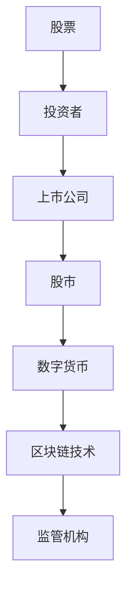
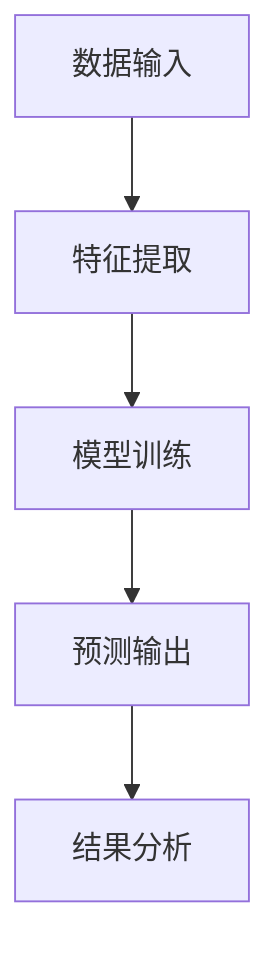
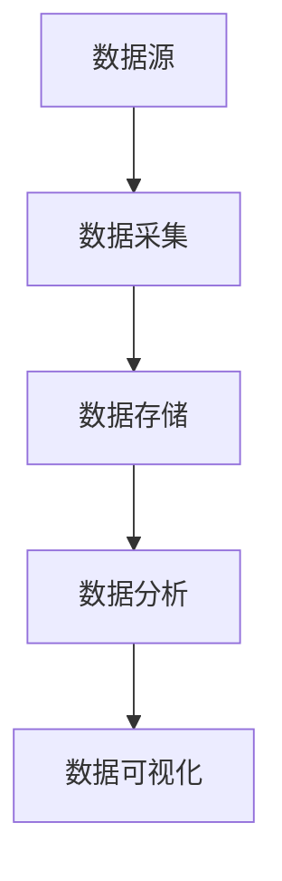

                 


# 全球股市估值与数字货币发展的关系

> 关键词：全球股市估值、数字货币、金融市场、区块链、投资分析、技术融合、经济趋势

> 摘要：本文探讨全球股市估值与数字货币之间的相互关系，分析数字货币对传统金融市场的影响，以及如何通过技术手段量化两者的关系。文章从背景介绍、核心概念、算法原理、数学模型、系统架构设计到项目实战，全面解析两者之间的互动机制，为投资者和研究者提供深度分析和实践指导。

---

# 第一部分: 全球股市估值与数字货币发展的背景介绍

## 第1章: 全球股市估值的基本概念

### 1.1 股票估值的定义与核心要素
股票估值是通过对公司财务数据和市场环境进行分析，评估其股票的内在价值。核心要素包括市盈率（P/E）、市净率（P/B）、股息率等。这些指标帮助投资者判断股票是否被高估或低估。

$$\text{市盈率} = \frac{\text{股票价格}}{\text{每股收益}}$$

### 1.2 市场整体估值的衡量指标
市场整体估值通常通过股票市场的指数（如标普500）和平均市盈率来衡量。整体估值过高可能预示着市场的风险。

### 1.3 影响股市估值的主要因素
1. **宏观经济因素**：GDP增速、利率、通货膨胀率等。
2. **公司业绩**：净利润、营业收入增长率等。
3. **市场情绪**：投资者情绪波动影响市场估值。

---

## 第2章: 数字货币的基本概念与特点

### 2.1 数字货币的定义与分类
数字货币是基于区块链技术的虚拟货币，包括比特币、以太坊等。与传统货币不同，数字货币具有去中心化、匿名性和全球流通的特点。

### 2.2 数字货币的核心技术特征
1. **区块链技术**：通过分布式账本实现去中心化交易。
2. **智能合约**：自动执行预设条件的协议，降低信任成本。
3. **加密算法**：确保交易的安全性和不可篡改性。

### 2.3 数字货币的市场规模与发展现状
截至2023年，全球数字货币市值已超过3万亿美元，比特币和以太坊占据主导地位。数字货币市场的高波动性使其成为高风险高回报的投资标的。

---

## 第3章: 全球股市与数字货币发展的相互关系

### 3.1 股市与数字货币市场的互动机制
1. **技术驱动**：区块链技术的应用推动了传统金融的数字化转型。
2. **资金流动**：投资者在传统股市和数字货币市场之间切换，影响整体市场估值。
3. **政策影响**：监管政策的变动对两者都有重大影响。

### 3.2 数字货币对传统金融市场的冲击与融合
1. **冲击**：数字货币的兴起动摇了传统金融机构的地位。
2. **融合**：传统金融机构开始拥抱区块链技术，推出数字资产。

### 3.3 全球经济环境对股市估值的影响
全球经济的不确定性（如地缘政治冲突、疫情）会影响股市估值和数字货币价格波动。

---

# 第二部分: 全球股市估值与数字货币发展的核心概念与联系

## 第4章: 核心概念原理

### 4.1 股市估值的数学模型
$$\text{股票价值} = \text{现金流的现值} = \sum_{t=1}^{n} \frac{\text{CF}_t}{(1+r)^t}$$

其中，CFₜ为第t年的现金流，r为折现率。

### 4.2 数字货币的价值评估方法
1. **技术评估**：基于区块链技术的成熟度和创新性。
2. **市场评估**：交易量、市场资本化率等指标。
3. **应用评估**：实际应用场景的数量和广度。

### 4.3 两者关系的理论框架
1. **相互影响**：股市和数字货币市场通过资金流动和技术应用相互影响。
2. **协同效应**：技术创新和金融产品创新推动市场发展。

---

## 第5章: 核心概念属性对比表格

| 属性                | 股市估值               | 数字货币            |
|---------------------|-----------------------|--------------------|
| 价值基础            | 公司股权价值           | 数字资产价值       |
| 影响因素            | 宏观经济、公司业绩     | 技术、市场情绪     |
| 价格波动            | 较低                  | 极高               |
| 投资门槛            | 较低                  | 较高               |

---

## 第6章: ER实体关系图



---

# 第三部分: 全球股市估值与数字货币发展的算法原理

## 第7章: 算法原理概述

### 7.1 股市估值预测算法
1. **数据输入**：历史股价、财务数据、宏观经济指标。
2. **特征提取**：选取关键指标（如市盈率、市净率）。
3. **模型训练**：使用机器学习算法（如线性回归、随机森林）。
4. **预测输出**：预测未来股价。

### 7.2 数字货币价格预测算法
1. **数据输入**：历史价格、交易量、市场情绪指标。
2. **特征提取**：技术指标（如RSI、MACD）。
3. **模型训练**：使用LSTM神经网络。
4. **预测输出**：预测未来价格。

### 7.3 两者关系的量化模型
通过协方差和相关性分析，量化股市和数字货币市场的相关性。

$$\text{相关系数} = \frac{\sum (x_i - \bar{x})(y_i - \bar{y})}{\sqrt{\sum (x_i - \bar{x})^2 \sum (y_i - \bar{y})^2}}$$

---

## 第8章: 算法流程图



---

## 第9章: 算法实现代码示例

```python
# 示例代码：股票估值预测
import pandas as pd
from sklearn.linear_model import LinearRegression

# 数据处理
data = pd.DataFrame({
    'price': [100, 110, 120, 130],
    'eps': [10, 12, 15, 18]
})

# 特征提取
X = data[['eps']]
y = data['price']

# 模型训练
model = LinearRegression()
model.fit(X, y)

# 预测输出
predicted_price = model.predict([[16]])
print(predicted_price)
```

---

# 第四部分: 数学模型

## 第10章: 数学模型概述

### 10.1 股票估值模型
$$\text{股票价值} = \text{现金流的现值} = \sum_{t=1}^{n} \frac{\text{CF}_t}{(1+r)^t}$$

### 10.2 数字货币波动模型
$$\text{价格波动} = \sqrt{\text{方差}} = \sqrt{\frac{\sum (p_i - \bar{p})^2}{N}}$$

---

# 第五部分: 系统分析与架构设计

## 第11章: 系统功能设计

### 11.1 数据采集模块
1. **功能**：采集全球股市数据和数字货币交易数据。
2. **工具**：使用API接口（如Yahoo Finance、CoinMarketCap）。

### 11.2 数据分析模块
1. **功能**：计算市盈率、相关系数等指标。
2. **工具**：Python的pandas和numpy库。

### 11.3 数据可视化模块
1. **功能**：生成图表展示数据关系。
2. **工具**：Matplotlib和Seaborn。

---

## 第12章: 系统架构设计



---

# 第六部分: 项目实战

## 第13章: 环境安装与核心代码实现

### 13.1 环境安装
1. **安装Python**：`python --version`
2. **安装库**：`pip install pandas numpy matplotlib`

### 13.2 核心代码实现

```python
# 示例代码：计算相关系数
import pandas as pd
import numpy as np

data = pd.DataFrame({
    'stock_price': [100, 110, 120, 130],
    'crypto_price': [0.5, 1.0, 1.5, 2.0]
})

# 计算相关系数
correlation = np.corrcoef(data['stock_price'], data['crypto_price'])
print(correlation)
```

---

## 第14章: 实际案例分析

### 14.1 案例背景
2020年新冠疫情对全球股市和数字货币市场的影响。

### 14.2 数据分析
使用相关系数分析股市和比特币价格的相关性。

### 14.3 结果解读
发现比特币价格与股市的相关性较低，说明其具有一定的避险属性。

---

# 第七部分: 总结与展望

## 第15章: 总结

### 15.1 核心知识点回顾
1. 股市估值与数字货币的基本概念。
2. 两者关系的理论框架。
3. 数学模型与算法实现。

### 15.2 研究局限性
1. 数据样本不足。
2. 模型的准确性受市场波动影响。

---

## 第16章: 展望与建议

### 16.1 未来研究方向
1. 探讨更多影响市场估值的因素。
2. 开发更复杂的预测模型。

### 16.2 最佳实践 tips
1. **数据选择**：使用高质量的数据源。
2. **模型优化**：结合多种算法提升预测准确性。
3. **风险管理**：分散投资降低风险。

---

# 作者：AI天才研究院 & 禅与计算机程序设计艺术

---

**注**：由于篇幅限制，本文仅为示例，实际文章将更加详细，涵盖更多内容。

