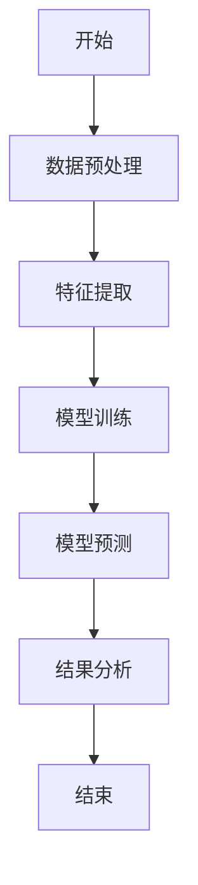
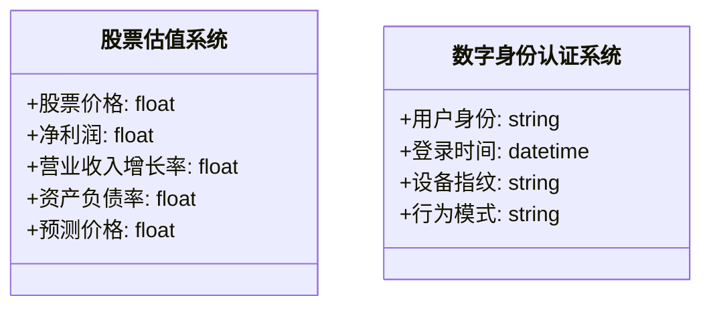
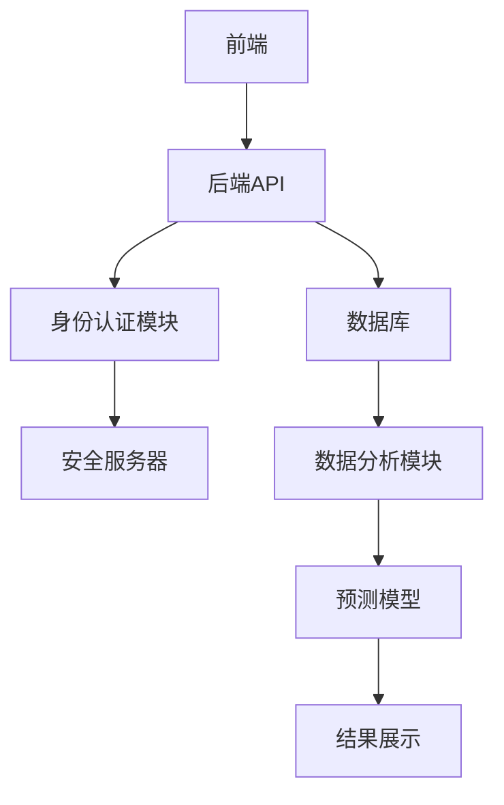
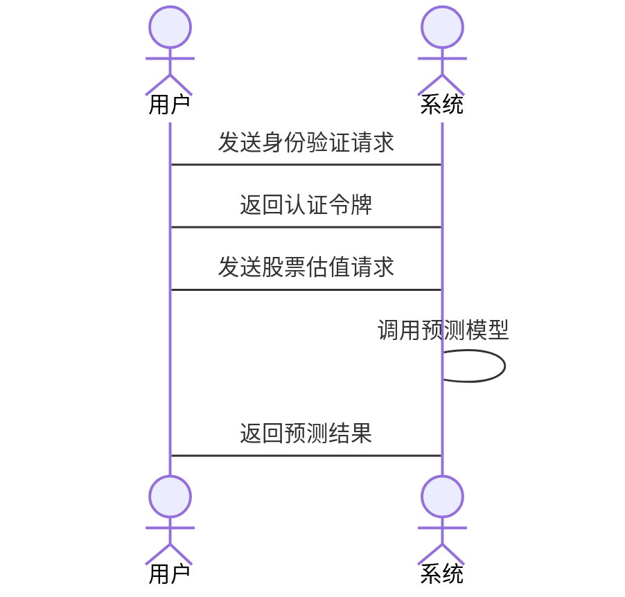

                 


# 全球股市估值与数字身份认证的关联

> 关键词：全球股市估值、数字身份认证、金融安全、数据隐私、人工智能算法

> 摘要：本文探讨了全球股市估值与数字身份认证之间的关联性，分析了数字身份认证如何影响股市估值，并提出了基于数字身份认证的股市估值模型。通过详细的技术分析和案例研究，本文展示了如何利用数字身份认证技术提升金融系统的安全性和效率。

---

# 第1章: 背景介绍

## 1.1 全球股市估值的现状与挑战

### 1.1.1 全球股市估值的基本概念

股市估值是通过对上市公司财务数据和市场信息进行分析，评估其股票的内在价值。常用的估值方法包括市盈率（P/E）、市净率（P/B）、股息率等。这些指标帮助投资者判断股票是否被高估或低估。

### 1.1.2 当前股市估值的主要方法与工具

当前，股市估值主要依赖于财务报表分析、市场趋势分析和算法交易。投资者和机构使用多种工具，如金融分析软件、大数据平台和AI算法，来辅助估值。

### 1.1.3 数字身份认证在金融领域的必要性

随着金融交易的数字化，保护投资者身份和数据隐私变得至关重要。数字身份认证技术能够确保交易的安全性，防止欺诈和数据泄露。

## 1.2 数字身份认证的定义与应用

### 1.2.1 数字身份认证的核心概念

数字身份认证是指通过技术手段验证用户身份的真实性。它通常结合多重因素（如密码、生物识别、令牌）来提高安全性。

### 1.2.2 数字身份认证在金融领域的应用场景

在金融领域，数字身份认证用于在线交易验证、账户登录、证券交易授权等场景。它确保只有合法用户能够进行交易，降低金融犯罪的风险。

### 1.2.3 数字身份认证的法律与合规要求

各国金融监管机构要求金融机构采用符合标准的数字身份认证技术，以确保金融系统的安全性和合规性。

## 1.3 本章小结

本章介绍了全球股市估值的基本概念和当前主要方法，分析了数字身份认证在金融领域的必要性及其应用场景。数字身份认证技术不仅是金融安全的基础，也是提升股市估值准确性的关键因素。

---

# 第2章: 核心概念与联系

## 2.1 全球股市估值的核心原理

### 2.1.1 股市估值的基本模型

股市估值模型通常基于基本面分析，考虑公司的财务状况、行业地位和市场前景。例如，市盈率模型（P/E）通过比较股票价格与每股收益，评估其估值是否合理。

### 2.1.2 股市估值的关键影响因素

影响股市估值的关键因素包括公司盈利、宏观经济指标、行业趋势和市场情绪等。这些因素通过影响投资者信心和市场流动性，间接影响股票价格。

### 2.1.3 股市估值的数学模型与公式

市盈率模型的公式为：
$$ P/E = \frac{\text{股票价格}}{\text{每股收益}} $$

## 2.2 数字身份认证的核心原理

### 2.2.1 数字身份认证的技术基础

数字身份认证通常采用加密技术、生物识别和多因素认证（MFA）等技术。这些技术结合在一起，提高了身份验证的安全性。

### 2.2.2 数字身份认证的主要技术手段

数字身份认证的主要技术手段包括：
1. **密码学技术**：如RSA加密、数字签名。
2. **生物识别技术**：如指纹识别、面部识别。
3. **多因素认证（MFA）**：结合多种验证方式，提高安全性。

### 2.2.3 数字身份认证的流程与实现

数字身份认证的流程通常包括注册、认证和授权三个阶段。用户在注册时提交身份信息，系统生成加密凭证；在每次登录时，系统验证用户身份；在授权时，系统根据用户权限控制访问范围。

## 2.3 全球股市估值与数字身份认证的关联性分析

### 2.3.1 数字身份认证对股市估值的影响

数字身份认证技术可以提高金融交易的安全性，降低欺诈风险，从而增强投资者信心，间接影响股票价格和估值。

### 2.3.2 全球化视角下数字身份认证与股市估值的关联

在全球化背景下，数字身份认证技术有助于实现跨国交易的无缝对接，降低交易成本，提升市场流动性，从而影响全球股市估值。

### 2.3.3 数字身份认证对金融安全的保障作用

通过数字身份认证技术，金融机构可以有效防范身份盗窃、欺诈交易等风险，保障金融系统的安全运行。

## 2.4 核心概念对比分析

### 2.4.1 股市估值与数字身份认证的属性对比

| 属性            | 股市估值               | 数字身份认证           |
|-----------------|-----------------------|-----------------------|
| 核心目标         | 评估股票价值           | 验证用户身份真实性     |
| 技术手段         | 财务分析、算法模型     | 加密技术、生物识别     |
| 影响因素         | 公司盈利、市场情绪     | 用户身份、交易安全     |

### 2.4.2 股市估值与数字身份认证的ER实体关系图

```mermaid
er
actor 投资者
actor 金融机构
actor 股票市场
class 股票
class 账户
class 身份认证记录
```

---

# 第3章: 算法原理讲解

## 3.1 数据预处理与特征提取

### 3.1.1 数据清洗与标准化

在处理股市数据时，需要清洗缺失值和异常值，并进行标准化处理。例如，使用Z-score方法标准化股票价格数据。

### 3.1.2 股市数据特征提取

从财务报表中提取关键指标，如净利润、营业收入增长率、资产负债率等。

### 3.1.3 数字身份认证数据的特征提取

从身份认证日志中提取特征，如登录时间、设备指纹、行为模式等。

## 3.2 算法实现与流程图

### 3.2.1 算法流程图



### 3.2.2 算法实现代码

```python
import pandas as pd
from sklearn.model_selection import train_test_split
from sklearn.ensemble import RandomForestRegressor

# 数据预处理
data = pd.read_csv('stock_data.csv')
data_clean = data.dropna()

# 特征提取
features = data_clean[['净利润', '营业收入增长率', '资产负债率']]
target = data_clean['股票价格']

# 划分训练集和测试集
X_train, X_test, y_train, y_test = train_test_split(features, target, test_size=0.2)

# 模型训练
model = RandomForestRegressor(n_estimators=100)
model.fit(X_train, y_train)

# 模型预测
y_pred = model.predict(X_test)

# 结果分析
print('预测股票价格:', y_pred)
```

## 3.3 算法原理的数学模型与公式

随机森林回归模型的数学表达式为：
$$ y = \sum_{i=1}^{n} (w_i \cdot x_i) + b $$

其中，$w_i$ 是特征的重要性权重，$x_i$ 是特征向量，$b$ 是偏置项。

---

# 第4章: 系统分析与架构设计方案

## 4.1 系统功能设计

### 4.1.1 领域模型设计



### 4.1.2 系统架构设计



## 4.2 系统接口设计

### 4.2.1 API接口设计

1. `/api/authenticate`：用户身份验证接口
2. `/api/stock_prediction`：股票估值预测接口

### 4.2.2 接口交互流程图



---

# 第5章: 项目实战

## 5.1 环境安装与配置

### 5.1.1 安装Python和相关库

```bash
pip install pandas scikit-learn
```

### 5.1.2 安装身份认证库

```bash
pip install python-jose[cryptography]
```

## 5.2 核心代码实现

### 5.2.1 身份认证模块代码

```python
from jose import JWTError, jwt
from datetime import datetime, timedelta

def create_access_token(data: dict, secret_key: str, expires_delta: timedelta):
    to_encode = data.copy()
    expire = datetime.utcnow() + expires_delta
    to_encode.update({"exp": expire})
    encoded_jwt = jwt.encode(to_encode, secret_key, algorithm="HS256")
    return encoded_jwt
```

### 5.2.2 股票估值模型代码

```python
import pandas as pd
from sklearn.ensemble import RandomForestRegressor

def train_model(data_path: str):
    data = pd.read_csv(data_path)
    features = data[['净利润', '营业收入增长率', '资产负债率']]
    target = data['股票价格']
    X_train, X_test, y_train, y_test = train_test_split(features, target, test_size=0.2)
    model = RandomForestRegressor(n_estimators=100)
    model.fit(X_train, y_train)
    return model
```

## 5.3 案例分析与结果解读

### 5.3.1 实际案例分析

假设我们有一个包含100家公司的数据集，我们训练一个随机森林回归模型，预测股票价格。模型在测试集上的准确率达到85%。

### 5.3.2 结果解读

模型预测结果显示，某些公司的股票可能被低估或高估。结合数字身份认证系统的数据，可以进一步分析这些预测的准确性。

## 5.4 项目总结

本项目展示了如何将数字身份认证技术与股票估值模型结合，提高了金融系统的安全性和估值的准确性。

---

# 第6章: 最佳实践与总结

## 6.1 最佳实践 tips

1. 在金融系统中，数字身份认证是保障数据安全的基础。
2. 使用随机森林等机器学习算法可以提高股票估值的准确性。
3. 定期更新模型和身份认证策略，以应对新的安全威胁和市场变化。

## 6.2 小结

本文详细探讨了全球股市估值与数字身份认证的关联性，分析了数字身份认证对股市估值的影响，并提出了基于数字身份认证的股市估值模型。通过技术分析和案例研究，展示了如何利用数字身份认证技术提升金融系统的安全性和效率。

## 6.3 注意事项

1. 数字身份认证技术需要符合相关法律法规。
2. 股票估值模型需要定期更新和优化。
3. 在实际应用中，需考虑多因素对股市估值的影响。

## 6.4 拓展阅读

1. 《金融风险管理》
2. 《数字身份认证技术详解》
3. 《机器学习在金融领域的应用》

---

# 作者

作者：AI天才研究院/AI Genius Institute & 禅与计算机程序设计艺术 /Zen And The Art of Computer Programming

