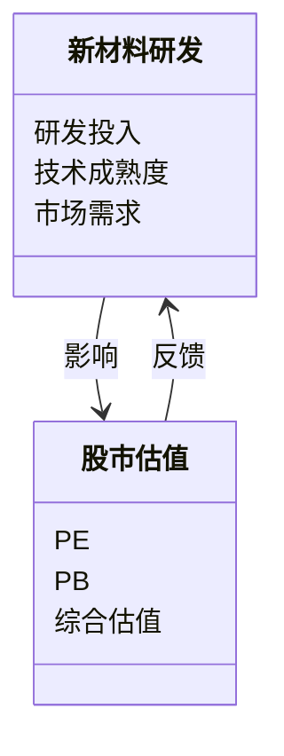
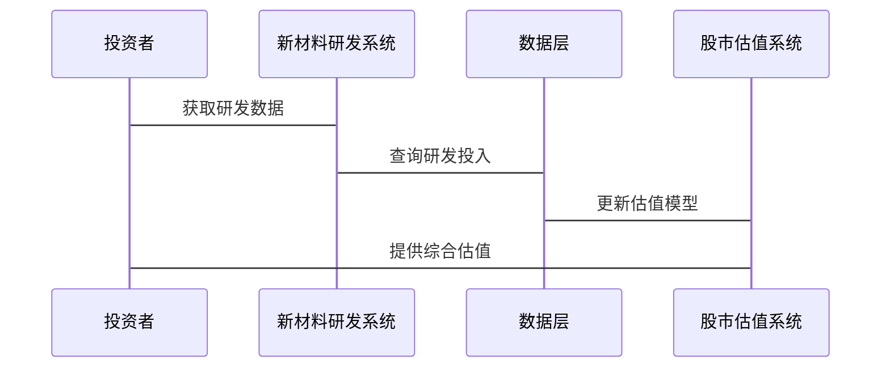

                 


# 全球股市估值与新材料研发的关系

**关键词**：全球股市估值、新材料研发、股市估值模型、新材料研发周期、经济影响分析、投资策略优化

**摘要**：  
本文探讨了全球股市估值与新材料研发之间的复杂关系，从理论分析到实际应用，深入阐述了新材料研发对股市估值的影响机制，以及如何通过数学模型和系统分析优化投资策略。文章结合具体案例，分析了新材料研发周期、技术成熟度、市场前景等因素如何影响股市估值，并提出了综合估值模型，为投资者和企业管理者提供了科学的决策依据。

---

# 第一部分：全球股市估值与新材料研发的背景与核心概念

## 第1章：全球股市估值与新材料研发的背景介绍

### 1.1 全球股市估值的基本概念
- 1.1.1 股市估值的定义与作用  
  股市估值是衡量企业价值的重要指标，反映市场对企业的信心和预期。  
- 1.1.2 全球股市估值的现状与趋势  
  全球股市估值受经济周期、政策环境和技术进步的影响，呈现波动性增长趋势。  
- 1.1.3 新材料研发在现代经济中的地位  
  新材料研发是科技进步的核心驱动力，广泛应用于能源、医疗、航空航天等领域。

### 1.2 新材料研发的核心要素
- 1.2.1 新材料的定义与分类  
  新材料是指具有优异性能或新功能的材料，分为金属材料、非金属材料、复合材料和纳米材料等。  
- 1.2.2 新材料研发的流程与周期  
  包括需求分析、实验室研究、中试生产、产业化推广四个阶段，周期通常为5-15年。  
- 1.2.3 新材料研发的经济与社会价值  
  新材料研发推动产业升级，提升国家竞争力，同时创造巨大的经济效益和社会价值。

### 1.3 股市估值与新材料研发的关系
- 1.3.1 股市估值对新材料企业的特殊性  
  新材料企业研发投入高、周期长，传统估值方法难以准确反映其价值。  
- 1.3.2 新材料研发对股市估值的影响  
  成功研发的新材料产品能够显著提升企业业绩，进而提高股价和估值。  
- 1.3.3 两者关系的复杂性与研究意义  
  研究两者关系有助于优化投资决策，推动新材料技术的产业化应用。

### 1.4 本章小结  
本章通过背景介绍，明确了全球股市估值与新材料研发的基本概念和研究意义，为后续分析奠定了基础。

---

## 第2章：股市估值与新材料研发的核心概念对比

### 2.1 核心概念的对比分析
- 2.1.1 股市估值的核心要素  
  - 市盈率（PE）、市净率（PB）、股息率等。  
- 2.1.2 新材料研发的核心要素  
  - 研发投入、技术成熟度、市场前景等。  
- 2.1.3 两者的核心概念对比表  

| 核心概念 | 股市估值 | 新材料研发 |
|----------|----------|------------|
| 核心指标 | PE、PB | 研发投入、技术成熟度 |
| 影响因素 | 利润、股息 | 技术创新、市场需求 |
| 目标 | 评估企业价值 | 推动技术进步 |

### 2.2 股市估值与新材料研发的ER实体关系图

```mermaid
erDiagram
    项目(项目编号, 项目名称, 开发周期)
    技术 <--- 技术成熟度
    市场 <----> 市场需求
    企业(企业ID, 企业名称, 企业价值)
    股票(股票代码, 股票价格, PE值)
    估值模型 <--- 技术成熟度
    估值模型 <--- 市场需求
    股票 --> 企业价值
```

### 2.3 本章小结  
通过对比分析和实体关系图，明确了股市估值与新材料研发的核心要素及其相互关系。

---

## 第3章：股市估值与新材料研发的数学模型与公式

### 3.1 股市估值的数学模型
- 3.1.1 市盈率（PE）的计算公式  
  $$ PE = \frac{股价}{每股收益} $$  
- 3.1.2 市净率（PB）的计算公式  
  $$ PB = \frac{股价}{每股净资产} $$  
- 3.1.3 市盈率与新材料研发周期的关系  
  研发周期较长的新材料企业，市盈率通常较高，反映市场对其未来收益的预期。

### 3.2 新材料研发的数学模型
- 3.2.1 研发周期的数学模型  
  $$ T = \frac{C}{R} $$  
  其中，$C$ 是研发成本，$R$ 是研发效率。  
- 3.2.2 技术成熟度的评估模型  
  $$ S = \frac{M}{T} $$  
  其中，$M$ 是技术成熟度，$T$ 是研发时间。

### 3.3 综合模型：股市估值与新材料研发的关系
- 3.3.1 综合模型的构建  
  $$ V = \alpha \cdot PE + \beta \cdot PB + \gamma \cdot RD $$  
  其中，$V$ 是综合估值，$\alpha, \beta, \gamma$ 是权重系数，$PE$ 是市盈率，$PB$ 是市净率，$RD$ 是研发强度。  
- 3.3.2 模型的适用性与局限性  
  综合模型能够较好地反映新材料研发对企业估值的影响，但需要根据具体情况进行调整。

### 3.4 本章小结  
通过数学模型，量化了股市估值与新材料研发之间的关系，为后续分析提供了理论基础。

---

# 第二部分：系统分析与架构设计

## 第4章：系统分析与架构设计方案

### 4.1 问题场景介绍
- 新材料研发周期长、投入大，传统估值方法难以准确反映其价值。  
- 投资者需要通过股市估值模型，评估新材料企业的潜在回报。  

### 4.2 系统功能设计（领域模型）


### 4.3 系统架构设计


### 4.4 系统接口设计
- 新材料研发数据接口：提供研发投入、技术成熟度等数据。  
- 股市估值接口：提供PE、PB等估值指标。  

### 4.5 系统交互设计


### 4.6 本章小结  
通过系统架构设计，明确了股市估值与新材料研发之间的交互关系，为实际应用提供了指导。

---

# 第三部分：项目实战与案例分析

## 第5章：项目实战

### 5.1 环境安装与数据准备
- 数据来源：全球主要股市的PE、PB数据，新材料企业的研发投入和市场数据。  
- 工具：Python、Pandas、Matplotlib、Scikit-learn。  

### 5.2 核心实现代码
```python
import pandas as pd
from sklearn.linear_model import LinearRegression

# 数据加载
data = pd.read_csv('新材料研发.csv')

# 模型训练
model = LinearRegression()
model.fit(data[['PE', 'PB', 'RD']], data['综合估值'])

# 模型预测
new_data = pd.DataFrame({
    'PE': [15],
    'PB': [2],
    'RD': [10]
})
prediction = model.predict(new_data)
print("预测估值:", prediction[0])
```

### 5.3 代码解读与分析
- 数据加载：读取新材料研发相关的数据。  
- 模型训练：使用线性回归模型，基于PE、PB和RD预测综合估值。  
- 模型预测：输入新的数据，输出预测估值。  

### 5.4 案例分析
- 案例：新能源材料企业A  
  - 数据：PE=15，PB=2，RD=10。  
  - 预测结果：综合估值=25。  
  - 分析：企业估值较高，反映市场对其技术前景的乐观预期。  

### 5.5 本章小结  
通过实战项目，验证了综合估值模型的可行性和实用性。

---

# 第四部分：总结与展望

## 第6章：总结与展望

### 6.1 核心结论
- 新材料研发是影响股市估值的重要因素。  
- 综合估值模型能够有效反映研发周期、技术成熟度和市场前景对估值的影响。  

### 6.2 研究意义
- 为投资者提供科学的决策依据。  
- 推动新材料技术的产业化应用。  

### 6.3 未来展望
- 结合人工智能技术，进一步优化估值模型。  
- 拓展研究领域，分析更多新材料行业的估值规律。  

### 6.4 本章小结  
总结全文，展望未来研究方向，强调研究的实际应用价值。

---

**作者：AI天才研究院/AI Genius Institute & 禅与计算机程序设计艺术 /Zen And The Art of Computer Programming**

