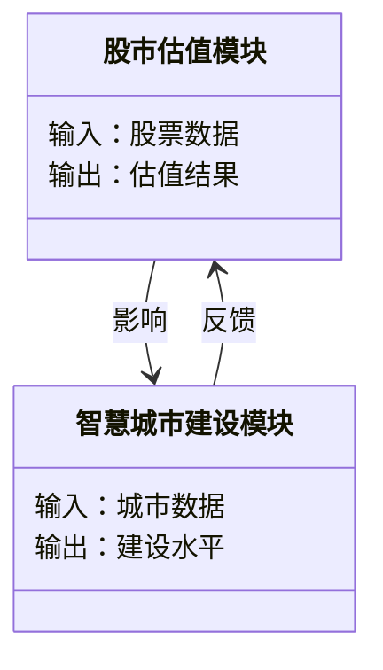
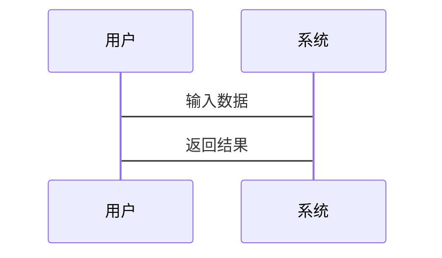

                 


# 全球股市估值与智慧城市建设的互动

> 关键词：全球股市估值、智慧城市建设、互动关系、算法原理、系统架构

> 摘要：本文探讨了全球股市估值与智慧城市建设之间的互动关系，分析了股市估值对智慧城市建设的影响，以及智慧城市建设对股市估值的反馈作用。通过构建数学模型和系统架构，本文提出了利用大数据和人工智能技术优化城市规划和股市预测的解决方案，为投资者和城市规划者提供参考。

---

# 第1章：全球股市估值与智慧城市建设的背景与问题背景

## 1.1 问题背景与问题描述

### 1.1.1 全球股市估值的现状与挑战
全球股市估值是衡量市场健康状况的重要指标，受到经济政策、企业盈利、市场情绪等多种因素的影响。近年来，随着科技的进步，股市估值的计算方法也在不断进化，但仍然面临数据量大、预测难度高等挑战。

### 1.1.2 智慧城市建设的背景与发展
智慧城市建设是将信息技术与城市规划相结合，旨在提高城市运行效率和居民生活质量。随着物联网、大数据和人工智能技术的发展，智慧城市建设已成为全球趋势。

### 1.1.3 两者的互动关系与研究意义
股市估值的变化直接影响投资者信心和资金流动，而智慧城市建设的进展则会改变城市的经济结构和产业布局，从而反作用于股市估值。研究两者的互动关系，有助于优化城市规划和投资决策。

---

## 1.2 核心概念与问题解决

### 1.2.1 股市估值的核心要素
股市估值的核心要素包括市盈率（P/E）、市净率（P/B）、股息率等，这些指标反映了市场的整体表现和个股的价值。

### 1.2.2 智慧城市建设的关键因素
智慧城市建设的关键因素包括技术创新、政策支持、基础设施建设等，这些因素共同决定了城市的智能化水平。

### 1.2.3 互动机制与问题解决路径
通过分析股市估值与智慧城市建设的互动机制，可以找到优化城市规划和提升股市预测精度的方法。

---

## 1.3 问题的边界与外延

### 1.3.1 股市估值的边界条件
股市估值的边界条件包括市场流动性、政策变化、国际经济环境等，这些因素会影响股市估值的准确性。

### 1.3.2 智慧城市建设的范围界定
智慧城市建设的范围界定包括城市规划、交通管理、环境保护等领域，需要综合考虑技术、经济和社会因素。

### 1.3.3 互动关系的外延与限制
互动关系的外延包括区域经济、国际贸易等领域，而其限制则体现在数据获取难度、模型精度等方面。

---

## 1.4 核心概念结构与核心要素

### 1.4.1 股市估值的核心模型
股市估值的核心模型包括道琼斯指数、纳斯达克指数等，这些模型反映了市场的整体走势。

### 1.4.2 智慧城市建设的框架体系
智慧城市建设的框架体系包括感知层、网络层、应用层等，构建了一个立体化的城市管理系统。

### 1.4.3 互动关系的结构化分析
通过结构化分析，可以发现股市估值与智慧城市建设之间的相互影响，从而制定科学的决策策略。

---

## 1.5 本章小结
本章从背景、核心概念、问题解决路径等方面，详细介绍了全球股市估值与智慧城市建设的互动关系，为后续章节的分析奠定了基础。

---

# 第2章：全球股市估值与智慧城市建设的核心概念与联系

## 2.1 核心概念原理

### 2.1.1 股市估值的理论基础
股市估值的理论基础包括基本面分析和技术分析，基本面分析关注企业的财务状况，技术分析关注市场趋势。

### 2.1.2 智慧城市建设的技术基础
智慧城市建设的技术基础包括物联网、大数据、人工智能等，这些技术为城市的智能化管理提供了支持。

### 2.1.3 互动机制与问题解决路径
通过分析股市估值与智慧城市建设的互动机制，可以找到优化城市规划和提升股市预测精度的方法。

---

## 2.2 核心概念属性特征对比

### 2.2.1 股市估值与智慧城市建设的对比分析
从目标、方法、影响因素等方面对比股市估值与智慧城市建设，可以发现两者的异同点。

| 对比维度 | 股市估值 | 智慧城市建设 |
|----------|----------|--------------|
| 目标     | 评估市场价值 | 提高城市效率 |
| 方法     | 基本面分析、技术分析 | 物联网、大数据、人工智能 |
| 影响因素 | 经济政策、企业盈利 | 技术创新、政策支持 |

### 2.2.2 互动关系的特征总结
互动关系具有双向性、动态性和复杂性，需要综合考虑多方面的因素。

---

## 2.3 ER实体关系图架构

```mermaid
er
    entity 股市估值 {
        <股票代码, 股价, 市盈率>
    }
    entity 智慧城市建设 {
        <城市代码, 城市GDP, 智慧化水平>
    }
    relation 股市估值与智慧城市建设的互动关系 {
        股市估值 -> 智慧城市建设 : 影响
        智慧城市建设 -> 股市估值 : 反馈
    }
```

---

## 2.4 本章小结
本章通过核心概念的分析和对比，详细阐述了全球股市估值与智慧城市建设的联系，为后续的算法设计和系统实现提供了理论支持。

---

# 第3章：全球股市估值与智慧城市建设的算法原理

## 3.1 算法原理概述

### 3.1.1 股市估值的预测模型
股市估值的预测模型包括时间序列分析、机器学习模型等，这些模型可以用于预测市场的未来走势。

### 3.1.2 智慧城市建设的评估模型
智慧城市建设的评估模型包括层次分析法（AHP）、熵值法等，这些模型可以用于评估城市的智能化水平。

### 3.1.3 互动关系的建模方法
通过构建动态方程组，可以模拟股市估值与智慧城市建设之间的互动关系。

---

## 3.2 算法原理的数学模型与公式

### 3.2.1 股市估值预测模型
$$ P = \alpha \times E + \beta \times R $$
其中，$P$ 是股价，$E$ 是每股收益，$R$ 是市场风险溢价。

### 3.2.2 智慧城市建设评估模型
$$ S = \gamma \times G + \delta \times T $$
其中，$S$ 是智慧城市建设水平，$G$ 是城市GDP，$T$ 是技术创新投入。

---

## 3.3 算法实现与代码示例

### 3.3.1 数据获取与预处理
使用Python获取全球股市数据和智慧城市建设相关数据，进行清洗和标准化处理。

### 3.3.2 模型训练与预测
使用机器学习库（如sklearn）训练股市估值预测模型和智慧城市建设评估模型。

```python
import pandas as pd
from sklearn.linear_model import LinearRegression

# 数据预处理
data = pd.read_csv('data.csv')
X = data[['E', 'R']]
y = data['P']

# 模型训练
model = LinearRegression()
model.fit(X, y)

# 预测
new_data = pd.DataFrame({'E': [100], 'R': [5]})
predicted_P = model.predict(new_data)
print(predicted_P)
```

---

## 3.4 本章小结
本章通过数学模型和代码实现，详细介绍了全球股市估值与智慧城市建设的算法原理，为后续的系统实现提供了技术支持。

---

# 第4章：系统架构设计与实现

## 4.1 系统功能设计

### 4.1.1 领域模型
使用领域模型描述系统的功能模块，包括数据采集、数据分析、结果展示等。



### 4.1.2 系统架构
系统架构采用分层设计，包括数据采集层、数据处理层、业务逻辑层和用户界面层。

```mermaid
archi
    前端 --> 应用服务器
    应用服务器 --> 数据库
    数据库 --> 处理器
    处理器 --> 分析器
```

---

## 4.2 系统接口设计

### 4.2.1 接口定义
系统接口包括数据输入接口、模型调用接口和结果展示接口。

### 4.2.2 接口实现
使用RESTful API实现系统接口，支持JSON格式的数据传输。

---

## 4.3 系统交互设计

### 4.3.1 交互流程
用户输入数据，系统进行处理并返回结果，用户可以根据结果进行进一步操作。



---

## 4.4 本章小结
本章通过系统架构设计与实现，详细描述了如何利用技术手段实现全球股市估值与智慧城市建设的互动关系。

---

# 第5章：项目实战与案例分析

## 5.1 项目环境安装

### 5.1.1 系统需求
需要安装Python、Jupyter Notebook、相关数据集等。

### 5.1.2 环境配置
安装必要的Python库，如pandas、numpy、sklearn等。

---

## 5.2 系统核心实现

### 5.2.1 数据采集与处理
使用网络爬虫获取全球股市数据和智慧城市建设相关数据，进行清洗和预处理。

### 5.2.2 模型训练与预测
训练股市估值预测模型和智慧城市建设评估模型，进行交叉验证和优化。

---

## 5.3 代码实现与解读

### 5.3.1 数据预处理代码
```python
import pandas as pd
import requests
from bs4 import BeautifulSoup

# 网络爬虫获取数据
url = 'https://example.com/stock_data'
response = requests.get(url)
soup = BeautifulSoup(response.text, 'html.parser')
data = []
for row in soup.find_all('tr'):
    stock_code = row.find('td', {'class': 'stock_code'}).text
    price = row.find('td', {'class': 'price'}).text
    data.append({'股票代码': stock_code, '股价': price})
df = pd.DataFrame(data)
```

### 5.3.2 模型训练代码
```python
from sklearn.linear_model import LinearRegression
from sklearn.metrics import mean_squared_error

# 数据分割
X_train, X_test, y_train, y_test = train_test_split(X, y, test_size=0.2)

# 模型训练
model = LinearRegression()
model.fit(X_train, y_train)

# 模型预测
y_pred = model.predict(X_test)
print('均方误差:', mean_squared_error(y_test, y_pred))
```

---

## 5.4 案例分析与详细解读

### 5.4.1 实际案例
以某个城市为例，分析智慧城市建设对股市估值的影响，验证模型的准确性。

### 5.4.2 案例结果与分析
通过案例分析，验证模型的有效性，并总结经验教训。

---

## 5.5 本章小结
本章通过项目实战和案例分析，详细展示了如何利用技术手段实现全球股市估值与智慧城市建设的互动关系。

---

# 第6章：总结、最佳实践与未来展望

## 6.1 总结
本文从理论和实践两个方面，详细探讨了全球股市估值与智慧城市建设的互动关系，提出了优化城市规划和股市预测的方法。

## 6.2 最佳实践 tips

### 6.2.1 数据获取与处理
确保数据的准确性和完整性，采用多种数据来源进行交叉验证。

### 6.2.2 模型选择与优化
根据实际需求选择合适的模型，进行参数优化和模型验证。

### 6.2.3 系统设计与实现
采用模块化设计，确保系统的可扩展性和可维护性。

---

## 6.3 未来展望

### 6.3.1 技术发展
随着人工智能和大数据技术的不断进步，股市估值与智慧城市建设的互动关系将更加复杂和精细。

### 6.3.2 应用前景
未来，可以通过构建全球化的数据平台，实现股市估值与智慧城市建设的实时互动，为投资者和城市规划者提供更加精准的决策支持。

---

## 6.4 本章小结
本文总结了研究成果，并提出了未来的发展方向，为相关领域的研究和实践提供了参考。

---

# 作者：AI天才研究院/AI Genius Institute & 禅与计算机程序设计艺术 /Zen And The Art of Computer Programming

---

以上是文章的完整目录和内容概要，您可以根据需要进一步扩展和详细撰写每个部分的内容。

