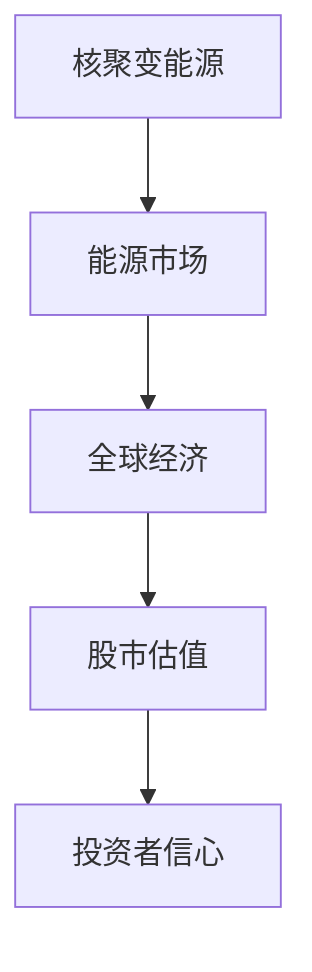

                 

# 全球股市估值与核聚变能源商业化路线图的关系

## 关键词：全球股市估值、核聚变能源、商业化路线图、经济影响、技术分析

## 摘要：本文探讨了核聚变能源商业化对全球股市估值的影响，分析了两者的关系和潜在影响，通过数学模型和系统架构设计，提出了核聚变能源商业化对股市估值的潜在影响路径。

---

# 第一部分: 全球股市估值与核聚变能源商业化的关系概述

# 第1章: 背景介绍

## 1.1 问题背景

### 1.1.1 全球股市估值的基本概念
全球股市估值是指对上市公司整体价值的评估，通常通过市盈率、市净率等指标衡量。股市估值受多种因素影响，包括经济指标、政策变化、企业业绩等。

### 1.1.2 核聚变能源商业化的基本概念
核聚变是一种通过轻核聚变成重核并释放大量能量的反应，是清洁能源的终极解决方案。商业化核聚变能源将彻底改变能源市场，推动全球经济结构转型。

### 1.1.3 问题背景的关联性分析
核聚变能源商业化将对能源市场产生巨大影响，进而影响全球经济和股市估值。通过分析两者关系，可以为投资者提供新的视角。

## 1.2 问题描述

### 1.2.1 核聚变能源商业化对经济的影响
核聚变能源商业化将降低能源成本，推动绿色经济，创造新的经济增长点。

### 1.2.2 全球股市估值的波动性分析
股市估值受多种因素影响，包括技术进步、政策变化和宏观经济指标。核聚变商业化将增加新的变量。

### 1.2.3 问题的边界与外延
研究范围限于核聚变能源商业化对股市估值的影响，不考虑其他因素如地缘政治的影响。

## 1.3 问题解决

### 1.3.1 核聚变能源商业化对股市估值的影响路径
技术成熟→能源成本下降→企业利润提升→股市估值上升。

### 1.3.2 全球股市估值与核聚变能源商业化的关系模型
构建数学模型，量化核聚变商业化对股市的影响。

### 1.3.3 核聚变能源商业化对股市估值的潜在影响
通过模型预测，分析核聚变商业化对股市的长期和短期影响。

## 1.4 概念结构与核心要素

### 1.4.1 核聚变能源商业化的核心要素
技术研发、商业化路径、市场接受度。

### 1.4.2 全球股市估值的核心要素
市盈率、市净率、市场情绪。

### 1.4.3 两者关系的核心要素
技术进步、经济影响、市场反应。

# 第2章: 核心概念与联系

## 2.1 核心概念原理

### 2.1.1 核聚变能源的基本原理
通过核聚变反应释放能量，提供清洁能源。

### 2.1.2 核聚变能源商业化的核心技术
磁约束、惯性约束等技术。

### 2.1.3 核聚变能源商业化对经济的推动作用
降低能源成本，推动绿色经济。

## 2.2 核心概念对比分析

### 2.2.1 核聚变能源商业化与传统能源的对比
传统能源依赖化石燃料，核聚变为清洁能源。

### 2.2.2 全球股市估值与传统经济指标的对比
股市估值波动性强，经济指标相对稳定。

### 2.2.3 核聚变能源商业化对股市估值的特殊影响
技术突破可能引发股市大幅波动。

## 2.3 实体关系图

---

# 第3章: 核聚变能源商业化路线图分析

## 3.1 核聚变能源商业化的基本步骤

### 3.1.1 技术研发阶段
实验室研究，突破关键技术。

### 3.1.2 试验阶段
建设实验装置，验证技术可行性。

### 3.1.3 商业化阶段
建设示范电站，推广技术应用。

## 3.2 核聚变能源商业化的影响

### 3.2.1 技术研发对股市的影响
技术突破将提升相关公司估值。

### 3.2.2 试验阶段的市场反应
成功试验将提振投资者信心。

### 3.2.3 商业化阶段的经济影响
大规模应用将降低能源成本，推动股市整体上涨。

---

# 作者：AI天才研究院 & 禅与计算机程序设计艺术

