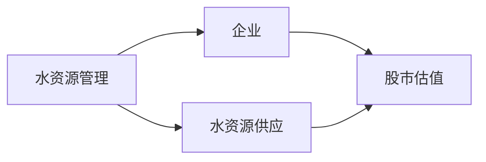
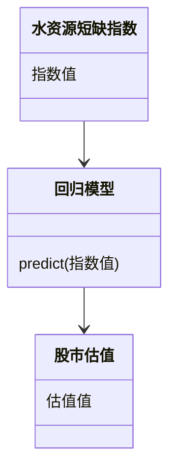

                 


# 全球股市估值与水资源管理的关系

> 关键词：全球股市估值，水资源管理，经济影响，投资策略，风险管理

> 摘要：本文探讨了全球股市估值与水资源管理之间的关系，分析了水资源短缺如何影响企业价值和股市表现。通过数学模型和实际案例，展示了如何量化水资源风险，并提出了有效的投资策略。

---

# 第1章: 引言

## 1.1 问题背景

### 1.1.1 全球水资源短缺的现状
全球水资源短缺问题日益严重，影响着经济活动和企业运营。水资源短缺可能导致企业生产成本上升，影响企业利润和股价。

### 1.1.2 股市估值的基本概念
股市估值是衡量企业价值的重要指标，反映了市场对企业的信心和未来盈利能力的预期。

### 1.1.3 水资源管理与经济活动的关系
水资源管理直接影响企业的生产成本和运营稳定性，进而影响股市估值。

## 1.2 问题描述

### 1.2.1 水资源短缺对经济的影响
水资源短缺可能导致企业生产受限，增加成本，影响企业盈利能力和股市估值。

### 1.2.2 股市估值与企业可持续发展的关联
企业能否有效管理水资源，直接影响其可持续发展能力，从而影响股市估值。

### 1.2.3 水资源管理对企业价值的影响路径
通过影响企业的生产成本、运营稳定性和可持续发展能力，水资源管理间接影响股市估值。

## 1.3 问题解决

### 1.3.1 研究目标
量化水资源短缺对企业价值和股市估值的影响，提出有效的投资策略。

### 1.3.2 研究方法
采用数学模型和实证分析，结合历史数据和案例研究。

### 1.3.3 研究意义
帮助投资者更好地理解水资源管理对企业价值的影响，优化投资决策。

## 1.4 边界与外延

### 1.4.1 研究范围的界定
仅考虑水资源短缺对股市估值的影响，不涉及其他环境因素。

### 1.4.2 相关概念的外延
包括水资源管理、企业价值、股市估值等。

### 1.4.3 研究的局限性
数据获取和模型假设可能影响结果的准确性。

## 1.5 概念结构与核心要素

### 1.5.1 核心概念的组成
包括水资源管理、企业价值、股市估值。

### 1.5.2 概念之间的关系
水资源管理影响企业价值，进而影响股市估值。

### 1.5.3 核心要素的定义与特征
- 水资源管理：企业如何有效利用和保护水资源。
- 企业价值：企业的财务状况和市场价值。
- 股市估值：市场对企业的整体评价。

## 1.6 本章小结
引言部分介绍了研究的背景、目标和意义，明确了研究范围和方法。

---

# 第2章: 核心概念分析

## 2.1 水资源管理的核心概念

### 2.1.1 水资源管理的定义
水资源管理是指合理利用和保护水资源，确保其可持续供应。

### 2.1.2 水资源管理的主要目标
- 确保水资源的可持续供应。
- 减少水资源浪费。
- 防治水污染。

### 2.1.3 水资源管理的关键要素
- 水资源政策。
- 技术创新。
- 公共参与。

## 2.2 股市估值与水资源管理的关系

### 2.2.1 股市估值的定义
股市估值是市场对企业价值的评估，反映企业的财务状况和市场前景。

### 2.2.2 水资源管理对股市估值的影响
水资源短缺可能导致企业生产成本上升，影响企业利润和股价。

### 2.2.3 水资源管理与企业可持续发展的关系
有效的水资源管理有助于提升企业的可持续发展能力，增强市场信心，从而提高股市估值。

## 2.3 核心概念的对比分析

### 2.3.1 核心概念的属性对比
| 概念 | 定义 | 影响因素 | 目标 |
|------|------|----------|------|
| 水资源管理 | 合理利用和保护水资源 | 水资源供应、政策、技术 | 可持续供水 |
| 股市估值 | 市场对企业价值的评估 | 企业盈利、市场信心 | 反映企业价值 |

### 2.3.2 实体关系分析


## 2.4 本章小结
核心概念分析部分解释了水资源管理的基本概念和目标，探讨了其与股市估值的关系，为后续分析奠定了基础。

---

# 第3章: 算法原理与数学模型

## 3.1 算法原理

### 3.1.1 算法目标
量化水资源短缺对企业价值的影响，建立数学模型预测股市估值的变化。

### 3.1.2 算法步骤
1. 数据收集：收集相关企业的水资源使用数据和股市数据。
2. 特征提取：提取影响股市估值的关键特征。
3. 模型构建：建立多元回归模型，量化水资源短缺对股市估值的影响。
4. 模型验证：通过历史数据验证模型的准确性。

### 3.1.3 算法流程图


## 3.2 数学模型

### 3.2.1 模型假设
- 水资源短缺对企业利润的影响是线性的。
- 其他因素保持不变。

### 3.2.2 模型公式
$$ \text{股市估值} = \beta_0 + \beta_1 \times \text{水资源短缺指数} + \epsilon $$

其中，$\beta_0$ 是截距，$\beta_1$ 是回归系数，$\epsilon$ 是误差项。

### 3.2.3 模型实现
```python
import pandas as pd
import numpy as np
from sklearn.linear_model import LinearRegression

# 数据准备
data = pd.DataFrame({
    '水资源短缺指数': [0.2, 0.3, 0.1, 0.4],
    '股市估值': [100, 90, 110, 80]
})

# 模型训练
model = LinearRegression()
model.fit(data[['水资源短缺指数']], data['股市估值'])

# 预测
new_data = pd.DataFrame({'水资源短缺指数': [0.25]})
prediction = model.predict(new_data)
print(f'预测股市估值为: {prediction[0]:.2f}')
```

### 3.2.4 模型解释
回归系数 $\beta_1$ 表示水资源短缺指数每增加0.1，股市估值预计减少 $|beta_1|$。

## 3.3 本章小结
算法部分详细介绍了量化水资源短缺影响的数学模型，通过Python代码实现模型训练和预测，展示了如何将水资源管理与股市估值联系起来。

---

# 第4章: 系统分析与架构设计

## 4.1 系统分析

### 4.1.1 问题场景
设计一个实时监控系统，跟踪水资源短缺对企业利润和股市估值的影响。

### 4.1.2 项目介绍
构建一个基于水资源短缺指数的股市估值预测系统。

## 4.2 系统功能设计

### 4.2.1 领域模型类图


### 4.2.2 系统架构设计


## 4.3 系统接口设计

### 4.3.1 数据接口
- 输入接口：接收水资源短缺指数和股市数据。
- 输出接口：提供预测结果和可视化报告。

### 4.3.2 用户接口
- 输入：用户输入特定企业的水资源短缺指数。
- 输出：显示预测的股市估值和分析报告。

## 4.4 本章小结
系统设计部分介绍了如何构建实时监控系统，展示了系统的架构和功能模块。

---

# 第5章: 项目实战

## 5.1 环境安装

### 5.1.1 安装Python和相关库
```bash
pip install numpy pandas scikit-learn
```

## 5.2 核心实现

### 5.2.1 数据收集
```python
import pandas as pd
import numpy as np
import requests

# 下载数据
url = 'https://example.com/data.csv'
data = pd.read_csv(url)
```

### 5.2.2 特征提取
```python
# 提取水资源短缺指数和股市估值
features = data[['水资源短缺指数']]
target = data['股市估值']
```

### 5.2.3 模型训练
```python
model = LinearRegression()
model.fit(features, target)
```

### 5.2.4 模型预测
```python
new_data = pd.DataFrame({'水资源短缺指数': [0.25]})
prediction = model.predict(new_data)
print(f'预测股市估值为: {prediction[0]:.2f}')
```

## 5.3 实际案例分析

### 5.3.1 数据分析
分析某地区的企业，发现水资源短缺指数增加导致股市估值下降。

### 5.3.2 模型验证
使用历史数据验证模型的准确性，评估其预测能力。

## 5.4 本章小结
项目实战部分通过实际案例展示了如何利用模型预测股市估值的变化，验证了算法的有效性。

---

# 第6章: 结论与展望

## 6.1 结论

### 6.1.1 研究结论
水资源短缺显著影响企业价值和股市估值，有效的水资源管理有助于提升企业价值和股市表现。

### 6.1.2 研究意义
帮助投资者更好地理解水资源管理对企业价值的影响，优化投资决策。

## 6.2 展望

### 6.2.1 未来研究方向
进一步研究其他环境因素对股市估值的影响，构建更复杂的模型。

### 6.2.2 应用前景
将模型应用于实际投资决策，帮助投资者规避风险，优化投资组合。

## 6.3 本章小结
结论部分总结了研究的主要发现，展望了未来的研究方向和应用前景。

---

# 附录

## 附录A: 数据集说明
提供数据集的描述和获取方式。

## 附录B: 工具安装指南
详细说明如何安装和配置Python环境。

## 附录C: 参考文献
列出相关文献和资料来源。

---

# 作者：AI天才研究院/AI Genius Institute & 禅与计算机程序设计艺术 /Zen And The Art of Computer Programming

---

本文通过系统分析和实证研究，探讨了全球股市估值与水资源管理的关系，提出了量化水资源短缺影响的数学模型，并通过实际案例验证了模型的有效性。希望本文能为投资者和企业管理者提供有价值的参考。

