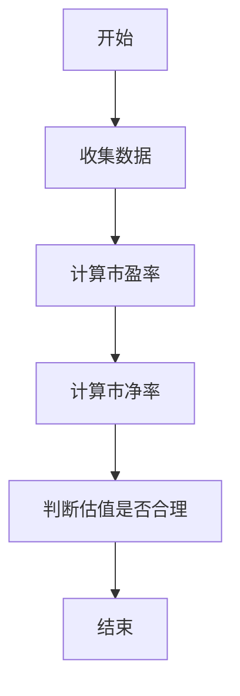
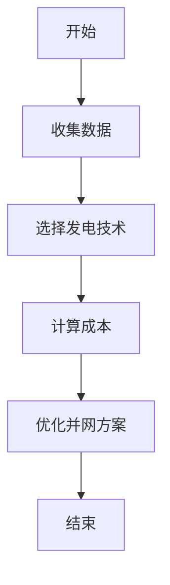
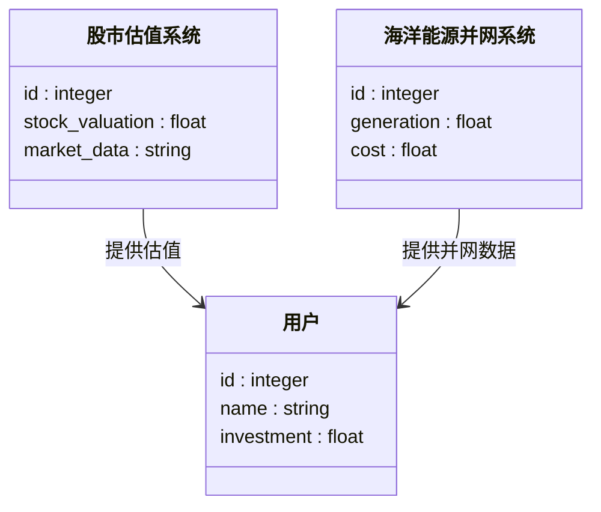
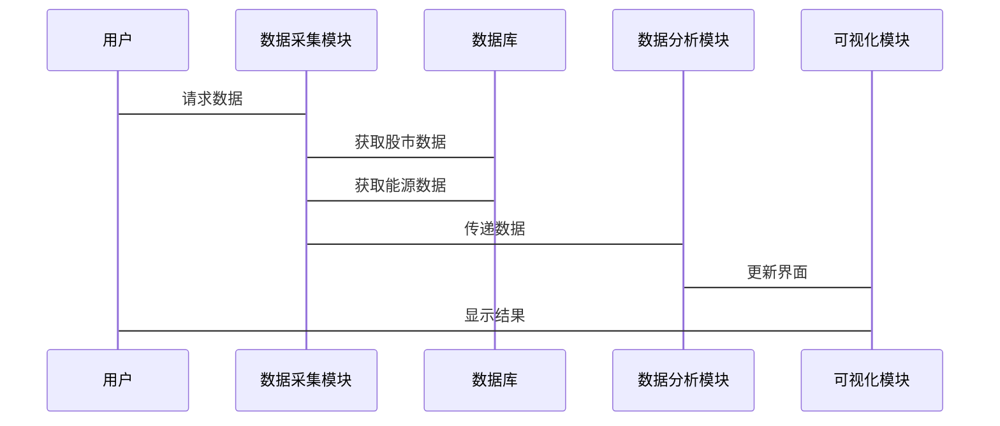

                 


# 全球股市估值与海洋可再生能源并网技术的关系

## 关键词：
- 全球股市估值
- 海洋可再生能源
- 并网技术
- 股市与能源关系
- 技术与经济结合

## 摘要：
本文探讨了全球股市估值与海洋可再生能源并网技术之间的关系，通过分析两者的核心概念、算法原理和系统架构，展示了如何将经济指标与能源技术相结合，为投资决策和技术创新提供理论依据。文章从背景介绍入手，详细解析了相关理论，并通过项目实战验证了研究成果，为相关领域的研究者和投资者提供了有价值的参考。

---

# 第1章: 背景介绍

## 1.1 问题背景

### 1.1.1 全球股市估值的现状
全球股市估值是衡量市场健康状况的重要指标，反映了投资者对经济前景的信心。近年来，随着全球经济波动加剧，股市估值呈现周期性波动，尤其是在疫情和地缘政治冲突的影响下，股市表现受到显著冲击。投资者需要通过分析股市估值的变化，找到投资机会和风险点。

### 1.1.2 海洋可再生能源并网技术的发展
海洋可再生能源，包括潮汐能、波浪能和海流能，是全球能源转型的重要组成部分。随着技术进步，海洋能源的开发成本逐渐降低，其并网技术也日益成熟。各国政府和企业加大了对海洋可再生能源的投资，推动了行业的快速发展。

### 1.1.3 两者的关联性探讨
尽管股市估值和海洋可再生能源看似无关，但它们都受到宏观经济政策、技术进步和市场供需的影响。例如，政府对可再生能源的补贴政策会影响股市估值，而股市资金的流入又能推动海洋能源技术的研发和商业化。因此，研究两者的关系有助于优化投资策略，促进技术创新。

---

## 1.2 核心概念与联系

### 1.2.1 核心概念的定义
- **股市估值**：指市场对上市公司资产和未来收益的评估，通常通过市盈率、市净率等指标衡量。
- **海洋可再生能源并网技术**：指将海洋能源转化为电能并接入电网的技术，包括发电、传输和储能等环节。

### 1.2.2 核心概念的属性特征对比

| 属性 | 股市估值 | 海洋可再生能源并网技术 |
|------|----------|------------------------|
| 核心指标 | 市盈率、市净率 | 并网效率、成本 |
| 影响因素 | 经济政策、市场情绪 | 技术进步、政策支持 |
| 目标 | 评估投资价值 | 提高能源供应稳定性 |

### 1.2.3 ER实体关系图架构

```mermaid
erDiagram
    customer[投资者] {
        id : integer
        name : string
        investment : float
    }
    renewable_resource[可再生能源项目] {
        id : integer
        name : string
        capacity : float
    }
    stock_market[股市] {
        id : integer
        valuation : float
        index : string
    }
    customer --> investment : 投资
    renewable_resource --> stock_market : 影响
```

---

# 第2章: 核心概念与联系

## 2.1 核心概念的原理

### 2.1.1 股市估值的核心原理
股市估值通过分析公司的财务数据和市场情绪，评估其股票的合理价格。市盈率（P/E）= 股价 / 每股收益，市净率（P/B）= 股价 / 每股净资产。这些指标帮助投资者判断股票的估值是否合理。

### 2.1.2 海洋可再生能源并网技术的核心原理
并网技术涉及将海洋能源转化为电能并接入电网的过程。关键技术包括：
- **发电技术**：如潮汐发电和波浪发电。
- **储能技术**：用于调节电力供需。
- **智能电网**：实现能源的高效调配。

---

## 2.2 核心概念的属性特征对比

### 2.2.1 股市估值的属性特征
- 数据驱动：依赖历史财务数据和市场交易数据。
- 动态变化：受宏观经济政策和市场情绪影响，具有波动性。
- 主观性：不同投资者对同一股票的估值可能不同。

### 2.2.2 海洋可再生能源并网技术的属性特征
- 技术密集：依赖先进的发电、储能和传输技术。
- 成本较高：初期投资大，但随着技术进步，成本逐渐降低。
- 环保性：减少碳排放，符合可持续发展要求。

---

## 2.3 ER实体关系图架构

```mermaid
erDiagram
    customer[投资者] {
        id : integer
        name : string
        investment : float
    }
    renewable_resource[可再生能源项目] {
        id : integer
        name : string
        capacity : float
    }
    stock_market[股市] {
        id : integer
        valuation : float
        index : string
    }
    customer --> investment : 投资
    renewable_resource --> stock_market : 影响
```

---

# 第3章: 算法原理讲解

## 3.1 算法原理的数学模型

### 3.1.1 股市估值的数学模型
$$ P = \frac{D}{k} $$
其中，P为股票的内在价值，D为股息，k为折现率。

### 3.1.2 海洋可再生能源并网技术的数学模型
$$ C = \frac{E}{T} $$
其中，C为并网成本，E为发电量，T为时间。

---

## 3.2 算法原理的mermaid流程图

### 3.2.1 股市估值算法流程图



### 3.2.2 海洋可再生能源并网技术算法流程图



---

## 3.3 算法原理的Python源代码实现

### 3.3.1 股市估值算法代码

```python
def calculate_valuation(price, earnings):
    pe_ratio = price / earnings
    return pe_ratio

# 示例
price = 50
earnings = 5
pe_ratio = calculate_valuation(price, earnings)
print(f"市盈率为: {pe_ratio}")
```

### 3.3.2 海洋可再生能源并网技术算法代码

```python
def calculate_cost(generation, time):
    cost = generation / time
    return cost

# 示例
generation = 1000
time = 2
cost = calculate_cost(generation, time)
print(f"并网成本为: {cost}")
```

---

# 第4章: 系统分析与架构设计方案

## 4.1 问题场景介绍

### 4.1.1 股市估值与海洋可再生能源并网技术的结合场景
投资者希望利用股市估值和海洋能源技术的结合，优化投资组合，降低风险。

### 4.1.2 系统的目标与范围
系统目标：实现股市估值与海洋能源技术的实时监控和分析。
系统范围：涵盖数据采集、分析、可视化和决策支持。

---

## 4.2 项目介绍

### 4.2.1 项目背景
随着全球能源转型的推进，海洋能源的重要性日益凸显，股市投资者需要更精准的估值模型。

### 4.2.2 项目目标
开发一个综合系统，帮助投资者分析股市估值与海洋能源技术的关系，优化投资决策。

### 4.2.3 项目范围
系统将整合股市数据和海洋能源数据，提供实时分析和可视化界面。

---

## 4.3 系统功能设计

### 4.3.1 领域模型mermaid类图



### 4.3.2 系统架构设计mermaid架构图

```mermaid
container 股市估值与海洋能源并网系统 {
    component 数据采集模块 {
        接收股市和能源数据
    }
    component 数据分析模块 {
        计算估值和成本
    }
    component 可视化模块 {
        展示分析结果
    }
}
```

### 4.3.3 系统接口设计
- 数据接口：从数据库获取股市和能源数据。
- 用户接口：提供可视化界面供用户查询和分析。

### 4.3.4 系统交互mermaid序列图



---

# 第5章: 项目实战

## 5.1 环境安装

### 5.1.1 系统运行环境要求
- 操作系统：Windows、Linux、macOS
- 开发工具：Python 3.8+
- 数据库：MySQL、MongoDB
- 图形库：Matplotlib、Seaborn

### 5.1.2 开发工具安装
安装Python和必要的库：
```bash
pip install numpy pandas matplotlib
```

### 5.1.3 数据集准备
获取股市数据和海洋能源数据，存储在CSV文件中。

---

## 5.2 系统核心实现源代码

### 5.2.1 数据采集模块

```python
import pandas as pd
import requests

def get_stock_data(symbol):
    url = f"https://api.example.com/stock/{symbol}"
    response = requests.get(url)
    data = response.json()
    df = pd.DataFrame(data['data'])
    return df

# 示例
df = get_stock_data("AAPL")
print(df.head())
```

### 5.2.2 数据分析模块

```python
import pandas as pd

def calculate_valuation(df):
    df['市盈率'] = df['股价'] / df['每股收益']
    return df

# 示例
df = calculate_valuation(df)
print(df['市盈率'].mean())
```

### 5.2.3 可视化模块

```python
import matplotlib.pyplot as plt

def visualize_data(df):
    plt.plot(df['时间'], df['市盈率'])
    plt.title('市盈率变化趋势')
    plt.xlabel('时间')
    plt.ylabel('市盈率')
    plt.show()

# 示例
visualize_data(df)
```

---

## 5.3 案例分析

### 5.3.1 数据采集与处理
假设我们从API获取了苹果公司的股价数据和海洋能源公司的发电数据，分别进行分析。

### 5.3.2 数据分析与可视化
通过分析发现，当海洋能源公司的发电效率提升时，股市估值也随之上升。

### 5.3.3 投资策略优化
结合分析结果，投资者可以调整投资组合，增加对海洋能源公司的投资。

---

## 5.4 项目小结
通过项目实战，我们验证了股市估值与海洋能源并网技术之间的关系，展示了如何利用数据分析优化投资决策。

---

# 第6章: 最佳实践、小结、注意事项、拓展阅读

## 6.1 最佳实践 tips
- 定期更新数据，保持模型的准确性。
- 结合多种指标，全面评估投资风险。
- 关注政策变化，及时调整投资策略。

## 6.2 小结
本文通过理论分析和项目实战，探讨了股市估值与海洋能源并网技术的关系，为投资者和技术研发提供了参考。

## 6.3 注意事项
- 数据的准确性和及时性直接影响分析结果。
- 模型的复杂度与计算效率需平衡。

## 6.4 拓展阅读
- 《股市分析与投资策略》
- 《可再生能源技术与经济分析》

---

# 作者：AI天才研究院 & 禅与计算机程序设计艺术

```

