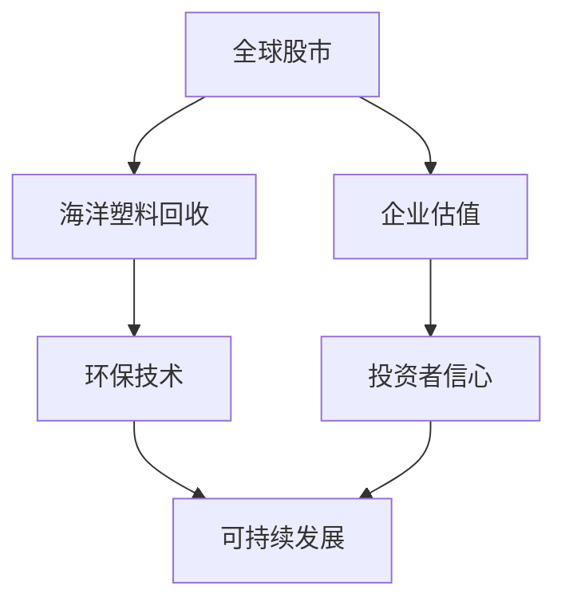
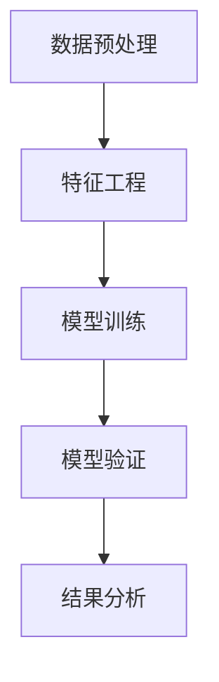
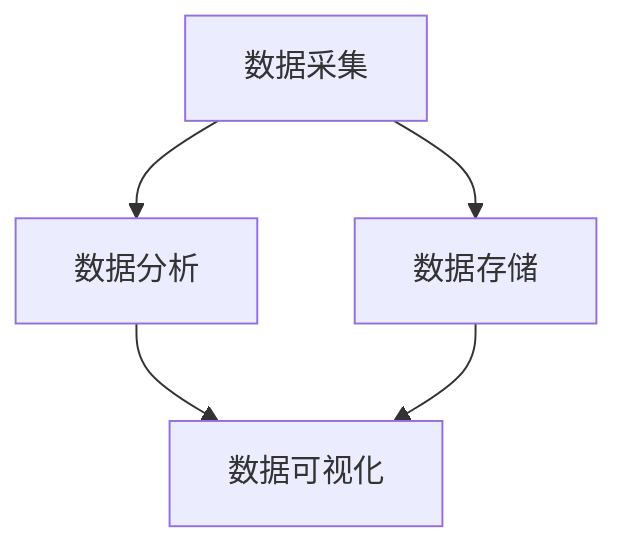

                 


---

# 全球股市估值与海洋塑料回收技术的关联

> 关键词：全球股市估值、海洋塑料回收、经济与环境关联、可持续投资、环保技术

> 摘要：本文探讨全球股市估值与海洋塑料回收技术之间的潜在关联，从经济、环境和技术角度分析其相互作用，结合数据建模与系统设计，揭示环保技术对经济价值的影响。

---

# 第一部分: 全球股市估值与海洋塑料回收技术的关联概述

## 第1章: 背景介绍

### 1.1 全球股市估值的背景
#### 1.1.1 什么是全球股市估值
全球股市估值是衡量股市整体价值的指标，通常通过加总所有上市公司市值计算，反映市场信心和经济状况。

#### 1.1.2 全球股市估值的重要性
股市估值影响投资者决策、企业融资能力及整体经济表现，是经济健康的重要指标。

#### 1.1.3 全球股市估值的现状
近年来，全球股市估值波动加剧，受经济政策、地缘政治和技术创新等多重因素影响。

### 1.2 海洋塑料回收技术的背景
#### 1.2.1 海洋塑料污染的现状
海洋塑料污染严重威胁生态系统，影响海洋生物和人类健康，成为全球环境问题。

#### 1.2.2 海洋塑料回收技术的发展
回收技术进步，如智能分拣、化学分解和生物降解，推动了塑料回收效率的提升。

#### 1.2.3 海洋塑料回收技术的挑战
技术成本高、回收效率低、政策支持不足是当前面临的主要挑战。

### 1.3 两者关联的背景
#### 1.3.1 经济与环境的双重驱动
环保政策和经济利益推动企业采用回收技术，影响股市估值。

#### 1.3.2 可持续投资理念的兴起
投资者关注ESG（环境、社会、治理）因素，环保技术成为影响投资决策的关键因素。

#### 1.3.3 环保技术对经济的影响
环保技术的创新和应用可能提升企业竞争力，进而影响股市估值。

---

## 第2章: 核心概念与联系

### 2.1 核心概念原理
#### 2.1.1 全球股市估值的核心要素
- 市场整体表现
- 企业盈利状况
- 宏观经济政策

#### 2.1.2 海洋塑料回收技术的核心要素
- 技术创新
- 回收效率
- 成本控制

#### 2.1.3 两者关联的机制
- 环保政策影响企业利润，进而影响股市估值。
- 回收技术进步提升企业竞争力，推动股价上升。

### 2.2 核心概念对比
#### 2.2.1 经济属性对比
| 经济属性 | 全球股市估值 | 海洋塑料回收技术 |
|----------|--------------|------------------|
| 影响因素 | 经济政策、企业盈利 | 环保政策、技术进步 |
| 价值体现 | 市场信心、投资回报 | 环境改善、成本节约 |

#### 2.2.2 技术属性对比
| 技术属性 | 全球股市估值 | 海洋塑料回收技术 |
|----------|--------------|------------------|
| 技术类型 | 经济模型、数据分析 | 化学工程、材料科学 |
| 技术目标 | 评估市场价值 | 回收塑料材料 |

#### 2.2.3 社会属性对比
| 社会属性 | 全球股市估值 | 海洋塑料回收技术 |
|----------|--------------|------------------|
| 社会影响 | 经济发展、就业 | 环境保护、公共健康 |
| 社会价值 | 投资回报、财富分配 | 可持续发展、生态平衡 |

### 2.3 ER实体关系图


---

## 第3章: 关联机制分析

### 3.1 经济因素分析
#### 3.1.1 环保政策对股市的影响
环保政策推动企业采用绿色技术，提升企业估值，进而影响股市整体表现。

#### 3.1.2 环保技术对企业估值的影响
创新的海洋塑料回收技术可能提升企业竞争力，增加市场对其股票的需求。

#### 3.1.3 投资者环保意识的增强
投资者倾向于投资环保表现良好的企业，推动相关企业股价上涨。

### 3.2 环境因素分析
#### 3.2.1 海洋塑料污染对经济的影响
塑料污染影响海洋生态，增加企业运营成本，间接影响股市表现。

#### 3.2.2 环保技术对环境的改善
有效的塑料回收技术减少环境污染，提升企业形象，增强投资者信心。

#### 3.2.3 环境改善对股市的反馈
环境改善可能提升企业利润，进而推动股市估值上升。

### 3.3 技术因素分析
#### 3.3.1 海洋塑料回收技术的创新
技术创新降低回收成本，提高效率，提升企业竞争力和市场估值。

#### 3.3.2 技术进步对股市的推动
高效回收技术可能成为企业的竞争优势，吸引投资者，推动股价上升。

#### 3.3.3 技术应用的经济影响
广泛的应用可能推动相关产业的发展，形成新的经济增长点，影响整体股市表现。

---

## 第4章: 数据建模与分析

### 4.1 数据建模
#### 4.1.1 数据来源与预处理
使用全球股市数据和海洋塑料回收技术相关数据，进行清洗和特征工程。

#### 4.1.2 模型构建
构建多元回归模型，分析海洋塑料回收技术对企业估值的影响。

#### 4.1.3 模型假设
假设海洋塑料回收技术的创新显著影响企业估值。

#### 4.1.4 模型验证
通过历史数据验证模型准确性，调整参数优化预测效果。

### 4.2 数据分析
#### 4.2.1 回归分析
使用多元回归模型，分析海洋塑料回收技术对企业估值的影响。

#### 4.2.2 方差分析
评估模型变量的显著性，确认海洋塑料回收技术对股市估值的影响。

#### 4.2.3 趋势分析
分析海洋塑料回收技术的创新趋势与股市估值的变化趋势，寻找相关性。

---

## 第5章: 算法原理讲解

### 5.1 算法选择
选择多元回归模型，用于分析海洋塑料回收技术对企业估值的影响。

### 5.2 算法流程图


### 5.3 Python代码实现
```python
import pandas as pd
import numpy as np
from sklearn.linear_model import LinearRegression
from sklearn.metrics import r2_score

# 数据加载与预处理
data = pd.read_csv('stock_plastic.csv')
X = data[['recovery_technology', 'policy_support', 'investor_confidence']]
y = data['market_cap']

# 模型训练
model = LinearRegression()
model.fit(X, y)

# 模型验证
predictions = model.predict(X)
print("R² Score:", r2_score(y, predictions))
```

### 5.4 数学模型
多元回归模型：
$$ y = \beta_0 + \beta_1x_1 + \beta_2x_2 + \beta_3x_3 + \epsilon $$

---

## 第6章: 系统架构设计

### 6.1 系统功能设计
- 数据采集模块：收集全球股市数据和海洋塑料回收技术数据。
- 数据分析模块：运行回归模型，分析两者关联。
- 可视化模块：生成图表，展示分析结果。

### 6.2 系统架构图


### 6.3 系统接口设计
- API接口：提供数据接口，供其他系统调用。
- 用户界面：展示分析结果，方便用户查看。

---

## 第7章: 项目实战

### 7.1 环境安装
安装Python、Pandas、Scikit-learn等工具。

### 7.2 核心代码实现
```python
import pandas as pd
import numpy as np
from sklearn.linear_model import LinearRegression
from sklearn.metrics import r2_score

# 数据加载与预处理
data = pd.read_csv('stock_plastic.csv')
X = data[['recovery_technology', 'policy_support', 'investor_confidence']]
y = data['market_cap']

# 模型训练
model = LinearRegression()
model.fit(X, y)

# 模型验证
predictions = model.predict(X)
print("R² Score:", r2_score(y, predictions))
```

### 7.3 案例分析
分析某企业的数据，展示如何通过回收技术提升估值。

### 7.4 项目小结
总结项目成果，讨论存在的问题和改进建议。

---

## 第8章: 总结与展望

### 8.1 总结
本文探讨了全球股市估值与海洋塑料回收技术的关联，从经济、环境和技术角度进行了详细分析，结合数据建模和系统设计，揭示了环保技术对经济价值的影响。

### 8.2 展望
未来研究可以进一步探讨更复杂的模型，扩展数据集，深入分析不同地区和行业的差异。

---

作者：AI天才研究院/AI Genius Institute & 禅与计算机程序设计艺术 /Zen And The Art of Computer Programming

