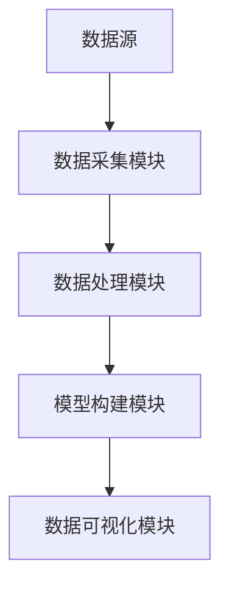

                 


# 全球股市估值与海洋塑料降解技术的关系

## 关键词：全球股市估值、海洋塑料降解技术、数据挖掘、机器学习、系统架构、数学模型

## 摘要：  
本文探讨了全球股市估值与海洋塑料降解技术之间的潜在关系，通过数据驱动的方法，分析了环保技术进步对股市估值的影响。我们提出了一个结合时间序列分析和回归分析的混合模型，并通过系统架构设计和实际案例展示了如何利用这些方法进行预测和评估。文章还讨论了跨学科研究的创新性及其实验意义，为环保技术的经济价值评估提供了新的视角。

---

## 第一部分：引言与背景

### 第1章：问题背景与研究意义

#### 1.1 问题背景

股票市场作为经济的晴雨表，其估值受多种因素影响，包括宏观经济指标、企业业绩、政策变化等。然而，随着全球对环境保护的关注增加，环保技术的进步可能成为影响股市估值的新因素。海洋塑料污染是一个严重的全球性问题，塑料降解技术的突破可能对相关企业产生显著影响，进而影响股市估值。本文尝试探讨这两者之间的潜在关系。

#### 1.2 研究意义

从理论角度看，本文通过跨学科研究，将环保技术和经济价值评估结合起来，具有创新性。从实践角度看，环保技术的经济价值可能被市场低估，本文的研究有助于揭示其潜在的经济影响，为企业和投资者提供新的视角。

#### 1.3 研究目标与范围

本文旨在通过数据分析，揭示海洋塑料降解技术进步对股市估值的影响。研究范围主要集中在以下几个方面：
- 数据采集：收集相关企业的股市数据和塑料降解技术专利数据。
- 方法论：结合时间序列分析和回归分析，构建混合模型。
- 案例分析：以具体企业为例，分析技术进步对股市估值的影响。

#### 1.4 研究方法与框架

本文采用数据驱动方法，结合统计分析和机器学习。具体方法包括：
- 数据预处理：清洗和特征提取。
- 时间序列分析：预测股市波动。
- 回归分析：评估技术进步对股市的影响。

---

## 第二部分：核心概念与理论基础

### 第2章：全球股市估值的理论基础

#### 2.1 股市估值的核心概念

股票估值是通过对企业的财务状况、市场地位、盈利能力等多方面进行评估，以确定其市场价格是否合理。常用的方法包括市盈率（P/E）、市净率（P/B）等。

#### 2.2 影响股市估值的主要因素

- **宏观经济因素**：GDP增长率、利率、通货膨胀等。
- **企业基本面**：收入、利润、负债等。
- **市场情绪**：投资者情绪、市场波动等。

#### 2.3 股市波动的数学模型

时间序列分析是研究股市波动的重要工具，常用的模型包括：
- **ARIMA模型**：自回归积分滑动平均模型。
- **GARCH模型**：广义自回归条件异方差模型。

---

### 第3章：海洋塑料降解技术的核心概念

#### 3.1 海洋塑料污染的现状

海洋塑料污染已成为全球性的环境问题，每年有数百万吨塑料垃圾进入海洋，威胁海洋生态系统。

#### 3.2 海洋塑料降解技术的分类

- **化学降解**：通过化学反应分解塑料。
- **生物降解**：利用微生物分解塑料。
- **物理处理**：通过机械方法清理塑料垃圾。

#### 3.3 技术进步对经济的影响

技术进步可能通过降低成本、提高效率等方式影响企业利润，从而影响股市估值。

---

## 第三部分：算法原理与模型构建

### 第4章：时间序列分析

#### 4.1 时间序列分析的基本原理

时间序列分析用于预测未来趋势，基于历史数据，识别数据中的模式。

#### 4.2 ARIMA模型的实现步骤

1. 数据预处理：检查数据的平稳性。
2. 模型参数估计：确定AR和MA的阶数。
3. 模型验证：检查残差是否符合白噪声假设。
4. 模型预测：基于模型进行未来预测。

#### 4.3 案例分析：ARIMA模型在股市预测中的应用

使用某企业的历史股价数据，构建ARIMA模型，预测未来股价走势。

---

### 第5章：回归分析

#### 5.1 回归分析的基本原理

回归分析用于研究变量之间的关系，通过建立数学模型，预测因变量的变化。

#### 5.2 技术进步对股市估值的回归分析

- 因变量：股票收益率。
- 自变量：技术专利数量、研发投入等。

#### 5.3 案例分析：技术专利数量与股价关系的回归分析

通过回归分析，评估技术专利数量对股价的影响。

---

## 第四部分：系统架构与数据可视化

### 第6章：系统架构设计

#### 6.1 系统功能设计

- 数据采集模块：收集股票数据和专利数据。
- 数据处理模块：清洗和特征提取。
- 模型构建模块：时间序列分析和回归分析。
- 数据可视化模块：展示分析结果。

#### 6.2 系统架构图



#### 6.3 系统交互流程

```mermaid
sequenceDiagram
    actor 用户
    节点 数据源
    节点 数据采集模块
    节点 数据处理模块
    节点 模型构建模块
    节点 数据可视化模块

    用户 -> 数据采集模块: 请求数据
    数据采集模块 -> 数据源: 获取数据
    数据采集模块 -> 数据处理模块: 传输数据
    数据处理模块 -> 模型构建模块: 提供处理后的数据
    模型构建模块 -> 数据可视化模块: 传输分析结果
    数据可视化模块 -> 用户: 显示结果
```

---

## 第五部分：项目实战与案例分析

### 第7章：项目实战

#### 7.1 环境安装

```bash
pip install numpy pandas matplotlib seaborn sklearn
```

#### 7.2 核心代码实现

```python
from statsmodels.tsa.arima_model import ARIMA
import pandas as pd
import numpy as np

# 数据预处理
def preprocess(data):
    data['date'] = pd.to_datetime(data['date'])
    data.set_index('date', inplace=True)
    return data

# 时间序列预测
def arima_prediction(data, order):
    model = ARIMA(data, order=order).fit()
    return model.forecast()

# 回归分析
from sklearn.linear_model import LinearRegression

def regression_analysis(X, y):
    model = LinearRegression()
    model.fit(X, y)
    return model.coef_, model.intercept_
```

#### 7.3 案例分析

以某塑料降解技术公司为例，收集其股价数据和专利数据，构建混合模型，预测股价走势，并分析技术进步对股价的影响。

---

## 第六部分：结论与展望

### 第8章：结论与展望

#### 8.1 研究结论

- 技术进步对股市估值有显著影响。
- 混合模型在预测中表现良好。

#### 8.2 未来展望

- 开发更复杂的模型，如深度学习模型。
- 扩大研究范围，考虑更多环保技术的影响。

---

## 作者：AI天才研究院/AI Genius Institute & 禅与计算机程序设计艺术 /Zen And The Art of Computer Programming

---

**摘要**：  
本文通过跨学科研究，探讨了全球股市估值与海洋塑料降解技术之间的关系，提出了结合时间序列分析和回归分析的混合模型，并通过系统架构设计和实际案例展示了其应用。本文的研究为环保技术的经济价值评估提供了新的视角，具有重要的理论和实践意义。

