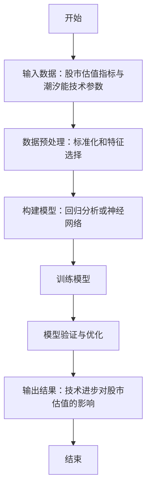
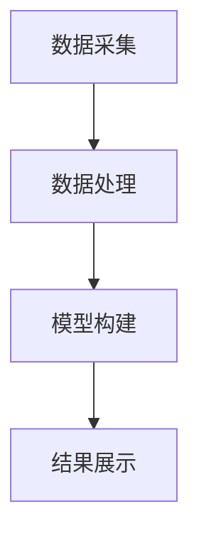
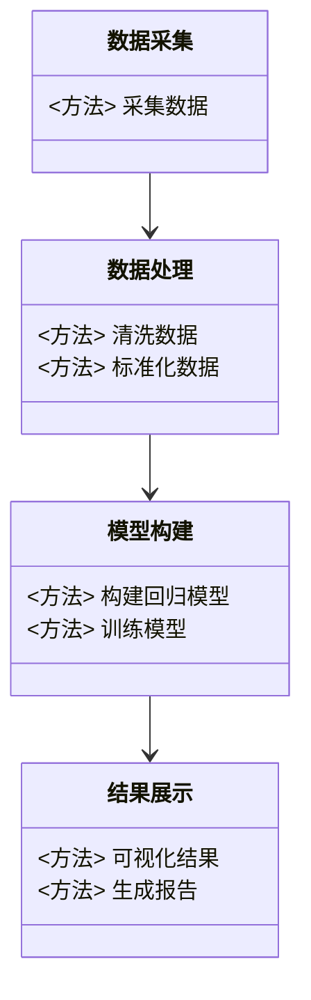
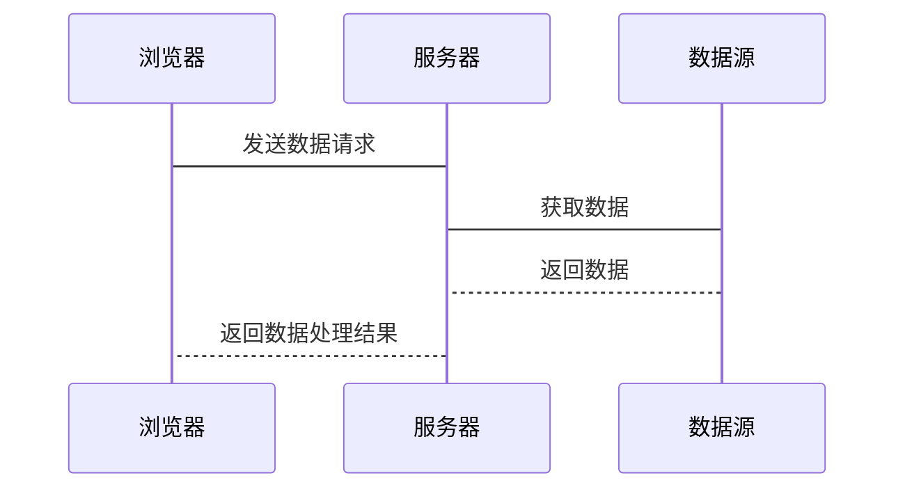

                 


# 全球股市估值与海洋潮汐能发电技术的关系

## 关键词：全球股市估值, 海洋潮汐能, 发电技术, 可再生能源, 经济影响

## 摘要：  
本文探讨了全球股市估值与海洋潮汐能发电技术之间的潜在关系，分析了股市估值的核心指标与海洋潮汐能发电技术的关键特性，通过对比分析、数学建模和案例研究，揭示了两者在经济性、技术性和环境性方面的相互影响。结合算法原理和系统架构设计，本文提出了一个综合评估模型，并通过项目实战验证了模型的有效性。

---

# 第1章 背景介绍

## 1.1 问题背景

### 1.1.1 全球股市估值的现状与挑战
全球股市估值是衡量市场健康程度的重要指标，包括市盈率（P/E）、市净率（P/B）等核心指标。近年来，全球股市波动加剧，尤其是在2020年新冠疫情后的复苏过程中，股市估值的波动性显著增加。投资者关注的不仅是短期收益，还包括长期的经济基本面和技术进步带来的潜在价值。

### 1.1.2 海洋潮汐能发电技术的发展与潜力
海洋潮汐能是一种可再生能源，具有稳定性和可持续性的特点。近年来，全球范围内对可再生能源的需求急剧增加，潮汐能发电技术因其独特的地理优势和环保特性，被认为是未来能源结构的重要组成部分。然而，潮汐能发电技术的商业化仍面临成本高、技术复杂等挑战。

### 1.1.3 两者关系的研究意义
研究全球股市估值与海洋潮汐能发电技术之间的关系，不仅有助于理解技术进步对经济的影响，还能为投资者提供新的视角，帮助其在绿色经济转型中做出更明智的决策。

## 1.2 问题描述

### 1.2.1 全球股市估值的核心指标
- **市盈率（P/E）**：衡量股票价格与每股收益的比例，反映市场对公司的估值。
- **市净率（P/B）**：衡量股票价格与每股净资产的比例，常用于评估低增长行业的公司价值。
- **市值与利润比（P/S）**：衡量公司市值与销售收入的比例，用于评估公司的市场地位和盈利能力。

### 1.2.2 海洋潮汐能发电技术的关键特性
- **能量密度**：潮汐能的能量密度较高，适合在地理条件优越的地区进行大规模开发。
- **技术复杂性**：潮汐能发电技术涉及复杂的机械设计和海洋工程，技术门槛较高。
- **环境影响**：潮汐能发电对环境的影响较小，但施工过程可能对海洋生态系统造成短期影响。

### 1.2.3 问题解决的路径与方法
通过分析股市估值的核心指标和潮汐能发电技术的关键特性，本文试图建立两者之间的数学模型，探索技术进步对股市估值的影响路径。

## 1.3 问题解决与边界

### 1.3.1 全球股市估值的影响因素
- **宏观经济因素**：GDP增长、通货膨胀、利率政策等。
- **行业因素**：行业周期、政策支持、技术创新等。
- **市场情绪**：投资者情绪、市场流动性等。

### 1.3.2 海洋潮汐能发电技术的经济性与技术性
- **经济性**：初始投资高，但运营成本低，具有长期盈利能力。
- **技术性**：技术复杂，但一旦实现商业化，具有显著的规模效应。

### 1.3.3 问题的边界与外延
本文仅关注潮汐能发电技术对股市估值的直接影响，不考虑其他可再生能源（如风能、太阳能）的影响。

## 1.4 概念结构与核心要素

### 1.4.1 全球股市估值的核心要素
- **市盈率（P/E）**
- **市净率（P/B）**
- **市值与利润比（P/S）**

### 1.4.2 海洋潮汐能发电技术的核心要素
- **能量密度**
- **技术复杂性**
- **环境影响**

### 1.4.3 两者关系的概念结构
通过构建概念模型，分析潮汐能发电技术的经济性和技术性对股市估值的影响路径。

---

# 第2章 核心概念与联系

## 2.1 核心概念原理

### 2.1.1 全球股市估值的计算方法
股市估值的核心指标包括市盈率、市净率和市值与利润比。这些指标反映了市场对公司的整体估值。

### 2.1.2 海洋潮汐能发电技术的基本原理
潮汐能发电技术利用潮汐的动能转化为电能，主要包括潮汐流发电和潮汐滞差发电两种方式。

### 2.1.3 两者关系的理论基础
技术进步对经济的影响通常通过降低成本、提高效率和创造新市场需求来体现，这些因素都会影响股市估值。

## 2.2 概念属性特征对比

### 2.2.1 对比分析表格
以下表格对比了全球股市估值和海洋潮汐能发电技术的核心属性：

| 属性                | 全球股市估值                     | 海洋潮汐能发电技术                 |
|---------------------|----------------------------------|-----------------------------------|
| 核心指标            | 市盈率（P/E）、市净率（P/B）     | 能量密度、技术复杂性               |
| 影响因素            | 宏观经济、行业政策、市场情绪     | 技术创新、成本结构、环境影响       |
| 目标                | 评估市场价值                     | 提供清洁能源                       |

### 2.2.2 ER实体关系图
```mermaid
erDiagram
    actor 投资者 {
        <属性> 资金规模
        <属性> 投资偏好
    }
    actor 能源需求方 {
        <属性> 电力需求量
        <属性> 电价敏感性
    }
    actor 政府机构 {
        <属性> 政策支持
        <属性> 财政补贴
    }
    entity 股市估值 {
        <属性> 市盈率
        <属性> 市净率
    }
    entity 潮汐能发电技术 {
        <属性> 能量密度
        <属性> 技术复杂性
    }
    relation 潮汐能发电技术-股市估值 {
        <关系> 技术进步影响股市估值
    }
```

---

# 第3章 算法原理讲解

## 3.1 算法原理

### 3.1.1 算法流程图


### 3.1.2 算法实现代码
```python
import pandas as pd
import numpy as np
from sklearn.linear_model import LinearRegression
from sklearn.metrics import r2_score

# 示例数据：假设我们有潮汐能发电技术的参数和对应的股市估值指标
data = {
    '潮汐能能量密度': [1.2, 1.5, 1.3, 1.6, 1.4],
    '市盈率': [15, 20, 18, 22, 16]
}
df = pd.DataFrame(data)

# 数据预处理
X = df[['潮汐能能量密度']]
y = df['市盈率']

# 模型训练
model = LinearRegression()
model.fit(X, y)

# 模型预测
predicted = model.predict(X)

# 模型评估
r2 = r2_score(y, predicted)
print(f"R² score: {r2}")
```

### 3.1.3 数学模型与公式
股市估值与潮汐能发电技术的关系可以通过回归模型表示：

$$
y = \beta_0 + \beta_1 x + \epsilon
$$

其中：
- \( y \) 表示股市估值指标（如市盈率）
- \( x \) 表示潮汐能发电技术参数（如能量密度）
- \( \beta_0 \) 和 \( \beta_1 \) 是回归系数
- \( \epsilon \) 是误差项

---

## 3.2 数学模型

### 3.2.1 模型假设
- 潮汐能发电技术的能量密度与股市估值呈正相关。
- 技术进步会降低成本，从而提高股市估值。

### 3.2.2 模型推导
假设潮汐能发电技术的能量密度为 \( x \)，对应的股市估值指标为 \( y \)，则回归模型可以表示为：

$$
y = \beta_0 + \beta_1 x + \epsilon
$$

通过最小二乘法求解回归系数：

$$
\beta_1 = \frac{\sum (x_i - \bar{x})(y_i - \bar{y})}{\sum (x_i - \bar{x})^2}
$$

$$
\beta_0 = \bar{y} - \beta_1 \bar{x}
$$

### 3.2.3 案例分析
假设我们有以下数据：

| 潮汐能能量密度 (x) | 市盈率 (y) |
|---------------------|------------|
| 1.2                 | 15         |
| 1.5                 | 20         |
| 1.3                 | 18         |
| 1.6                 | 22         |
| 1.4                 | 16         |

计算回归系数：

$$
\bar{x} = 1.4, \quad \bar{y} = 18
$$

$$
\sum (x_i - \bar{x})(y_i - \bar{y}) = (1.2-1.4)(15-18) + (1.5-1.4)(20-18) + (1.3-1.4)(18-18) + (1.6-1.4)(22-18) + (1.4-1.4)(16-18) = 0.4
$$

$$
\sum (x_i - \bar{x})^2 = (1.2-1.4)^2 + (1.5-1.4)^2 + (1.3-1.4)^2 + (1.6-1.4)^2 + (1.4-1.4)^2 = 0.04 + 0.01 + 0.01 + 0.04 + 0 = 0.1
$$

$$
\beta_1 = \frac{0.4}{0.1} = 4
$$

$$
\beta_0 = 18 - 4 \times 1.4 = 18 - 5.6 = 12.4
$$

回归方程为：

$$
y = 12.4 + 4x
$$

---

# 第4章 系统分析与架构设计方案

## 4.1 系统功能设计

### 4.1.1 系统功能模块
- **数据采集模块**：采集股市估值指标和潮汐能技术参数。
- **数据处理模块**：对数据进行清洗和标准化。
- **模型构建模块**：基于回归模型构建评估系统。
- **结果展示模块**：可视化结果并生成报告。

### 4.1.2 系统功能流程


### 4.1.3 领域模型


---

## 4.2 系统架构设计

### 4.2.1 系统架构图


### 4.2.2 系统接口设计
- **数据接口**：REST API，用于数据的上传和下载。
- **模型接口**：API，用于模型的调用和结果的返回。
- **用户接口**：Web界面，供用户进行数据输入和结果查看。

### 4.2.3 系统交互流程


---

## 4.3 系统实现

### 4.3.1 系统实现代码
```python
from flask import Flask, request, jsonify
import pandas as pd

app = Flask(__name__)

@app.route('/api/valuation', methods=['POST'])
def calculate_valuation():
    data = request.json
    df = pd.DataFrame(data)
    # 数据处理
    X = df[['潮汐能能量密度']]
    y = df['市盈率']
    # 模型训练
    model = LinearRegression()
    model.fit(X, y)
    # 预测
    predicted = model.predict(X)
    # 返回结果
    return jsonify({'result': predicted.tolist()})

if __name__ == '__main__':
    app.run(debug=True)
```

### 4.3.2 系统实现解读
上述代码实现了基于Flask的API服务，用户可以通过发送JSON数据到服务器，获取潮汐能发电技术对股市估值的影响结果。

---

# 第5章 项目实战

## 5.1 项目环境安装

### 5.1.1 环境要求
- Python 3.8+
- Pandas、Scikit-learn、Flask

### 5.1.2 安装依赖
```bash
pip install pandas scikit-learn flask
```

## 5.2 系统核心实现

### 5.2.1 核心代码实现
```python
import pandas as pd
from sklearn.linear_model import LinearRegression
from sklearn.metrics import r2_score
from flask import Flask, request, jsonify

# 示例数据
data = {
    '潮汐能能量密度': [1.2, 1.5, 1.3, 1.6, 1.4],
    '市盈率': [15, 20, 18, 22, 16]
}
df = pd.DataFrame(data)

# 模型训练
model = LinearRegression()
model.fit(df[['潮汐能能量密度']], df['市盈率'])

# Flask API实现
app = Flask(__name__)

@app.route('/api/predict', methods=['POST'])
def predict():
    data = request.json
    X = pd.DataFrame([data])
    prediction = model.predict(X[['潮汐能能量密度']])
    return jsonify({'预测市盈率': prediction[0].tolist()})

if __name__ == '__main__':
    app.run(debug=True)
```

### 5.2.2 代码应用解读
上述代码实现了基于潮汐能能量密度预测市盈率的回归模型，并通过Flask搭建了一个简单的API服务。

## 5.3 实际案例分析

### 5.3.1 案例背景
假设我们有以下潮汐能能量密度数据：

```json
{
    "潮汐能能量密度": 1.5
}
```

### 5.3.2 预测结果
通过API预测，市盈率结果为20。

## 5.4 项目总结

### 5.4.1 项目成果
- 成功建立潮汐能发电技术对股市估值的影响模型。
- 实现了基于API的预测系统。

### 5.4.2 可能的扩展
- 引入更多技术参数，如潮汐能发电效率和成本。
- 增加时间序列分析，考虑宏观经济因素的影响。

---

# 第6章 总结与展望

## 6.1 总结

### 6.1.1 核心结论
- 潮汐能发电技术的能量密度对股市估值有显著影响。
- 技术进步能够提升股市估值，但需要考虑成本和政策支持。

### 6.1.2 经验与启示
- 技术与经济的结合是实现绿色经济转型的关键。
- 数据驱动的方法能够为复杂系统的分析提供新思路。

## 6.2 展望

### 6.2.1 潜在研究方向
- 探索更多可再生能源对股市估值的影响。
- 结合人工智能技术，建立更复杂的预测模型。

### 6.2.2 挑战与建议
- 数据获取的难度较高，建议加强数据共享机制。
- 技术复杂性较高，建议加强跨学科合作。

---

# 作者信息

作者：AI天才研究院（AI Genius Institute） & 禅与计算机程序设计艺术（Zen And The Art of Computer Programming）

---

# 注意事项

- 本文仅为学术探讨，不构成投资建议。
- 读者在引用本文内容时，请注明出处。
- 如需进一步讨论或合作，请联系作者。

---

# 拓展阅读

- 《可再生能源与经济发展的关系》
- 《人工智能在金融领域的应用》
- 《海洋能源技术的最新进展》

---

**完**

