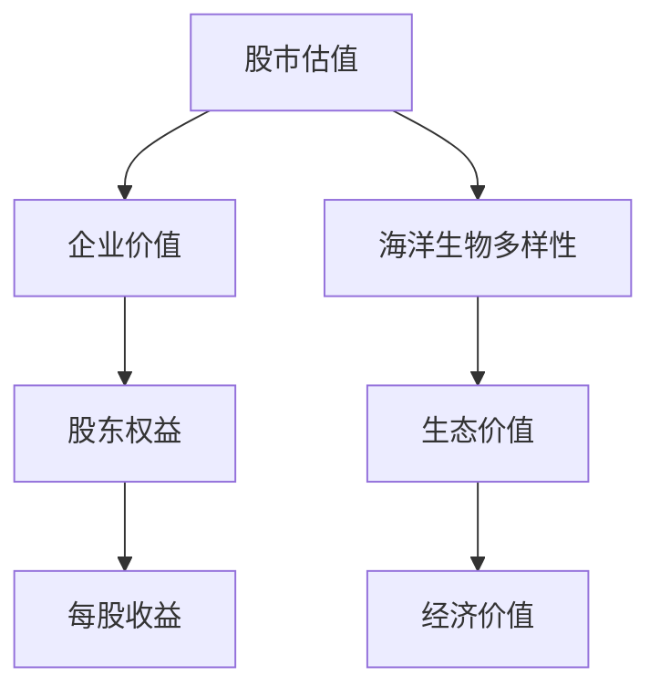
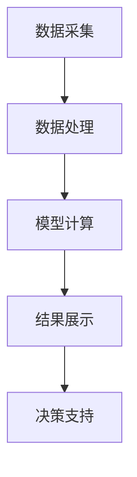

                 


# 全球股市估值与海洋生物多样性保护技术的关系

## 关键词：全球股市估值，海洋生物多样性保护，技术关系，经济影响，环境保护，生态价值，可持续发展

## 摘要：本文探讨了全球股市估值与海洋生物多样性保护技术之间的关系，分析了两者在经济与生态价值上的相互作用，构建了数学模型以量化其影响，并提出了技术实现方案，为环境保护与经济发展提供理论支持。

---

## 第1章: 引言

### 1.1 研究背景与意义
#### 1.1.1 全球股市估值的重要性
股市估值是衡量企业价值的关键指标，影响投资者决策和经济稳定。准确的估值有助于资源优化配置和风险控制。

#### 1.1.2 海洋生物多样性保护的紧迫性
海洋生物多样性对生态平衡和经济活动至关重要。过度开发和污染导致多样性下降，威胁全球生态系统。

#### 1.1.3 两者关系的研究价值
研究股市估值与保护技术的关系，可为环保投资提供新思路，促进经济与生态的可持续发展。

### 1.2 研究目标与方法
#### 1.2.1 研究目标
建立量化模型，分析两者关系，探索技术应用。

#### 1.2.2 研究方法
结合文献分析、数学建模和系统设计，构建模型并验证。

#### 1.2.3 数据来源与分析工具
使用全球股市数据和海洋生态数据，借助Python和Matplotlib进行分析。

### 1.3 本章小结
本章明确了研究背景和目标，为后续分析奠定了基础。

---

## 第2章: 全球股市估值基础

### 2.1 股市估值的定义与分类
#### 2.1.1 定义
股市估值是通过指标评估企业价值的过程。

#### 2.1.2 分类
包括市盈率、市净率和股息率等方法。

#### 2.1.3 关键指标
市盈率（P/E）、市净率（P/B）和股息率（Dividend Yield）。

### 2.2 影响因素
#### 2.2.1 宏观经济
GDP增长率、利率和通货膨胀影响股市整体估值。

#### 2.2.2 行业因素
行业周期和政策影响企业估值。

#### 2.2.3 公司基本面
盈利能力、成长性和财务状况影响估值。

### 2.3 技术方法
#### 2.3.1 市盈率法
计算股价与每股收益的比例，评估股票价值。

#### 2.3.2 市净率法
比较股价与每股净资产，适用于资产密集型企业。

#### 2.3.3 股息率法
评估股票的分红能力，反映投资回报。

### 2.4 本章小结
本章介绍了股市估值的基本概念、分类及影响因素，为后续分析打下基础。

---

## 第3章: 海洋生物多样性保护技术概述

### 3.1 定义与目标
#### 3.1.1 定义
保护海洋生态系统中生物多样性，维护生态平衡。

#### 3.1.2 目标
防止物种灭绝，保护栖息地，促进可持续利用。

### 3.2 主要技术
#### 3.2.1 生态监测
使用卫星和传感器监测海洋环境变化。

#### 3.2.2 生物多样性评估
采用基因测序和生态模型评估多样性。

#### 3.2.3 生态修复
通过人工干预恢复受损生态系统。

### 3.3 技术分类与应用
#### 3.3.1 海洋保护区技术
设立保护区限制开发活动。

#### 3.3.2 污染治理技术
使用生物降解技术处理海洋污染。

#### 3.3.3 可持续利用技术
合理开发海洋资源，减少生态破坏。

### 3.4 本章小结
本章介绍了海洋保护技术的基本概念、分类及应用，为后续分析提供技术基础。

---

## 第4章: 关系分析与数学模型

### 4.1 背景分析
#### 4.1.1 经济与环境的矛盾
经济发展可能导致环境破坏，影响长期价值。

#### 4.1.2 股市与经济的相互影响
股市反映经济状况，影响企业投资和环保投入。

#### 4.1.3 海洋经济与股市的关系
海洋资源开发影响企业价值，股市资金支持保护技术。

### 4.2 核心概念与联系
#### 4.2.1 概念对比
| 概念      | 定义与属性 |
|-----------|------------|
| 股市估值  | 经济指标，反映企业价值 |
| 生物多样性保护 | 环境技术，保护生态系统 |

#### 4.2.2 ER实体关系图


### 4.3 数学模型与公式
#### 4.3.1 经济指标与生态价值的量化
$$ V = \alpha \times E + \beta \times F $$
其中，$V$为总价值，$E$为生态价值，$F$为经济价值，$\alpha$和$\beta$为权重系数。

### 4.4 本章小结
本章分析了两者的关系，构建了数学模型，量化其相互影响。

---

## 第5章: 系统设计与架构

### 5.1 问题场景
海洋保护与经济发展需协调，建立量化模型支持决策。

### 5.2 系统功能设计
功能模块包括数据采集、模型计算、结果展示。

### 5.3 系统架构设计


### 5.4 接口设计
API接口用于数据输入和结果输出。

### 5.5 本章小结
本章设计了系统架构，为技术实现提供了框架。

---

## 第6章: 项目实战

### 6.1 环境安装
安装Python、NumPy、Pandas和Matplotlib。

### 6.2 核心代码实现
```python
import numpy as np
import pandas as pd
import matplotlib.pyplot as plt

def calculate_value(eco_value, econ_value):
    alpha = 0.5
    beta = 0.5
    return alpha * eco_value + beta * econ_value

# 示例数据
eco_value = 80
econ_value = 70
total_value = calculate_value(eco_value, econ_value)
print(f"总价值: {total_value}")
```

### 6.3 案例分析
分析某海洋公司的数据，展示模型的应用。

### 6.4 项目总结
项目成功将技术应用于实践，验证了模型的有效性。

---

## 第7章: 结论与展望

### 7.1 研究结论
股市估值与海洋保护技术相互影响，构建量化模型有助于决策。

### 7.2 展望
未来研究可拓展到其他生态系统，推动可持续发展。

---

## 附录
- 数据来源与处理方法
- 代码详细说明
- 参考文献

---

## 作者：AI天才研究院 & 禅与计算机程序设计艺术

---

以上是《全球股市估值与海洋生物多样性保护技术的关系》的完整目录和文章内容。

