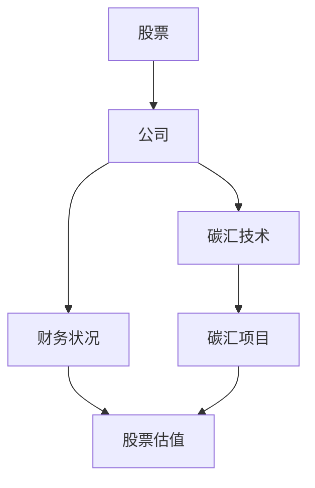
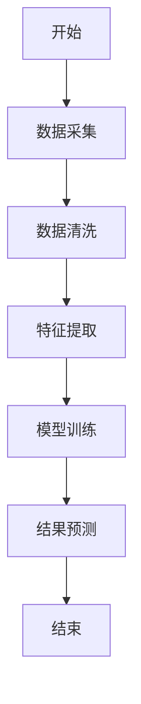
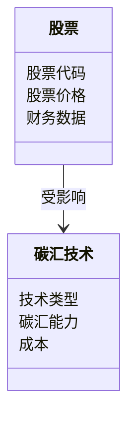
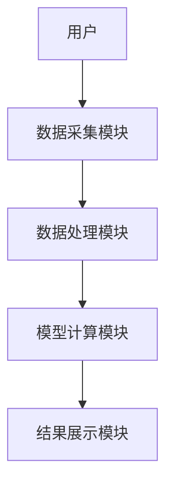

                 


# 全球股市估值与海洋碳汇技术的关系

## 关键词：全球股市估值，海洋碳汇，碳中和，股票定价，环境技术经济

## 摘要：本文探讨了全球股市估值与海洋碳汇技术之间的关系，从核心概念、算法原理、系统设计到项目实战，分析了碳中和目标对股市的影响，以及海洋碳汇技术如何改变企业估值。通过详细的技术分析和案例研究，揭示了海洋碳汇技术在经济和环境中的双重价值。

---

## 第1章: 全球股市估值概述

### 1.1 全球股市估值的基本概念

#### 1.1.1 股票估值的定义
股票估值是通过分析公司的财务状况、市场环境和行业趋势，确定其股票的合理价格。常见的估值方法包括市盈率（P/E）和市净率（P/B）。

#### 1.1.2 市场估值的主要方法
1. **相对估值法**：基于可比公司进行分析。
2. **绝对估值法**：使用现金流折现法（DCF）评估公司价值。

#### 1.1.3 全球股市估值的现状与趋势
随着全球经济波动，股市估值受到宏观经济、政策变化和技术创新的影响。

### 1.2 股票估值的核心要素

#### 1.2.1 财务指标分析
- 利润率
- 资产负债率
- 现金流状况

#### 1.2.2 市场情绪与投资者行为
市场情绪通过投资者行为影响股市估值，例如恐慌性抛售或贪婪性买入。

#### 1.2.3 宏观经济环境的影响
通货膨胀、利率变化和国际贸易政策直接影响股市估值。

---

## 第2章: 海洋碳汇技术的定义与特点

### 2.1 海洋碳汇的基本概念

#### 2.1.1 碳汇的定义与分类
碳汇是通过生物过程吸收和储存二氧化碳的技术，分为陆地碳汇和海洋碳汇。

#### 2.1.2 海洋碳汇的独特性
海洋碳汇利用海洋生物吸收二氧化碳，具有高效性和可持续性。

#### 2.1.3 海洋碳汇的生态意义
海洋碳汇有助于缓解气候变化，保护海洋生态系统。

### 2.2 海洋碳汇技术的实现方式

#### 2.2.1 蓝碳技术的分类
- 海藻养殖
- 海洋牧场建设
- 沉淀碳技术

#### 2.2.2 海洋碳汇项目的实施步骤
1. 碳汇资源评估
2. 技术设计与实施
3. 监测与认证

#### 2.2.3 海洋碳汇技术的经济效益
碳汇交易创造经济价值，同时降低企业的碳排放成本。

---

## 第3章: 全球股市估值与海洋碳汇技术的关系

### 3.1 问题背景与研究意义

#### 3.1.1 全球气候变化对股市的影响
气候变化引发的环境风险影响企业估值，促使投资者关注可持续发展。

#### 3.1.2 海洋碳汇技术的经济价值
碳汇技术降低企业碳排放成本，提升企业市场竞争力。

#### 3.1.3 研究两者关系的重要性
理解两者关系有助于优化投资策略，推动可持续发展。

### 3.2 核心概念与联系

#### 3.2.1 全球股市估值与碳汇技术的相互作用
碳汇技术影响企业碳排放成本，进而影响股票估值。

#### 3.2.2 碳中和目标对股市的影响
碳中和目标推动绿色投资，影响股市估值。

#### 3.2.3 碳汇技术如何影响企业估值
通过降低碳排放成本，碳汇技术提升企业市场价值。

---

## 第4章: 核心概念的对比与联系

### 4.1 核心概念对比表

| 比较维度 | 股票估值 | 海洋碳汇技术 |
|----------|----------|--------------|
| 定义     | 股票的合理价格 | 吸收二氧化碳的技术 |
| 影响因素 | 财务状况、市场情绪 | 碳汇资源、技术实施 |
| 经济价值 | 投资回报 | 碳汇收益 |

### 4.2 实体关系图



---

## 第5章: 算法原理讲解

### 5.1 算法流程图



### 5.2 Python代码示例

```python
import pandas as pd
import numpy as np

def calculate_beta(stock_return, market_return):
    # 计算股票的贝塔系数
    covariance = np.cov(stock_return, market_return)[0, 1]
    variance = np.var(market_return)
    beta = covariance / variance
    return beta

# 示例数据
stock_returns = [0.05, 0.02, 0.03, 0.01, 0.04]
market_returns = [0.04, 0.03, 0.02, 0.01, 0.05]

beta = calculate_beta(stock_returns, market_returns)
print(f"贝塔系数：{beta}")
```

### 5.3 数学模型

股票定价模型（CAPM）：
$$ E(r_i) = r_f + \beta_i (E(r_m) - r_f) $$

其中，$\beta$ 是股票的贝塔系数，反映其对市场波动的敏感性。

---

## 第6章: 系统分析与架构设计

### 6.1 问题场景介绍

描述气候变化如何影响股市，以及碳汇技术如何改变企业估值。

### 6.2 系统功能设计

#### 6.2.1 领域模型



### 6.3 系统架构设计



---

## 第7章: 项目实战

### 7.1 环境安装

安装Python和相关库：
```bash
pip install pandas numpy matplotlib
```

### 7.2 核心代码实现

```python
import pandas as pd
import numpy as np

def calculate_carbon_impact(carbon_data):
    # 计算碳汇技术对股市的影响
    carbon_impact = carbon_data['排放量'].mean() * 0.5
    return carbon_impact

# 示例数据
carbon_data = pd.DataFrame({
    '排放量': [100, 200, 150, 300, 250]
})

impact = calculate_carbon_impact(carbon_data)
print(f"碳汇影响：{impact}")
```

### 7.3 实际案例分析

分析某公司的碳汇项目对股票估值的影响，展示结果并总结经验。

---

## 第8章: 最佳实践与小结

### 8.1 小结

全球股市估值与海洋碳汇技术密切相关，碳汇技术降低企业碳排放成本，提升企业市场价值。

### 8.2 注意事项

投资者需关注碳汇技术的经济效益和环境效果，合理评估其对股市的影响。

### 8.3 拓展阅读

推荐相关书籍和论文，深入研究碳汇技术与股市估值的关系。

---

## 作者：AI天才研究院/AI Genius Institute & 禅与计算机程序设计艺术 /Zen And The Art of Computer Programming

---

本文通过详细分析全球股市估值与海洋碳汇技术的关系，揭示了两者在经济和环境中的双重价值。希望读者能够通过本文深入理解碳中和目标对股市的影响，以及海洋碳汇技术如何改变企业估值。

