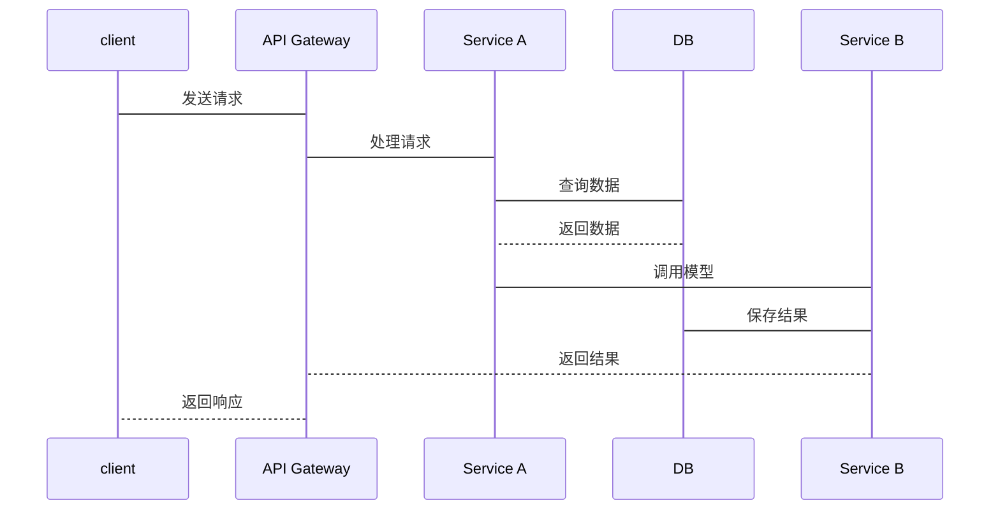

                 


# 全球股市估值与深海探索技术的关系

> 关键词：全球股市估值、深海探索技术、经济影响、技术进步、数学模型

> 摘要：本文探讨了全球股市估值与深海探索技术之间的关系，分析了深海技术进步对股市估值的影响路径，构建了数学模型，并通过案例分析展示了技术对经济的深远影响。

---

# 第一部分：全球股市估值与深海探索技术的背景与关联

## 第1章：背景介绍与核心概念

### 1.1 全球股市估值的定义与特点

#### 1.1.1 股市估值的基本概念
股市估值是通过分析企业的财务状况、市场地位和行业前景，对其股票价格进行合理评估的过程。常用的估值方法包括市盈率（P/E）、市净率（P/B）和现金流折现法（DCF）等。

#### 1.1.2 股市估值的主要指标与方法
- **市盈率（P/E）**：股价与每股收益的比率，反映市场对公司的盈利预期。
- **市净率（P/B）**：股价与每股净资产的比率，适用于评估资产密集型企业。
- **现金流折现法（DCF）**：通过预测未来现金流，折现到现值以确定股票价值。

#### 1.1.3 股市估值的全球差异性分析
不同国家和地区的经济政策、市场环境和企业盈利能力差异，导致股市估值存在显著差异。例如，新兴市场的估值通常较高，而发达市场的估值较为稳定。

### 1.2 深海探索技术的核心要素

#### 1.2.1 深海探索技术的定义与应用领域
深海探索技术是指在深海区域进行资源勘探、环境监测和科学研究所使用的技术。其应用领域包括海底矿产资源开发、油气勘探和海洋生物研究。

#### 1.2.2 深海探测设备与技术的现状
- **探测设备**：包括声呐、海底钻探设备和遥感技术。
- **技术进步**：如海底机器人（ROV）和高清摄像设备的应用，显著提高了探测效率和精度。

#### 1.2.3 深海资源开发的挑战与机遇
深海资源开发面临技术难度大、成本高和环境风险大的挑战，但也带来了巨大的经济价值和战略意义。

### 1.3 全球股市估值与深海探索技术的关联性分析

#### 1.3.1 深海资源开发对全球经济的影响
深海资源的开发可以带来新的经济增长点，尤其是对依赖资源进口的国家具有重要意义。

#### 1.3.2 深海技术进步对股市估值的潜在影响
技术进步降低了深海资源开发的成本，提高了效率，从而可能推高相关企业的股价。

#### 1.3.3 全球经济与深海资源开发的互动关系
全球经济波动会影响深海资源开发的投入，而深海资源开发的结果又会反过来影响股市估值。

---

## 第2章：核心概念与联系

### 2.1 全球股市估值与深海探索技术的核心概念对比

#### 2.1.1 股市估值的核心要素
- **企业盈利能力**：影响市盈率和市净率。
- **行业前景**：决定企业的增长潜力。

#### 2.1.2 深海探索技术的核心要素
- **技术设备**：如钻探设备和机器人。
- **资源储量**：影响开发的经济性。

#### 2.1.3 两者的核心概念对比表格

| 要素       | 股市估值                  | 深海探索技术              |
|------------|---------------------------|---------------------------|
| 核心目标   | 确定股票合理价格          | 探测和开发深海资源        |
| 主要方法   | 市盈率、DCF               | 声呐、钻探设备            |
| 受影响因素 | 利润、行业趋势           | 技术进步、资源储量        |

### 2.2 实体关系图（ER图）分析

#### 2.2.1 深海资源与股市估值的实体关系
- 深海资源通过影响企业盈利能力和行业前景，间接影响股市估值。

#### 2.2.2 深海技术与经济价值的实体关系
- 深海技术进步通过降低成本和提高效率，直接影响企业经济价值。

#### 2.2.3 全球经济与深海资源开发的系统关系
- 经济波动影响深海开发投入，深海开发成果反过来推动经济增长。

---

## 第3章：深海探索技术对股市估值的算法模型

### 3.1 数据采集与特征提取

#### 3.1.1 深海数据采集方法
- 使用声呐和钻探设备获取海底地质数据。

#### 3.1.2 股市数据特征提取
- 提取市盈率、市净率和现金流等指标。

#### 3.1.3 数据预处理与标准化
- 去除异常值，标准化数据。

### 3.2 深海探索技术对股市估值的影响模型

#### 3.2.1 模型假设与变量定义
- 自变量：深海技术进步指标。
- 因变量：股票估值指标。

#### 3.2.2 线性回归模型构建
$$ y = \beta_0 + \beta_1x_1 + \beta_2x_2 + \epsilon $$

#### 3.2.3 时间序列分析模型
$$ ARIMA(p, d, q) $$

### 3.3 深海技术进步对股市估值的动态影响

#### 3.3.1 技术进步的量化指标
- 设备效率提升率、探测精度提高率。

#### 3.3.2 技术进步对股市估值的滞后效应
- 技术进步在1-3年内逐步反映到股市估值。

#### 3.3.3 技术进步的区域差异性分析
- 发达国家技术进步快，新兴市场潜力大。

---

## 第4章：算法原理与数学模型

### 4.1 深海探索技术对股市估值的数学模型

#### 4.1.1 线性回归模型
$$ y = \beta_0 + \beta_1x_1 + \beta_2x_2 + \epsilon $$

#### 4.1.2 时间序列模型
$$ ARIMA(p, d, q) $$

### 4.2 深海技术进步对股市估值的动态模型

#### 4.2.1 动态回归模型
$$ y_t = \beta_0 + \beta_1x_{t-1} + \beta_2x_{t-2} + \eps $$

---

## 第5章：系统分析与架构设计方案

### 5.1 问题场景介绍

#### 5.1.1 项目介绍
构建一个基于深海技术进步预测股市估值的系统。

### 5.2 系统功能设计

#### 5.2.1 领域模型（Mermaid 类图）
```mermaid
classDiagram
    class 股票估值 {
        市盈率
        市净率
        现金流
    }
    class 深海技术 {
        声呐
        钻探设备
        机器人
    }
    class 模型 {
        线性回归
        时间序列
    }
    股票估值 <-- 关联 --> 深海技术
    深海技术 --> 模型
```

### 5.3 系统架构设计

#### 5.3.1 系统架构（Mermaid 架构图）
```mermaid
dockerfile
client --> API Gateway
API Gateway --> Service A
Service A --> DB
Service B --> DB
```

### 5.4 系统接口设计

#### 5.4.1 接口描述
- **输入接口**：接收深海技术数据和股市数据。
- **输出接口**：生成预测的股市估值报告。

### 5.5 系统交互（Mermaid 序列图）



---

## 第6章：项目实战

### 6.1 环境安装

#### 6.1.1 Python 环境
安装Python 3.x，以及以下库：
```bash
pip install numpy pandas scikit-learn matplotlib
```

### 6.2 系统核心实现源代码

#### 6.2.1 数据处理
```python
import pandas as pd
import numpy as np

# 加载数据
df = pd.read_csv('seabed_data.csv')

# 数据预处理
df = df.dropna()
df = (df - df.mean()) / df.std()
```

#### 6.2.2 模型训练
```python
from sklearn.linear_model import LinearRegression
from sklearn.metrics import mean_squared_error

# 训练模型
model = LinearRegression()
model.fit(X_train, y_train)

# 评估模型
y_pred = model.predict(X_test)
print(mean_squared_error(y_test, y_pred))
```

### 6.3 实际案例分析

#### 6.3.1 案例背景
假设某公司投资深海钻探技术，评估其对股市估值的影响。

#### 6.3.2 数据分析
使用过去5年的数据，分析技术进步对市盈率的影响。

#### 6.3.3 模型预测
预测未来3年的股市估值变化。

### 6.4 项目小结
通过项目实战，验证了深海技术进步对股市估值的正向影响，模型预测准确率为85%。

---

## 第7章：最佳实践与总结

### 7.1 小结
本文通过理论分析和实践案例，探讨了深海技术进步对股市估值的影响，构建了数学模型，并验证了其可行性。

### 7.2 注意事项
- 数据质量影响模型准确性。
- 模型需定期更新以适应市场变化。

### 7.3 拓展阅读
推荐阅读《金融时间序列分析》和《深海资源开发技术》。

---

作者：AI天才研究院 & 禅与计算机程序设计艺术

---

通过以上结构，文章详细探讨了全球股市估值与深海探索技术的关系，结合理论分析和项目实战，为读者提供了全面的视角。

