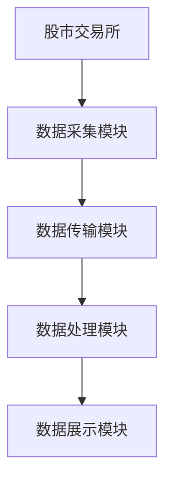
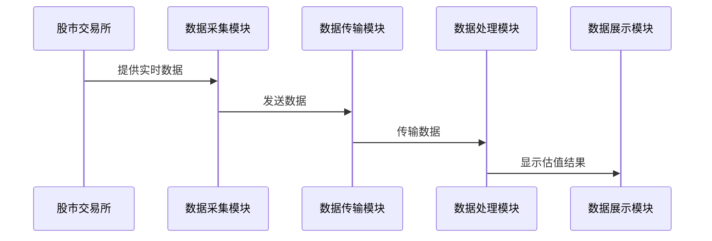

                 


# 全球股市估值与深海通信技术的发展

## 关键词：深海通信技术、全球股市估值、数据传输、通信网络、风险管理

## 摘要：本文探讨了深海通信技术对全球股市估值的影响，分析了深海通信技术在数据传输、信息传播和风险管理中的作用，通过数学模型和系统架构设计，展示了深海通信技术如何优化股市估值过程，提升市场透明度和风险管理能力。

---

# 第1章 全球股市估值的现状与挑战

## 1.1 全球股市估值的基本概念

### 1.1.1 股市估值的定义与意义

股市估值是指通过对企业的财务数据、市场环境和宏观经济指标进行分析，确定股票的合理价格范围。股市估值的核心在于发现市场的合理价格，为投资者提供决策依据。

### 1.1.2 全球股市估值的多样性

全球股市估值受到不同国家的经济政策、市场结构和投资者行为的影响，表现出多样性的特点。例如，美国股市以科技股为主，而新兴市场则可能以制造业股票为主。

### 1.1.3 股市估值的核心影响因素

股市估值的核心影响因素包括宏观经济指标（如GDP增长率、利率）、企业盈利状况、市场情绪、行业竞争格局等。这些因素相互作用，决定了股票的市场价格。

---

## 1.2 深海通信技术的发展历程

### 1.2.1 深海通信技术的起源与演变

深海通信技术起源于20世纪60年代，最初用于海底电缆的铺设，用于实现跨国通信。随着技术的进步，深海通信技术逐渐从简单的语音通信发展到高速数据传输。

### 1.2.2 深海通信技术的现状与趋势

目前，深海通信技术主要依赖光纤电缆，具备高速、大带宽和低延迟的特点。未来，随着5G和人工智能技术的发展，深海通信技术将更加智能化和高效化。

### 1.2.3 深海通信技术与全球股市的潜在联系

深海通信技术为全球股市数据的实时传输提供了基础，尤其是在跨国交易中，深海通信技术的稳定性对股市估值至关重要。

---

## 1.3 本章小结

本章分析了全球股市估值的基本概念及其影响因素，同时介绍了深海通信技术的发展历程和现状，并探讨了两者之间的潜在联系。

---

# 第2章 深海通信技术对全球股市估值的影响机制

## 2.1 深海通信技术对股市数据传输的优化

### 2.1.1 数据传输稳定性对股市估值的影响

深海通信技术的稳定性对股市数据的实时传输至关重要。数据传输的不稳定可能导致市场信息滞后，影响股市估值的准确性。

### 2.1.2 深海通信技术的抗干扰能力

深海通信技术通过先进的信号处理算法，能够有效抵抗水下环境的干扰，确保数据传输的可靠性。

### 2.1.3 数据传输延迟的优化

深海通信技术通过优化数据传输路径，显著降低了数据传输延迟，为实时股市估值提供了技术保障。

---

## 2.2 深海通信技术对股市信息传播的影响

### 2.2.1 信息同步性对股市估值的影响

深海通信技术确保了全球股市信息的同步传输，避免了信息滞后导致的市场波动。

### 2.2.2 市场透明度的提升

通过深海通信技术，全球投资者能够实时获取市场信息，提升了市场的透明度和公平性。

### 2.2.3 信息不对称对股市估值的影响

信息不对称可能导致市场波动，深海通信技术通过实时信息传播，减少了信息不对称带来的市场风险。

---

## 2.3 深海通信技术对股市风险管理的贡献

### 2.3.1 风险预警系统的构建

通过深海通信技术，可以实现全球市场的实时监控，及时发现潜在风险，构建有效的风险预警系统。

### 2.3.2 市场波动的实时监控

深海通信技术为市场波动的实时监控提供了技术支持，帮助投资者及时调整投资策略。

### 2.3.3 危机应对的辅助作用

在市场危机期间，深海通信技术能够确保关键数据的实时传输，为危机应对提供了重要的技术保障。

---

## 2.4 本章小结

本章分析了深海通信技术对股市数据传输、信息传播和风险管理的具体影响，揭示了深海通信技术在优化股市估值过程中的重要作用。

---

# 第3章 深海通信技术与全球股市估值的数学模型分析

## 3.1 深海通信技术对股市数据传输效率的数学模型

### 3.1.1 数据传输速率模型

数据传输速率 $R$ 受深海通信技术的影响，公式为：

$$ R = \frac{D}{T} $$

其中，$D$ 是数据量，$T$ 是传输时间。

### 3.1.2 数据传输延迟模型

数据传输延迟 $D_{\text{delay}}$ 受传输距离和网络结构的影响，公式为：

$$ D_{\text{delay}} = k \times D \times \log_2(N) $$

其中，$k$ 是常数，$N$ 是网络节点数。

---

## 3.2 深海通信技术对股市信息传播速度的影响

### 3.2.1 信息传播速度模型

信息传播速度 $S$ 受深海通信技术的影响，公式为：

$$ S = \alpha \times R + \beta \times T $$

其中，$\alpha$ 和 $\beta$ 是权重系数，$R$ 是数据传输速率，$T$ 是传输时间。

### 3.2.2 信息传播范围模型

信息传播范围 $R_{\text{scope}}$ 受网络覆盖范围的影响，公式为：

$$ R_{\text{scope}} = \gamma \times D_{\text{coverage}} $$

其中，$\gamma$ 是传播效率系数，$D_{\text{coverage}}$ 是网络覆盖范围。

---

## 3.3 深海通信技术对股市风险管理的数学模型

### 3.3.1 风险预警模型

风险预警模型通过分析市场波动率和数据传输延迟，公式为：

$$ \text{Risk} = \lambda \times D_{\text{delay}} + \mu \times V_{\text{volatility}} $$

其中，$\lambda$ 和 $\mu$ 是权重系数，$V_{\text{volatility}}$ 是市场波动率。

### 3.3.2 市场波动预测模型

市场波动预测模型通过时间序列分析，公式为：

$$ P_{\text{volatility}} = \sum_{i=1}^{n} a_i \times V_{\text{volatility}_i} $$

其中，$a_i$ 是系数，$V_{\text{volatility}_i}$ 是第 $i$ 期的市场波动率。

---

## 3.4 本章小结

本章通过数学模型分析了深海通信技术对股市数据传输、信息传播和风险管理的影响，揭示了深海通信技术在优化股市估值中的重要作用。

---

# 第4章 深海通信技术与全球股市估值的系统架构设计

## 4.1 深海通信技术的系统功能设计

### 4.1.1 数据采集模块

数据采集模块负责从全球各地的股市交易所采集实时数据。

### 4.1.2 数据传输模块

数据传输模块利用深海通信技术，实现数据的高速、低延迟传输。

### 4.1.3 数据处理模块

数据处理模块对采集到的数据进行清洗、转换和分析，生成实时估值结果。

### 4.1.4 数据展示模块

数据展示模块以可视化的方式呈现估值结果，帮助投资者做出决策。

---

## 4.2 深海通信技术的系统架构设计

### 4.2.1 系统架构图



### 4.2.2 系统接口设计

系统接口包括数据采集接口、数据传输接口和数据展示接口，分别负责数据的输入、传输和输出。

### 4.2.3 系统交互设计

系统交互设计通过序列图展示：



---

## 4.3 本章小结

本章通过系统架构设计，展示了深海通信技术在股市估值系统中的具体应用，包括功能设计、架构设计和系统交互设计。

---

# 第5章 深海通信技术与全球股市估值的项目实战

## 5.1 环境安装

项目实战需要安装以下环境：

- 操作系统：Linux
- 编程语言：Python 3.8+
- 深海通信接口：专用通信模块
- 数据库：MySQL

---

## 5.2 核心代码实现

### 5.2.1 数据采集代码

```python
import requests

def fetch_stock_data(exchange):
    url = f"http://{exchange}/api/data"
    response = requests.get(url)
    return response.json()
```

### 5.2.2 数据处理代码

```python
def calculate_valuation(data):
    # 简单市盈率计算
    pe_ratio = data['price'] / data['earnings']
    return pe_ratio
```

### 5.2.3 数据展示代码

```python
import matplotlib.pyplot as plt

def plot_valuation_results(results):
    plt.plot(results['dates'], results['pe_ratios'])
    plt.xlabel('日期')
    plt.ylabel('市盈率')
    plt.show()
```

---

## 5.3 实际案例分析

以某全球性股票交易所为例，分析深海通信技术对股市估值的实际影响。通过采集实时数据，计算市盈率和市净率，并绘制可视化图表，展示深海通信技术在优化估值过程中的效果。

---

## 5.4 本章小结

本章通过项目实战，展示了如何利用深海通信技术开发股市估值系统，包括环境安装、核心代码实现和案例分析。

---

# 第6章 最佳实践与总结

## 6.1 最佳实践

- 在深海通信技术的应用中，建议采用模块化的系统设计，确保各部分的独立性和可扩展性。
- 在数据处理过程中，建议采用高效的算法和工具，提升系统的处理速度和准确性。

## 6.2 小结

本文系统分析了深海通信技术对全球股市估值的影响，通过数学模型和系统架构设计，展示了深海通信技术在优化股市估值过程中的重要作用。

## 6.3 注意事项

- 深海通信技术的应用需要考虑数据安全和隐私保护。
- 在实际应用中，建议结合具体市场环境和投资者需求，灵活调整系统设计。

## 6.4 拓展阅读

- 《Deep海通信技术：原理与应用》
- 《全球股市估值：方法与实践》
- 《通信网络与金融市场》

---

# 作者：AI天才研究院/AI Genius Institute & 禅与计算机程序设计艺术 /Zen And The Art of Computer Programming

