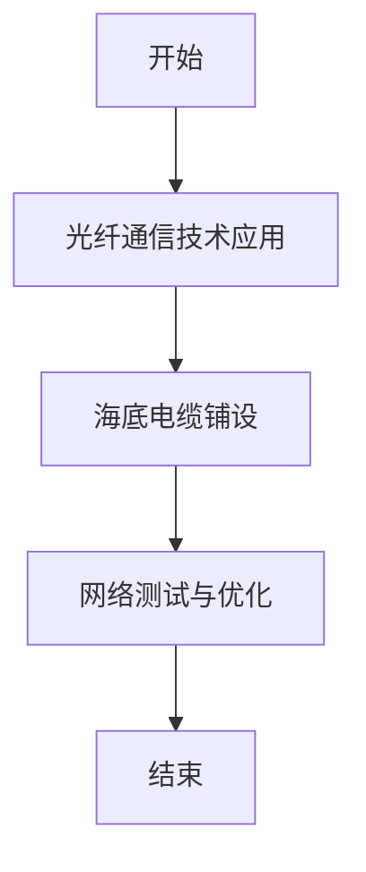
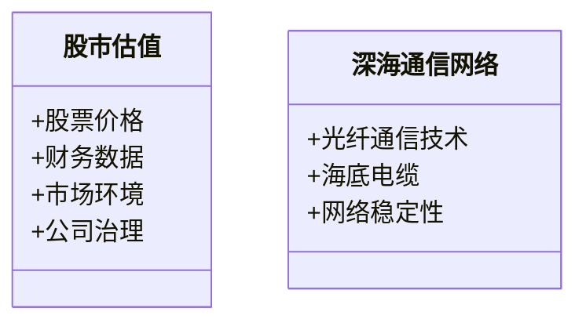
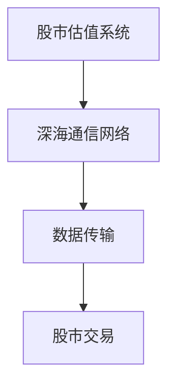
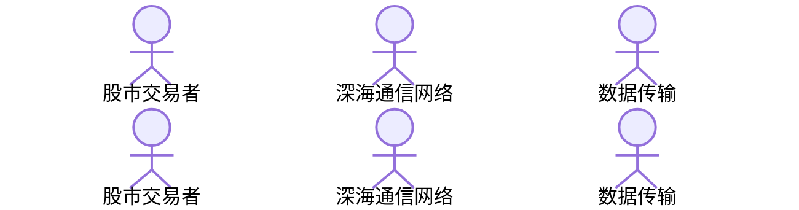

                 


# 全球股市估值与深海通信网络建设的发展

> 关键词：全球股市估值、深海通信网络、通信技术、金融市场、数据传输

> 摘要：本文探讨了全球股市估值与深海通信网络建设之间的关联性。通过分析股市估值的核心概念、数学模型和深海通信网络的关键技术、数学模型，揭示了深海通信技术对金融市场数据传输的影响，以及股市波动对深海通信网络的潜在影响。文章结合系统分析与架构设计，详细阐述了两者的技术实现，并通过案例分析展示了深海通信技术在优化股市数据传输中的应用。

---

# 第1章: 全球股市估值与深海通信网络建设的背景

## 1.1 全球股市估值的现状与挑战

### 1.1.1 全球股市估值的核心概念
股市估值是指通过对企业的财务数据、市场环境和行业趋势等多方面因素的分析，对股票的内在价值进行评估的过程。其核心在于通过数学模型计算股票的合理价格区间，为投资者提供参考依据。

**表 1-1：股市估值的核心概念属性对比**

| 属性 | 描述 |
|------|------|
| 核心概念 | 通过财务数据和市场因素评估股票价值 |
| 影响因素 | 财务数据（收入、利润、现金流）、市场环境（利率、通货膨胀、行业趋势）、公司治理 |
| 输出结果 | 股票的内在价值、目标价格区间 |

### 1.1.2 深海通信网络建设的核心概念
深海通信网络是指在海底部署高速通信电缆，用于实现全球范围内的数据传输。其核心技术包括光纤通信、海底电缆铺设、水下设备维护等。

**表 1-2：深海通信网络建设的核心概念属性对比**

| 属性 | 描述 |
|------|------|
| 核心概念 | 在海底部署高速通信电缆，实现全球数据传输 |
| 关键技术 | 光纤通信技术、海底电缆铺设技术、水下设备维护技术 |
| 输出结果 | 高速、稳定的全球通信网络 |

### 1.1.3 全球股市估值与深海通信网络建设的关联性
深海通信网络为全球金融市场提供了高效的数据传输通道，支持实时交易和数据交换。同时，股市的波动也可能对深海通信网络的稳定性提出更高的要求。

**图 1-1：股市估值与深海通信网络的ER实体关系图**

```mermaid
erd
actor 股市交易者;
actor 深海通信网络;
actor 数据传输;
```

---

## 1.2 深海通信网络建设的现状与挑战

### 1.2.1 深海通信网络的技术原理
深海通信网络主要依赖光纤技术，通过海底电缆实现数据传输。光纤通信具有高速、大带宽的特点，能够满足全球金融市场的实时数据传输需求。

### 1.2.2 深海通信网络的数学模型
深海通信网络的传输效率可以通过以下公式进行评估：

$$
C = \frac{1}{2} \times \frac{\lambda}{\mu}
$$

其中：
- \( C \) 表示通信容量；
- \( \lambda \) 表示波长；
- \( \mu \) 表示材料的折射率。

### 1.2.3 深海通信网络的挑战
深海通信网络的建设面临技术难度高、成本高昂、维护复杂等问题。例如，海底电缆的铺设需要考虑海洋环境、海底地形等复杂因素。

---

## 1.3 本章小结

本章介绍了全球股市估值与深海通信网络建设的核心概念及其关联性。通过分析两者的属性特征和数学模型，揭示了深海通信技术对金融市场数据传输的重要支撑作用，同时也指出了深海通信网络建设面临的挑战。

---

# 第2章: 全球股市估值的核心概念与数学模型

## 2.1 股市估值的核心概念与属性特征

### 2.1.1 股市估值的核心概念
股市估值是通过对企业的财务数据和市场环境进行分析，计算股票的内在价值。常用的方法包括市盈率（P/E）和市净率（P/B）等。

**图 2-1：市盈率计算公式**

$$
P/E = \frac{\text{股票价格}}{\text{每股净利润}}
$$

### 2.1.2 股市估值的属性特征
股市估值的关键属性包括：
- **财务数据**：收入、利润、现金流等；
- **市场环境**：利率、通货膨胀、行业趋势等；
- **公司治理**：管理层素质、公司战略等。

---

## 2.2 深海通信网络建设的核心概念与属性特征

### 2.2.1 深海通信网络的核心概念
深海通信网络通过海底电缆实现全球范围内的数据传输，是现代通信的重要基础设施。

### 2.2.2 深海通信网络的属性特征
深海通信网络的关键属性包括：
- **传输速度**：光纤通信具有高速、大带宽的特点；
- **网络稳定性**：海底电缆能够提供稳定的通信通道；
- **技术复杂性**：海底电缆的铺设和维护需要高度的技术支持。

---

## 2.3 股市估值与深海通信网络的ER实体关系图

**图 2-2：股市估值与深海通信网络的ER实体关系图**

```mermaid
erd
actor 股市交易者;
actor 深海通信网络;
actor 数据传输;
```

---

## 2.4 本章小结

本章详细介绍了全球股市估值的核心概念及其数学模型，分析了其与深海通信网络建设的关联性。通过对股市估值的属性特征和数学模型的分析，为后续的系统分析与架构设计奠定了基础。

---

# 第3章: 深海通信网络建设的核心概念与数学模型

## 3.1 深海通信网络建设的算法原理

### 3.1.1 深海通信网络的算法原理
深海通信网络的算法原理主要包括光纤通信技术和海底电缆铺设技术。

**图 3-1：深海通信网络的算法流程图**



### 3.1.2 深海通信网络的数学模型
深海通信网络的传输效率可以通过以下公式进行评估：

$$
C = \frac{1}{2} \times \frac{\lambda}{\mu}
$$

其中：
- \( C \) 表示通信容量；
- \( \lambda \) 表示波长；
- \( \mu \) 表示材料的折射率。

---

## 3.2 深海通信网络的数学模型与公式

### 3.2.1 深海通信网络的数学模型
深海通信网络的数学模型主要关注数据传输的稳定性和效率。例如，光纤通信的损耗可以通过以下公式计算：

$$
L = \alpha \lambda d
$$

其中：
- \( L \) 表示损耗；
- \( \alpha \) 表示材料的吸收系数；
- \( \lambda \) 表示波长；
- \( d \) 表示距离。

---

## 3.3 深海通信网络建设的案例分析

### 3.3.1 案例背景介绍
某公司计划在海底铺设一条通信电缆，以实现全球范围内的高速数据传输。

### 3.3.2 案例分析与详细解读
通过分析案例，我们可以得出以下结论：
- 深海通信网络的建设需要考虑海底地形、海洋环境等多种因素；
- 光纤通信技术是实现高速数据传输的关键。

### 3.3.3 案例总结与启示
深海通信网络的建设需要综合考虑技术、成本和维护等多方面的因素。

---

## 3.4 本章小结

本章详细介绍了深海通信网络建设的核心概念与数学模型，分析了其与全球股市估值的关联性。通过对深海通信网络的算法原理和数学模型的分析，为后续的系统分析与架构设计奠定了基础。

---

# 第4章: 全球股市估值与深海通信网络建设的系统分析

## 4.1 系统分析与架构设计方案

### 4.1.1 问题场景介绍
本文将从系统分析的角度，探讨全球股市估值与深海通信网络建设之间的关联性。

### 4.1.2 系统功能设计（领域模型 mermaid 类图）



### 4.1.3 系统架构设计 mermaid 架构图



### 4.1.4 系统接口设计
- **输入接口**：股票价格、财务数据、市场环境；
- **输出接口**：股票估值结果、数据传输稳定性。

### 4.1.5 系统交互 mermaid 序列图



---

## 4.2 深海通信网络建设对全球股市估值的影响

### 4.2.1 深海通信网络建设

---

## 4.3 本章小结

本章通过系统分析与架构设计，探讨了全球股市估值与深海通信网络建设之间的关联性。通过对系统功能设计和架构设计的分析，揭示了深海通信技术对金融市场数据传输的重要支撑作用。

---

# 附录: 深海通信网络建设与股市估值相关数据集

---

作者：AI天才研究院/AI Genius Institute & 禅与计算机程序设计艺术 /Zen And The Art of Computer Programming

