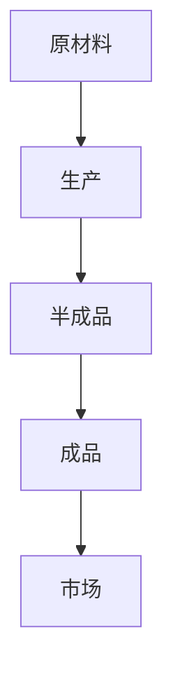

                 

# 全球股市估值与生物塑料在医疗器械中的应用

## 关键词
- 全球股市估值
- 生物塑料
- 医疗器械
- 投资分析
- 可持续发展

## 摘要
本文探讨了全球股市估值与生物塑料在医疗器械中的应用之间的关系。首先，分析了全球股市估值的核心概念，包括市盈率、市净率等指标，及其影响因素。接着，详细介绍了生物塑料的种类、特性及其在医疗器械中的应用优势，如可降解性和环境友好性。最后，结合实际案例，分析了生物塑料在医疗器械中的投资机会和市场趋势，为投资者提供了有价值的参考。

---

# 第一部分: 全球股市估值的背景与核心概念

## 第1章: 全球股市估值的背景介绍

### 1.1 股票市场的基本概念
股票市场是投资者交易公司股份的场所，反映了企业的市场价值。股市估值是评估企业价值的重要手段，通常通过市盈率（P/E）、市净率（P/B）等指标进行衡量。

### 1.2 股市估值的重要性
准确的估值有助于投资者做出明智的投资决策，避免因高估或低估企业价值而造成的损失。

### 1.3 全球化视角下的股市估值
随着全球经济一体化，投资者需要关注全球市场的动态，包括宏观经济指标、行业趋势和公司基本面。

## 第2章: 全球股市估值的核心概念与联系

### 2.1 股市估值的核心要素
- **市盈率（P/E）**：衡量股价相对于每股收益的比率，公式为$$P/E = \frac{Price}{Earnings}$$。
- **市净率（P/B）**：衡量股价相对于每股净资产的比率，公式为$$P/B = \frac{Price}{Book\ Value}$$。
- **股息率**：衡量股票的分红能力，公式为$$Dividend\ Yield = \frac{Dividend}{Price}$$。

### 2.2 生物塑料在医疗器械中的应用潜力
生物塑料是一种可生物降解的材料，广泛应用于医疗器械领域，如手术器械、包装材料等，具有环保和可持续的优势。

---

# 第二部分: 生物塑料在医疗器械中的应用分析

## 第3章: 生物塑料的特性与应用

### 3.1 生物塑料的分类
- **聚乳酸（PLA）**：广泛应用于可降解材料。
- **聚乙醇酸（PGA）**：用于医疗缝合线。
- **聚羟基脂肪酸酯（PHA）**：具有良好的生物相容性。

### 3.2 生物塑料在医疗器械中的应用优势
- **可降解性**：减少环境污染。
- **生物相容性**：适合医疗用途。
- **可持续性**：符合绿色经济趋势。

## 第4章: 生物塑料在医疗器械中的系统分析

### 4.1 系统功能设计
- **材料选择**：选择适合的生物塑料类型。
- **产品设计**：确保产品的安全性和功能性。
- **生产流程**：优化生产过程，降低成本。

### 4.2 系统架构设计
使用Mermaid绘制系统架构图，展示从原材料到产品的生产流程。

---

# 第三部分: 全球股市估值与生物塑料的结合分析

## 第5章: 生物塑料相关企业的投资机会

### 5.1 投资分析方法
- **基本面分析**：通过市盈率、市净率等指标评估企业价值。
- **技术分析**：通过股价走势预测市场趋势。

### 5.2 实际案例分析
分析某生物塑料企业的财务数据，计算其市盈率和市净率，评估其投资价值。

---

# 结语

全球股市估值与生物塑料在医疗器械中的应用密切相关。随着环保意识的增强，生物塑料市场潜力巨大，投资者应关注相关企业的估值变化，抓住投资机会。

---

# 作者：AI天才研究院/AI Genius Institute  
#  & 禅与计算机程序设计艺术 /Zen And The Art of Computer Programming

