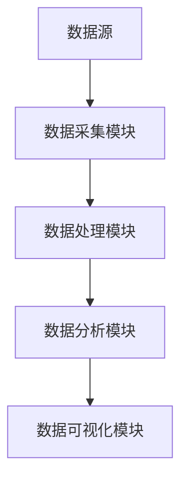

                 


# 全球股市估值与生物技术进步的关联

> 关键词：生物技术，股市估值，关联分析，数学模型，案例研究

> 摘要：本文探讨生物技术进步对全球股市估值的影响，分析其直接和间接关联，建立数学模型，并通过案例研究验证假设。

---

## 第一部分：背景介绍

### 第1章：问题背景与研究意义

#### 1.1 问题背景
- 生物技术作为现代科技的重要组成部分，推动了医疗、农业等多个领域的发展。
- 股市估值反映企业价值，受技术创新、市场环境等多种因素影响。
- 研究生物技术进步与股市估值的关联，有助于理解技术对企业价值的影响。

#### 1.2 研究意义
- **理论意义**：揭示技术进步对企业价值的影响机制。
- **实践意义**：为投资者提供决策依据，优化投资策略。

---

## 第二部分：核心概念与联系

### 第2章：生物技术与股市估值的核心概念

#### 2.1 生物技术的核心要素
- **定义**：利用生物科学原理改造生物体，用于生产或治疗。
- **关键领域**：基因编辑、细胞治疗、生物制药。
- **创新周期**：研发周期长，风险高，回报大。

#### 2.2 股市估值的基本原理
- **估值方法**：PE（市盈率）、PEG（市盈率相对盈利增长比率）、DCF（现金流折现法）。
- **影响因素**：财务指标、市场情绪、行业趋势。
- **生物技术公司的特殊性**：高研发投入、长回报周期。

#### 2.3 生物技术与股市估值的关联性
- **直接影响**：技术突破提升公司利润，推高股价。
- **间接影响**：改变行业竞争格局，影响整个板块估值。

---

## 第三部分：生物技术进步对股市估值的影响分析

### 第3章：生物技术进步对股市估值的直接影响

#### 3.1 对上市公司盈利能力的影响
- **研发投入与收益**：分析研发投入对利润的影响。
- **案例分析**：某生物技术公司新产品上市后的股价变化。

#### 3.2 对股价波动的影响
- **重大技术突破**：股价短期上涨。
- **技术失败**：股价下跌，影响市场信心。

### 第4章：生物技术进步对股市估值的间接影响

#### 4.1 对产业链的影响
- **上游供应商**：技术进步带动需求，提升供应商估值。
- **下游产业**：技术应用扩大市场需求，促进相关企业发展。

#### 4.2 对市场情绪的影响
- **技术进步引发的市场乐观情绪**：推动整体股市估值上升。
- **风险因素**：技术失败可能导致市场恐慌。

---

## 第四部分：系统分析与架构设计

### 第5章：系统分析与架构设计方案

#### 5.1 问题场景介绍
- 分析生物技术进步对股市估值的整体影响，构建分析框架。

#### 5.2 系统功能设计
- **领域模型**：构建生物技术与股市估值的关联模型。
- **系统架构**：数据采集、分析、可视化模块。

#### 5.3 系统架构设计（Mermaid图）


---

## 第五部分：数学模型与算法原理

### 第6章：数学模型与算法原理

#### 6.1 模型建立
- **回归模型**：分析生物技术专利数量与股市估值的相关性。
- **公式**：$$ Y = \beta X + \epsilon $$
  其中，Y为股市估值，X为生物技术专利数，β为回归系数。

#### 6.2 算法实现
- 使用Python进行数据分析和建模。
- 代码示例：
  ```python
  import pandas as pd
  import statsmodels.api as sm

  data = pd.read_csv('biotech_data.csv')
  X = data[['patents']]
  Y = data['valuation']
  model = sm.OLS(Y, sm.add_constant(X)).fit()
  print(model.summary())
  ```

---

## 第六部分：项目实战

### 第7章：项目实战与案例分析

#### 7.1 环境安装
- 安装必要的Python库：pandas、statsmodels。

#### 7.2 核心实现
- 数据清洗、特征选择、模型训练与验证。

#### 7.3 案例分析
- 分析某生物技术公司数据，验证模型的准确性。

#### 7.4 项目小结
- 总结项目成果，提出改进建议。

---

## 第七部分：总结与展望

### 第8章：总结与展望

#### 8.1 研究总结
- 生物技术进步显著影响股市估值，需综合考虑技术、市场等多因素。

#### 8.2 未来展望
- 进一步研究更多生物技术领域的影响。
- 探索机器学习在股市预测中的应用。

---

## 参考文献
- 列出所有引用的文献和数据来源。

---

作者：AI天才研究院 & 禅与计算机程序设计艺术

