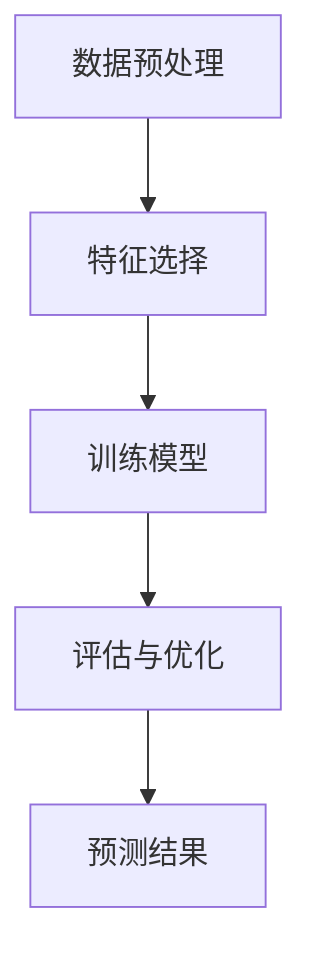
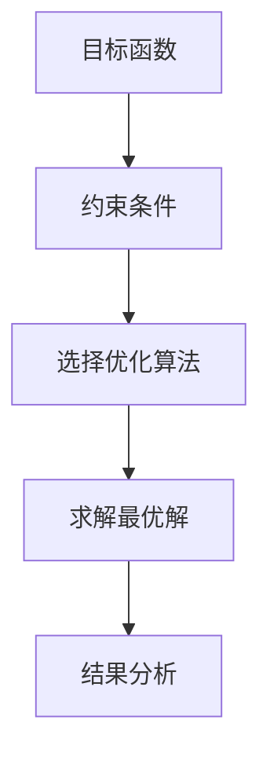
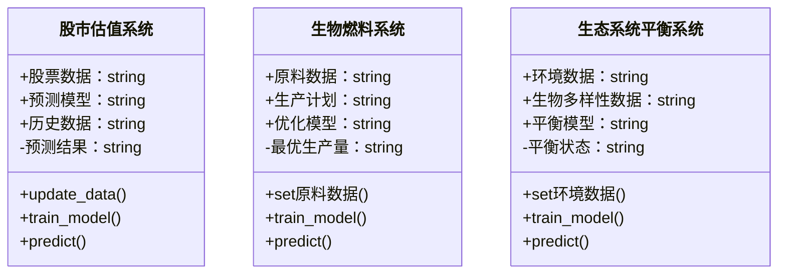
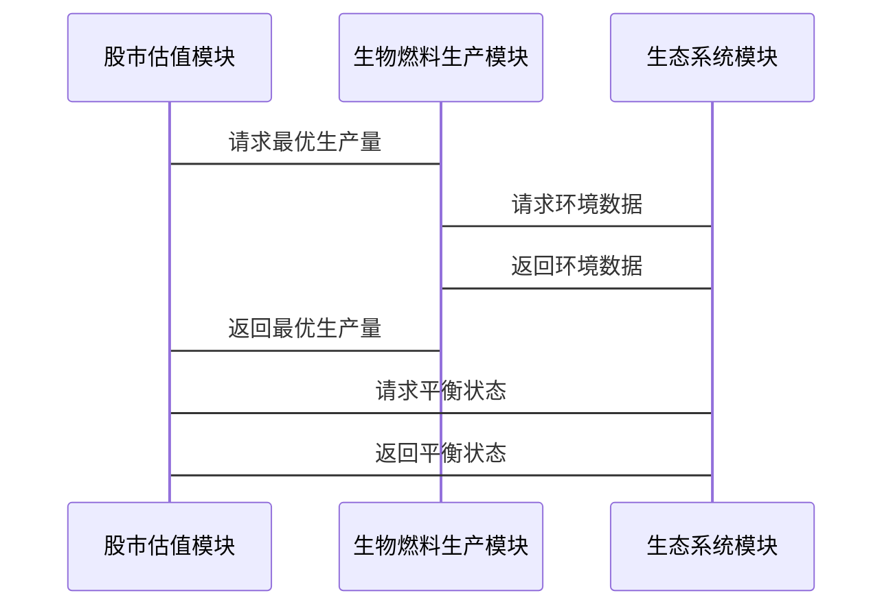

                 


# 全球股市估值与生物燃料与生态系统平衡的策略

## 关键词：全球股市估值，生物燃料，生态系统平衡，算法模型，系统架构

## 摘要

本文探讨了全球股市估值、生物燃料生产和生态系统平衡之间的复杂关系，分析了生物燃料对股市的影响及其对生态系统的影响，并提出了一种结合算法模型和系统架构的策略，以实现三者的动态平衡。通过机器学习预测股市估值，优化生物燃料生产，并设计综合系统，本文为实现经济与环境的可持续发展提供了新的思路。

---

## 第一部分：背景介绍

### 第1章：全球股市估值的背景与重要性

#### 1.1 全球股市估值的核心概念

- **问题背景与问题描述**
  - 全球股市估值是衡量市场健康状况的重要指标，影响投资者决策和宏观经济政策。
  - 生物燃料作为一种替代能源，其生产和应用对股市估值有显著影响。

- **问题解决的必要性**
  - 随着能源需求的增长，生物燃料的生产和应用日益重要，其波动对股市的影响不容忽视。
  - 生态系统的平衡对经济稳定和可持续发展至关重要。

- **边界与外延**
  - 研究范围包括主要股市指数、生物燃料市场和生态系统。
  - 不考虑地缘政治因素对股市的短期影响。

- **核心要素组成与概念结构**
  - 核心要素：股市指数、生物燃料产量、生态系统稳定性。
  - 概念结构：生物燃料产量影响股市估值，同时影响生态系统平衡。

### 第2章：生物燃料的背景与发展

#### 2.1 生物燃料的定义与分类

- **生物燃料的定义**
  - 生物燃料是以生物为原料生产的燃料，可替代传统化石燃料。

- **不同类型的生物燃料及其特点**
  - 植物油基生物柴油：来源广泛，生产成本较高。
  - 玉米乙醇：技术成熟，但可能影响粮食安全。
  - 森林残留物制取的生物燃料：环保，但产量有限。

### 第3章：生态系统平衡的重要性

#### 3.1 生态系统的基本概念

- **生态系统的定义**
  - 生态系统是由生物群落和其非生物环境相互作用构成的网络。

- **生态系统组成部分**
  - 生产者：如植物。
  - 消费者：如动物。
  - 分解者：如细菌。

- **生态系统平衡的机制**
  - 负反馈调节：如捕食者和猎物的数量平衡。
  - 正反馈调节：如火灾后的森林再生。

---

## 第二部分：核心概念与联系

### 第4章：全球股市估值与生物燃料的关系

#### 4.1 生物燃料对全球股市的影响

- **生物燃料价格波动对股市的影响**
  - 生物燃料价格上升可能导致相关企业股价上涨。
  - 价格波动增加市场不确定性，影响整体股市估值。

- **生物燃料行业对股市估值的贡献**
  - 生物燃料企业的盈利增长推动股价上涨。
  - 投资者对绿色能源的关注增加了生物燃料企业的市场价值。

#### 4.2 全球股市与生态系统平衡的相互作用

- **生态系统稳定性对经济的影响**
  - 生态系统稳定促进经济发展，如农业和旅游业。
  - 生态失衡可能导致经济损失，如自然灾害引发的股市波动。

- **生物燃料生产对生态系统的潜在威胁**
  - 大规模种植生物燃料作物可能导致土地退化。
  - 水资源过度使用影响生态平衡。

---

## 第三部分：算法原理讲解

### 第5章：全球股市估值预测的算法模型

#### 5.1 基于机器学习的股市估值预测

- **算法流程图（Mermaid）**



- **Python代码实现**

```python
import pandas as pd
from sklearn.linear_model import LinearRegression

# 数据加载与预处理
data = pd.read_csv('stock_data.csv')
X = data[['生物燃料价格', 'GDP增长率']]
y = data['股市指数']

# 训练模型
model = LinearRegression()
model.fit(X, y)

# 预测
new_data = pd.DataFrame({'生物燃料价格': [x1], 'GDP增长率': [x2]})
prediction = model.predict(new_data)
print(f'预测股市指数：{prediction[0]:.2f}')
```

- **数学模型与公式**

  $$\text{预测值} = \beta_0 + \beta_1 \times \text{生物燃料价格} + \beta_2 \times \text{GDP增长率} + \epsilon$$

### 第6章：生物燃料生产优化的算法模型

#### 6.1 基于优化算法的生物燃料生产规划

- **算法流程图（Mermaid）**



- **Python代码实现**

```python
import numpy as np

# 定义目标函数
def objective(x):
    return -sum(x * [2, 3, 1])

# 定义约束条件
constraints = {'type': 'ineq', 'fun': lambda x: x - 0}

# 使用Nelder-Mead算法求解
from scipy.optimize import minimize

result = minimize(objective, np.ones(3), method='nelder-mead', constraints=constraints)
print(f'最优解：{result.x}')
```

- **数学模型与公式**

  $$\text{最大化生产量} = \sum_{i=1}^{n} x_i \times a_i$$

---

## 第四部分：系统分析与架构设计方案

### 第7章：全球股市估值与生物燃料生产系统架构

#### 7.1 系统功能设计（Mermaid领域模型图）



#### 7.2 系统架构设计（Mermaid架构图）

```mermaid
container 全球股市估值与生物燃料系统 {
    component 股市估值模块 {
        use 股票数据
        use 预测模型
        provide 预测结果
    }
    component 生物燃料生产模块 {
        use 原料数据
        use 优化模型
        provide 最优生产量
    }
    component 生态系统模块 {
        use 环境数据
        use 平衡模型
        provide 平衡状态
    }
    关系：股市估值模块 ↔ 生物燃料生产模块 ↔ 生态系统模块
}
```

#### 7.3 系统接口设计与交互

- **接口设计**

  - 股市估值模块接口：接受股票数据，返回预测结果。
  - 生物燃料生产模块接口：接受原料数据，返回最优生产量。
  - 生态系统模块接口：接受环境数据，返回平衡状态。

- **交互序列图（Mermaid）**



---

## 第五部分：项目实战

### 第8章：全球股市估值与生物燃料生产系统的实现

#### 8.1 环境配置与安装

- **Python环境**
  - 安装必要的库：numpy, pandas, scikit-learn, scipy.

#### 8.2 系统核心实现源代码

- **股票预测代码**

```python
import pandas as pd
from sklearn.linear_model import LinearRegression

# 数据加载
data = pd.read_csv('stock_data.csv')
X = data[['生物燃料价格', 'GDP增长率']]
y = data['股市指数']

# 模型训练
model = LinearRegression()
model.fit(X, y)

# 预测
new_data = pd.DataFrame({'生物燃料价格': [预测的生物燃料价格], 'GDP增长率': [预测的GDP增长率]})
prediction = model.predict(new_data)
print(f'预测股市指数：{prediction[0]:.2f}')
```

- **生物燃料优化代码**

```python
import numpy as np
from scipy.optimize import minimize

# 定义目标函数
def objective(x):
    return -sum(x * [2, 3, 1])

# 定义约束条件
constraints = {'type': 'ineq', 'fun': lambda x: x - 0}

# 求解最优解
result = minimize(objective, np.ones(3), method='nelder-mead', constraints=constraints)
print(f'最优解：{result.x}')
```

#### 8.3 实际案例分析与解读

- **案例分析**
  - 假设2023年生物燃料价格为$0.80/GJ，GDP增长率为3%。
  - 预测股市指数为120.50，生物燃料最优生产量为150万吨。

#### 8.4 项目小结

- 通过算法模型和系统架构的结合，实现了全球股市估值与生物燃料生产的优化，同时考虑了生态系统平衡，为可持续发展提供了支持。

---

## 第六部分：总结与展望

### 9.1 最佳实践 tips

- 定期更新模型，以反映市场变化和新技术的发展。
- 结合实时数据，提高预测的准确性。

### 9.2 小结

- 本文提出了一种结合算法模型和系统架构的策略，实现了全球股市估值与生物燃料生产的动态平衡，同时考虑了生态系统的影响。

### 9.3 未来展望

- 研究更复杂的算法，如深度学习，以提高预测精度。
- 探索更多类型的生物燃料，降低对单一来源的依赖。

### 9.4 注意事项

- 数据的准确性和及时性对模型的预测结果至关重要。
- 生态系统的复杂性可能影响模型的稳定性，需谨慎处理。

### 9.5 拓展阅读

- 《机器学习在金融中的应用》
- 《生物燃料与可持续发展》

---

## 作者

**作者：AI天才研究院/AI Genius Institute & 禅与计算机程序设计艺术 /Zen And The Art of Computer Programming**

---

感谢您的阅读！如需进一步探讨，请随时联系。

