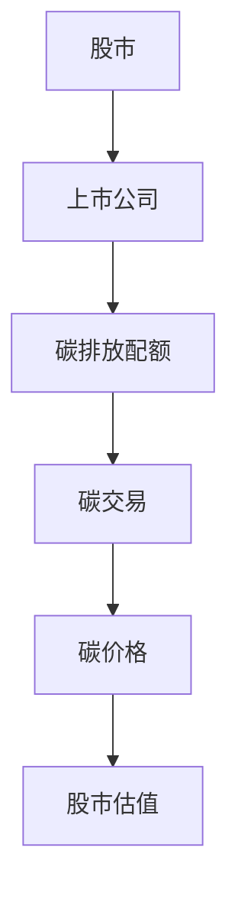
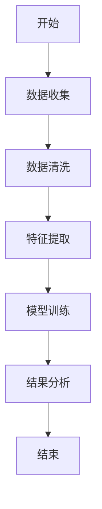
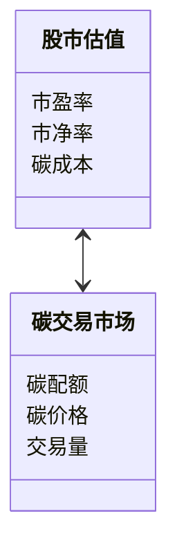
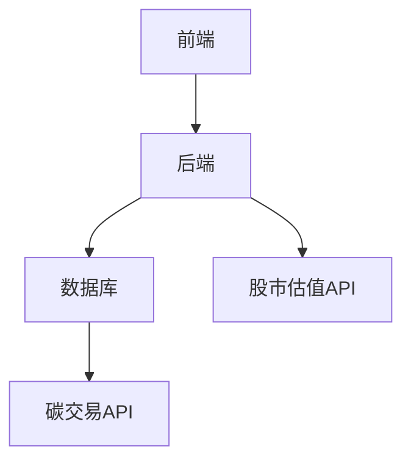
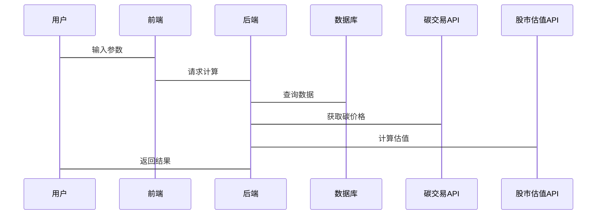

                 


# 全球股市估值与碳交易市场发展的关系

> 关键词：全球股市估值，碳交易市场，碳中和，金融市场，气候变化

> 摘要：随着全球气候变化问题的加剧，碳交易市场作为应对气候变化的重要工具，正在迅速崛起。与此同时，股市估值作为金融市场的重要组成部分，也在不断受到碳交易市场的影响。本文将从全球股市估值的基本概念出发，深入分析碳交易市场的发展机制，探讨两者之间的相互作用，并结合实际案例和系统设计，为读者提供全面的视角，理解这一重要关系。

---

## 第一部分：全球股市估值与碳交易市场发展的关系概述

### 第1章：引言

#### 1.1 问题背景
##### 1.1.1 全球股市估值的基本概念
股市估值是通过对上市公司财务数据和市场表现的分析，对其市值进行合理评估的过程。常见的估值方法包括市盈率（P/E）、市净率（P/B）等，这些指标反映了市场对企业的信心和未来预期。

##### 1.1.2 碳交易市场的定义与特征
碳交易市场是通过买卖碳排放配额或信用，实现碳排放总量控制的市场机制。它分为一级市场和二级市场，分别对应政府分配和市场交易。

##### 1.1.3 问题解决的目标
本研究旨在分析碳交易市场对股市估值的影响，揭示两者之间的动态关系，为企业和投资者提供参考。

#### 1.2 问题描述
##### 1.2.1 全球股市估值的核心要素
- 财务数据（收入、利润、现金流）
- 市场情绪（投资者信心、市场波动）
- 宏观经济指标（GDP、利率、通货膨胀）

##### 1.2.2 碳交易市场的运作机制
- 配额分配：政府将碳排放额度分配给企业。
- 交易过程：企业可在二级市场上买卖配额。
- 结算机制：定期核查企业碳排放，确保合规。

##### 1.2.3 问题的边界与外延
- 研究范围：全球主要股市和碳交易市场。
- 时间跨度：近十年的数据分析。

#### 1.3 问题解决
##### 1.3.1 股市估值与碳交易市场的关联性
碳交易市场的价格波动会影响企业的碳成本，进而影响其利润和市值。

##### 1.3.2 碳中和目标对股市估值的影响
实现碳中和需要大量投资于绿色能源和可持续发展，这将推动相关行业股票估值上升。

##### 1.3.3 碳交易市场对全球金融体系的重塑
碳交易市场的兴起将改变传统金融市场的估值模型，推动绿色金融的发展。

---

## 第二部分：核心概念与联系

### 第2章：核心概念与联系

#### 2.1 核心概念原理
##### 2.1.1 股市估值的理论基础
- 基本面分析：通过财务数据评估企业价值。
- 技术分析：通过价格和成交量预测市场趋势。

##### 2.1.2 碳交易市场的经济学原理
- 碳定价：通过市场机制确定碳排放成本。
- 边际成本：企业选择最经济的减排方式。

##### 2.1.3 两者关系的理论框架
$$ 股市估值 = f(企业价值, 市场情绪, 碳成本) $$

#### 2.2 概念属性特征对比
| 特性 | 股市估值 | 碳交易市场 |
|------|----------|------------|
| 核心要素 | 财务数据、市场情绪 | 碳配额、碳价格 |
| 风险因素 | 市场波动、经济周期 | 政策变化、技术进步 |
| 影响机制 | 直接影响企业市值 | 通过成本影响企业利润 |

#### 2.3 ER实体关系图


---

## 第三部分：算法原理讲解

### 第3章：算法原理讲解

#### 3.1 算法流程图


#### 3.2 Python源代码实现
```python
import pandas as pd
import numpy as np

def calculate_carbon_impact(revenue, carbon_price):
    return revenue * carbon_price * 0.001

# 示例数据
data = {
    '公司': ['A', 'B', 'C'],
    '营收': [100, 200, 150],
    '碳价格': [50, 60, 55]
}

df = pd.DataFrame(data)
df['碳影响'] = df.apply(lambda x: calculate_carbon_impact(x['营收'], x['碳价格']), axis=1)
print(df)
```

#### 3.3 算法数学模型
$$ \text{碳影响} = \text{营收} \times \text{碳价格} \times \text{影响系数} $$

---

## 第四部分：系统分析与架构设计

### 第4章：系统分析与架构设计

#### 4.1 问题场景介绍
碳交易市场的兴起对企业估值产生了深远影响，企业需要考虑碳成本对利润的影响。

#### 4.2 系统功能设计
##### 4.2.1 领域模型类图


##### 4.2.2 系统架构图


#### 4.3 系统接口设计
- 前端接口：用户输入参数，显示估值结果。
- 后端接口：接收数据，调用API计算碳影响。

#### 4.4 系统交互序列图


---

## 第五部分：项目实战

### 第5章：项目实战

#### 5.1 环境安装
- Python 3.8+
- Pandas、NumPy、Matplotlib

#### 5.2 系统核心实现
```python
import pandas as pd
import matplotlib.pyplot as plt

def visualize_carbon_impact(data):
    plt.plot(data['时间'], data['碳价格'], label='碳价格')
    plt.plot(data['时间'], data['股市估值'], label='股市估值')
    plt.xlabel('时间')
    plt.ylabel('值')
    plt.legend()
    plt.show()

# 示例数据
data = {
    '时间': [1, 2, 3, 4, 5],
    '碳价格': [50, 60, 55, 65, 70],
    '股市估值': [100, 120, 110, 130, 140]
}

df = pd.DataFrame(data)
visualize_carbon_impact(df)
```

#### 5.3 案例分析
分析某企业碳交易对股市估值的影响，展示实际应用中的数据变化。

#### 5.4 项目总结
通过项目实战，验证了碳交易市场对股市估值的显著影响，为企业和投资者提供了新的视角。

---

## 第六部分：结论与展望

### 第6章：结论与展望

#### 6.1 结论
碳交易市场的发展正在重塑全球股市估值，企业和投资者需要重视碳成本的影响。

#### 6.2 未来展望
- 碳金融产品的创新
- 碳交易市场的国际化
- 数字技术在碳交易中的应用

---

## 附录

### 附录A：数据来源与工具介绍

### 附录B：相关术语解释

### 附录C：参考文献

---

作者：AI天才研究院/AI Genius Institute & 禅与计算机程序设计艺术 /Zen And The Art of Computer Programming

