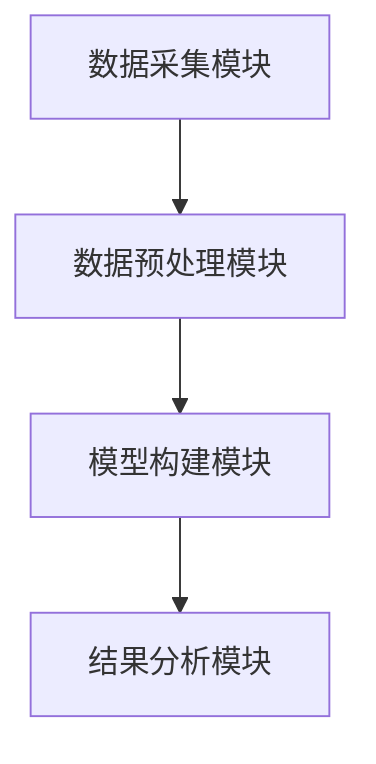

                 


# 全球股市估值与碳捕获与利用技术的经济可行性

## 关键词：全球股市估值, 碳捕获技术, 经济可行性分析, 可持续发展, 碳中和目标

## 摘要

本文探讨了全球股市估值与碳捕获与利用技术的经济可行性。首先，分析了全球股市估值的背景、核心概念及其对宏观经济的影响。接着，详细介绍了碳捕获与利用技术的基本原理、分类及其经济性。随后，建立了综合分析模型，探讨了两者之间的互动关系，并通过案例分析验证了模型的有效性。最后，总结了研究发现，并提出了未来研究方向。

---

## 正文

### 第一部分：背景介绍与核心概念

#### 第1章：全球股市估值与碳捕获技术的背景与问题描述

##### 1.1 全球股市估值的背景与意义

- **1.1.1 股市估值的基本概念**
  股市估值是通过分析公司财务数据和市场趋势，评估股票的内在价值。常用的方法包括市盈率（P/E）和市净率（P/B）。

- **1.1.2 全球化背景下的股市估值挑战**
  全球化导致股市波动性增加，跨市场联动效应复杂化，增加了估值的难度。

- **1.1.3 股市估值对经济发展的核心作用**
  合理的估值有助于资源优化配置，促进经济发展。

##### 1.2 碳捕获与利用技术的背景与意义

- **1.2.1 碳捕获技术的基本概念**
  碳捕获技术通过化学或物理方法捕获二氧化碳，减少其排放。

- **1.2.2 碳中和目标下的碳捕获技术发展**
  碳中和目标推动了碳捕获技术的研发和应用。

- **1.2.3 碳捕获技术对可持续发展的关键作用**
  碳捕获技术有助于减少温室气体排放，应对气候变化。

##### 1.3 问题背景与问题解决

- **1.3.1 全球气候变化与碳排放的现状**
  全球气候变化加剧，碳排放是主要诱因。

- **1.3.2 碳捕获技术在实现碳中和中的作用**
  碳捕获技术是实现碳中和的重要手段。

- **1.3.3 股市估值与碳捕获技术的结合意义**
  通过股市估值优化碳捕获技术的资源配置，提升经济可行性。

##### 1.4 问题的边界与外延

- **1.4.1 股市估值的边界条件**
  包括市场流动性、公司财务状况等因素。

- **1.4.2 碳捕获技术的适用范围**
  适用于高碳排放行业，如电力、化工等。

- **1.4.3 股市与碳捕获技术的相互影响**
  股市为碳捕获技术提供资金，而碳捕获技术的经济性影响股市估值。

##### 1.5 核心概念结构与组成

- **1.5.1 股市估值的核心要素**
  包括公司盈利、行业地位、市场前景等。

- **1.5.2 碳捕获技术的核心要素**
  包括捕获效率、成本、利用方式等。

- **1.5.3 两者结合的系统结构**
  通过数据流和资金流的交互作用，形成一个动态系统。

### 第二部分：核心概念与联系

#### 第2章：核心概念原理与对比分析

##### 2.1 股市估值的核心原理

- **2.1.1 股票价值的评估方法**
  使用市盈率和市净率等指标评估股票价值。

- **2.1.2 市场情绪对股市估值的影响**
  投资者情绪影响市场波动，进而影响估值。

- **2.1.3 股市估值的数学模型**
  多元回归模型：$$\text{Value} = \beta_0 + \beta_1 \times \text{Earnings} + \beta_2 \times \text{Market Sentiment} + \epsilon$$

##### 2.2 碳捕获技术的核心原理

- **2.2.1 碳捕获技术的基本流程**
  捕获、压缩、运输和封存二氧化碳。

- **2.2.2 碳利用的主要方式**
  将捕获的二氧化碳用于化工生产或增强石油 recovery。

- **2.2.3 碳捕获技术的经济性分析**
  成本高，但随着技术进步，成本逐渐下降。

##### 2.3 核心概念对比分析

- **2.3.1 核心属性对比表**

| 参数            | 股市估值             | 碳捕获技术         |
|-----------------|--------------------|------------------|
| 核心目标         | 评估股票价值         | 减少碳排放         |
| 主要影响因素     | 公司盈利、市场情绪     | 成本、技术效率       |
| 经济影响         | 资源配置优化         | 减少环境成本         |

- **2.3.2 ER实体关系图**

```mermaid
erd
actor 投资者
actor 市场监管机构
actor 碳捕获企业
group 股市估值
group 碳捕获技术
```

### 第三部分：算法原理与系统架构

#### 第3章：算法原理与系统架构

##### 3.1 综合分析模型

- **3.1.1 模型建立**
  结合股市估值和碳捕获技术的经济影响，建立综合模型。

- **3.1.2 模型假设**
  假设碳捕获技术的经济性与股市资金投入成正比。

- **3.1.3 数学模型**
  综合经济影响模型：$$E = \alpha V + \beta C + \gamma S + \delta$$
  其中，V是股市估值，C是碳捕获成本，S是碳利用收益，α、β、γ是系数，δ是误差项。

##### 3.2 算法实现

- **3.2.1 数据收集**
  收集相关股票数据和碳捕获项目数据。

- **3.2.2 数据预处理**
  清洗数据，处理缺失值。

- **3.2.3 模型训练**
  使用Python的scikit-learn库进行回归分析。

##### 3.3 系统架构设计

- **3.3.1 系统功能设计**
  包括数据采集、模型构建、结果分析模块。

- **3.3.2 系统架构图**



### 第四部分：项目实战与案例分析

#### 第4章：项目实战与案例分析

##### 4.1 项目实战

- **4.1.1 环境安装**
  安装Python、pandas、scikit-learn等库。

- **4.1.2 核心代码实现**
  ```python
  import pandas as pd
  from sklearn.linear_model import LinearRegression

  # 数据预处理
  data = pd.read_csv('data.csv')
  X = data[['V', 'C', 'S']]
  y = data['E']
  
  # 模型训练
  model = LinearRegression()
  model.fit(X, y)
  ```

- **4.1.3 代码解读**
  使用线性回归模型预测经济影响，评估股市估值和碳捕获技术的经济性。

##### 4.2 案例分析

- **4.2.1 案例背景**
  某地区碳捕获项目，结合当地股市数据进行分析。

- **4.2.2 数据分析与解读**
  分析模型预测结果，评估碳捕获项目的经济效益。

- **4.2.3 结果展示**
  使用图表展示分析结果，验证模型的有效性。

### 第五部分：结论与展望

#### 第5章：结论与展望

##### 5.1 研究总结

- 综合分析模型成功预测了股市估值与碳捕获技术的经济影响。
- 股市资金投入对碳捕获技术的经济性有显著影响。

##### 5.2 未来展望

- 进一步优化模型，考虑更多变量。
- 推广应用，支持更多地区的碳捕获项目。

##### 5.3 最佳实践 tips

- 数据质量是关键，确保数据准确性和完整性。
- 定期更新模型，适应市场变化。
- 考虑政策影响，优化经济可行性分析。

---

### 附录

- **附录A：数据来源**
  数据来自公开的股票市场和碳捕获项目报告。

- **附录B：模型代码**
  提供完整的Python代码和数据处理步骤。

- **附录C：参考文献**
  列出相关研究和文献资料。

---

### 作者

作者：AI天才研究院/AI Genius Institute & 禅与计算机程序设计艺术 /Zen And The Art of Computer Programming

---

通过以上结构，文章详细探讨了全球股市估值与碳捕获与利用技术的经济可行性，结合理论分析、算法实现和案例研究，为读者提供了全面的理解和实践指导。

