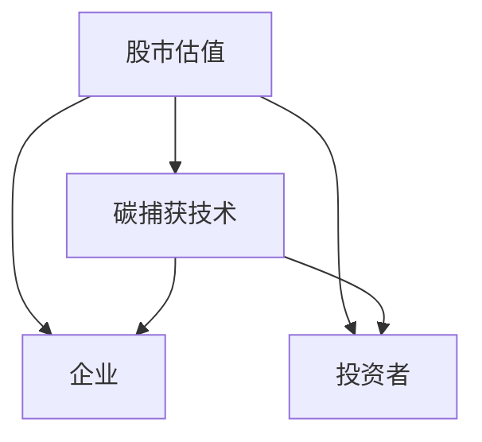
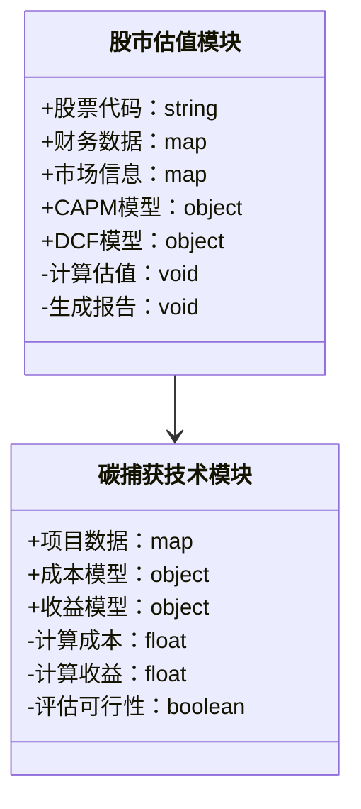

                 

# 全球股市估值与碳捕获与利用技术的经济可行性

## 关键词：全球股市估值、碳捕获与利用技术、经济可行性、股市估值模型、碳捕获经济分析

## 摘要：  
本文深入分析了全球股市估值与碳捕获与利用技术的经济可行性。首先，从股市估值的基本概念和碳捕获技术的定义入手，详细探讨了两者的相互关系与潜在影响。其次，通过数学模型和算法原理，分析了股市估值的核心方法和碳捕获技术的经济可行性模型。最后，结合实际案例，从系统架构设计、项目实战与案例分析等方面，详细阐述了如何将股市估值与碳捕获技术相结合，以实现经济与环境的双重效益。本文旨在为投资者、政策制定者和技术创新者提供有价值的参考。

---

## 第一部分：全球股市估值与碳捕获与利用技术的核心概念

### 第1章：核心概念与背景介绍

#### 1.1 股市估值的基本概念
- **定义**：股市估值是指对上市公司股票的内在价值进行评估的过程，通常基于公司财务数据、市场环境和行业趋势。
- **关键指标**：市盈率（P/E）、市净率（P/B）、股息率、ROE（净资产收益率）等。
- **目的**：帮助投资者判断股票是否被高估或低估，指导投资决策。

#### 1.2 碳捕获与利用技术的定义与特点
- **定义**：碳捕获与利用技术是指通过物理、化学或生物方法，从大气或工业排放中捕获二氧化碳，并将其转化为有用的产品或能源的过程。
- **特点**：
  - **技术多样性**：包括化学吸收法、物理分离法、生物固定法等。
  - **经济性**：初期投资高，但随着技术进步和规模效应，成本逐渐降低。
  - **环境效益**：减少温室气体排放，助力全球碳中和目标。

#### 1.3 问题背景与研究意义
- **背景**：全球气候变化问题日益严重，碳捕获技术成为实现碳中和的重要手段。同时，股市估值在投资决策中起着关键作用，但传统估值方法未充分考虑碳排放的成本和收益。
- **意义**：研究股市估值与碳捕获技术的经济可行性，有助于投资者评估绿色技术的长期收益，同时推动碳捕获技术的商业化应用。

---

### 第2章：核心概念的联系与对比

#### 2.1 股市估值与碳捕获技术的相互影响
- **股市估值对碳捕获技术的影响**：
  - 碳捕获技术的商业化前景会影响相关企业的估值。
  - 政府补贴、碳交易政策等外部因素会间接影响股市估值。
- **碳捕获技术对股市估值的影响**：
  - 碳捕获技术的成本和收益会影响企业的盈利能力和股价。
  - 投资者对碳捕获技术的关注度可能影响相关股票的流动性。

#### 2.2 核心概念的对比分析
- **属性特征对比表**：
| 特性          | 股市估值              | 碳捕获技术          |
|---------------|----------------------|--------------------|
| 核心目标      | 评估股票价值          | 捕获并利用CO₂        |
| 依赖因素      | 财务数据、市场环境      | 技术、成本、政策      |
| 应用场景      | 投资决策              | 环境保护、能源转型    |
- **Mermaid 实体关系图**：

---

## 第二部分：算法原理与数学模型

### 第3章：股市估值的数学模型

#### 3.1 资本资产定价模型（CAPM）
- **公式**：$$ E(R_i) = R_f + β_i (R_m - R_f) $$
  - $$E(R_i)$$：资产的预期回报率
  - $$R_f$$：无风险利率
  - $$β_i$$：资产的贝塔系数
  - $$R_m$$：市场预期回报率
- **应用**：用于评估股票的合理价格，帮助投资者判断股票是否被高估或低估。

#### 3.2 现金流折现模型（DCF）
- **公式**：$$ V = \sum_{t=1}^{n} \frac{CF_t}{(1 + r)^t} $$
  - $$V$$：企业价值
  - $$CF_t$$：第t年的现金流
  - $$r$$：折现率
- **应用**：适用于评估具有稳定现金流的企业，如碳捕获技术公司。

### 第4章：碳捕获技术的经济可行性分析

#### 4.1 碳捕获成本模型
- **公式**：$$ C = \sum_{i=1}^{n} c_i \times q_i $$
  - $$C$$：总成本
  - $$c_i$$：第i项成本（如设备、人力、能源）
  - $$q_i$$：第i项成本的数量
- **应用**：用于估算碳捕获项目的初始投资和运营成本。

#### 4.2 碳利用的收益预测模型
- **公式**：$$ R = p \times Q $$
  - $$R$$：收益
  - $$p$$：碳利用产品的市场价格
  - $$Q$$：碳利用产品的产量
- **应用**：用于评估碳捕获技术的经济回报潜力。

---

## 第三部分：系统分析与架构设计

### 第5章：系统功能设计

#### 5.1 股市估值模块
- **功能**：
  - 数据采集：获取企业的财务数据和市场信息。
  - 模型计算：应用CAPM或DCF模型进行估值。
  - 结果展示：生成估值报告和可视化图表。

#### 5.2 碳捕获技术经济分析模块
- **功能**：
  - 数据输入：碳捕获项目的成本和收益数据。
  - 模型计算：应用成本模型和收益模型。
  - 结果分析：评估项目的经济可行性。

#### 5.3 使用 Mermaid 绘制领域模型类图

---

## 第四部分：项目实战与案例分析

### 第6章：案例分析

#### 6.1 股市估值案例
- **案例背景**：某科技公司开发碳捕获技术，财务数据如下：
  - 营业收入：10亿元
  - 净利润：2亿元
  - 贝塔系数：1.2
  - 无风险利率：3%
  - 市场预期回报率：8%
- **计算**：$$ E(R_i) = 3\% + 1.2 \times (8\% - 3\%) = 9.6\% $$
- **结论**：股票合理回报率为9.6%，低于市场预期，可能被高估。

#### 6.2 碳捕获技术经济分析案例
- **项目数据**：某碳捕获项目初期投资1000万元，年运营成本200万元，预计每年捕获并利用CO₂产生收益500万元。
- **计算**：$$ C = 1000 + 200 = 1200 \text{万元} $$
  $$ R = 500 \text{万元} $$
- **结论**：项目年净收益为$$ 500 - 200 = 300 \text{万元} $$，投资回收期为$$ 1200 / 300 = 4 \text{年} $$。

---

## 第五部分：最佳实践与总结

### 第7章：总结与展望

#### 7.1 最佳实践
- **投资者**：在评估企业价值时，应考虑碳捕获技术的潜在收益和风险。
- **企业**：碳捕获技术公司应优化成本结构，提高技术效率。
- **政策制定者**：应提供税收优惠和补贴，支持碳捕获技术的商业化。

#### 7.2 小结
本文通过分析股市估值与碳捕获技术的经济可行性，提出了将两者结合的系统架构和分析方法。通过案例分析，验证了模型的有效性和实用性。

#### 7.3 注意事项
- 数据的准确性和完整性是模型计算的基础。
- 碳捕获技术的经济性受政策和市场环境影响较大，需动态调整。

---

## 作者：AI天才研究院 & 禅与计算机程序设计艺术

