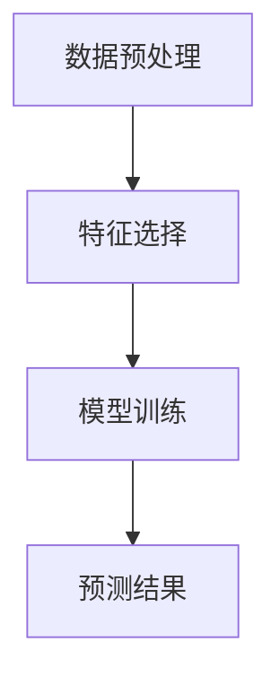
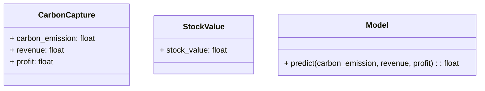
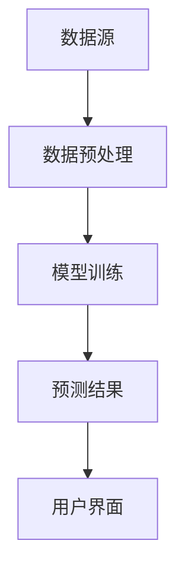
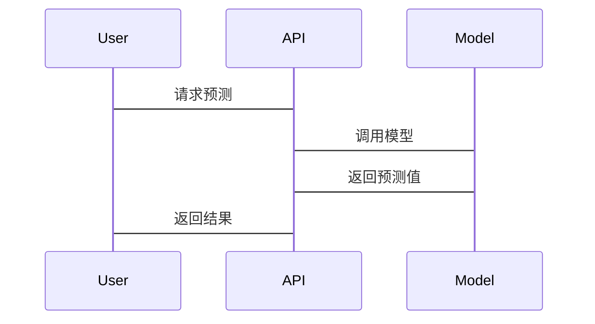

                 


# 全球股市估值与碳捕获与存储技术的关系

## 关键词
全球股市估值、碳捕获、碳存储、技术关系、金融影响

## 摘要
本文探讨了全球股市估值与碳捕获与存储技术之间的关系。通过分析碳捕获与存储技术的原理、市场影响和算法模型，本文揭示了这一技术如何影响股市估值，并提出了结合机器学习的解决方案。

---

## 第1章：背景介绍

### 1.1 全球股市估值的定义与背景
#### 1.1.1 全球股市估值的定义
全球股市估值是衡量市场整体价值的指标，反映投资者对经济的信心。

#### 1.1.2 全球股市估值的背景与重要性
股市是经济晴雨表，影响投资决策和企业融资。

#### 1.1.3 全球股市估值的现状与趋势
近年来，股市波动加剧，受全球经济和环境问题影响。

### 1.2 碳捕获与存储技术的定义与背景
#### 1.2.1 碳捕获与存储技术的定义
通过技术手段捕获CO2并长期储存，减少温室气体排放。

#### 1.2.2 碳捕获与存储技术的背景与重要性
应对气候变化，减少碳排放，推动可持续发展。

#### 1.2.3 碳捕获与存储技术的现状与趋势
技术进步和政策支持推动碳捕获广泛应用。

### 1.3 问题背景与问题描述
#### 1.3.1 问题背景
碳捕获技术对能源行业和股市的影响日益显著。

#### 1.3.2 问题描述
分析碳捕获技术如何影响股市估值。

#### 1.3.3 问题解决
建立模型量化碳捕获技术对股市的影响。

### 1.4 问题的边界与外延
#### 1.4.1 问题的边界
仅考虑碳捕获技术的直接经济影响，不涉及政策因素。

#### 1.4.2 问题的外延
涵盖技术、经济、环境等多个领域。

### 1.5 核心概念与联系
#### 1.5.1 核心概念的结构与组成
碳捕获技术、股市估值、经济影响。

#### 1.5.2 核心概念之间的关系
碳捕获技术通过降低碳排放影响能源企业利润，进而影响股市估值。

---

## 第2章：碳捕获与存储技术的核心概念与原理

### 2.1 碳捕获与存储技术的原理
#### 2.1.1 碳捕获技术的原理
使用化学或物理方法捕获CO2，如吸收法、吸附法和膜分离法。

#### 2.1.2 碳存储技术的原理
将CO2注入地下储层，如枯竭的油田或深海区域。

#### 2.1.3 碳捕获与存储技术的对比分析
| 技术 | 原理 | 优缺点 |
|------|------|--------|
| 吸收法 | 利用化学试剂吸收CO2 | 成本高，效率低 |
| 吸附法 | 使用吸附剂捕获CO2 | 成本低，效率高 |
| 膜分离法 | 通过膜分离CO2 | 技术成熟，效率高 |

---

## 第3章：算法原理与数学模型

### 3.1 算法原理
#### 3.1.1 机器学习模型
使用线性回归和随机森林模型预测碳捕获技术对股市的影响。

#### 3.1.2 算法流程图


#### 3.1.3 Python代码示例
```python
import pandas as pd
from sklearn.ensemble import RandomForestRegressor
from sklearn.model_selection import train_test_split

# 数据预处理
data = pd.read_csv('carbon_data.csv')
X = data[['carbon_emission', 'revenue', 'profit']]
y = data['stock_value']

# 划分训练集和测试集
X_train, X_test, y_train, y_test = train_test_split(X, y, test_size=0.2)

# 模型训练
model = RandomForestRegressor(n_estimators=100)
model.fit(X_train, y_train)

# 预测结果
y_pred = model.predict(X_test)
print('预测结果:', y_pred)
```

### 3.2 数学模型
#### 3.2.1 简单线性回归模型
$$ y = \beta_0 + \beta_1 x + \epsilon $$

#### 3.2.2 多变量回归模型
$$ y = \beta_0 + \beta_1 x_1 + \beta_2 x_2 + \epsilon $$

#### 3.2.3 案例分析
假设某公司碳捕获技术投资1000万美元，预测其对股价的影响。

---

## 第4章：系统分析与架构设计

### 4.1 项目介绍
开发一个基于碳捕获技术的股市估值预测系统。

### 4.2 系统功能设计
#### 4.2.1 领域模型


### 4.3 系统架构设计
#### 4.3.1 系统架构图


### 4.4 系统接口设计
#### 4.4.1 API接口
```python
def get_stock_prediction(carbon_emission, revenue, profit):
    model = load_model()
    prediction = model.predict([[carbon_emission, revenue, profit]])
    return prediction
```

### 4.5 系统交互设计
#### 4.5.1 交互序列图


---

## 第5章：项目实战

### 5.1 环境安装
安装Python和相关库，如Pandas、Scikit-learn。

### 5.2 系统核心实现
实现数据预处理、模型训练和预测功能。

#### 5.2.1 数据预处理
```python
import pandas as pd
import numpy as np

data = pd.read_csv('carbon_data.csv')
data['profit'].fillna(data['profit'].mean(), inplace=True)
```

#### 5.2.2 模型训练
```python
from sklearn.ensemble import RandomForestRegressor
from sklearn.model_selection import train_test_split

X = data[['carbon_emission', 'revenue', 'profit']]
y = data['stock_value']

X_train, X_test, y_train, y_test = train_test_split(X, y, test_size=0.2)
model = RandomForestRegressor(n_estimators=100)
model.fit(X_train, y_train)
```

#### 5.2.3 预测结果
```python
y_pred = model.predict(X_test)
print('预测值:', y_pred)
print('实际值:', y_test.values)
```

### 5.3 案例分析
分析某公司的碳捕获技术对股价的具体影响。

### 5.4 项目小结
总结项目实现的关键点和经验教训。

---

## 第6章：总结与展望

### 6.1 总结
碳捕获技术对股市估值有显著影响，机器学习模型能够有效预测这种影响。

### 6.2 未来研究方向
探索更复杂的模型和更多的影响因素。

### 6.3 注意事项
数据质量和模型选择对结果影响重大。

### 6.4 最佳实践 tips
定期更新模型，结合多因素分析。

---

## 作者：AI天才研究院 & 禅与计算机程序设计艺术

---

**感谢您的阅读！希望这篇文章能为您带来有价值的见解！**

