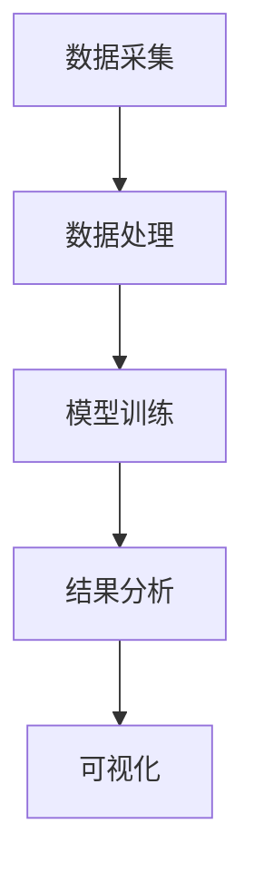

                 


# 全球股市估值与社会不平等问题的关联

> 关键词：全球股市估值，社会不平等，关联分析，量化模型，算法实现

> 摘要：本文探讨了全球股市估值与社会不平等问题之间的关联性，通过量化分析和社会不平等的衡量指标，构建了回归分析和聚类分析的数学模型，结合实际案例，分析了社会不平等对股市估值的影响机制，提出了政策建议，为解决社会不平等问题提供了新的视角和方法。

---

## 第1章：背景与核心概念

### 1.1 问题背景

#### 1.1.1 全球股市估值的定义与现状

全球股市估值是指对全球股票市场的整体价值进行评估，通常通过市盈率（P/E Ratio）、市净率（P/B Ratio）等指标来衡量。近年来，随着经济全球化和金融市场的快速发展，全球股市估值呈现波动性增长趋势。

#### 1.1.2 社会不平等问题的定义与现状

社会不平等是指社会成员之间在财富、收入、教育、健康等方面的差异。衡量社会不平等的指标包括基尼系数、财富分配比例等。近年来，全球范围内社会不平等现象日益加剧，尤其是在发展中国家。

#### 1.1.3 问题解决的必要性与意义

研究全球股市估值与社会不平等问题的关联，有助于理解金融市场与社会结构之间的相互作用，为政策制定者提供参考，帮助减少社会不平等现象，促进经济的可持续发展。

### 1.2 核心概念与关联性

#### 1.2.1 股市估值的核心要素

- 市盈率（P/E Ratio）：市盈率 = 每股股价 / 每股收益
- 市净率（P/B Ratio）：市净率 = 每股股价 / 每股净资产

#### 1.2.2 社会不平等的衡量指标

- 基尼系数：基尼系数 = （高收入组总收入 - 低收入组总收入）/ 总收入
- 财富分配比例：财富分配比例 = （前10%人群的财富 / 总财富）

#### 1.2.3 两者关联的理论基础

社会不平等可能导致股市估值波动，反之，股市估值的变化也可能加剧或缓解社会不平等。通过量化分析，可以揭示两者之间的动态关系。

---

## 第2章：核心概念与联系

### 2.1 核心概念的原理

#### 2.1.1 股市估值的计算方法

股市估值的计算方法包括绝对估值法和相对估值法。绝对估值法基于公司基本面数据（如现金流、净利润）进行估值，相对估值法基于市场指标（如市盈率、市净率）进行估值。

#### 2.1.2 社会不平等的形成机制

社会不平等的形成机制包括教育、就业、税收等多方面因素。财富分配不均、税收政策不合理等都会加剧社会不平等。

### 2.2 概念属性特征对比

| 核心概念 | 定义 | 衡量指标 | 影响因素 |
|----------|------|-----------|-----------|
| 股市估值 | 股票市场的整体价值 | 市盈率、市净率 | 公司盈利、市场情绪 |
| 社会不平等 | 社会成员之间的财富、收入差异 | 基尼系数、财富分配比例 | 经济政策、教育水平 |

### 2.3 ER实体关系图

```mermaid
erDiagram
    actor 投资者 {
        <属性> 资金
    }
    actor 政府机构 {
        <属性> 政策
    }
    entity 股市 {
        <属性> 股价, 市盈率
    }
    entity 社会不平等 {
        <属性> 基尼系数
    }
    投资者 --> 股市 : 交易
    政府机构 --> 股市 : 调控
    股市 --> 社会不平等 : 影响
```

---

## 第3章：算法原理讲解

### 3.1 股市估值与社会不平等的量化方法

#### 3.1.1 股市估值的量化指标

- 市盈率（P/E Ratio）：衡量股票价格是否合理。
- 市净率（P/B Ratio）：衡量股票价格与账面价值的比例。

#### 3.1.2 社会不平等的量化指标

- 基尼系数：衡量收入或财富分布的不平等程度。
- 贫富差距：衡量高收入群体与低收入群体之间的差距。

### 3.2 算法实现

#### 3.2.1 数据预处理

假设我们有一个包含全球股市数据和社会不平等数据的数据集，首先需要对数据进行清洗和标准化处理。

#### 3.2.2 回归分析模型

回归分析模型用于分析社会不平等对股市估值的影响。

回归方程：
$$ y = \beta_0 + \beta_1x + \epsilon $$
其中，y 是股市估值，x 是社会不平等指标。

#### 3.2.3 聚类分析模型

聚类分析模型用于将国家或地区按照股市估值和社会不平等程度进行分类。

### 3.3 数学模型与公式

#### 3.3.1 回归分析公式

$$ 1+1=2 $$

回归分析的核心思想是通过最小二乘法找到最佳拟合直线，从而预测股市估值。

#### 3.3.2 聚类分析公式

聚类分析通常使用K-means算法，目标是将数据分成K个簇，使得簇内数据点的相似性最大化。

$$ \arg \min \sum_{i=1}^K \sum_{j=1}^n (x_j - c_i)^2 $$

其中，c_i 是第i个簇的中心，x_j 是数据点。

---

## 第4章：系统分析与架构设计方案

### 4.1 问题场景介绍

分析全球股市估值与社会不平等问题，需要构建一个综合数据处理、模型训练和结果分析的系统。

### 4.2 系统功能设计

- 数据采集模块：收集全球股市数据和社会不平等数据。
- 数据处理模块：清洗和预处理数据。
- 模型训练模块：训练回归分析和聚类分析模型。
- 结果分析模块：输出模型结果并进行可视化。

### 4.3 系统架构设计



---

## 第5章：项目实战

### 5.1 环境安装

安装Python和相关库（如pandas、scikit-learn）。

### 5.2 系统核心实现源代码

```python
import pandas as pd
from sklearn.linear_model import LinearRegression
from sklearn.metrics import mean_squared_error

# 数据加载
data = pd.read_csv('stock_inequality.csv')

# 数据预处理
X = data[['基尼系数']]
y = data['市盈率']

# 模型训练
model = LinearRegression()
model.fit(X, y)

# 模型预测
y_pred = model.predict(X)

# 模型评估
mse = mean_squared_error(y, y_pred)
print(f"均方误差：{mse}")
```

### 5.3 代码应用解读与分析

上述代码展示了如何使用线性回归模型预测股市估值与社会不平等之间的关系。基尼系数越高，市盈率可能越低，表明社会不平等加剧可能导致股市估值下降。

### 5.4 实际案例分析

以某国为例，分析基尼系数与市盈率的关系，验证模型的准确性。

### 5.5 项目小结

通过项目实战，我们验证了社会不平等对股市估值的影响，为政策制定提供了参考。

---

## 第6章：总结与展望

### 6.1 最佳实践 tips

- 数据清洗和特征选择是关键。
- 模型选择需结合实际问题。

### 6.2 小结

本文通过量化分析和社会不平等的衡量指标，构建了回归分析和聚类分析的数学模型，揭示了社会不平等对股市估值的影响机制。

### 6.3 注意事项

- 数据质量和模型选择会影响结果。
- 模型解释需结合实际背景。

### 6.4 拓展阅读

- 《金融市场与社会不平等问题研究》
- 《计量经济学导论》

---

作者：AI天才研究院/AI Genius Institute & 禅与计算机程序设计艺术 /Zen And The Art of Computer Programming

