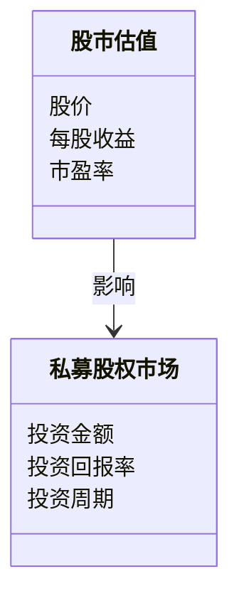
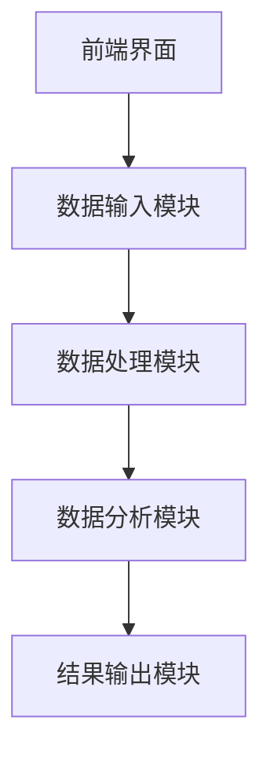
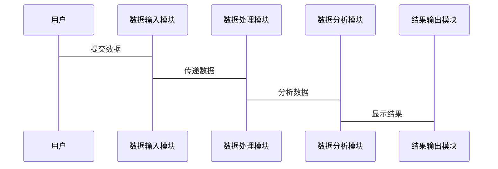

                 


# 全球股市估值与私募股权市场的关系

## 关键词：全球股市估值，私募股权市场，数据关联，投资策略，风险分析

## 摘要：  
本文探讨了全球股市估值与私募股权市场之间的关系，从理论基础、数据关联、系统分析到项目实战，详细分析了两者如何相互影响。通过统计分析、计量经济学方法和机器学习模型，本文揭示了两者之间的潜在关联，并提出了基于数据驱动的投资策略。本文还通过实际案例分析，展示了如何利用这些方法优化投资组合，并提供了系统的架构设计和代码实现。

---

# 第一部分: 全球股市估值与私募股权市场的关系概述

## 第1章: 引言

### 1.1 研究背景与意义  
全球股市估值是衡量市场健康状况的重要指标，而私募股权市场则为投资者提供了非公开市场的投资机会。随着金融市场的全球化，两者之间的关系日益紧密。然而，私募股权市场的数据往往不透明，且缺乏系统性的研究，这使得两者之间的关联性研究具有重要意义。

#### 1.1.1 全球股市估值的重要性  
股市估值反映了市场的整体健康状况，是投资者决策的重要依据。通过对股市估值的分析，可以识别市场趋势和潜在风险。

#### 1.1.2 私募股权市场的独特性  
私募股权市场的非公开性和高回报吸引了大量投资者，但其数据的不透明性和复杂性使得研究难度较大。

#### 1.1.3 两者关系的研究价值  
研究两者之间的关系，可以帮助投资者更好地理解市场动态，优化投资组合，并降低风险。

### 1.2 研究目的与方法  
本文旨在通过理论分析和实证研究，揭示全球股市估值与私募股权市场之间的关系，并提出基于数据驱动的投资策略。

#### 1.2.1 研究目标  
通过数据分析和建模，揭示两者之间的潜在关联，并提出可行的投资策略。

#### 1.2.2 研究方法  
采用统计分析、计量经济学方法和机器学习模型，结合实际案例分析，验证理论假设。

#### 1.2.3 数据来源与处理  
数据来源包括公开市场数据和私募股权市场数据，数据清洗与预处理是关键步骤。

### 1.3 本章小结  
本章介绍了研究的背景、意义和方法，为后续分析奠定了基础。

---

# 第二部分: 理论基础与核心概念

## 第2章: 全球股市估值的核心要素

### 2.1 股市估值的基本概念  
股市估值是通过对股票价格的分析，评估市场的整体价值。主要方法包括市盈率（P/E）、市净率（P/B）和现金流折现模型（DCF）。

#### 2.1.1 股市估值的定义  
股市估值是通过对股票价格和相关指标的分析，评估市场的整体价值。

#### 2.1.2 主要估值方法  
市盈率（P/E）：$P/E = \frac{\text{股价}}{\text{每股收益}}$  
市净率（P/B）：$P/B = \frac{\text{股价}}{\text{每股净资产}}$  
现金流折现模型（DCF）：通过现金流的现值计算企业价值。

#### 2.1.3 影响股市估值的关键因素  
宏观经济因素（GDP、利率）、行业趋势、公司基本面等。

### 2.2 股市估值的数学模型  
通过数学模型分析股市估值的变化趋势。

#### 2.2.1 市盈率模型  
市盈率模型用于评估股票的相对价值，公式为：$$P/E = \frac{\text{股价}}{\text{每股收益}}$$  

#### 2.2.2 市净率模型  
市净率模型用于评估股票的净资产价值，公式为：$$P/B = \frac{\text{股价}}{\text{每股净资产}}$$  

#### 2.2.3 现金流折现模型  
现金流折现模型用于评估企业的内在价值，公式为：$$\text{企业价值} = \sum_{t=1}^{n} \frac{\text{现金流}}{(1 + r)^t}$$  

## 第3章: 私募股权市场的特点与运作机制

### 3.1 私募股权市场的定义  
私募股权市场是指通过非公开方式募集资金，投资于未上市公司股权的市场。

#### 3.1.1 私募股权的定义  
私募股权是指通过非公开方式募集资金，投资于未上市公司股权的市场。

#### 3.1.2 私募股权的主要参与者  
投资者、管理人、目标公司等。

#### 3.1.3 私募股权的运作流程  
资金募集、项目筛选、投资决策、投后管理、退出机制。

### 3.2 私募股权市场的核心特征  
非公开性、高风险高回报、长期性。

#### 3.2.1 非公开性  
私募股权市场的交易不公开，数据获取难度大。

#### 3.2.2 高风险高回报  
私募股权市场的回报通常高于公开市场，但风险也更大。

#### 3.2.3 长期性  
私募股权的投资周期较长，通常为3-5年。

---

# 第三部分: 数据关联与实证分析

## 第4章: 全球股市估值与私募股权市场的数据关联

### 4.1 数据收集与处理  
数据收集和预处理是实证分析的基础。

#### 4.1.1 公开市场数据的获取  
通过公开数据源（如Yahoo Finance）获取股市数据。

#### 4.1.2 私募股权市场数据的获取  
通过私募股权管理人或第三方数据平台获取私募股权数据。

#### 4.1.3 数据清洗与预处理  
数据清洗、缺失值处理、异常值处理。

### 4.2 数据分析方法  
统计分析、计量经济学方法和机器学习方法。

#### 4.2.1 统计分析方法  
回归分析、时间序列分析。

#### 4.2.2 计量经济学方法  
Granger因果关系检验、协整分析。

#### 4.2.3 机器学习方法  
聚类分析、回归树、随机森林。

### 4.3 数据关联的实证分析  
通过实证分析验证两者之间的关系。

#### 4.3.1 数据关联的实证结果  
通过统计分析和机器学习模型，揭示两者之间的潜在关联。

---

## 第5章: 基于统计分析的市场关系建模

### 5.1 统计分析方法  
回归分析、时间序列分析。

#### 5.1.1 回归分析  
通过回归模型分析私募股权市场对股市估值的影响。

#### 5.1.2 时间序列分析  
通过ARIMA模型分析股市估值的变动趋势。

### 5.2 计量经济学方法  
Granger因果关系检验、协整分析。

#### 5.2.1 Granger因果关系检验  
检验私募股权市场是否是股市估值的Granger原因。

#### 5.2.2 协整分析  
检验两者之间是否存在长期均衡关系。

### 5.3 机器学习方法  
聚类分析、回归树、随机森林。

#### 5.3.1 聚类分析  
将私募股权市场和股市估值进行聚类分析，识别潜在关联。

#### 5.3.2 回归树  
通过决策树模型分析影响股市估值的关键因素。

#### 5.3.3 随机森林  
通过随机森林模型进行特征重要性分析。

### 5.4 数据关联的实证结果  
通过实证分析揭示两者之间的关系。

---

## 第6章: 系统分析与架构设计方案

### 6.1 问题场景介绍  
介绍系统设计的背景和目标。

#### 6.1.1 问题背景  
分析全球股市估值与私募股权市场的关系，需要构建一个系统化的解决方案。

#### 6.1.2 项目介绍  
通过系统设计，实现全球股市估值与私募股权市场的数据关联分析。

### 6.2 系统功能设计  
通过领域模型进行系统功能设计。

#### 6.2.1 领域模型  
使用mermaid绘制领域模型类图。



#### 6.2.2 系统架构设计  
使用mermaid绘制系统架构图。



### 6.3 系统接口设计  
定义系统接口和交互流程。

#### 6.3.1 系统接口  
数据输入接口、数据处理接口、数据分析接口、结果输出接口。

#### 6.3.2 系统交互  
使用mermaid绘制序列图，展示系统交互流程。



---

## 第7章: 项目实战

### 7.1 环境安装  
安装必要的软件和库。

#### 7.1.1 环境配置  
安装Python、Pandas、NumPy、Scikit-learn等库。

### 7.2 系统核心实现源代码  
实现数据关联分析的代码。

#### 7.2.1 数据关联实现  
使用Python代码实现回归分析和时间序列分析。

```python
import pandas as pd
import numpy as np
from sklearn.linear_model import LinearRegression
from statsmodels.tsa.arima_model import ARIMA

# 数据预处理
data = pd.read_csv('market_data.csv')
data_cleaned = data.dropna()

# 回归分析
model = LinearRegression()
X = data_cleaned[['PE', 'PB']]
y = data_cleaned['Market_Return']
model.fit(X, y)
print(model.coef_)

# 时间序列分析
model_arima = ARIMA(y, order=(1, 1, 1)).fit()
print(model_arima.summary())
```

#### 7.2.2 投资策略优化  
使用随机森林模型优化投资组合。

```python
from sklearn.ensemble import RandomForestRegressor

# 数据准备
X_train = data_cleaned[['PE', 'PB', 'Market_Return']]
y_train = data_cleaned['Private_Equity_Return']

# 训练模型
model_rf = RandomForestRegressor(n_estimators=100)
model_rf.fit(X_train, y_train)

# 预测结果
y_pred = model_rf.predict(X_train)
print('Feature Importances:', model_rf.feature_importances_)
```

### 7.3 代码应用解读与分析  
解读代码的功能和实际应用。

#### 7.3.1 代码功能解读  
回归分析用于分析私募股权市场对股市估值的影响，时间序列分析用于预测股市估值的变动趋势，随机森林模型用于优化投资组合。

#### 7.3.2 实际应用分析  
通过代码实现，可以量化分析私募股权市场对股市估值的影响，帮助投资者制定更科学的投资策略。

### 7.4 实际案例分析  
通过实际案例分析，验证系统的有效性和实用性。

#### 7.4.1 案例分析  
分析某私募股权市场的投资回报率对股市估值的影响。

#### 7.4.2 结果解读  
通过实证分析，揭示两者之间的关系，并提出优化投资组合的建议。

### 7.5 项目小结  
总结项目的实现过程和主要成果。

---

## 第8章: 结论与展望

### 8.1 结论  
通过研究和实证分析，揭示了全球股市估值与私募股权市场之间的关系，并提出了基于数据驱动的投资策略。

### 8.2 展望  
未来的研究可以进一步探索两者之间的动态关系，并结合更多数据源和算法进行优化。

---

## 附录

### 附录A: 术语表  
解释文章中涉及的核心术语。

### 附录B: 数据来源  
列出数据来源和获取方法。

---

# 作者：AI天才研究院/AI Genius Institute & 禅与计算机程序设计艺术 /Zen And The Art of Computer Programming

