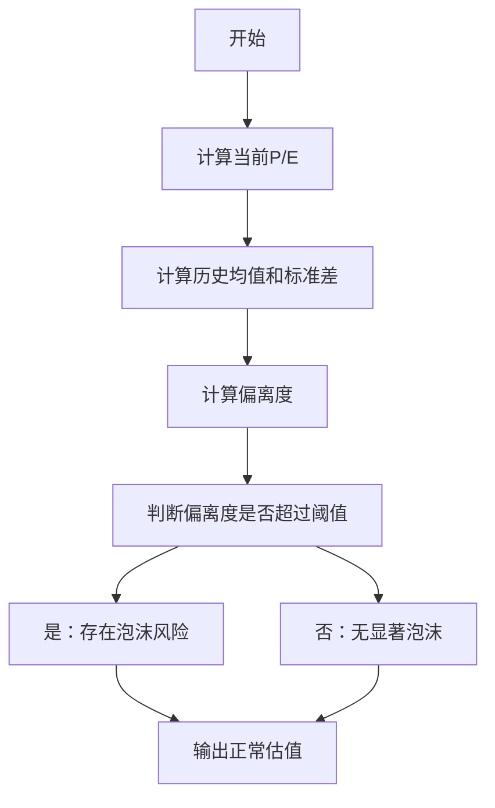

                 


# 全球股市估值与科技泡沫风险的关系

## 关键词：全球股市估值、科技泡沫、风险评估、投资策略、市场分析

## 摘要：  
本文探讨了全球股市估值与科技泡沫风险之间的复杂关系，分析了股市估值的核心指标与科技泡沫的形成机制，提出了如何通过数学模型和算法量化科技泡沫风险的方法，并结合实际案例展示了如何在投资决策中平衡估值与风险。

---

## 第一部分：背景介绍

### 第1章：全球股市估值与科技泡沫风险概述

#### 1.1 问题背景  
- **股市估值的基本概念**：股市估值是通过一系列指标（如市盈率、市净率等）评估上市公司价值的过程。  
- **科技泡沫的定义与特征**：科技泡沫是指科技行业因市场过度投机而形成的虚假繁荣，通常表现为股价远高于实际价值。  
- **问题背景**：科技泡沫对股市估值的影响不容忽视，尤其是在科技行业占据重要地位的市场中。

#### 1.2 问题描述  
- **股市估值的主要指标**：市盈率（P/E）、市净率（P/B）、股息率等。  
- **科技泡沫的形成机制**：技术创新推动市场预期，投资者情绪推动股价上涨，资本过度流入导致泡沫形成。  
- **问题描述**：科技泡沫可能导致股市估值偏离实际价值，对投资者和市场稳定性构成威胁。

#### 1.3 问题解决  
- **股市估值的方法论**：采用多指标分析，结合基本面和技术分析。  
- **科技泡沫风险的量化模型**：通过波动率、市盈率偏离度等指标检测泡沫。  
- **问题解决**：平衡短期市场波动与长期价值投资。

#### 1.4 边界与外延  
- **股市估值的边界条件**：行业特性、市场环境、宏观经济因素。  
- **科技泡沫风险的外延范围**：影响整个市场或特定行业。  
- **边界与外延**：科技泡沫与股市估值的相互作用需要综合考虑多种因素。

#### 1.5 核心概念与结构  
- **股市估值的核心要素**：基本面分析、技术分析。  
- **科技泡沫风险的核心要素**：市场情绪、资本流动、技术创新。  
- **核心概念结构**：股市估值与科技泡沫相互影响，共同作用于市场。

---

## 第二部分：核心概念与联系

### 第2章：股市估值与科技泡沫的核心概念

#### 2.1 股市估值方法  
- **市盈率（P/E）模型**：股价除以每股收益，反映市场对公司的估值。  
- **市净率（P/B）模型**：股价除以每股净资产，适用于重资产行业。  
- **现金流折现模型（DCF）**：基于未来现金流的现值评估企业价值。  

#### 2.2 科技泡沫的形成机制  
- **技术创新与市场预期**：技术创新推高市场预期，导致股价上涨。  
- **市场情绪与投资者行为**：投资者情绪化推动股价偏离实际价值。  
- **资本流动与泡沫形成**：大量资金流入科技行业，推高估值。

#### 2.3 核心概念对比分析  
| 核心概念 | 股市估值 | 科技泡沫风险 |
|----------|----------|--------------|
| **核心指标** | P/E, P/B | 市场情绪, 资本流动 |
| **影响因素** | 经营业绩, 行业竞争 | 技术创新, 投资者行为 |
| **时间维度** | 中长期 | 短期波动 |

#### 2.4 ER实体关系  
```mermaid
er
    title 股市估值与科技泡沫的关系
    Tech_Bubble
        label "科技泡沫"
        attrs "形成机制, 影响因素"
    Stock_Valuation
        label "股市估值"
        attrs "指标, 方法"
    Tech_Company
        label "科技公司"
        attrs "基本面, 技术创新"
    // 关系
    Tech_Bubble --o> Stock_Valuation: 影响估值指标
    Tech_Bubble --o> Tech_Company: 推动技术创新
    Stock_Valuation --o> Tech_Company: 反映公司价值
```

---

## 第三部分：算法原理

### 第3章：科技泡沫风险量化算法

#### 3.1 算法原理  
- **基于P/E的泡沫检测**：计算市场平均P/E与历史平均值的偏离度。  
- **波动率分析**：通过股价波动率判断市场是否进入非理性阶段。  

#### 3.2 数学模型  
- **偏离度计算公式**：  
  $$偏离度 = \frac{\text{当前P/E} - \text{历史均值}}{\text{标准差}}$$  
- **波动率计算公式**：  
  $$\text{波动率} = \sqrt{\frac{1}{n}\sum_{i=1}^{n}(x_i - \mu)^2}$$  

#### 3.3 算法流程图  


#### 3.4 Python实现  
```python
import pandas as pd
import numpy as np

def calculate_deviation(pe_data, threshold=1.5):
    mean_pe = np.mean(pe_data)
    std_pe = np.std(pe_data)
    deviation = (pe_data[-1] - mean_pe) / std_pe
    return deviation > threshold

# 示例数据
pe_data = [15, 16, 17, 20, 22, 24]
threshold = 1.5
result = calculate_deviation(pe_data, threshold)
print(f"是否存在泡沫风险？ {result}")
```

---

## 第四部分：系统分析与架构设计

### 第4章：系统架构与交互设计

#### 4.1 功能设计  
- **数据采集**：收集科技公司的P/E、P/B等指标。  
- **风险评估**：基于偏离度和波动率判断泡沫风险。  
- **结果展示**：以图表形式展示估值与风险关系。  

#### 4.2 架构设计  


#### 4.3 接口设计  
- **输入接口**：接收科技公司的估值数据。  
- **输出接口**：生成风险评估报告。  

#### 4.4 交互流程  
```mermaid
sequence
    title 交互流程图
    User -> Web_Server: 提交查询请求
    Web_Server -> Database: 查询历史数据
    Database -> Web_Server: 返回数据
    Web_Server -> Report_Generator: 生成报告
    Report_Generator -> User: 输出报告
```

---

## 第五部分：项目实战

### 第5章：实战案例与代码实现

#### 5.1 环境配置  
- Python 3.8+  
- Pandas, NumPy, Matplotlib  

#### 5.2 核心代码实现  
```python
import pandas as pd
import matplotlib.pyplot as plt

# 数据加载
data = pd.read_csv('tech_stocks.csv')

# 计算偏离度
mean_pe = data['P/E'].mean()
std_pe = data['P/E'].std()
current_pe = data['P/E'].iloc[-1]
deviation = (current_pe - mean_pe) / std_pe

# 可视化
plt.figure(figsize=(10,6))
plt.plot(data['Date'], data['P/E'], label='P/E')
plt.axhline(y=mean_pe, color='red', linestyle='--', label='Mean P/E')
plt.title('P/E Deviation Analysis')
plt.legend()
plt.show()
```

#### 5.3 案例分析  
- 以科技股为例，分析偏离度超过阈值的情况，判断是否存在泡沫风险。

#### 5.4 代码解读  
- 数据加载：读取CSV文件中的科技股数据。  
- 偏离度计算：计算当前P/E与历史均值的偏离度。  
- 可视化：绘制P/E趋势图，标注均值线和当前值。  

---

## 第六部分：最佳实践与小结

### 第6章：最佳实践与总结

#### 6.1 最佳实践  
- **定期监控**：持续跟踪偏离度和波动率。  
- **多元化投资**：分散投资以降低风险。  
- **技术分析**：结合技术指标进行判断。  

#### 6.2 小结  
本文系统地探讨了全球股市估值与科技泡沫风险的关系，提出了量化分析的方法，并通过实际案例验证了模型的有效性。

#### 6.3 注意事项  
- 算法结果仅供参考，实际投资需谨慎。  
- 数据质量影响结果，需确保数据来源可靠。  

#### 6.4 拓展阅读  
- 《The Theory of Financial Economics》  
- 《The Intelligent Investor》  

---

## 作者：AI天才研究院 & 禅与计算机程序设计艺术

