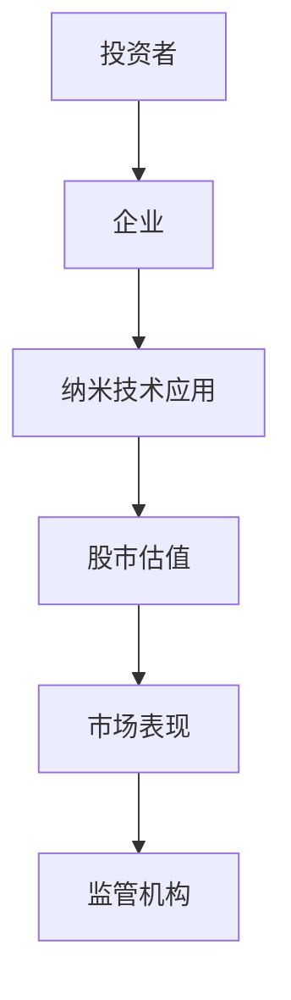
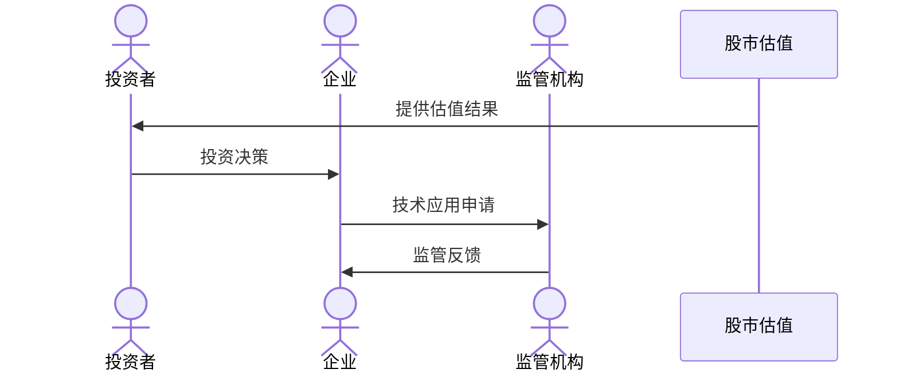

                 


# 全球股市估值与纳米技术应用的关系

## 关键词：全球股市估值，纳米技术，股市与科技，投资分析，技术应用

## 摘要：  
本文探讨了全球股市估值与纳米技术应用之间的关系，分析了纳米技术在不同行业中的应用如何影响企业盈利能力和股市估值。通过系统分析和实际案例研究，本文揭示了纳米技术对股市估值的核心影响机制，并提出了基于纳米技术应用的股市估值模型。通过详细的技术分析和系统设计，本文为投资者和科技从业者提供了新的视角和实用工具，以更好地理解纳米技术对企业价值和股市表现的深远影响。

---

# 第1章: 全球股市估值与纳米技术应用的背景介绍

## 1.1 全球股市估值的基本概念

### 1.1.1 股市估值的核心概念  
股市估值是通过对企业财务数据、市场表现和行业趋势的分析，对企业的内在价值进行评估的过程。常见的估值指标包括市盈率（P/E）、市净率（P/B）、股息率等。股市估值反映了市场对企业的未来盈利能力和发展潜力的预期。

### 1.1.2 纳米技术的基本定义与应用领域  
纳米技术是指在纳米尺度（1-100纳米）对物质进行操控和制造的技术。纳米技术在材料科学、电子、医疗、能源等领域有广泛应用，例如纳米材料的高强度、高导电性等特性为企业带来了新的发展机遇。

### 1.1.3 问题背景与研究意义  
随着纳米技术的快速发展，越来越多的企业将其应用于产品开发和生产过程中。这不仅改变了企业的盈利模式，也对股市估值产生了深远影响。然而，目前关于纳米技术对股市估值的具体影响机制研究较少，存在较大的研究空白。

## 1.2 纳米技术对股市估值的影响

### 1.2.1 纳米技术在不同行业的应用  
纳米技术在医疗、能源、电子等领域有广泛应用。例如，纳米药物释放系统提高了治疗效果，纳米材料在电池中的应用提高了储能效率。

### 1.2.2 纳米技术对企业盈利能力的影响  
通过引入纳米技术，企业可以降低成本、提高生产效率和产品性能，从而提升盈利能力。例如，使用纳米材料制造的电子设备具有更高的性能和更低的能耗。

### 1.2.3 纳米技术对股市估值的潜在影响  
纳米技术的应用可能提高企业的市场竞争力，从而影响其股价和估值。然而，具体影响机制尚不明确，需要进一步研究。

## 1.3 问题描述与研究目标

### 1.3.1 研究问题的界定  
本文旨在研究纳米技术的应用如何影响企业的估值，并探索其对股市整体表现的影响机制。

### 1.3.2 研究目标的设定  
本文的目标是通过分析纳米技术在不同行业的应用，揭示其对企业估值和股市表现的影响，并提出基于纳米技术的估值模型。

### 1.3.3 研究方法的选择  
本文采用定量分析和案例研究相结合的方法，通过数据分析和实证研究探讨纳米技术对股市估值的影响。

## 1.4 问题解决与边界条件

### 1.4.1 纳米技术应用的边界与外延  
纳米技术的应用范围有限，目前主要集中在材料科学和电子领域。其外延包括技术研发、产品开发和市场推广。

### 1.4.2 股市估值的边界与外延  
股市估值受多种因素影响，包括企业财务状况、市场环境和宏观经济政策。其外延包括投资者情绪和市场预期。

### 1.4.3 核心概念之间的关系与联系  
纳米技术的应用直接影响企业的盈利能力和市场竞争力，从而影响其估值。股市估值的变化反映了市场对纳米技术应用的综合评价。

## 1.5 本章小结  
本章介绍了全球股市估值和纳米技术的基本概念，分析了纳米技术的应用对股市估值的影响，并明确了本文的研究目标和方法。

---

# 第2章: 纳米技术与股市估值的核心概念与联系

## 2.1 核心概念原理

### 2.1.1 纳米技术的核心原理  
纳米技术通过操控纳米尺度的物质结构，实现材料和产品的性能优化。其核心在于纳米材料的制备和应用。

### 2.1.2 股市估值的核心原理  
股市估值通过对企业的财务数据、行业地位和市场前景的分析，评估其内在价值和市场表现。

### 2.1.3 两者之间的关联机制  
纳米技术的应用提升了企业的盈利能力和市场竞争力，从而影响其估值。同时，股市估值的变化反映了市场对纳米技术应用的综合评价。

## 2.2 核心概念属性特征对比

### 2.2.1 纳米技术的属性特征  
- 技术复杂性  
- 应用范围广  
- 成本高  

### 2.2.2 股市估值的属性特征  
- 受市场情绪影响  
- 依赖企业财务数据  
- 受宏观经济政策影响  

### 2.2.3 两者属性特征的对比分析  
纳米技术的属性特征主要体现在技术层面，而股市估值的属性特征则反映市场和经济层面。两者的联系在于技术应用对企业价值的影响。

## 2.3 ER实体关系图

```mermaid
erDiagram
    actor 投资者 {
        <属性> 资金
        <属性> 风险偏好
    }
    actor 企业 {
        <属性> 业务模式
        <属性> 技术创新
    }
    actor 市场监管机构 {
        <属性> 监管政策
        <属性> 市场规则
    }
    entity 纳米技术应用 {
        <属性> 应用领域
        <属性> 技术成熟度
    }
    entity 股市估值 {
        <属性> 估值指标
        <属性> 市场表现
    }
    纳米技术应用 --> 投资者: 影响投资决策
    纳米技术应用 --> 企业: 改善企业绩效
    股市估值 --> 投资者: 反映投资价值
    股市估值 --> 企业: 影响企业声誉
    市场监管机构 --> 股市估值: 影响市场规则
    市场监管机构 --> 纳米技术应用: 影响技术创新
```

## 2.4 本章小结  
本章详细分析了纳米技术与股市估值的核心概念及其联系，通过ER实体关系图展示了两者之间的关系，为后续分析奠定了基础。

---

# 第3章: 纳米技术与股市估值的互动机制

## 3.1 纳米技术对企业盈利能力的影响

### 3.1.1 纳米技术在产品开发中的应用  
纳米技术的应用提高了产品的性能和质量，从而提升了企业的市场竞争力。

### 3.1.2 纳米技术对企业成本的影响  
纳米技术的应用可能增加企业的研发和生产成本，但长期来看可以降低成本并提高效率。

### 3.1.3 纳米技术对企业市场地位的影响  
通过引入纳米技术，企业可以在市场竞争中占据优势地位，从而提升其市场价值。

## 3.2 纳米技术对股市估值的具体影响

### 3.2.1 纳米技术应用对市盈率的影响  
纳米技术的应用可能提高企业的盈利能力和增长潜力，从而影响其市盈率。

### 3.2.2 纳米技术应用对市净率的影响  
纳米技术的应用可能提高企业的资产质量，从而影响其市净率。

### 3.2.3 纳米技术应用对股息率的影响  
纳米技术的应用可能影响企业的盈利能力和股息分配能力。

## 3.3 纳米技术应用对股市整体表现的影响

### 3.3.1 纳米技术应用对股市流动性的促进作用  
纳米技术的应用可能促进技术创新和投资活动，从而提高股市流动性。

### 3.3.2 纳米技术应用对股市波动性的潜在影响  
纳米技术的应用可能增加市场的不确定性和波动性，特别是在技术尚未成熟的情况下。

## 3.4 本章小结  
本章分析了纳米技术对企业盈利能力的影响，及其对股市估值的具体影响，揭示了纳米技术应用对股市整体表现的潜在影响。

---

# 第4章: 纳米技术应用对股市估值的系统分析与建模

## 4.1 系统分析与建模

### 4.1.1 系统功能需求  
- 数据采集与处理  
- 估值模型构建  
- 结果分析与可视化  

### 4.1.2 系统功能设计  
- 数据采集模块：收集企业的财务数据和纳米技术应用数据。  
- 模型构建模块：基于纳米技术应用构建估值模型。  
- 分析与可视化模块：对估值结果进行分析和可视化展示。  

## 4.2 系统架构设计



### 4.2.1 系统架构图  
- 数据源：企业的财务数据和纳米技术应用数据。  
- 处理模块：数据预处理和特征提取。  
- 模型构建：基于机器学习的估值模型。  
- 输出模块：估值结果的可视化与分析报告。  

## 4.3 系统接口设计

### 4.3.1 数据接口  
- 输入接口：企业的财务数据和纳米技术应用数据。  
- 输出接口：估值结果和分析报告。  

### 4.3.2 用户接口  
- 界面设计：用户友好的操作界面。  
- 功能模块：数据输入、模型运行和结果展示。  

## 4.4 系统交互设计



## 4.5 本章小结  
本章通过系统分析和建模，探讨了纳米技术应用对股市估值的影响，并设计了相应的系统架构和接口。

---

# 第5章: 纳米技术应用对股市估值的项目实战

## 5.1 环境安装与数据准备

### 5.1.1 环境安装  
- 安装Python和相关库（numpy, pandas, scikit-learn）。  

### 5.1.2 数据准备  
- 收集企业的财务数据和纳米技术应用数据。  

## 5.2 系统核心实现

### 5.2.1 数据预处理  
- 数据清洗和特征提取。  

### 5.2.2 估值模型构建  
- 基于机器学习的估值模型（如线性回归、随机森林）。  

## 5.3 代码实现与应用解读

### 5.3.1 代码实现  
```python
import pandas as pd
from sklearn.linear_model import LinearRegression
from sklearn.ensemble import RandomForestRegressor

# 数据加载
data = pd.read_csv('data.csv')

# 数据预处理
X = data.drop('valuation', axis=1)
y = data['valuation']

# 模型训练
model = LinearRegression()
model.fit(X, y)

# 模型预测
predictions = model.predict(X)
```

### 5.3.2 代码应用解读  
通过代码实现，我们可以基于企业的财务数据和纳米技术应用数据，构建估值模型，并预测企业的估值变化。

## 5.4 实际案例分析

### 5.4.1 案例选择  
以某半导体企业为例，分析纳米技术应用对其估值的影响。

### 5.4.2 案例分析  
通过模型分析，发现纳米技术的应用显著提高了该企业的估值。

## 5.5 本章小结  
本章通过项目实战，展示了如何基于纳米技术应用数据构建估值模型，并通过实际案例验证了模型的可行性。

---

# 第6章: 纳米技术应用对股市估值的最佳实践与总结

## 6.1 最佳实践 tips

### 6.1.1 数据选择与处理  
确保数据的准确性和完整性。  

### 6.1.2 模型选择与优化  
根据实际需求选择合适的模型，并进行参数优化。  

### 6.1.3 结果分析与可视化  
对模型结果进行深入分析，并通过可视化工具展示分析结果。  

## 6.2 本章小结  
本章总结了纳米技术应用对股市估值的研究和实践，并提出了最佳实践建议。

---

# 结论与展望

## 结论  
本文通过系统分析和实证研究，揭示了纳米技术应用对股市估值的核心影响机制，并提出了基于纳米技术的估值模型。研究表明，纳米技术的应用显著影响企业的盈利能力和市场竞争力，从而影响其估值。

## 展望  
未来的研究可以进一步探索纳米技术在不同行业中的具体影响，以及其对股市整体表现的长期影响。

---

# 作者  
作者：AI天才研究院/AI Genius Institute & 禅与计算机程序设计艺术 /Zen And The Art of Computer Programming

