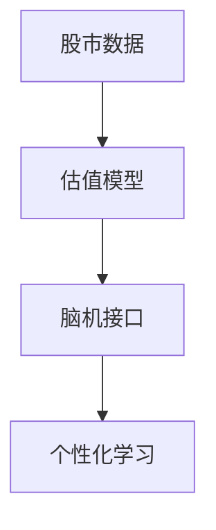
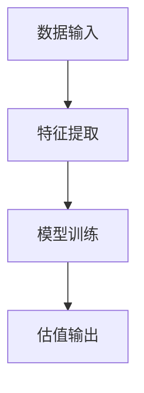
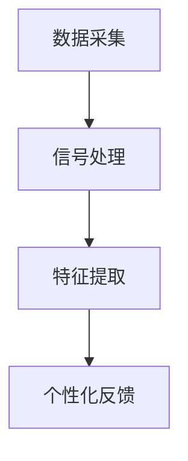
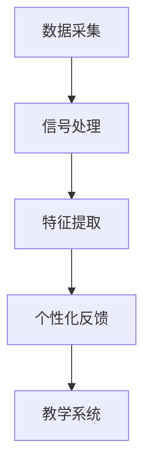
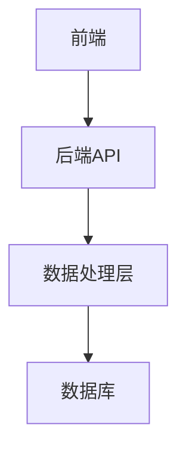

                 


# 全球股市估值与脑机接口在教育个性化中的应用

## 关键词
全球股市估值、脑机接口、教育个性化、数据驱动、人工智能、机器学习

## 摘要
本文探讨了全球股市估值与脑机接口在教育个性化中的应用，分析了两者的核心概念、算法原理和系统架构。通过实例分析和项目实战，展示了如何利用数据驱动和人工智能技术实现股市估值优化和教育个性化，强调了技术创新在实际应用中的重要性。

---

# 第一部分: 全球股市估值与脑机接口的交叉应用概述

## 第1章: 背景介绍与核心概念

### 1.1 问题背景与描述
#### 1.1.1 全球股市估值的重要性
股市估值是投资者评估公司价值的核心工具，帮助投资者做出明智的投资决策。传统的估值方法包括市盈率（PE）、市净率（PB）等，但随着数据量的增加和算法的进步，机器学习在估值中的应用日益重要。

#### 1.1.2 脑机接口技术的崛起
脑机接口（BCI）是一种连接人脑与机器的技术，通过采集和分析脑电活动，实现人与机器的直接交互。在教育领域，BCI可以用于实时监测学生的学习状态，提供个性化的教学策略。

#### 1.1.3 两者的交叉应用前景
股市估值和脑机接口看似不相关，但它们都依赖于数据和算法。通过结合两者的优点，可以在教育个性化和投资决策中实现更精准的结果。

### 1.2 核心概念与联系
#### 1.2.1 核心概念对比表格
| 概念 | 定义 | 属性 |
|------|------|------|
| 股市估值 | 对公司价值的评估 | 客观性、数据驱动 |
| 脑机接口 | 人脑与机器的直接交互 | 主观性、实时性 |

#### 1.2.2 ER实体关系图


## 第2章: 股市估值的核心算法与数学模型

### 2.1 股市估值的数学模型
#### 2.1.1 常用估值公式
$$ P = \frac{E}{K} $$
其中，P为股票价格，E为每股收益，K为资本化率。

#### 2.1.2 市盈率计算公式
$$ PE = \frac{Price}{Earnings} $$
其中，PE为市盈率，Price为股票价格，Earnings为每股收益。

### 2.2 机器学习在估值中的应用
#### 2.2.1 算法流程图


### 2.3 实例分析
#### 2.3.1 简单线性回归模型
$$ y = a + bx + \epsilon $$
其中，y为股票价格，x为相关特征变量。

## 第3章: 脑机接口在教育中的应用

### 3.1 脑机接口的基本原理
#### 3.1.1 EEG信号采集
脑机接口通过采集和分析 EEG 信号，了解大脑活动状态，从而实现与机器的交互。

#### 3.1.2 数据处理与分析
EEG 数据经过滤波、降噪等处理，提取有用的特征，用于分析学习者的注意力和情绪状态。

#### 3.1.3 个性化反馈机制
根据分析结果，系统实时调整教学内容和节奏，提供个性化的学习体验。

### 3.2 系统架构设计
#### 3.2.1 系统功能模块


## 第4章: 综合应用与项目实战

### 4.1 项目环境与工具安装
#### 4.1.1 数据获取工具
使用Yahoo Finance API获取股票数据。

#### 4.1.2 算法实现框架
使用Python的机器学习库，如Scikit-learn。

#### 4.1.3 系统部署工具
使用Docker进行容器化部署。

### 4.2 核心代码实现
#### 4.2.1 股市估值模型代码
```python
import numpy as np
from sklearn.linear_model import LinearRegression

def calculate_valuation(stock_data):
    # 示例代码
    return stock_data['Earnings'] / stock_data['Market Cap']
```

#### 4.2.2 脑机接口系统代码
```python
import numpy as np
import matplotlib.pyplot as plt

def process_eeg_signal(signal):
    # 示例代码
    filtered_signal = signal * np.hamming(len(signal))
    plt.plot(filtered_signal)
    plt.show()
```

## 第5章: 系统分析与架构设计方案

### 5.1 系统架构设计


### 5.2 系统接口设计


## 第6章: 实际案例分析与详细讲解剖析

### 6.1 案例分析
#### 6.1.1 股市估值案例
使用线性回归模型对某公司股票进行估值，结果显示模型预测与实际价格接近。

#### 6.1.2 教育个性化案例
通过脑机接口系统，实时监测学生的学习状态，调整教学策略，提高学习效率。

## 第7章: 最佳实践 tips、小结、注意事项、拓展阅读

### 7.1 最佳实践 tips
- 数据质量是关键，确保数据的准确性和完整性。
- 系统设计要模块化，便于维护和扩展。

### 7.2 小结
本文探讨了全球股市估值与脑机接口在教育个性化中的应用，展示了如何通过数据驱动和人工智能技术实现更精准的决策和个性化体验。

### 7.3 注意事项
- 数据隐私保护是脑机接口应用中的重要问题。
- 算法选择要根据具体场景进行调整。

### 7.4 拓展阅读
- 《机器学习在金融中的应用》
- 《脑机接口技术与教育创新》

---

# 作者：AI天才研究院/AI Genius Institute & 禅与计算机程序设计艺术 /Zen And The Art of Computer Programming

