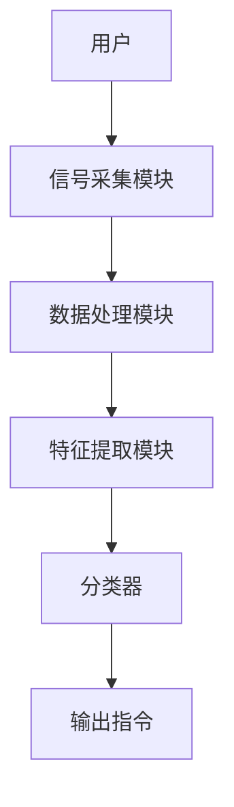

                 


# 全球股市估值与脑机接口在辅助沟通中的应用

> 关键词：脑机接口，股市估值，情绪分析，辅助沟通，人工智能，神经科学

> 摘要：本文探讨了脑机接口技术在全球股市估值中的潜在应用，重点分析了脑机接口在辅助沟通中的技术原理及其在金融市场的实际应用案例。通过结合神经科学与金融市场分析，本文提出了基于脑机接口的股市情绪分析方法，并展望了这一技术在未来金融分析中的巨大潜力。

---

# 第1章: 背景与概述

## 1.1 问题背景

### 1.1.1 全球股市估值的重要性
全球股市估值是金融市场的核心组成部分，它反映了市场的整体健康状况和投资者信心。传统的股市估值方法依赖于历史数据、财务指标和市场情绪分析。然而，随着市场的复杂化和数据量的指数级增长，传统方法的局限性日益显现，亟需引入新技术来提升估值的准确性和实时性。

### 1.1.2 脑机接口技术的现状与发展
脑机接口（Brain-Computer Interface, BCI）是一种能够直接将人类大脑活动转化为计算机可识别信号的技术。近年来，随着神经科学和人工智能技术的进步，脑机接口在医疗、教育、娱乐和金融等领域的应用取得了显著进展。尤其是在辅助沟通和情绪识别方面，脑机接口展现出了巨大的潜力。

### 1.1.3 两者的结合意义
将脑机接口技术引入股市估值，可以通过实时捕捉投资者的情绪和认知变化，提供更加精准的市场预测和投资决策支持。这种结合不仅能够提升股市估值的准确性，还能为投资者提供全新的辅助决策工具。

## 1.2 核心概念与联系

### 1.2.1 核心概念原理
- **脑机接口**：通过采集和分析大脑神经信号，将人类意图转化为计算机指令。
- **股市估值**：通过对市场数据的分析，评估股票的内在价值和市场表现。

### 1.2.2 概念属性特征对比表格
| 属性 | 脑机接口 | 股市估值 |
|------|----------|----------|
| 输入 | 神经信号 | 市场数据 |
| 输出 | 指令或反馈 | 估值结果 |
| 应用 | 辅助沟通、控制设备 | 投资决策、市场预测 |

### 1.2.3 ER实体关系图架构
```mermaid
er
  entity 投资者 {
    [ID]
    [姓名]
    [投资偏好]
  }
  entity 股票 {
    [股票代码]
    [公司名称]
    [财务数据]
  }
  entity 情绪数据 {
    [投资者ID]
    [时间戳]
    [情绪强度]
  }
  entity 股市估值结果 {
    [股票代码]
    [估值时间]
    [估值分数]
  }
  relationship 投资者 --> 情绪数据: 提供情绪数据
  relationship 情绪数据 --> 股市估值结果: 影响估值结果
  relationship 股票 --> 股市估值结果: 估值目标
```

## 1.3 本章小结
本章通过分析全球股市估值和脑机接口技术的核心概念及其联系，为后续的技术探讨奠定了基础。脑机接口在辅助沟通和情绪识别方面的优势，使其成为提升股市估值准确性的潜在工具。

---

# 第2章: 脑机接口技术基础

## 2.1 神经科学基础

### 2.1.1 神经信号的产生与传输
神经信号的产生涉及神经元的动作电位和化学突触传递。动作电位通过轴突传递到下一个神经元，形成神经网络的信号传递链。

### 2.1.2 大脑活动的电生理特征
大脑活动可以通过EEG（脑电图）测量，其主要特征包括：
- **频率**：α波、β波、θ波、γ波。
- **振幅**：反映神经活动的强度。

### 2.1.3 神经网络的基本结构
神经网络由神经元和突触组成，其基本结构包括输入层、隐藏层和输出层。神经网络通过权重调整和激活函数实现信息处理。

## 2.2 脑机接口信号采集方法

### 2.2.1 电极类型与布局
- **EEG电极**：常用的是头皮电极，分为单电极和参考电极。
- **布局**：常用国际10-20系统，确保信号采集的全面性。

### 2.2.2 信号采集设备原理
EEG信号采集设备通过放大器和模数转换器（ADC）将微弱的神经信号转化为数字信号。

### 2.2.3 数据预处理流程
- **去噪**：去除肌电干扰和环境噪声。
- **滤波**：使用带通滤波器提取特定频段的信号。
- **降采样**：减少数据量，降低计算复杂度。

## 2.3 数据处理与特征提取

### 2.3.1 常见的数据处理方法
- **时域分析**：计算均值、标准差等统计指标。
- **频域分析**：计算功率谱密度（PSD）和小波变换。

### 2.3.2 特征提取算法
- **经验模态分解（EMD）**：适用于非线性信号的分解。
- **主成分分析（PCA）**：用于降维和特征提取。

### 2.3.3 信号分类与识别
- **支持向量机（SVM）**：常用于分类任务。
- **随机森林**：适用于特征重要性分析。

## 2.4 脑机接口系统设计

### 2.4.1 系统架构


### 2.4.2 接口设计
- **输入接口**：EEG信号采集模块。
- **输出接口**：显示设备或控制设备。

### 2.4.3 系统优化
- **算法优化**：提升分类准确率。
- **实时性优化**：减少处理延迟。

## 2.5 本章小结
本章详细介绍了脑机接口技术的基本原理和系统设计。通过合理的信号处理和特征提取方法，可以有效提升脑机接口的性能，为后续应用打下基础。

---

# 第3章: 全球股市估值方法

## 3.1 传统估值方法

### 3.1.1 市盈率法
市盈率（P/E）= 股价 / 每股收益（EPS）。通过比较市盈率与行业平均水平，评估股票的估值水平。

### 3.1.2 市净率法
市净率（P/B）= 股价 / 每股净资产。适用于评估银行等资产密集型行业的股票。

### 3.1.3 股息率法
股息率 = 每股股息 / 股价。用于评估股票的分红能力。

## 3.2 现代估值方法

### 3.2.1 大数据分析法
通过分析海量市场数据，识别市场趋势和潜在机会。

### 3.2.2 机器学习法
使用回归分析、聚类分析等机器学习算法，预测股票价格和市场波动。

### 3.2.3 深度学习法
利用深度神经网络（DNN）模型，捕捉数据中的复杂特征。

## 3.3 股市估值模型构建

### 3.3.1 数据来源与处理
- **数据来源**：股票价格、财务数据、市场情绪。
- **数据处理**：缺失值处理、标准化、特征工程。

### 3.3.2 模型选择与训练
- **模型选择**：线性回归、随机森林、神经网络。
- **训练过程**：数据分割、交叉验证、超参数调优。

### 3.3.3 模型评估与优化
- **评估指标**：均方误差（MSE）、R²、准确率。
- **优化方法**：网格搜索、贝叶斯优化。

## 3.4 本章小结
本章介绍了传统和现代的股市估值方法，重点探讨了机器学习和深度学习在股市分析中的应用。通过合理选择和优化模型，可以显著提升股市估值的准确性和实时性。

---

# 第4章: 脑机接口在辅助沟通中的应用

## 4.1 沟通障碍与脑机接口解决方案

### 4.1.1 残障人士的沟通需求
- **失语症**：无法正常表达语言。
- **截瘫**：无法进行肢体沟通。

### 4.1.2 脑机接口的辅助功能
- **文本生成**：通过EEG信号控制光标选择字符。
- **语音合成**：通过意图识别生成语音。

### 4.1.3 应用场景与案例
- **医疗领域**：帮助残障人士实现基本沟通。
- **教育领域**：辅助特殊教育学生与教师互动。

## 4.2 脑机接口与投资者决策

### 4.2.1 投资者情绪分析
- **实时情绪监测**：通过EEG信号捕捉投资者的情绪变化。
- **情绪与决策关系**：分析情绪波动对投资决策的影响。

### 4.2.2 实时决策支持
- **市场情绪预测**：基于群体情绪数据预测市场走势。
- **个性化投资建议**：根据投资者情绪提供定制化建议。

### 4.2.3 应用优势与挑战
- **优势**：实时性、精准性。
- **挑战**：信号干扰、用户适应性。

## 4.3 本章小结
本章通过分析脑机接口在辅助沟通中的应用，展示了其在医疗和金融领域的巨大潜力。通过实时捕捉和分析情绪数据，可以显著提升投资者的决策效率。

---

# 第5章: 全球股市估值与脑机接口的结合应用

## 5.1 脑机接口辅助股市估值

### 5.1.1 情绪分析与市场预测
- **情绪数据采集**：通过EEG信号获取投资者情绪。
- **情绪与价格关系**：分析情绪波动对股价的影响。

### 5.1.2 市场情绪指数构建
- **指数定义**：综合分析市场整体情绪。
- **指数应用**：用于市场趋势预测。

### 5.1.3 案例分析
- **案例背景**：某股票的市场情绪变化。
- **分析过程**：EEG信号采集与情绪指数计算。
- **结果展示**：情绪指数与股价走势的对比。

## 5.2 脑机接口与实时数据优化

### 5.2.1 实时数据采集与处理
- **数据流处理**：实时采集和处理EEG信号。
- **特征提取**：提取与市场波动相关的特征。

### 5.2.2 投资策略优化
- **动态调整**：根据实时情绪数据优化投资组合。
- **风险控制**：通过情绪分析识别市场风险。

## 5.3 本章小结
本章通过分析脑机接口与股市估值的结合应用，展示了其在市场情绪分析和投资策略优化中的潜力。通过实时捕捉和分析情绪数据，可以显著提升股市估值的准确性和实时性。

---

# 第6章: 项目实战

## 6.1 环境搭建与数据采集

### 6.1.1 开发环境搭建
- **软件工具**：Python、NumPy、Matplotlib、Scikit-learn、TensorFlow。
- **硬件设备**：EEG信号采集设备。

### 6.1.2 数据采集流程
- **数据采集**：通过EEG设备采集投资者情绪数据。
- **数据存储**：将数据存储为CSV格式。

## 6.2 系统核心实现

### 6.2.1 特征提取与模型训练
```python
import numpy as np
from sklearn.decomposition import PCA

# 示例特征提取代码
features = np.array([...])  # 采集到的EEG特征
pca = PCA(n_components=2)
principal_components = pca.fit_transform(features)
```

### 6.2.2 情绪分类与估值预测
```python
from sklearn.svm import SVC

# 示例分类代码
model = SVC(kernel='rb

