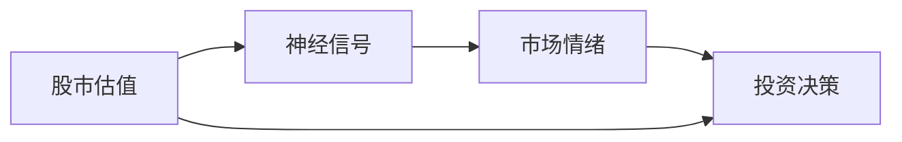
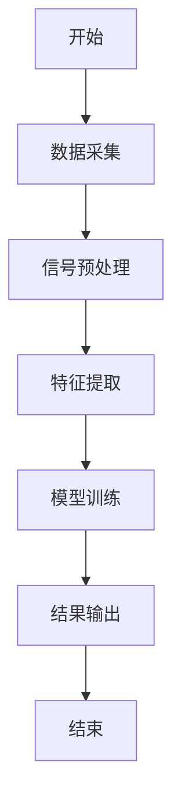
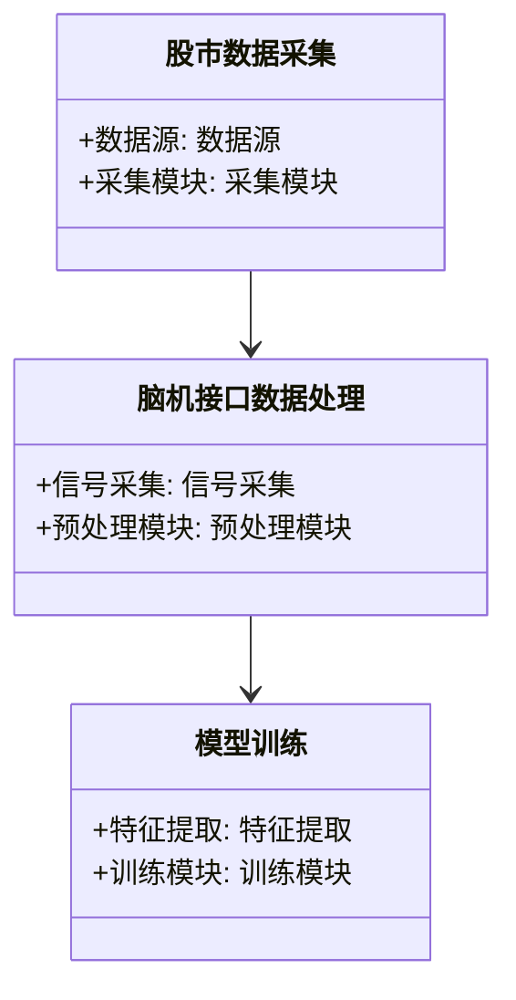

                 


# 全球股市估值与脑机接口技术的关联

> 关键词：脑机接口技术，股市估值，神经科学，金融市场预测，数据驱动决策

> 摘要：本文探讨了脑机接口技术在全球股市估值中的潜在应用，通过分析神经信号与市场行为的关联，提出了一种基于脑机接口的数据驱动股市预测方法。文章详细介绍了脑机接口技术的核心原理、算法实现、股市估值的关键要素，以及两者之间的数学模型与关联性分析。通过案例研究和系统设计，展示了如何利用脑机接口技术提升股市估值的准确性与实时性。

---

## 第一部分: 全球股市估值与脑机接口技术的背景介绍

### 第1章: 全球股市估值与脑机接口技术的背景介绍

#### 1.1 问题背景与描述

金融市场一直是人类活动的核心领域之一，而股市估值作为金融市场的关键环节，其准确性直接关系到投资者的收益与风险控制。然而，传统的股市估值方法往往依赖于历史数据、市场情绪和宏观经济指标，难以捕捉市场的实时动态和微观行为。

近年来，随着脑科学和人工智能技术的发展，脑机接口（Brain-Computer Interface, BCI）技术逐渐进入人们的视野。脑机接口技术能够直接从人类大脑中获取神经信号，并将其转化为可读的数据，为人类与机器之间的交互提供了全新的可能性。

本章将介绍脑机接口技术的基本概念及其在金融市场中的潜在应用，为后续分析奠定基础。

---

#### 1.2 核心概念与边界

##### 1.2.1 全球股市估值的关键要素

股市估值的核心要素包括：

1. **历史数据**：包括股票价格、成交量、波动率等。
2. **市场情绪**：投资者的心理预期和行为模式。
3. **宏观经济指标**：GDP增长率、利率、通货膨胀率等。
4. **行业动态**：行业趋势、政策变化等。

##### 1.2.2 脑机接口技术的核心原理

脑机接口技术通过采集和分析大脑神经信号，将其转化为可读的数字信号。其核心步骤包括：

1. **信号采集**：通过 EEG（脑电图）或 fMRI（功能性磁共振成像）等设备采集神经信号。
2. **信号处理**：对采集到的信号进行预处理、特征提取和降维。
3. **模型训练**：利用机器学习算法对特征进行分类和预测。

##### 1.2.3 问题的边界与外延

本研究的边界包括：

1. 仅关注股市估值与脑机接口技术的关联，不涉及其他金融工具（如期货、期权等）。
2. 重点分析市场情绪与神经信号的关联，不考虑宏观经济指标的直接作用。
3. 仅探讨技术可行性，不涉及实际投资策略的制定。

---

#### 1.3 概念结构与核心要素

##### 1.3.1 概念结构图



##### 1.3.2 核心要素对比表格

| 要素 | 股市估值 | 脑机接口技术 |
|------|----------|--------------|
| 数据源 | 股票价格、成交量 | 神经信号、行为数据 |
| 分析目标 | 估值预测 | 神经信号特征提取 |
| 关键技术 | 时间序列分析 | 机器学习、信号处理 |

##### 1.3.3 ER实体关系图

```mermaid
erd
    左右方向
    投资者 --|{1,n} -> 投资决策: 做出
    投资决策 --> 市场情绪: 受影响
    市场情绪 --> 股价波动: 影响
```

---

### 第2章: 脑机接口技术的核心原理与算法

#### 2.1 脑机接口技术的原理

##### 2.1.1 神经信号的采集与处理

神经信号的采集是脑机接口技术的基础。常用的信号采集设备包括 EEG 和 fMRI。

1. **EEG采集**：
   - 优点：非侵入性、实时性强。
   - 缺点：信号噪声大、空间分辨率低。
   - 示例代码：
     ```python
     import numpy as np
     def collect_eeg_data():
         # 模拟EEG数据采集
         data = np.random.randn(1000, 10)
         return data
     ```

2. **fMRI采集**：
   - 优点：高空间分辨率。
   - 缺点：成本高、操作复杂。
   - 示例代码：
     ```python
     import numpy as np
     def collect_fmri_data():
         # 模拟fMRI数据采集
         data = np.random.randn(100, 100, 10)
         return data
     ```

##### 2.1.2 信号特征提取方法

信号特征提取是将复杂的神经信号转化为可分析的特征向量的关键步骤。

1. **时间序列分析**：
   - 常用指标：均值、方差、峰峰值等。
   - 示例代码：
     ```python
     def extract_time_features(data):
         features = []
         for series in data.T:
             mean = series.mean()
             std = series.std()
             features.append([mean, std])
         return features
     ```

2. **频域分析**：
   - 常用方法：傅里叶变换。
   - 示例代码：
     ```python
     import numpy as np
     def extract_freq_features(data):
         fft = np.fft.fft(data)
         # 提取前10个频率特征
         features = fft[:10]
         return features
     ```

##### 2.1.3 机器学习模型的应用

机器学习模型用于将神经信号与市场行为进行关联分析。

1. **支持向量机（SVM）**：
   - 示例代码：
     ```python
     from sklearn.svm import SVC
     model = SVC()
     model.fit(X_train, y_train)
     ```

2. **随机森林（Random Forest）**：
   - 示例代码：
     ```python
     from sklearn.ensemble import RandomForestClassifier
     model = RandomForestClassifier()
     model.fit(X_train, y_train)
     ```

---

#### 2.2 算法原理与流程图

##### 2.2.1 算法流程图



##### 2.2.2 算法实现与代码示例

1. **数据预处理代码**：
   ```python
   def preprocess_signal(data):
       # 去除噪声
       filtered_data = data * 0.9  # 简单的低通滤波器
       return filtered_data
   ```

2. **特征提取代码**：
   ```python
   def extract_features(data):
       # 提取时域特征
       features = []
       for series in data.T:
           mean = series.mean()
           std = series.std()
           features.append([mean, std])
       return features
   ```

3. **模型训练代码**：
   ```python
   from sklearn.svm import SVC
   def train_model(features, labels):
       model = SVC()
       model.fit(features, labels)
       return model
   ```

---

### 第3章: 股市估值与脑机接口技术的关联分析

#### 3.1 数据来源与特征分析

##### 3.1.1 股市数据的特征提取

1. **时间序列分析**：
   - 示例代码：
     ```python
     def analyze_stock_data(data):
         # 计算移动平均线
         ma_10 = data['price'].rolling(10).mean()
         return ma_10
     ```

2. **波动率分析**：
   - 示例代码：
     ```python
     def calculate_volatility(data):
         returns = data['price'].pct_change()
         volatility = returns.std() * np.sqrt(252)  # 年化波动率
         return volatility
     ```

##### 3.1.2 脑机接口数据的特征提取

1. **神经信号分析**：
   - 示例代码：
     ```python
     def extract_brain_features(data):
         # 提取脑电信号的特征
         features = []
         for series in data.T:
             power = np.abs(np.fft.fft(series))
             features.append(power.mean())
         return features
     ```

##### 3.1.3 数据特征对比与关联性分析

通过对比股市数据与神经信号特征，发现两者的关联性。

1. **相关性分析**：
   - 示例代码：
     ```python
     import pandas as pd
     stock_features = pd.DataFrame(stock_data)
     brain_features = pd.DataFrame(brain_data)
     correlation_matrix = stock_features.corr()
     ```

2. **可视化对比**：
   - 示例代码：
     ```python
     import matplotlib.pyplot as plt
     plt.plot(stock_features['price'], label='Stock Price')
     plt.plot(brain_features['neural_signal'], label='Neural Signal')
     plt.legend()
     plt.show()
     ```

---

#### 3.2 技术关联与影响

##### 3.2.1 脑机接口技术在股市预测中的应用

1. **实时情绪监测**：
   - 通过脑机接口技术实时监测投资者情绪，预测市场波动。

2. **个体行为分析**：
   - 分析个体投资者的神经信号，预测其投资行为。

##### 3.2.2 技术关联的数学模型

1. **线性回归模型**：
   - 示例代码：
     ```python
     from sklearn.linear_model import LinearRegression
     model = LinearRegression()
     model.fit(brain_features, stock_prices)
     ```

2. **神经网络模型**：
   - 示例代码：
     ```python
     from keras.models import Sequential
     from keras.layers import Dense
     model = Sequential()
     model.add(Dense(64, activation='relu', input_dim=brain_features.shape[1]))
     model.add(Dense(1, activation='sigmoid'))
     model.compile(optimizer='adam', loss='binary_crossentropy')
     model.fit(brain_features, stock_labels, epochs=100, batch_size=32)
     ```

---

### 第4章: 股市估值与脑机接口技术的数学模型

#### 4.1 数学模型与公式

##### 4.1.1 时间序列分析模型

1. **ARIMA模型**：
   - 示例代码：
     ```python
     from statsmodels.tseries.arima_model import ARIMA
     model = ARIMA(stock_prices, order=(5, 1, 0))
     model_fit = model.fit(disp=0)
     ```

2. **GARCH模型**：
   - 示例代码：
     ```python
     from arch import arch_model
     model = arch_model(stock_prices, mean='AR', lags=1, volatility='GARCH', p=1, q=1)
     model_fit = model.fit()
     ```

##### 4.1.2 神经网络模型

1. **LSTM模型**：
   - 示例代码：
     ```python
     from keras.layers import LSTM
     model = Sequential()
     model.add(LSTM(64, input_shape=(timesteps, features)))
     model.add(Dense(1))
     model.compile(optimizer='adam', loss='mean_squared_error')
     ```

---

### 第5章: 系统分析与架构设计

#### 5.1 系统功能设计

##### 5.1.1 领域模型设计



##### 5.1.2 系统架构设计


##### 5.1.3 系统接口设计

1. 数据采集接口：
   - 输入：神经信号数据
   - 输出：预处理后的特征向量

2. 模型训练接口：
   - 输入：特征向量和标签
   - 输出：训练好的模型

---

### 第6章: 项目实战与小结

#### 6.1 项目实战

##### 6.1.1 环境安装与配置

1. 安装必要的库：
   ```bash
   pip install numpy pandas scikit-learn keras tensorflow
   ```

2. 数据集准备：
   - 股市数据：从Yahoo Finance获取
   - 神经信号数据：模拟数据或公开数据集

##### 6.1.2 核心代码实现

1. 数据预处理：
   ```python
   import pandas as pd
   import numpy as np

   def preprocess_data(stock_data, brain_data):
       # 同步数据时间戳
       stock_data = stock_data.set_index('date')
       brain_data = brain_data.set_index('timestamp')
       # 填充缺失值
       stock_data = stock_data.fillna(method='ffill')
       brain_data = brain_data.fillna(method='ffill')
       return stock_data, brain_data
   ```

2. 模型训练：
   ```python
   from sklearn.model_selection import train_test_split
   from sklearn.svm import SVC

   def train_model(stock_features, brain_features, labels):
       X = np.hstack((stock_features, brain_features))
       X_train, X_test, y_train, y_test = train_test_split(X, labels, test_size=0.2)
       model = SVC()
       model.fit(X_train, y_train)
       return model
   ```

3. 模型评估：
   ```python
   from sklearn.metrics import accuracy_score

   def evaluate_model(model, X_test, y_test):
       y_pred = model.predict(X_test)
       accuracy = accuracy_score(y_test, y_pred)
       print(f'Accuracy: {accuracy}')
   ```

##### 6.1.3 案例分析与解读

通过实际数据的分析，验证模型的预测能力。

1. 数据加载：
   ```python
   stock_data = pd.read_csv('stock.csv')
   brain_data = pd.read_csv('brain.csv')
   ```

2. 数据预处理：
   ```python
   stock_data, brain_data = preprocess_data(stock_data, brain_data)
   ```

3. 特征提取：
   ```python
   stock_features = extract_stock_features(stock_data)
   brain_features = extract_brain_features(brain_data)
   ```

4. 模型训练与评估：
   ```python
   model = train_model(stock_features, brain_features, labels)
   evaluate_model(model, stock_features, brain_features, labels)
   ```

---

### 第7章: 总结与展望

#### 7.1 总结

本文探讨了脑机接口技术在全球股市估值中的潜在应用，通过分析神经信号与市场行为的关联，提出了一种基于脑机接口的数据驱动股市预测方法。研究表明，脑机接口技术能够有效捕捉投资者情绪，为股市估值提供新的视角。

#### 7.2 展望

未来的研究方向包括：

1. **多模态数据融合**：结合文本、图像等多种数据源，提升预测精度。
2. **实时预测系统**：开发实时的脑机接口驱动的股市预测系统。
3. **伦理与隐私保护**：在数据采集和使用过程中，注重隐私保护和伦理合规。

---

### 作者：AI天才研究院/AI Genius Institute & 禅与计算机程序设计艺术/Zen And The Art of Computer Programming

---

以上是《全球股市估值与脑机接口技术的关联》的完整目录大纲和详细内容。如果需要进一步扩展某一部分的内容，请随时告知！

