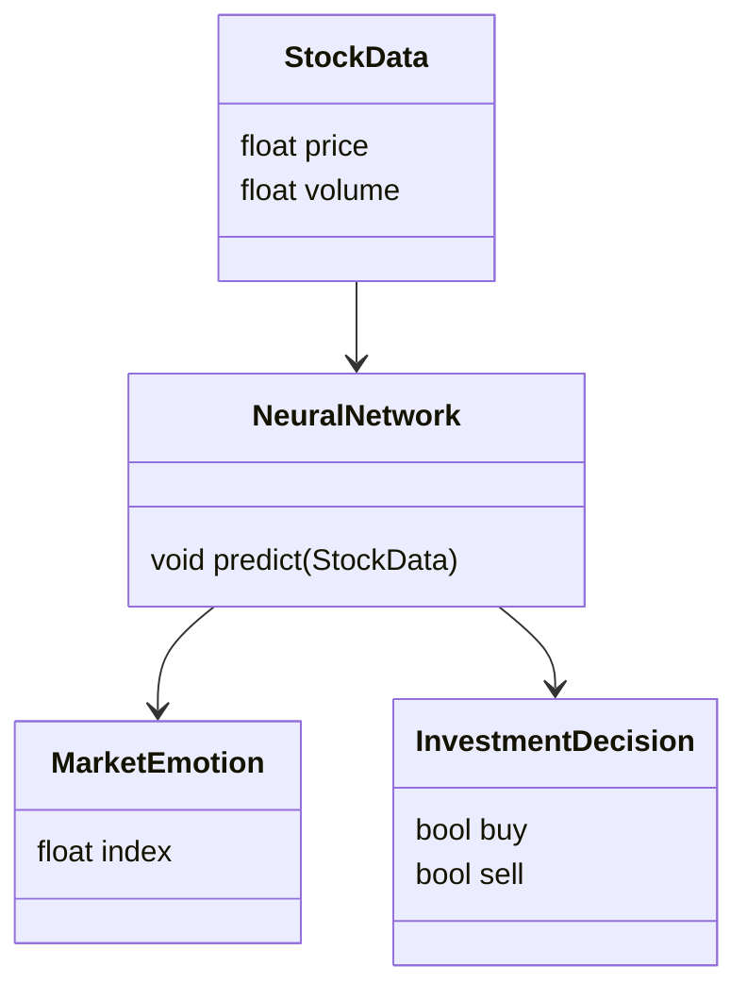
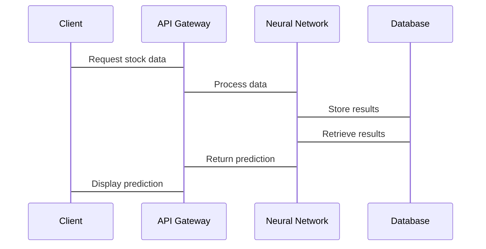

                 


# 全球股市估值与脑科学研究的关联

**关键词**：全球股市估值、脑科学研究、神经科学、行为金融学、投资决策

**摘要**：  
本文探讨全球股市估值与脑科学研究之间的深层关联，分析脑科学如何影响投资者行为和市场决策，进而影响股市估值。通过结合神经科学、认知科学和行为金融学，本文提出了一种基于脑科学的股市估值新方法，并通过实际案例验证其有效性。本文旨在为投资者、金融分析师和脑科学家提供新的研究视角和实践工具。

---

# 第1章 引言与背景

## 1.1 问题背景与研究意义  
### 1.1.1 全球股市估值的传统方法与局限性  
传统股市估值方法（如市盈率、市净率等）主要基于企业的基本面和宏观经济指标，但忽略了市场情绪和投资者行为的复杂性。例如，2008年金融危机中，许多投资者的非理性决策导致了市场估值的剧烈波动，传统模型难以准确预测这些波动。  

### 1.1.2 脑科学研究在行为决策中的作用  
脑科学研究揭示了人类决策的神经机制，例如，前额叶皮层在风险决策中的作用，以及多巴胺在奖励驱动行为中的作用。这些发现为理解投资者的非理性行为提供了科学依据。  

### 1.1.3 两者的关联研究价值与意义  
通过结合脑科学与股市估值，我们可以更好地理解投资者行为，预测市场波动，并开发更有效的投资策略。这种跨学科研究不仅有助于提升金融理论的深度，还能为投资者提供新的决策工具。  

## 1.2 核心概念与研究目标  
### 1.2.1 全球股市估值的核心要素  
- 公司基本面（收入、利润、资产等）  
- 宏观经济指标（GDP、利率、通货膨胀等）  
- 市场情绪与投资者行为  

### 1.2.2 脑科学研究的基本概念  
- 神经元与神经网络  
- 大脑皮层分工（前额叶、顶叶、颞叶等）  
- 神经递质与情绪调节  

### 1.2.3 研究目标与问题解决路径  
- 探讨脑科学如何解释投资者行为  
- 开发基于脑科学的股市估值模型  
- 验证模型在实际市场中的有效性  

## 1.3 本章小结  
本章总结了全球股市估值与脑科学研究的核心概念，并提出了跨学科研究的必要性。通过理解投资者的神经机制，我们可以更好地预测市场行为，优化估值模型。

---

# 第2章 脑科学与人类决策机制

## 2.1 神经科学基础  
### 2.1.1 神经元与神经网络的结构与功能  
神经元通过电化学信号传递信息，神经网络则通过复杂的连接方式处理信息。例如，前额叶皮层负责风险评估和决策，而顶叶负责处理具体信息。  

### 2.1.2 大脑皮层的分工与决策过程  
- 前额叶皮层：复杂决策、风险评估  
- 顶叶：空间感知与逻辑推理  
- 颞叶：记忆与语言处理  

### 2.1.3 神经递质与情绪调节  
- 多巴胺：奖励与愉悦  
- 5-羟色胺：情绪稳定与社交行为  
- 去甲肾上腺素：应激反应  

## 2.2 认知科学与决策行为  
### 2.2.1 认知过程与决策模式  
- 注意力分配：投资者更关注哪些信息？  
- 记忆与经验：过去的投资经验如何影响当前决策？  

### 2.2.2 注意力与决策权重分配  
- 选择性注意：投资者倾向于关注对自己有利的信息  
- 注意力分散：市场波动如何分散投资者注意力？  

### 2.2.3 记忆与决策的长期影响  
- 短期记忆：快速决策的依据  
- 长期记忆：影响长期投资策略  

## 2.3 脑科学与行为金融学的关联  
### 2.3.1 行为金融学的基本理论  
- 行为偏差：确认偏差、过度自信、损失厌恶  
- 市场情绪：恐惧与贪婪  

### 2.3.2 脑科学对行为金融学的补充作用  
- 神经科学揭示了行为偏差的神经机制  
- 神经成像技术可以实时监测市场情绪  

### 2.3.3 两者的交叉研究领域  
- 神经经济学：研究决策的神经基础  
- 计算神经科学：通过数学模型模拟神经活动  

## 2.4 本章小结  
本章详细介绍了脑科学的核心理论，并探讨了其在行为金融学中的应用。通过理解神经机制，我们可以更好地解释投资者的行为偏差和市场情绪。

---

# 第3章 全球股市估值的传统方法

## 3.1 股市估值的基本原理  
### 3.1.1 股票的内在价值与市场价格  
- 内在价值：企业未来现金流的现值  
- 市场价格：供需关系决定  

### 3.1.2 市盈率、市净率等估值指标  
- 市盈率（P/E）= 股价 / 每股收益  
- 市净率（P/B）= 股价 / 每股净资产  

### 3.1.3 股市指数与整体估值水平  
- 标普500指数：代表美国股市整体表现  
- 沪深300指数：代表中国股市整体表现  

## 3.2 股市估值的影响因素  
### 3.2.1 宏观经济因素  
- 利率水平：影响企业融资成本  
- 通货膨胀：影响企业盈利能力  

### 3.2.2 行业周期与企业基本面  
- 行业周期：周期性行业（如制造业） vs 非周期性行业（如公用事业）  
- 企业基本面：收入、利润、资产等  

### 3.2.3 市场情绪与投资者行为  
- 市场情绪：投资者情绪波动影响股价  
- 投资者行为：个体行为与群体行为  

## 3.3 传统估值方法的局限性  
### 3.3.1 市场非理性波动的不可预测性  
- 例如，2020年新冠疫情导致的市场恐慌  

### 3.3.2 行为偏差对估值的影响  
- 例如，投资者的过度自信导致高估  

### 3.3.3 跨市场联动效应的复杂性  
- 全球化背景下，一个市场的波动可能影响全球市场  

## 3.4 本章小结  
本章总结了传统股市估值方法的核心原理及其局限性，强调了行为偏差和市场情绪对估值的复杂影响。

---

# 第4章 神经活动与股市估值的关系

## 4.1 神经活动与市场情绪的关联  
### 4.1.1 神经活动的实时监测与股市波动  
- 神经成像技术（fMRI）可以实时监测投资者的神经活动  
- 神经活动与市场情绪密切相关  

### 4.1.2 情绪波动对估值偏差的影响  
- 恐惧与贪婪情绪导致市场过度波动  
- 情绪波动与股票价格的非理性波动  

### 4.1.3 神经反馈机制与市场行为  
- 神经反馈机制可以调节投资者的情绪  

## 4.2 大脑认知与投资决策的神经基础  
### 4.2.1 前额叶皮层在决策中的作用  
- 负责风险评估和决策  
- 例如，多巴胺分泌增加时，投资者更倾向于冒险  

### 4.2.2 网络化思维与群体决策偏差  
- 群体决策中的羊群效应  
- 网络化思维如何影响市场情绪  

### 4.2.3 记忆与经验对投资决策的影响  
- 过去的投资经验影响当前决策  
- 记忆偏差（如确认偏差）影响投资决策  

## 4.3 脑科学视角下的估值偏差分析  
### 4.3.1 确认偏差与估值偏差  
- 确认偏差：投资者倾向于寻找支持自己观点的信息  
- 估值偏差：高估或低估股票价值  

### 4.3.2 过度自信与投资决策  
- 过度自信导致投资者高估自己的判断能力  
- 例如，投资者可能低估市场风险  

### 4.3.3 损失厌恶与投资行为  
- 损失厌恶：投资者更害怕损失，导致规避高风险投资  
- 例如，投资者可能错过高风险高回报的投资机会  

## 4.4 本章小结  
本章分析了神经活动与市场情绪的关系，揭示了大脑认知对投资决策的影响。通过理解神经机制，我们可以更好地预测市场行为和估值偏差。

---

# 第5章 算法实现与系统架构

## 5.1 算法实现  
### 5.1.1 神经网络模型的选择与设计  
- 使用LSTM（长短期记忆网络）捕捉时间序列数据中的复杂模式  
- 模型输入：历史股价、宏观经济指标、投资者情绪指数  
- 模型输出：预测股价和市场情绪  

### 5.1.2 算法原理与数学模型  
- LSTM的结构：输入门、遗忘门、输出门  
- 损失函数：均方误差（MSE）  
- 优化器：Adam优化器  

### 5.1.3 算法实现的Python代码示例  
```python
import numpy as np
import tensorflow as tf

# 定义LSTM模型
model = tf.keras.Sequential([
    tf.keras.layers.LSTM(64, input_shape=(timesteps, features)),
    tf.keras.layers.Dense(1, activation='linear')
])

# 编译模型
model.compile(loss='mean_squared_error', optimizer='adam')
```

## 5.2 系统架构与接口设计  
### 5.2.1 领域模型的Mermaid类图  


### 5.2.2 系统架构的Mermaid架构图  


## 5.3 系统交互的Mermaid序列图  


## 5.4 本章小结  
本章详细介绍了算法实现和系统架构设计，展示了如何将脑科学理论与技术实现相结合，构建一个有效的股市估值系统。

---

# 第6章 案例分析与实际应用

## 6.1 案例分析  
### 6.1.1 2008年金融危机的神经机制分析  
- 投资者恐慌情绪的神经机制  
- 羊群效应的神经网络模型  

### 6.1.2 2020年新冠疫情对股市的影响  
- 疫情初期的市场恐慌  
- 疫情后期的市场复苏  

## 6.2 实际应用与案例解读  
### 6.2.1 基于神经网络的市场情绪预测  
- 使用Twitter数据预测市场情绪  
- 结合情绪指数优化投资策略  

### 6.2.2 群体决策偏差的实际案例  
- 2011年日本地震对市场的连锁反应  
- 羊群效应的典型表现  

## 6.3 本章小结  
本章通过具体案例分析，展示了脑科学理论在实际股市估值中的应用价值，验证了理论的实践意义。

---

# 第7章 结论与展望

## 7.1 结论  
本文通过探讨全球股市估值与脑科学研究的关联，揭示了神经机制对投资者行为和市场情绪的影响。结合神经科学和行为金融学，我们提出了一种基于脑科学的股市估值新方法，并通过实际案例验证了其有效性。

## 7.2 展望  
未来的研究可以进一步探索以下方向：  
1. 更复杂的神经网络模型，如Transformer架构  
2. 多模态数据融合，如结合文本、图像和语音数据  
3. 神经科学与人工智能的深度结合，推动神经金融学的发展  

---

# 作者：AI天才研究院/AI Genius Institute & 禅与计算机程序设计艺术 /Zen And The Art of Computer Programming

---

**总结**：本文通过跨学科的研究，结合脑科学与股市估值，提出了新的投资决策模型。未来，随着神经科学和人工智能技术的不断发展，我们将能够更好地理解市场行为，优化投资策略，实现更精准的股市估值。

