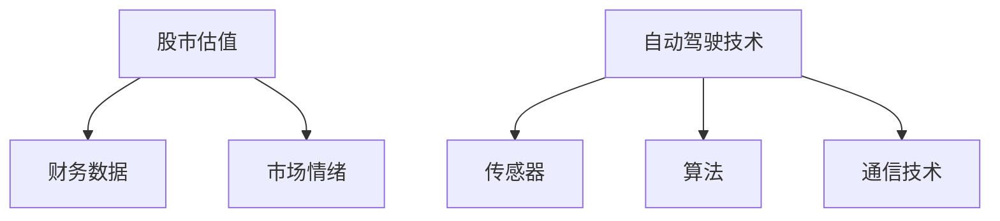
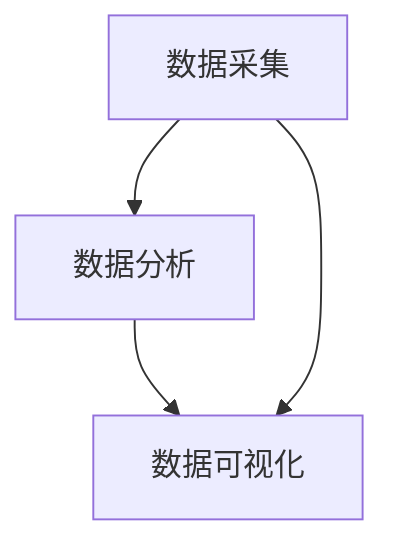

                 

# 全球股市估值与自动驾驶技术的关联

> **关键词**：全球股市估值，自动驾驶技术，关联分析，经济影响，技术驱动

> **摘要**：本文探讨了全球股市估值与自动驾驶技术之间的关联性，从理论分析到实证研究，深入剖析了自动驾驶技术对股市估值的影响路径，结合具体案例分析，揭示了技术进步如何影响市场价值，并提出了对未来研究的展望。

---

# 第一部分: 全球股市估值与自动驾驶技术的关联概述

## 第1章: 背景介绍

### 1.1 问题背景

#### 1.1.1 全球股市估值的基本概念
股市估值是通过对公司财务数据和市场表现的分析，评估其股票的内在价值。常用指标包括市盈率（P/E）、市净率（P/B）和股息率等，反映了市场对公司的信心和未来预期。

#### 1.1.2 自动驾驶技术的定义与发展
自动驾驶技术是指通过传感器、人工智能和机器学习等技术，实现车辆自主导航和决策的能力。根据技术成熟度，自动驾驶分为L0到L5六个级别，目前主流企业如特斯拉、Waymo等正在推动L3及以上技术的商业化。

#### 1.1.3 问题的提出与研究意义
随着自动驾驶技术的快速发展，投资者开始关注其对汽车产业链和相关企业的潜在影响，进而影响股市估值。研究这一关联性，有助于投资者更好地理解市场动态，企业优化战略决策。

### 1.2 问题描述

#### 1.2.1 股市估值与自动驾驶技术的关联性
自动驾驶技术可能通过改变汽车行业的商业模式和盈利预期，影响相关企业的估值。例如，自动驾驶出租车服务可能提升企业的收入预期，从而提高股价。

#### 1.2.2 自动驾驶技术对股市估值的影响路径
- **直接影响**：自动驾驶技术的商业化可能提升相关企业的收入和利润率，从而提高其股票的内在价值。
- **间接影响**：技术进步可能改变投资者对整个行业的看法，影响其他相关企业的估值。

#### 1.2.3 股市投资者与自动驾驶技术企业的互动关系
投资者的预期和行为（如股价波动）可能反过来影响企业的研发投资和战略决策，形成一个双向互动的机制。

### 1.3 问题解决

#### 1.3.1 数据收集与分析方法
- **数据收集**：收集全球主要股市（如纳斯达克、纽交所）中自动驾驶相关企业的股价数据和财务报表。
- **分析方法**：使用时间序列分析、回归分析等统计方法，结合文本挖掘技术分析新闻和社交媒体对股价的影响。

#### 1.3.2 关联机制的理论模型构建
构建一个包含自动驾驶技术成熟度、市场预期和企业财务指标的多因素模型，量化各因素对股价的影响。

#### 1.3.3 实证分析与案例研究
通过分析特斯拉、Waymo等企业的股价数据，验证模型的有效性，并探讨技术进展如何推动股价变化。

### 1.4 边界与外延

#### 1.4.1 研究范围的界定
主要关注自动驾驶技术对汽车制造企业的影响，不涉及完全无人驾驶的社会经济影响。

#### 1.4.2 相关概念的外延与限制
自动驾驶技术的影响不仅限于股市估值，还涉及交通法规、能源政策等领域，但本文仅聚焦于其对股市的直接影响。

#### 1.4.3 研究的局限性与未来展望
数据获取和模型构建的限制可能导致结论的片面性，未来研究可考虑引入更多变量，如政策变化和技术突破。

### 1.5 概念结构与核心要素组成

#### 1.5.1 股市估值的核心要素
- 公司盈利能力
- 市场预期
- 行业竞争格局

#### 1.5.2 自动驾驶技术的关键技术
- 传感器技术（激光雷达、摄像头）
- 人工智能算法
- 通信技术

#### 1.5.3 两者关联的核心要素
- 技术成熟度与商业化进程
- 市场预期与投资情绪
- 行业政策与法规变化

---

## 第二部分: 核心概念与联系

## 第2章: 股市估值的核心概念

### 2.1 股市估值的定义与特点

#### 2.1.1 股市估值的基本定义
股市估值是对企业股票内在价值的估算，通常基于财务指标和市场情绪。

#### 2.1.2 股市估值的主要特点
- 受市场情绪影响较大
- 与企业基本面密切相关
- 受宏观经济环境影响

### 2.2 股市估值的主要方法

#### 2.2.1 市盈率法
市盈率 = 股价 / 每股净利润，反映市场对企业的盈利预期。

#### 2.2.2 市净率法
市净率 = 股价 / 每股净资产，适用于评估资产密集型企业的价值。

#### 2.2.3 现金流折现法
DCF模型通过折现未来现金流评估企业价值，常用于高科技企业的估值。

---

## 第3章: 自动驾驶技术的核心概念

### 3.1 自动驾驶技术的定义与分类

#### 3.1.1 自动驾驶技术的基本定义
自动驾驶技术通过传感器和算法实现车辆的自主导航和决策。

#### 3.1.2 自动驾驶技术的分类
- **L0-L5**：从无自动驾驶到完全自动驾驶的分级标准。

#### 3.1.3 自动驾驶技术的关键技术
- **传感器**：激光雷达、摄像头、雷达
- **人工智能**：神经网络、深度学习
- **通信技术**：V2X（车与万物互联）

---

## 第4章: 股市估值与自动驾驶技术的关联性分析

### 4.1 关联性分析的理论基础

#### 4.1.1 经济学视角
自动驾驶技术可能降低交通事故率，提升交通效率，进而影响相关企业的成本和收益。

#### 4.1.2 技术驱动视角
技术进步可能提升企业的竞争力，改变市场格局，从而影响股市估值。

#### 4.1.3 市场预期视角
投资者对自动驾驶技术的未来预期会影响当前的市场估值。

### 4.2 关联机制的构建

#### 4.2.1 自动驾驶技术对股市估值的直接影响
- **收入增长**：自动驾驶技术可能带来新的收入来源（如自动驾驶出租车服务）。
- **成本降低**：自动化生产流程可能降低制造成本。

#### 4.2.2 自动驾驶技术对股市估值的间接影响
- **行业竞争格局变化**：技术领先企业可能获得更大的市场份额。
- **政策影响**：政府对自动驾驶技术的支持可能影响企业的政策环境。

#### 4.2.3 综合影响模型
构建一个包含技术成熟度、市场预期和企业基本面的多因素模型，量化各因素对股价的影响。

---

## 第5章: 核心概念的对比分析

### 5.1 股市估值与自动驾驶技术的对比

#### 5.1.1 对比分析表
| 比较维度 | 股市估值 | 自动驾驶技术 |
|----------|----------|--------------|
| 核心要素 | 财务数据、市场情绪 | 传感器、算法、通信技术 |
| 影响因素 | 经济环境、政策 | 技术进步、法规 |
| 应用场景 | 投资决策 | 汽车制造、交通服务 |

#### 5.1.2 对比分析图
使用 Mermaid 绘制对比分析图，展示两者的异同。

---

## 第6章: 技术原理与数学模型

### 6.1 自动驾驶技术的算法原理

#### 6.1.1 神经网络模型
使用深度学习模型（如CNN、RNN）处理传感器数据，实现目标检测和路径规划。

#### 6.1.2 机器学习模型
通过回归分析预测交通状况，优化自动驾驶的决策过程。

### 6.2 股市估值的时间序列分析

#### 6.2.1 ARIMA 模型
使用 ARIMA 模型预测股价走势，结合自动驾驶技术的新闻数据进行分析。

---

## 第7章: 系统架构与项目实战

### 7.1 系统架构设计

#### 7.1.1 系统功能设计
- 数据采集模块：收集自动驾驶相关企业的股价和财务数据。
- 数据分析模块：使用时间序列分析和文本挖掘技术进行关联分析。
- 可视化模块：展示分析结果和趋势预测。

#### 7.1.2 系统架构图
使用 Mermaid 绘制系统架构图，展示各模块的交互关系。

### 7.2 项目实战

#### 7.2.1 案例分析
以特斯拉为例，分析其股价与自动驾驶技术进展的关系。

#### 7.2.2 数据分析与结果解读
使用 Python 实现时间序列分析，展示自动驾驶技术对股价的具体影响。

---

## 第8章: 总结与展望

### 8.1 总结
本文探讨了全球股市估值与自动驾驶技术的关联性，构建了理论模型并进行了实证分析，揭示了技术进步对股市估值的深远影响。

### 8.2 展望
未来研究可进一步考虑更多变量，如政策变化和消费者行为，构建更完善的关联模型。

---

## 小结

本文系统地分析了全球股市估值与自动驾驶技术的关联性，从理论到实践，为投资者和企业提供了有益的参考。通过深入的技术分析和案例研究，揭示了自动驾驶技术对企业估值的潜在影响，为未来的研究提供了方向。

---

**作者：AI天才研究院 & 禅与计算机程序设计艺术**

