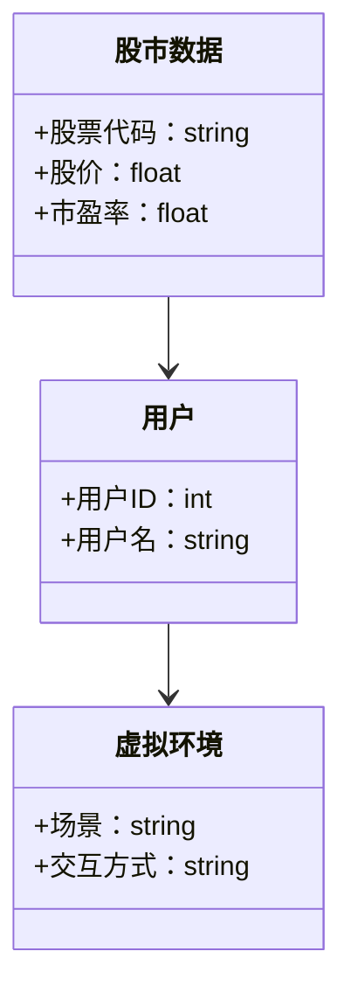

                 


# 全球股市估值与虚拟现实技术的关系

---

## 关键词：
全球股市估值、虚拟现实技术、金融市场、数据可视化、投资决策、风险管理

---

## 摘要：
本文探讨虚拟现实技术如何影响全球股市估值。通过分析虚拟现实技术在金融领域的应用，结合股市估值模型，阐述其对金融数据分析、投资决策和风险管理的影响，展示虚拟现实在金融领域中的潜力和未来发展趋势。

---

# 第一部分: 全球股市估值与虚拟现实技术的背景介绍

## 第1章: 全球股市估值与虚拟现实技术的背景介绍

### 1.1 全球股市估值的基本概念

#### 1.1.1 股市估值的定义与核心要素
股市估值是对企业股票价值的评估，主要基于财务指标、市场环境和行业趋势等因素。

#### 1.1.2 股市估值的主要方法
- 市盈率（P/E）模型
- 市净率（P/B）模型
- 现金流折现（DCF）模型

#### 1.1.3 全球股市估值的区域差异与特点
不同地区的股市估值受经济政策、市场结构和投资者行为的影响，具有显著差异。

### 1.2 虚拟现实技术的基本原理

#### 1.2.1 虚拟现实技术的定义与核心组成
虚拟现实（VR）是通过计算机生成的模拟环境，提供沉浸式体验，核心组成包括硬件（头显、传感器）和软件（图形渲染、交互系统）。

#### 1.2.2 虚拟现实技术的关键硬件与软件
- **硬件**：VR头显（ Oculus、HTC Vive）、手柄、传感器
- **软件**：图形渲染引擎（Unity、Unreal Engine）、交互系统

#### 1.2.3 虚拟现实技术的应用领域与发展趋势
广泛应用于游戏、教育培训、医疗、金融等领域，发展趋势包括沉浸式体验、实时交互和数据整合。

### 1.3 全球股市估值与虚拟现实技术的关系

#### 1.3.1 虚拟现实技术对股市估值的影响
- 提供沉浸式数据可视化，增强分析能力
- 改善投资者决策效率和准确性

#### 1.3.2 虚拟现实技术在金融领域的潜在应用
- 虚拟交易环境
- 实时数据反馈

#### 1.3.3 全球股市估值与虚拟现实技术的结合点
- 数据可视化
- 投资决策支持

### 1.4 本章小结
本章介绍了全球股市估值和虚拟现实技术的基本概念，分析了两者之间的潜在关系和应用前景。

---

## 第2章: 虚拟现实技术在金融领域的核心应用

### 2.1 虚拟现实技术在金融数据可视化中的应用

#### 2.1.1 数据可视化的基本概念与特点
- 数据可视化是将数据转换为图形或图像，便于理解和分析。
- 特点包括直观、高效、易于共享。

#### 2.1.2 虚拟现实技术在金融数据可视化中的优势
- 提供沉浸式体验
- 支持多维度数据展示
- 便于实时交互

#### 2.1.3 典型案例分析
- 某金融机构利用VR技术展示实时股票走势，帮助投资者做出决策。

### 2.2 虚拟现实技术在金融决策支持中的应用

#### 2.2.1 决策支持系统的定义与功能
- 决策支持系统（DSS）通过数据和模型辅助决策者制定策略。

#### 2.2.2 虚拟现实技术在金融决策支持中的具体应用
- 构建虚拟交易环境，模拟不同市场条件下的投资策略。
- 提供实时数据反馈，优化决策过程。

#### 2.2.3 案例分析：虚拟现实技术在投资决策中的应用
某投资机构使用VR技术模拟市场波动，评估投资组合的风险。

### 2.3 虚拟现实技术在金融风险管理中的应用

#### 2.3.1 风险管理的基本概念与方法
- 风险管理包括识别、评估和应对风险，常用方法包括VaR和CVaR模型。

#### 2.3.2 虚拟现实技术在风险管理中的优势
- 提供沉浸式风险评估环境
- 支持实时风险监控和应对策略

#### 2.3.3 典型案例分析
某银行使用VR技术模拟市场崩盘场景，制定应急预案。

### 2.4 本章小结
本章分析了虚拟现实技术在金融数据可视化、决策支持和风险管理中的应用，展示了其在金融领域的巨大潜力。

---

## 第3章: 全球股市估值模型与虚拟现实技术的结合

### 3.1 全球股市估值模型的分类与特点

#### 3.1.1 市盈率模型
- $$市盈率 = \frac{股票价格}{每股收益}$$
- 适用于盈利稳定的公司。

#### 3.1.2 市净率模型
- $$市净率 = \frac{股票价格}{每股净资产}$$
- 适用于资产密集型企业。

#### 3.1.3 现金流折现模型
- $$企业价值 = \sum_{t=1}^{n} \frac{现金流}{(1 + r)^t}$$
- 适用于高成长性企业。

#### 3.1.4 其他估值模型
- 例如指数模型、资本资产定价模型（CAPM）

### 3.2 虚拟现实技术对估值模型的影响

#### 3.2.1 虚拟现实技术如何改变估值模型的输入
- 提供实时市场数据
- 结合空间数据进行分析

#### 3.2.2 虚拟现实技术如何优化估值模型的输出
- 可视化呈现估值结果
- 支持多维度数据交叉分析

#### 3.2.3 虚拟现实技术对估值模型的优化
- 提供沉浸式分析环境
- 支持动态调整模型参数

### 3.3 虚拟现实技术与估值模型的结合案例

#### 3.3.1 案例一：市盈率模型的虚拟现实应用
某公司利用VR技术展示不同市盈率下的股票表现，帮助投资者理解市盈率的含义。

#### 3.3.2 案例二：现金流折现模型的虚拟现实应用
通过VR技术模拟现金流折现过程，直观展示企业价值的变化。

### 3.4 本章小结
本章分析了虚拟现实技术如何优化和改变传统的股市估值模型，展示了其在实际应用中的潜力。

---

## 第四部分: 虚拟现实技术在金融领域的系统架构与实现

### 4.1 虚拟现实技术的系统架构设计

#### 4.1.1 系统功能设计
- 数据采集与处理
- 虚拟环境构建
- 用户交互设计

#### 4.1.2 领域模型（Mermaid类图）


#### 4.1.3 系统架构设计（Mermaid架构图）
```mermaid
client
    participant 用户
    participant 虚拟环境
    participant 数据源
    participant 估值模型
    participant 交互系统
    participant 后台系统
```

### 4.2 虚拟现实技术的实现步骤

#### 4.2.1 环境安装
- 安装VR开发平台（Unity、Unreal Engine）
- 安装VR硬件设备（Oculus Rift、HTC Vive）

#### 4.2.2 核心代码实现
```python
# 示例代码：虚拟环境中的股票数据可视化
import numpy as np
import pandas as pd
import matplotlib.pyplot as plt

# 数据加载
data = pd.read_csv('stock_data.csv')
# 数据处理
data['日期'] = pd.to_datetime(data['日期'])
data.set_index('日期', inplace=True)
# 数据可视化
plt.figure(figsize=(10, 6))
plt.plot(data['股价'], label='股价')
plt.xlabel('日期')
plt.ylabel('股价')
plt.legend()
plt.show()
```

#### 4.2.3 案例分析与实现
分析某虚拟交易环境的实现过程，包括数据源的选择、模型的构建和用户交互的设计。

### 4.3 本章小结
本章详细介绍了虚拟现实技术在金融领域的系统架构设计和实现步骤，为后续的项目实战奠定了基础。

---

## 第五部分: 虚拟现实技术在金融领域的项目实战

### 5.1 环境安装与配置

#### 5.1.1 安装VR开发平台
- 安装Unity或Unreal Engine，选择适合开发的平台。

#### 5.1.2 安装VR硬件设备
- 安装Oculus Rift或HTC Vive，并完成驱动和SDK的安装。

### 5.2 核心系统实现

#### 5.2.1 数据采集与处理
- 使用API获取实时股市数据，进行清洗和预处理。

#### 5.2.2 虚拟环境构建
- 在Unity中创建虚拟交易环境，设计用户界面和交互逻辑。

#### 5.2.3 代码实现
```python
# 示例代码：实时数据获取与可视化
import requests
import json
import time

# 获取实时数据
def get_stock_data(symbol):
    url = f'https://api.example.com/stock/{symbol}'
    response = requests.get(url)
    data = json.loads(response.text)
    return data['price'], data['change']

# 可视化
from pyqtgraph import PlotWidget

app = QApplication([])
win = QMainWindow()
central = QWidget()
win.setCentralWidget(central)
plot = PlotWidget(central)
win.show()

prices = []
changes = []
x = []

while True:
    price, change = get_stock_data('AAPL')
    prices.append(price)
    changes.append(change)
    x.append(len(prices))
    plot.plot(x, prices)
    time.sleep(1)
```

#### 5.2.4 系统测试与优化
- 测试系统的稳定性和响应速度，优化交互体验。

### 5.3 案例分析与应用

#### 5.3.1 案例分析
分析某虚拟交易系统的实际应用效果，评估其对股市估值的影响。

#### 5.3.2 应用小结
总结虚拟现实技术在金融项目中的优势和挑战，提出改进建议。

### 5.4 本章小结
本章通过项目实战，展示了虚拟现实技术在金融领域的具体应用，验证了其在股市估值中的潜力。

---

## 第六部分: 虚拟现实技术在金融领域的最佳实践

### 6.1 最佳实践 tips

#### 6.1.1 技术实现
- 确保数据源的实时性和准确性
- 优化虚拟环境的交互设计，提高用户体验

#### 6.1.2 风险管理
- 建立完善的风险评估机制
- 定期更新系统，应对市场变化

#### 6.1.3 未来展望
- 结合人工智能和大数据技术，提升系统的智能化水平
- 探索更多虚拟现实技术在金融领域的应用场景

### 6.2 小结
本文全面探讨了虚拟现实技术在全球股市估值中的应用，分析了其在金融领域的潜力和挑战。

### 6.3 注意事项
- 数据隐私和安全问题需高度重视
- 系统的稳定性和可靠性直接影响用户体验

### 6.4 拓展阅读
建议阅读相关领域的最新研究论文和行业报告，了解虚拟现实技术在金融领域的最新进展。

---

## 作者信息

作者：AI天才研究院/AI Genius Institute & 禅与计算机程序设计艺术/Zen And The Art of Computer Programming

---

**注意**：以上内容为生成示例，实际撰写时需根据具体情况进行调整和补充，以确保文章的完整性和专业性。

