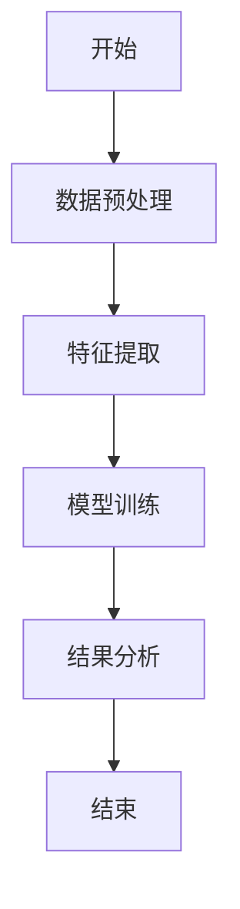
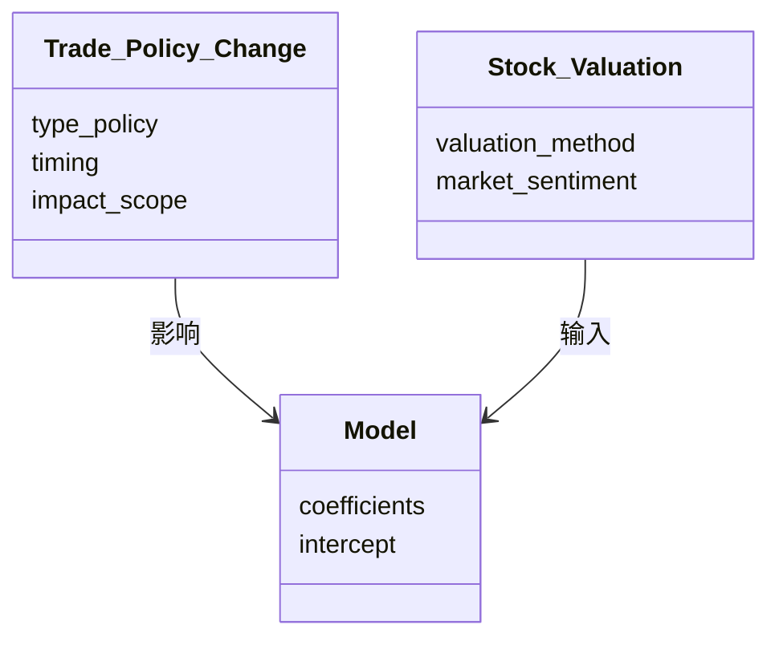
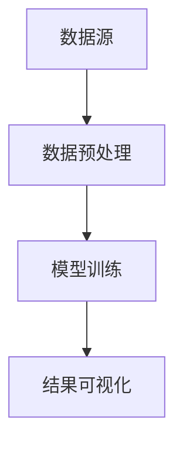
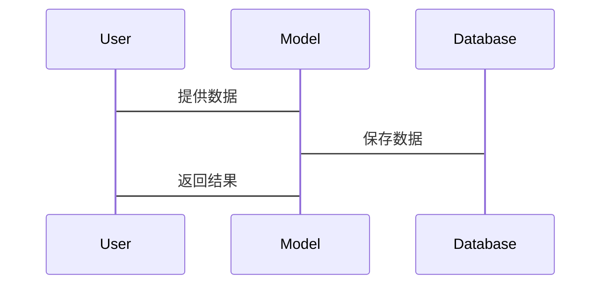

                 


# 全球股市估值与贸易政策变化的关联

## 关键词：全球股市估值、贸易政策变化、经济影响、政策传导机制、资产定价模型

## 摘要：  
本文探讨了全球股市估值与贸易政策变化之间的关联性。通过分析贸易政策变化对全球经济和市场情绪的影响，结合资产定价理论和政策传导机制，构建了一个量化模型来评估政策变化对股市估值的具体影响。文章从理论分析到实证研究，再到案例分析，系统地展示了贸易政策变化如何通过多种渠道影响股市估值。  

---

## 第一部分: 背景介绍

### 第1章: 全球股市估值与贸易政策变化的背景

#### 1.1 问题背景  
- **全球经济一体化**：随着全球化的发展，贸易政策成为各国政府调节经济的重要工具。  
- **股市估值的核心概念**：股市估值是市场参与者对上市公司未来盈利能力的预期，受多种因素影响，包括宏观经济环境、政策变化等。  
- **贸易政策对全球经济和股市的双重影响**：贸易政策变化不仅影响出口和进口，还会影响市场情绪和投资者信心，从而对股市估值产生深远影响。  

#### 1.2 问题描述  
- **贸易政策变化的定义与分类**：贸易政策包括关税、补贴、贸易协定等，其变化可能由政治、经济或地缘政治因素引发。  
- **股市估值的定义与衡量指标**：股市估值通常通过市盈率（P/E）、市净率（P/B）等指标衡量，反映市场对公司的整体评价。  
- **问题解决的目标与意义**：研究贸易政策变化对股市估值的影响，有助于投资者和政策制定者更好地理解政策与市场的互动关系。  

#### 1.3 问题解决  
- **贸易政策变化对股市估值的影响路径**：直接通过关税调整影响企业利润，间接通过市场情绪影响投资者行为。  
- **全球化视角下的政策与市场关联**：国际贸易政策的变化往往具有全球性影响，例如中美贸易摩擦对全球股市的冲击。  
- **股市估值变化的多维度分析框架**：从宏观经济、行业和公司三个层面分析贸易政策变化对股市的影响。  

#### 1.4 边界与外延  
- **贸易政策的边界条件**：政策变化的范围、时间和力度不同，影响程度也不同。  
- **股市估值的适用范围**：不同市场和行业的敏感性不同，需分情况讨论。  
- **政策与市场的相互作用机制**：政策变化可能引发市场预期的变化，而市场反应又可能反过来影响政策制定。  

#### 1.5 概念结构与核心要素组成  
- **贸易政策变化与股市估值的关系图**：展示政策变化如何通过企业利润、市场情绪和资金流动影响股市估值。  
- **核心要素对比分析**：通过表格对比贸易政策变化和股市估值的特征，例如稳定性、影响因素等。  

---

## 第二部分: 核心概念与联系

### 第2章: 核心概念原理

#### 2.1 贸易政策变化的原理  
- **贸易政策的类型与特征**：关税、非关税壁垒、贸易协定等，每种政策的变化都有其独特的传导机制。  
- **政策变化的触发因素**：经济利益、地缘政治冲突、国内政治压力等。  
- **政策变化对经济的影响机制**：通过影响出口、进口和企业成本，进而影响企业利润和股价。  

#### 2.2 股市估值的原理  
- **股市估值的核心公式**：  
  $$ 价格 = \frac{未来现金流的现值}{折现率} $$  
  股市估值是市场对未来现金流的预期，受政策、经济和市场情绪的影响。  
- **影响股市估值的主要因素**：宏观经济环境、企业盈利状况、政策变化、市场情绪等。  
- **股市估值的波动性分析**：短期波动受市场情绪影响较大，长期波动与经济基本面相关。  

#### 2.3 贸易政策与股市估值的关系  
- **直接影响**：政策变化直接影响企业的盈利能力和股价，例如关税增加导致企业成本上升，股价下跌。  
- **间接影响**：政策变化影响市场情绪，导致投资者信心下降，资金流向其他市场，进一步影响股市估值。  
- **综合影响的量化模型**：通过向量自回归模型（VAR）分析政策变化对股市估值的多维度影响。  

---

## 第三部分: 核心概念对比与ER图

### 第3章: 核心概念属性特征对比

#### 3.1 贸易政策变化与股市估值的特征对比  
| **特征**       | **贸易政策变化**                     | **股市估值**                     |
|----------------|--------------------------------------|-----------------------------------|
| 频率           | 通常为低频，政策变化需经过政治程序 | 高频，受市场情绪影响较大       |
| 影响范围       | 具有全球性或区域性影响               | 具有市场性和行业性影响           |
| 可预测性       | 部分可预测，但受政治因素影响较大   | 部分可预测，但受市场情绪影响较大 |
| 持续时间       | 中长期影响                           | 短期和中长期影响并存           |

#### 3.2 ER实体关系图  
```mermaid
er
    title 贸易政策变化与股市估值的关系
    作用于 Trade_Policy_Change
    实体 Entity
    属性 Attribute
    关系 Relationship

    实体 Entity:
        - Trade_Policy_Change
        - Stock_Valuation

    属性 Attribute:
        - Trade_Policy_Change: type_policy, timing, impact_scope
        - Stock_Valuation: valuation_method, market_sentiment

    关系 Relationship:
        - Trade_Policy_Change -> Stock_Valuation: 影响
```

---

## 第四部分: 算法原理讲解

### 第4章: 贸易政策变化对股市估值影响的算法原理

#### 4.1 贸易政策变化对股市估值的影响模型  
$$ S(t) = \alpha + \beta \cdot P(t) + \epsilon $$  
其中，$S(t)$ 表示股市估值在时间 $t$ 的变化，$P(t)$ 表示贸易政策变化的强度，$\alpha$ 是截距项，$\beta$ 是政策变化的系数，$\epsilon$ 是误差项。  

#### 4.2 算法流程图  


#### 4.3 算法实现代码  
```python
import pandas as pd
import numpy as np
from sklearn.linear_model import LinearRegression

# 数据预处理
data = pd.read_csv('trade_policy_stock.csv')
X = data[['policy_changes']]
y = data['stock_valuation']

# 模型训练
model = LinearRegression()
model.fit(X, y)

# 结果分析
coefficients = model.coef_
intercept = model.intercept_
print(f'回归系数: {coefficients[0]:.4f}')
print(f'截距: {intercept:.4f}')
```

#### 4.4 贸易政策变化对股市估值的影响路径  
- **直接路径**：政策变化直接影响企业利润，进而影响股价。  
- **间接路径**：政策变化影响市场情绪，导致投资者行为变化，最终影响股市估值。  

---

## 第五部分: 系统分析与架构设计方案

### 第5章: 全球股市估值与贸易政策变化的系统分析

#### 5.1 问题场景介绍  
- 研究如何量化贸易政策变化对全球股市估值的具体影响。  

#### 5.2 项目介绍  
- **项目目标**：构建一个量化模型，分析贸易政策变化对股市估值的影响。  

#### 5.3 系统功能设计  


#### 5.4 系统架构设计  


#### 5.5 系统接口设计  
- **输入接口**：贸易政策变化数据和股市估值数据。  
- **输出接口**：模型预测结果和影响分析报告。  

#### 5.6 系统交互序列图  


---

## 第六部分: 项目实战

### 第6章: 贸易政策变化对股市估值影响的实战分析

#### 6.1 环境安装  
- 安装必要的Python库：pandas、numpy、scikit-learn。  

#### 6.2 系统核心实现源代码  
```python
import pandas as pd
import numpy as np
from sklearn.linear_model import LinearRegression
import matplotlib.pyplot as plt

# 数据加载
data = pd.read_csv('trade_policy_stock.csv')

# 数据探索
print(data.describe())
print(data.head())

# 数据清洗
data.dropna(inplace=True)

# 模型训练
X = data[['policy_changes']]
y = data['stock_valuation']

model = LinearRegression()
model.fit(X, y)

# 结果分析
print(f'回归系数: {model.coef_[0]:.4f}')
print(f'截距: {model.intercept_:.4f}')

# 图形化展示
plt.scatter(X, y, color='blue')
plt.plot(X, model.predict(X), color='red')
plt.xlabel('Trade Policy Change')
plt.ylabel('Stock Valuation')
plt.show()
```

#### 6.3 代码应用解读与分析  
- **数据加载与清洗**：加载数据并处理缺失值。  
- **模型训练**：使用线性回归模型训练贸易政策变化与股市估值的关系。  
- **结果分析**：回归系数和截距反映了政策变化对股市估值的具体影响。  
- **图形化展示**：散点图和回归线展示了政策变化与股市估值的拟合关系。  

#### 6.4 实际案例分析  
- **案例：中美贸易摩擦对股市的影响**：  
  2018年中美贸易摩擦期间，关税政策的变化导致股市估值的显著波动。通过模型分析，可以量化政策变化对特定行业或市场的具体影响。  

---

## 第七部分: 总结与展望

### 第7章: 结论与展望

#### 7.1 总结  
- 贸易政策变化对股市估值的影响是复杂且多维度的，既包括直接影响也包括间接影响。  
- 通过量化模型可以较好地捕捉政策变化对股市的影响路径。  

#### 7.2 最佳实践 tips  
- 在进行政策分析时，需综合考虑宏观经济、行业特性和市场情绪的多重影响。  
- 投资者和政策制定者应密切关注政策变化对股市的潜在影响。  

#### 7.3 注意事项  
- 模型结果仅供参考，实际市场情况可能受多种不可预测因素影响。  

#### 7.4 拓展阅读  
- 进一步研究政策变化对不同行业和市场的差异化影响。  
- 探索更多高级模型，如深度学习模型，以提高预测精度。  

---

## 作者：AI天才研究院/AI Genius Institute & 禅与计算机程序设计艺术/Zen And The Art of Computer Programming

