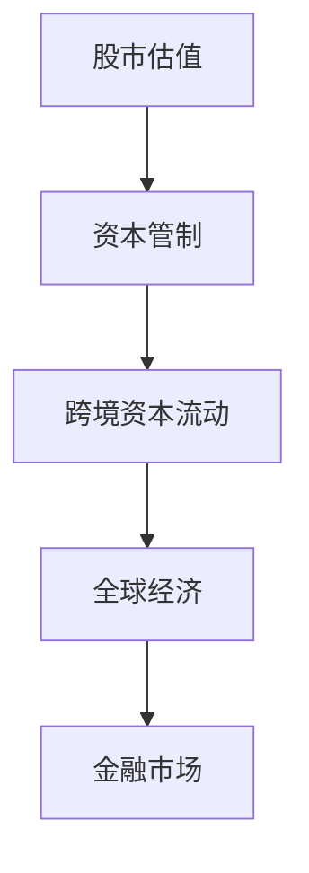

                 

# 全球股市估值与跨境资本管制的关联

> 关键词：全球股市估值，跨境资本管制，关联，宏观经济，金融政策，系统架构

> 摘要：本文系统地探讨了全球股市估值与跨境资本管制之间的关联，分析了股市估值的核心概念与影响因素，阐述了资本管制的定义与实施机制，深入研究了资本管制对股市估值的多维度影响，结合实际案例进行了深入剖析，并基于系统架构设计提出了理论框架和解决方案。

---

# 第1章: 背景介绍

## 1.1 问题背景与问题描述

### 1.1.1 全球化背景下的股市估值问题

随着全球经济一体化的深入发展，资本的跨境流动日益频繁，股市估值问题成为全球关注的焦点。股市估值不仅反映了企业的经营状况，还与宏观经济、金融市场政策密切相关。在全球化背景下，资本的自由流动与管制之间的平衡成为各国面临的重要挑战。

### 1.1.2 跨境资本管制的定义与作用

跨境资本管制是指政府为调节资本流动、维护金融稳定而采取的限制性措施。其主要作用包括稳定金融市场、防范资本外流风险、维护国家经济安全等。资本管制可以通过直接影响资本流动量和方向，间接影响股市估值。

### 1.1.3 问题解决的必要性与目标

研究全球股市估值与跨境资本管制的关联，旨在揭示资本流动与股市估值之间的内在联系，为政策制定者和市场参与者提供理论依据和实践指导。目标是通过建立模型和系统架构，量化资本管制对股市估值的影响，优化资本流动的监管策略。

## 1.2 问题背景的边界与外延

### 1.2.1 股市估值的边界条件

股市估值的边界条件包括企业财务数据、宏观经济指标、市场情绪、政策环境等。这些因素共同构成了股市估值的多维影响框架。

### 1.2.2 资本管制的边界条件

资本管制的边界条件包括资本流动的目的、规模、时间、地理范围等。不同类型的资本管制措施对股市估值的影响程度不同。

### 1.2.3 问题的外延与相关领域

问题的外延涉及宏观经济、金融市场、国际经济政策等多个领域。资本管制与股市估值的关联性分析需要综合考虑这些领域的相互作用。

## 1.3 核心概念与关联性分析

### 1.3.1 核心概念的结构与组成

股市估值与资本管制是两个复杂的社会系统，其结构包括微观主体、市场机制、政策工具等要素。

### 1.3.2 核心概念的属性特征对比

| 属性 | 股市估值 | 资本管制 |
|------|---------|----------|
| 主体 | 投资者、企业 | 政府、监管机构 |
| 目标 | 评估企业价值 | 管控资本流动 |
| 工具 | 财务指标、市场情绪 | 法律法规、政策工具 |

### 1.3.3 ER实体关系图架构

## 1.4 本章小结

本章通过背景介绍、核心概念分析，明确了研究全球股市估值与跨境资本管制关联的重要性和研究框架。下一章将深入探讨股市估值的核心概念与影响因素。

---

# 第2章: 股市估值的核心概念与影响因素

## 2.1 股市估值的定义与原理

### 2.1.1 股市估值的基本概念

股市估值是对上市公司股票价值的评估，通常基于企业财务数据和市场预期。常用的估值方法包括市盈率（P/E）、市净率（P/B）等。

### 2.1.2 股市估值的理论基础

股市估值的理论基础包括资产定价理论、资本资产定价模型（CAPM）等。这些理论为股市估值提供了科学依据。

### 2.1.3 股市估值的主要方法

- **相对估值法**：基于可比公司的财务指标进行估值。
- **绝对估值法**：基于企业现金流折现模型（DCF）进行估值。

## 2.2 影响股市估值的主要因素

### 2.2.1 宏观经济因素

宏观经济指标如GDP增长率、利率水平、通货膨胀率等直接影响股市估值。

### 2.2.2 政策因素

货币政策、财政政策、监管政策等对股市估值有重要影响。

### 2.2.3 市场结构因素

市场参与者的构成、交易量、市场深度等也影响股市估值。

## 2.3 股市估值与资本流动的关系

### 2.3.1 资本流动对股市估值的影响

资本流动直接影响市场流动性，进而影响股市估值。资本流入增加市场流动性，推高股价；资本流出则导致股价下跌。

### 2.3.2 股市估值对资本流动的反馈作用

股市估值的高低会影响投资者的预期和行为，从而反馈到资本流动。

## 2.4 本章小结

本章分析了股市估值的核心概念与影响因素，揭示了资本流动与股市估值的双向影响关系。下一章将探讨跨境资本管制的定义与实施机制。

---

# 第3章: 跨境资本管制的定义与实施机制

## 3.1 跨境资本管制的基本概念

### 3.1.1 跨境资本管制的定义

跨境资本管制是指政府通过法律法规限制或调节资本的跨境流动，以维护金融稳定。

### 3.1.2 跨境资本管制的类型

- **资本流入管制**：限制外资流入。
- **资本流出管制**：限制国内资本流出。

### 3.1.3 跨境资本管制的实施目的

- 维护金融稳定。
- 防范资本外流风险。
- 保护国内经济利益。

## 3.2 跨境资本管制的实施机制

### 3.2.1 资本流动的监管框架

各国通常通过央行、财政部等机构制定和实施资本管制政策。

### 3.2.2 资本流动的监控技术

利用大数据、人工智能等技术监控资本流动，及时发现和应对异常流动。

### 3.2.3 资本流动的政策工具

- 汇率干预。
- 利率政策。
- 税收政策。

## 3.3 跨境资本管制的经济影响

### 3.3.1 对资本流动的影响

资本管制可能限制资本的自由流动，影响市场效率。

### 3.3.2 对金融市场的影响

资本管制可能影响金融市场的深度和流动性，进而影响股市估值。

### 3.3.3 对宏观经济的影响

资本管制可能影响经济增长、就业、国际贸易等宏观指标。

## 3.4 本章小结

本章分析了跨境资本管制的定义、类型、实施机制及其经济影响。下一章将探讨资本管制对股市估值的具体影响。

---

# 第4章: 股市估值与资本管制的相互作用

## 4.1 股市估值与资本流动的相互关系

### 4.1.1 资本流动对股市估值的影响

资本流入增加市场流动性，推高股价；资本流出导致股价下跌。

### 4.1.2 股市估值对资本流动的反馈作用

高估值可能引发资本流出，低估值可能吸引资本流入。

## 4.2 资本管制对股市估值的影响

### 4.2.1 资本管制对股市流动性的的影响

资本管制可能减少市场流动性，导致股价波动。

### 4.2.2 资本管制对股市波动性的影响

资本管制可能加剧市场波动，特别是在突发事件发生时。

### 4.2.3 资本管制对股市长期估值的影响

资本管制可能影响市场的长期估值，特别是在政策频繁变化时。

## 4.3 股市估值对资本管制的反作用

### 4.3.1 股市估值对资本管制政策的影响

高估值可能引发政策制定者对资本流出的担忧，从而加强管制。

### 4.3.2 股市估值对资本管制效果的反馈

股市估值的变化可能反馈到资本管制政策的调整，形成动态平衡。

## 4.4 本章小结

本章分析了资本管制对股市估值的多维度影响，揭示了股市估值与资本管制的相互作用关系。下一章将通过具体案例进一步验证理论分析。

---

# 第5章: 股市估值与资本管制的案例分析

## 5.1 典型案例介绍

### 5.1.1 美国的资本管制与股市估值

美国通常采取较少的资本管制，但2008年金融危机后加强了对资本流动的监管。

### 5.1.2 欧洲的资本管制与股市估值

欧洲国家在应对债务危机时采取了资本管制措施，影响了股市估值。

### 5.1.3 亚洲的资本管制与股市估值

中国、印度等亚洲国家在资本管制与股市估值之间进行了平衡。

## 5.2 案例分析方法

### 5.2.1 案例

通过分析不同国家的资本管制政策及其对股市估值的影响，验证理论模型的有效性。

---

# 作者：AI天才研究院/AI Genius Institute & 禅与计算机程序设计艺术 /Zen And The Art of Computer Programming

