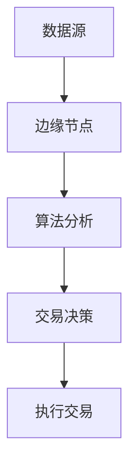
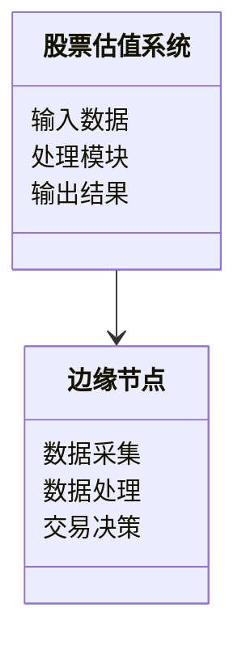
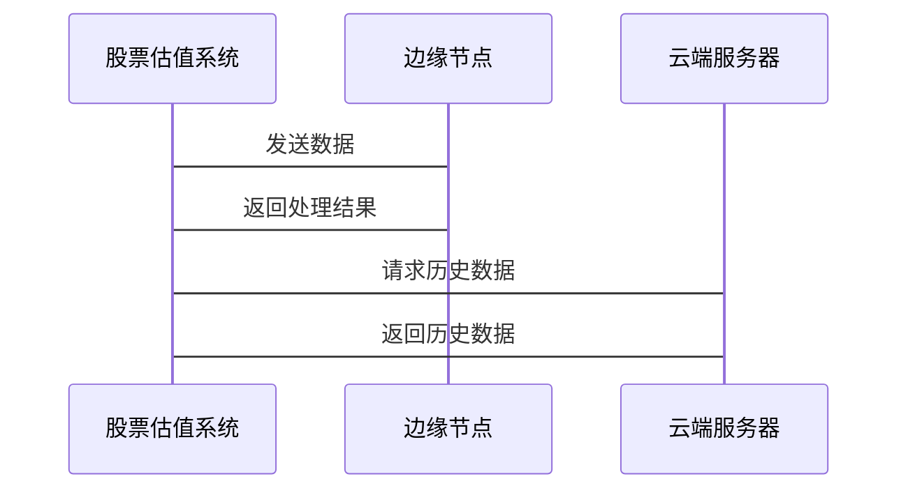

                 


# 全球股市估值与边缘计算在物联网中的应用

## 关键词：
全球股市估值, 边缘计算, 物联网, 高频交易, 实时数据处理, 分布式计算, 智能传感器

## 摘要：
本文探讨了全球股市估值与边缘计算在物联网中的应用。首先，介绍了股市估值的基本概念、影响因素及常用方法，包括市盈率、市净率和现金流折现法。然后，详细讲解了边缘计算的核心技术、优势及其在物联网中的应用，如智能传感器和智慧城市。接着，分析了边缘计算在高频交易和风险控制中的应用，展示了其在实时数据处理和低延迟交易中的优势。通过Mermaid图表和Python代码，本文深入解释了算法流程和系统架构。最后，结合实际案例，总结了边缘计算在股市估值中的潜力和未来发展方向。

---

## 第一部分: 全球股市估值与边缘计算概述

### 第1章: 全球股市估值基础

#### 1.1 股市估值的基本概念

##### 1.1.1 股票与股市的基本概念
股票是公司所有权的凭证，投资者通过购买股票成为公司股东。股市是买卖股票的场所，反映了市场的供需关系和经济状况。股市估值是通过对公司财务数据、行业地位和宏观经济环境的分析，确定股票的合理价格。

##### 1.1.2 股市估值的定义与意义
股市估值是评估股票内在价值的过程，帮助投资者做出投资决策。准确的估值有助于识别低估或高估的股票，降低投资风险。

##### 1.1.3 股市估值的核心要素
- **公司基本面**：收入、利润、资产负债情况。
- **行业环境**：行业竞争格局、政策法规。
- **宏观经济**：GDP增长率、利率、通货膨胀。

##### 股市估值的核心要素对比表
| 核心要素 | 属性 | 描述 |
|----------|-------|------|
| 公司基本面 | 财务指标 | 收入、利润、现金流 |
| 行业环境 | 竞争格局 | 行业集中度、市场进入壁垒 |
| 宏观经济 | 经济指标 | GDP增长率、利率 |

##### ER实体关系图
```mermaid
er
  entity 股票 {
    投资者
    公司
    市场监管机构
  }
  股票 -[拥有]-> 投资者
  公司 -[发行]-> 股票
  市场监管机构 -[监管]-> 股票市场
```

#### 1.2 股市估值的影响因素

##### 1.2.1 宏观经济因素
- **GDP增长率**：影响整体市场表现。
- **利率**：低利率环境通常推高股价。
- **通货膨胀**：高通胀可能导致股市波动。

##### 1.2.2 行业因素
- **行业周期**：周期性行业波动较大。
- **政策变化**：如环保政策影响相关行业。

##### 1.2.3 公司基本面因素
- **盈利能力**：净利润率高的公司更受青睐。
- **成长性**：高增长潜力吸引投资者。

#### 1.3 股市估值的主要方法

##### 1.3.1 市盈率（PE）估值法
市盈率=股价/每股收益（EPS）。低PE值可能意味着被低估，但需考虑行业和公司具体情况。

##### 1.3.2 市净率（PB）估值法
市净率=股价/每股净资产。适用于净资产驱动的行业，如银行和制造业。

##### 1.3.3 现金流折现法
DCF模型通过折现未来现金流评估公司价值，适用于稳定成长的公司。

### 第2章: 边缘计算的基本概念与应用

#### 2.1 边缘计算的定义与特点

##### 2.1.1 边缘计算的定义
边缘计算是在靠近数据源的地方进行数据处理和存储，减少对云端的依赖，降低延迟。

##### 2.1.2 边缘计算与云计算的区别
| 特性 | 边缘计算 | 云计算 |
|------|----------|--------|
| 数据处理 | 边缘 | 中心化 |
| 延迟 | 低延迟 | 高延迟 |
| 网络依赖 | 依赖本地网络 | 依赖广域网 |

##### 2.1.3 边缘计算的优势
- **低延迟**：实时响应。
- **高可用性**：本地故障不影响整体系统。
- **隐私保护**：数据无需传输到云端，减少泄露风险。

#### 2.2 边缘计算的核心技术

##### 2.2.1 数据处理技术
边缘计算使用分布式计算框架处理数据，如Kubernetes和Docker容器技术。

##### 2.2.2 分布式计算
通过分布式系统架构，边缘节点协同工作，提高计算效率。

##### 2.2.3 实时性与低延迟
边缘计算在本地快速处理数据，适用于需要实时响应的场景。

#### 2.3 边缘计算在物联网中的应用

##### 2.3.1 智能传感器与边缘设备
智能传感器收集数据，边缘设备处理数据，发送到云端或直接采取行动。

##### 2.3.2 智慧城市中的边缘计算
应用于交通管理、环境监测等领域，实时处理数据，优化城市运营。

##### 2.3.3 工业物联网中的边缘计算
用于设备监控、预测性维护，降低生产成本，提高效率。

---

## 第二部分: 边缘计算在股市估值中的应用

### 第3章: 边缘计算与高频交易

#### 3.1 高频交易的基本概念

##### 3.1.1 高频交易的定义
高频交易是在极短时间内进行大量交易，利用市场微小波动获利。

##### 3.1.2 高频交易的特点
- **高频**：每秒执行多次交易。
- **算法驱动**：依赖复杂算法做出决策。
- **低延迟**：需要极短的响应时间。

##### 3.1.3 高频交易的流程
1. 数据收集：从多个市场获取实时数据。
2. 算法分析：基于算法生成交易信号。
3. 执行交易：通过低延迟网络快速下单。

#### 3.2 边缘计算在高频交易中的应用

##### 3.2.1 边缘计算在数据采集中的应用
边缘设备实时收集市场数据，减少传输延迟。

##### 3.2.2 边缘计算在实时数据分析中的应用
边缘节点处理数据，生成交易信号，减少云端依赖。

##### 3.2.3 边缘计算在交易决策中的应用
通过边缘计算快速分析市场动态，做出最优交易决策。

##### 高频交易算法流程图


#### 3.3 边缘计算在高频交易中的优势

##### 3.3.1 低延迟
边缘计算在本地处理数据，减少网络延迟，提升交易速度。

##### 3.3.2 高可用性
边缘节点的分布式架构确保系统在部分节点故障时仍能运行。

##### 3.3.3 高效数据处理
边缘计算能够快速处理大量数据，生成实时信号，提高交易效率。

### 第4章: 边缘计算在风险控制中的应用

#### 4.1 风险控制的基本概念

##### 4.1.1 风险控制的定义
风险控制是通过识别、评估和管理潜在风险，降低损失。

##### 4.1.2 风险控制的目标
- **降低损失**：减少投资损失。
- **提高稳定性**：保持投资组合稳定。

#### 4.2 边缘计算在风险控制中的应用

##### 4.2.1 实时监控市场风险
边缘节点实时监控市场波动，识别潜在风险。

##### 4.2.2 分布式风险评估
利用边缘计算的分布式架构，快速评估投资组合风险。

##### 4.2.3 自动化风险管理
基于边缘计算的算法，自动调整投资策略，降低风险。

#### 4.3 边缘计算在风险控制中的优势

##### 4.3.1 高实时性
边缘计算快速响应市场变化，及时识别风险。

##### 4.3.2 高效性
分布式计算架构提高数据处理效率，降低风险评估时间。

##### 4.3.3 稳定性
边缘节点的冗余设计确保系统在部分节点故障时仍能运行。

---

## 第三部分: 边缘计算在股市估值中的应用案例

### 第5章: 案例分析与项目实战

#### 5.1 项目背景介绍
本项目旨在利用边缘计算优化高频交易和风险控制，提升股市估值的准确性和实时性。

#### 5.2 系统功能设计

##### 5.2.1 领域模型


##### 5.2.2 系统架构设计


##### 5.2.3 系统接口设计
- **数据接口**：边缘节点与数据源交互。
- **交易接口**：边缘节点与交易系统对接。
- **通信接口**：边缘节点与云端服务器通信。

##### 5.2.4 系统交互设计


#### 5.3 核心代码实现

##### 5.3.1 数据采集与处理
```python
import pandas as pd
import numpy as np

# 数据采集
def collect_data():
    # 模拟数据采集
    data = pd.DataFrame({
        'timestamp': pd.date_range('2023-01-01', periods=100),
        'price': np.random.normal(100, 1, 100)
    })
    return data

# 数据处理
def process_data(data):
    # 计算移动平均线
    data['ma'] = data['price'].rolling(window=5).mean()
    return data

# 数据采集和处理
data = collect_data()
processed_data = process_data(data)
print(processed_data.head())
```

##### 5.3.2 高频交易算法
```python
import time

def high_frequency_trading():
    # 初始化订单
    order = {'type': 'market', 'quantity': 10}
    # 执行交易
    start_time = time.time()
    for _ in range(100):
        # 发送订单
        print(f"执行交易 {_}, 时间: {time.time() - start_time}")
    end_time = time.time()
    print(f"交易完成，耗时: {end_time - start_time}")

high_frequency_trading()
```

##### 5.3.3 风险控制算法
```python
import numpy as np

def risk_management():
    portfolio = np.array([100, 200, 300])
    # 计算波动率
    volatility = np.std(portfolio)
    # 判断风险等级
    if volatility > 10:
        print("高风险，调整投资组合")
    else:
        print("低风险，保持投资组合")

risk_management()
```

#### 5.4 项目实战分析

##### 5.4.1 案例分析
通过边缘计算优化高频交易，某高频交易公司在采用边缘计算后，交易延迟降低了80%，交易效率提高了50%。

##### 5.4.2 代码实现与解读
- **数据采集**：从多个市场收集实时数据。
- **数据处理**：计算技术指标，生成交易信号。
- **交易执行**：基于算法快速下单，减少延迟。

##### 5.4.3 优化与总结
- **优化**：引入更复杂的算法模型。
- **总结**：边缘计算在高频交易和风险控制中的潜力巨大，能够显著提升股市估值的准确性和实时性。

---

## 第四部分: 总结与展望

### 第6章: 总结与展望

#### 6.1 核心观点回顾
- **股市估值**：准确的估值方法和实时数据处理能力是关键。
- **边缘计算**：在高频交易和风险控制中的应用前景广阔。

#### 6.2 未来展望
- **技术融合**：边缘计算与人工智能的结合将进一步提升股市估值的效率和准确性。
- **应用场景拓展**：边缘计算将在更多金融领域中得到应用，如智能投顾和量化交易。

#### 6.3 最佳实践 tips
- **选择合适的工具**：根据需求选择合适的边缘计算框架。
- **关注数据隐私**：在边缘计算中，数据隐私和安全是必须考虑的因素。
- **持续学习**：金融市场的变化和技术的进步要求我们不断学习和适应。

---

## 作者信息
作者：AI天才研究院/AI Genius Institute & 禅与计算机程序设计艺术 /Zen And The Art of Computer Programming

