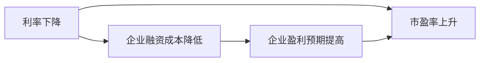
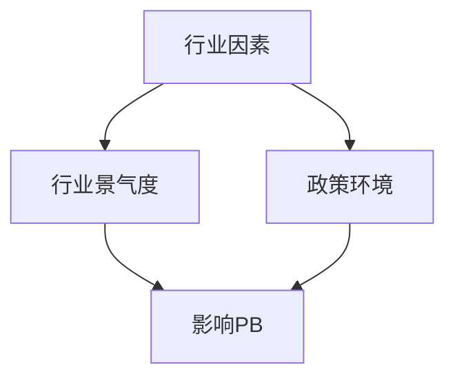
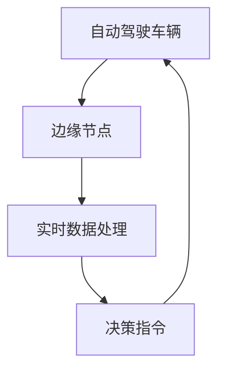

                 

# 全球股市估值与边缘计算在自动驾驶中的应用

---

## 关键词：全球股市估值、边缘计算、自动驾驶、投资策略、技术应用

---

## 摘要

本文探讨了全球股市估值与边缘计算在自动驾驶中的应用。首先，从股市估值的基本概念、影响因素及投资策略入手，分析了如何通过估值指标和方法指导投资决策。其次，深入探讨了边缘计算在自动驾驶中的应用场景、技术优势及其与云计算的关系。最后，结合两者的协同作用，分析了边缘计算技术对自动驾驶公司市值的影响，以及如何通过估值方法优化投资策略。文章结合理论与实践，为投资者和技术从业者提供了深刻的洞察。

---

## 第一部分：全球股市估值

### 第1章：全球股市估值概述

#### 1.1 股市估值的基本概念

股市估值是评估公司股票内在价值的过程，旨在确定其合理的价格区间。传统估值方法包括市盈率（PE）、市净率（PB）等，而现代方法则引入了更多复杂模型。股市估值的核心在于平衡市场波动与公司基本面，确保估值的准确性和实用性。

**背景介绍：**
股市估值的核心概念包括公司财务指标、市场环境和投资者情绪。问题在于如何在复杂市场中准确评估股票价值，解决方法是通过多种估值指标和模型进行综合分析。股市估值的边界在于市场波动和公司独特性，而其外延则涉及宏观经济和行业因素。

**核心概念与联系：**
- **核心概念：** 股票价值、市场情绪、财务指标。
- **联系：** 估值指标（如PE、PB）与公司基本面（如ROE）密切相关，且受宏观经济环境影响。

#### 1.2 股市估值的主要指标

以下是常用的估值指标及其公式：

- **市盈率（PE）：**  
  $$ PE = \frac{\text{股价}}{\text{每股收益}} $$
  
- **市净率（PB）：**  
  $$ PB = \frac{\text{股价}}{\text{每股净资产}} $$

- **ROE（净资产收益率）：**  
  $$ ROE = \frac{\text{净利润}}{\text{净资产}} $$

- **EV（企业价值）：**  
  $$ EV = \text{企业市值} + \text{债务} - \text{现金} $$

#### 1.3 股市估值的分类与应用场景

股市估值分为市场整体估值和个股估值，常用指标如下表所示：

| 指标类型 | 指标名称 | 适用场景 |
|----------|----------|----------|
| 市盈率类 | PE       | 成长型公司估值 |
| 市净率类 | PB       | 周期性行业估值 |
| 收益率类 | ROE      | 价值型企业估值 |
| 综合类   | EV       | 大盘蓝筹股估值 |

---

### 第2章：全球股市估值的影响因素

#### 2.1 宏观经济因素对股市估值的影响

宏观经济因素如利率水平和经济周期对股市估值有显著影响。利率下降通常会推高市盈率，而经济衰退可能导致市净率上升。以下是利率与PE的关系示意图：

#### 2.2 行业因素对股市估值的影响

行业景气度和政策环境直接影响估值水平。例如，科技行业的高增长可能推高PE，而传统行业的稳定则更关注ROE。以下是行业因素对估值影响的概念图：

---

## 第二部分：边缘计算在自动驾驶中的应用

### 第3章：边缘计算概述

#### 3.1 边缘计算的基本概念

边缘计算是在靠近数据源的地方进行计算和数据处理的技术，减少了延迟和带宽消耗。其核心优势在于实时性，适用于自动驾驶中快速决策的需求。

**背景介绍：**
边缘计算的核心概念包括分布式计算和本地数据处理。问题在于如何在资源受限的环境中优化计算效率，解决方法是通过边缘节点的协同工作实现数据高效处理。边缘计算的边界在于数据隐私和计算能力，而外延则涉及云计算和物联网。

**核心概念与联系：**
- **核心概念：** 边缘节点、分布式计算、低延迟。
- **联系：** 边缘计算与云计算协同工作，边缘节点处理实时数据，云计算提供存储和分析支持。

### 第4章：边缘计算在自动驾驶中的应用

#### 4.1 边缘计算在自动驾驶中的应用场景

自动驾驶中的边缘计算主要用于实时数据处理和决策。例如，车辆传感器数据在本地节点处理，减少云端依赖，提高响应速度。以下是自动驾驶中边缘计算的应用场景：

---

## 结论

本文探讨了全球股市估值与边缘计算在自动驾驶中的应用，分析了两者的核心概念、影响因素及应用场景。通过理论与实践的结合，为投资者和技术从业者提供了深刻的洞察。未来，随着边缘计算技术的不断发展，其对自动驾驶公司市值的影响将更加显著，值得进一步研究和关注。

---

## 作者

作者：AI天才研究院/AI Genius Institute & 禅与计算机程序设计艺术 /Zen And The Art of Computer Programming

