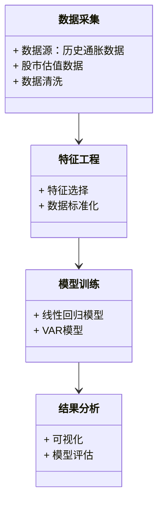
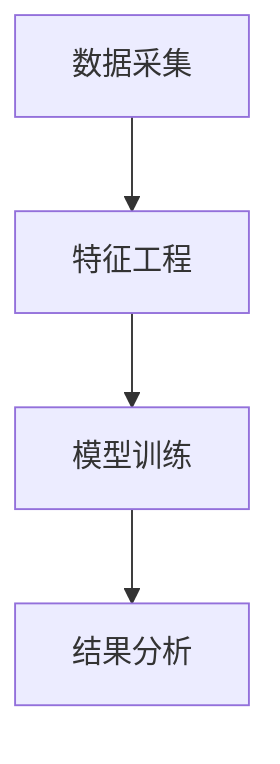
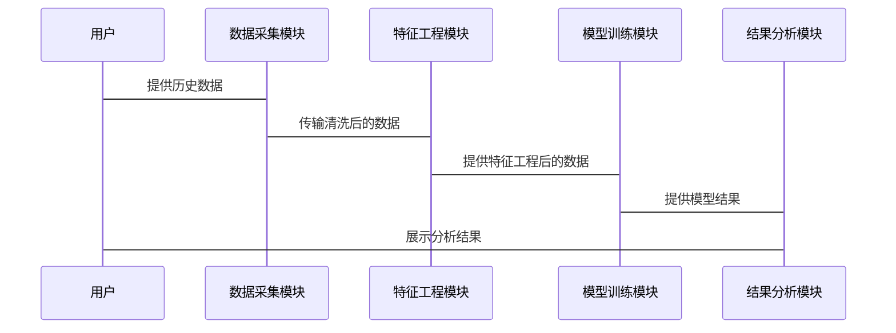

                 


# 全球股市估值与通货膨胀预期的关系

> 关键词：全球股市估值，通货膨胀预期，宏观经济，股市分析，经济指标

> 摘要：本文探讨了全球股市估值与通货膨胀预期之间的关系，分析了通货膨胀预期如何影响股市估值，以及股市估值如何反馈通货膨胀预期。通过建立数学模型和系统架构，本文详细解释了两者之间的相互作用，并通过实际案例分析了通货膨胀预期对股市估值的具体影响。

---

## 第一部分：背景介绍

### 第1章：通货膨胀与股市估值的关系

#### 1.1 通货膨胀的定义与影响

通货膨胀是指物价总水平在一段时间内持续上涨的现象。它通常由货币供应增加、需求拉动或成本推动等因素引起。通货膨胀对经济的影响是多方面的，包括消费者购买力下降、企业成本增加等。在股市中，通货膨胀可能导致企业盈利下降，从而影响股价。

#### 1.2 股市估值的基本概念

股市估值是衡量市场整体价值的指标，常用的指标包括市盈率（P/E）、市净率（P/B）等。这些指标反映了市场参与者的信心和对未来的预期。股市估值与经济周期密切相关，通常在经济扩张期，股市估值上升。

#### 1.3 通货膨胀预期的定义与作用

通货膨胀预期是市场参与者对未来通货膨胀率的预测。它影响企业定价策略、货币政策制定以及投资者决策。通货膨胀预期可能导致股市估值的变化，因为投资者会根据对未来通胀的预期调整投资行为。

---

## 第二部分：通货膨胀预期与股市估值的核心概念

### 第2章：通货膨胀预期与股市估值的核心概念

#### 2.1 通货膨胀预期的核心要素

通货膨胀预期来源于市场参与者的感知和预测。常用的衡量指标包括通胀期权、通胀预期调查等。实际通货膨胀与预期通胀之间的差异会影响市场行为。

#### 2.2 股市估值的核心要素

股市估值的计算方法包括加总法和指数法。影响股市估值的主要因素包括企业盈利、货币政策、市场情绪等。股市估值与市场情绪密切相关，投资者情绪波动会影响估值水平。

#### 2.3 通货膨胀预期与股市估值的相互作用

通货膨胀预期通过影响企业盈利、货币政策和市场情绪间接影响股市估值。同时，股市估值的变化也能反馈通货膨胀预期的变化，因为股市表现反映了市场的整体预期。

---

## 第三部分：通货膨胀预期与股市估值的数学模型

### 第3章：通货膨胀预期与股市估值的数学模型

#### 3.1 通货膨胀预期的数学表达

通货膨胀预期的线性回归模型可以表示为：
$$ \text{预期通胀率} = \beta_0 + \beta_1 \times \text{历史通胀率} + \epsilon $$
其中，$\epsilon$ 是误差项。

向量自回归模型（VAR）用于分析通货膨胀预期与实际通胀之间的动态关系：
$$ \text{预期通胀} = \alpha_1 \times \text{历史通胀} + \alpha_2 \times \text{其他变量} + \epsilon $$

#### 3.2 股市估值的数学模型

股市估值的时间序列分析可以表示为：
$$ \text{估值} = \gamma_1 \times \text{滞后估值} + \gamma_2 \times \text{滞后通胀预期} + \epsilon $$

多元回归分析用于预测股市估值：
$$ \text{估值} = \beta_1 \times \text{通胀预期} + \beta_2 \times \text{其他因素} + \epsilon $$

#### 3.3 通货膨胀预期与股市估值的关系模型

协方差模型用于分析两者的关系：
$$ \text{协方差}(\text{通胀预期}, \text{估值}) = \sigma_{12} $$

相关性分析可以表示为：
$$ \text{相关系数} = \frac{\text{协方差}(\text{通胀预期}, \text{估值})}{\sigma_{1} \times \sigma_{2}} $$

---

## 第四部分：系统分析与架构设计

### 第4章：系统分析与架构设计

#### 4.1 问题场景介绍

本文构建了一个系统来分析通货膨胀预期与股市估值的关系。系统包括数据采集、特征工程、模型训练和结果分析四个模块。

#### 4.2 系统功能设计

领域模型类图展示了系统的各个模块及其关系：


#### 4.3 系统架构设计

系统架构图展示了各模块的交互：


#### 4.4 系统接口设计

系统接口包括数据输入接口、模型训练接口和结果输出接口。数据输入接口接收历史通胀数据和股市估值数据，特征工程接口处理数据，模型训练接口训练模型，结果输出接口展示结果。

#### 4.5 系统交互设计

系统交互序列图展示了用户与系统之间的交互：


---

## 第五部分：项目实战

### 第5章：项目实战

#### 5.1 环境安装

需要安装Python、Pandas、NumPy、Scikit-learn和Plotly。

#### 5.2 核心实现源代码

```python
import pandas as pd
import numpy as np
from sklearn.linear_model import LinearRegression
import matplotlib.pyplot as plt

# 数据加载
data = pd.read_csv('inflation_stock.csv')

# 数据清洗
data = data.dropna()

# 特征选择
X = data[['inflation_expectation']]
y = data['stock_valuation']

# 模型训练
model = LinearRegression()
model.fit(X, y)

# 模型预测
y_pred = model.predict(X)

# 结果可视化
plt.scatter(X, y, color='b', label='实际值')
plt.plot(X, y_pred, color='r', label='预测值')
plt.xlabel('通胀预期')
plt.ylabel('股市估值')
plt.legend()
plt.show()
```

#### 5.3 代码应用解读与分析

代码加载数据后，进行清洗和特征选择。使用线性回归模型训练，预测股市估值。结果可视化显示实际值与预测值的关系。

#### 5.4 实际案例分析

以美国股市为例，分析通货膨胀预期对股市估值的影响。数据来源包括历史通胀数据和股市估值数据。

#### 5.5 项目小结

通过实际案例分析，验证了通货膨胀预期对股市估值的影响。模型预测结果与实际数据具有较高的相关性。

---

## 第六部分：总结与展望

### 第6章：总结与展望

#### 6.1 核心观点总结

通货膨胀预期通过影响企业盈利、货币政策和市场情绪间接影响股市估值。两者之间的关系是动态的，需要通过数学模型和系统分析来深入研究。

#### 6.2 未来研究方向

未来可以引入机器学习模型，如LSTM，来更好地捕捉通货膨胀预期与股市估值之间的复杂关系。同时，可以考虑更多经济指标的影响。

#### 6.3 最佳实践 tips

- 在进行股市分析时，应结合宏观经济指标进行综合分析。
- 通货膨胀预期的变化可能滞后于实际通货膨胀，需注意时间滞后效应。
- 在实际投资中，应关注政策变化和市场情绪的变化。

---

## 作者：AI天才研究院/AI Genius Institute & 禅与计算机程序设计艺术 /Zen And The Art of Computer Programming

