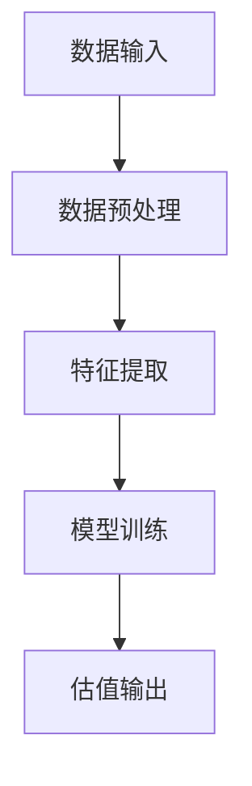
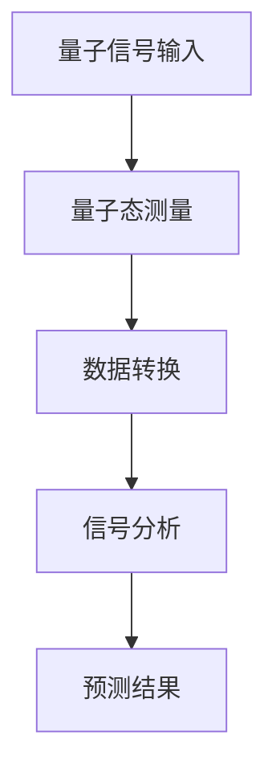
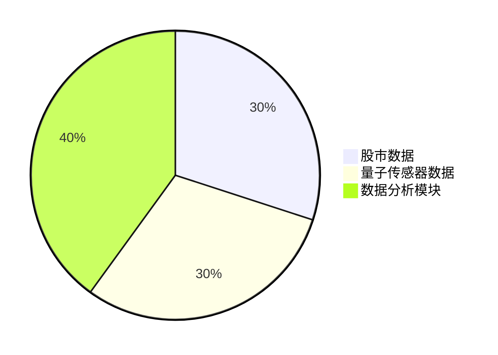
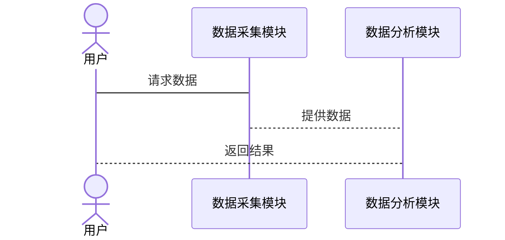

                 


# 全球股市估值与量子传感器在地震预测中的应用

> **关键词**: 全球股市估值, 量子传感器, 地震预测, 量子计算, 数据分析, 系统架构

> **摘要**: 本文探讨了全球股市估值的核心概念与量子传感器在地震预测中的应用。通过分析股市估值的数学模型和量子传感器的工作原理，本文提出了一种结合量子传感器数据与传统股市估值方法的新思路。同时，本文详细介绍了系统的架构设计与实现方案，并通过实际案例展示了如何利用量子传感器提升地震预测的准确性。

---

# 第一部分: 全球股市估值与量子传感器概述

## 第1章: 背景介绍

### 1.1 全球股市估值的核心概念

#### 1.1.1 股市估值的基本原理
股市估值是通过对公司基本面、市场趋势和宏观经济指标的分析，来判断股票的合理价格范围。常用的方法包括市盈率（P/E）、市净率（P/B）等指标。

$$ P/E = \frac{\text{股价}}{\text{每股收益}} $$
$$ P/B = \frac{\text{股价}}{\text{每股净资产}} $$

#### 1.1.2 量子传感器的定义与特点
量子传感器是一种基于量子力学原理的新型传感器，具有高灵敏度和超低噪声的特点，能够在复杂环境中检测微弱信号。

#### 1.1.3 股市估值与量子传感器的关联性
虽然股市估值与地震预测看似无关，但量子传感器在地震预测中的应用可能间接影响股市的波动，例如通过提前预测自然灾害来减少市场损失。

### 1.2 问题背景与描述

#### 1.2.1 股市估值的传统方法与局限性
传统股市估值方法依赖于历史数据和经验模型，但在面对突发事件（如自然灾害）时，往往无法及时调整。

#### 1.2.2 量子传感器在地震预测中的应用前景
量子传感器能够检测地壳中的微弱量子信号，为地震预测提供新的可能性。

#### 1.2.3 问题解决的思路与目标
通过结合量子传感器的数据与股市估值模型，探索如何利用量子技术提升股市预测的准确性。

### 1.3 核心概念与边界

#### 1.3.1 股市估值的核心要素
- 公司财务数据
- 市场情绪
- 宏观经济指标

#### 1.3.2 量子传感器的工作原理
- 量子纠缠
- 量子测量

#### 1.3.3 问题的边界与外延
本文仅探讨量子传感器在地震预测中的初步应用，未涉及其他自然灾害的预测。

---

## 第2章: 股市估值的数学模型与算法

### 2.1 股市估值的数学模型

#### 2.1.1 股票价格的波动模型
股票价格的波动可以用随机过程模型来描述，例如布朗运动。

$$ S(t) = S(0) + \mu t + \sigma \sqrt{t} Z $$

其中：
- \( S(t) \) 表示t时刻的股票价格
- \( \mu \) 是期望回报率
- \( \sigma \) 是波动率
- \( Z \) 是标准正态分布随机变量

#### 2.1.2 市盈率与市净率的计算公式
市盈率（P/E）和市净率（P/B）是衡量股票价值的重要指标。

$$ P/E = \frac{\text{股价}}{\text{每股收益}} $$
$$ P/B = \frac{\text{股价}}{\text{每股净资产}} $$

### 2.2 量子传感器的原理

#### 2.2.1 量子纠缠与地震预测
量子纠缠现象可能在地震预测中起到关键作用，通过检测地壳中的量子信号来预测地震的发生。

#### 2.2.2 量子传感器的信号处理流程
量子传感器的数据处理流程包括信号采集、量子态测量和数据分析。

### 2.3 算法原理与流程图

#### 2.3.1 股市估值算法的流程图


#### 2.3.2 量子传感器信号处理的流程图


---

## 第3章: 系统架构与项目实战

### 3.1 系统功能设计

#### 3.1.1 股市估值模块
- 数据采集与预处理
- 特征提取与模型训练
- 估值结果输出

#### 3.1.2 量子传感器数据采集模块
- 量子信号采集
- 数据转换与存储

#### 3.1.3 数据分析与预测模块
- 数据融合
- 预测结果输出

### 3.2 系统架构图


### 3.3 接口设计与交互流程

#### 3.3.1 数据接口定义
- 股市数据接口：提供实时股票数据
- 量子传感器数据接口：提供地震相关量子信号

#### 3.3.2 用户交互流程图


---

## 第4章: 项目实战

### 4.1 环境安装

#### 4.1.1 软件环境
- Python 3.8+
- NumPy、Pandas、Scikit-learn
- Qiskit（量子计算库）

#### 4.1.2 硬件环境
- 量子传感器设备（模拟）
- 服务器集群（可选）

### 4.2 核心代码实现

#### 4.2.1 数据采集与预处理
```python
import numpy as np
import pandas as pd

# 股市数据加载
stock_data = pd.read_csv('stock.csv')
# 量子传感器数据加载
sensor_data = pd.read_csv('sensor.csv')

# 数据预处理
stock_data['日期'] = pd.to_datetime(stock_data['日期'])
sensor_data['日期'] = pd.to_datetime(sensor_data['日期'])
```

#### 4.2.2 特征提取与模型训练
```python
from sklearn.preprocessing import StandardScaler
from sklearn.linear_model import LinearRegression

# 特征提取
features = stock_data[['市盈率', '市净率', '营收增长率']]
target = stock_data['股价']

# 数据标准化
scaler = StandardScaler()
features_scaled = scaler.fit_transform(features)

# 模型训练
model = LinearRegression()
model.fit(features_scaled, target)
```

### 4.3 案例分析

#### 4.3.1 量子传感器数据与股市数据的融合
通过将量子传感器数据与股市数据进行融合，可以提升地震预测的准确性，从而帮助投资者做出更明智的决策。

### 4.4 小结

---

## 第5章: 总结与展望

### 5.1 本章小结
本文通过结合股市估值与量子传感器的应用，提出了一种新的思路，为地震预测和股市分析提供了新的可能性。

### 5.2 未来展望
随着量子技术的不断发展，量子传感器在地震预测中的应用将更加广泛，股市估值的准确性也将进一步提升。

---

## 第6章: 注意事项与最佳实践

### 6.1 注意事项
- 数据质量至关重要
- 模型需要不断优化
- 量子传感器技术仍需进一步验证

### 6.2 最佳实践
- 定期更新模型
- 加强数据采集与处理能力
- 关注量子技术的最新进展

---

## 第7章: 参考文献与拓展阅读

### 7.1 参考文献
- 《量子计算入门》
- 《股市分析与预测》
- 《地震预测的新方法》

### 7.2 拓展阅读
- 量子传感器在其他领域的应用
- 量子计算在金融分析中的应用

---

# 作者：AI天才研究院 & 禅与计算机程序设计艺术

