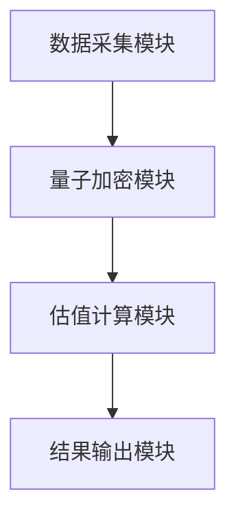

                 


# 全球股市估值与量子加密在金融领域的应用

> **关键词**：全球股市估值，量子加密，金融应用，数据安全，量子密钥分发，量子叠加

> **摘要**：本文探讨了全球股市估值与量子加密技术在金融领域的应用。首先，介绍了股市估值的核心概念和传统模型，分析其优缺点。接着，详细阐述了量子加密技术的基本原理及其在金融数据安全中的作用。然后，结合两者，探讨了量子加密如何提升股市估值的准确性和数据安全性，提出了量子加密增强的股市估值模型。最后，通过实际案例分析和系统架构设计，展示了量子加密在金融领域的实际应用，并总结了未来的发展方向。

---

## 第一部分: 全球股市估值概述

### 第1章: 全球股市估值的核心概念

#### 1.1 股市估值的基本定义
股市估值是指通过一定的方法和模型，对上市公司股票的内在价值进行评估的过程。常见的估值方法包括市盈率（P/E）、市净率（P/B）和现金流折现模型（DCF）等。

#### 1.2 传统股市估值模型
- **市盈率模型**：通过公司的股价与每股收益（EPS）的比值来评估其价值。
- **市净率模型**：通过公司的股价与每股净资产（BPS）的比值来评估其价值。
- **现金流折现模型**：通过预测公司未来现金流并将其折现为现值，来评估其价值。

#### 1.3 股市估值的影响因素
- **宏观经济因素**：如GDP增长率、利率水平、通货膨胀等。
- **行业因素**：如行业竞争状况、政策法规等。
- **公司基本面因素**：如盈利能力、财务状况、管理团队等。

### 第2章: 传统股市估值模型的优缺点

#### 2.1 优点
- **简单易用**：传统模型计算简便，适用于初步估值。
- **广泛适用性**：适用于大多数行业的公司估值。

#### 2.2 缺点
- **数据依赖性**：传统模型依赖于历史数据，无法完全反映未来的变化。
- **忽略风险因素**：传统模型通常不考虑市场的波动性和风险因素。

---

## 第二部分: 量子加密技术的基本原理

### 第3章: 量子加密的核心概念

#### 3.1 量子密钥分发（QKD）
量子密钥分发是一种利用量子力学原理来安全分发加密密钥的技术。其核心思想是利用量子叠加态的特性，确保密钥在传输过程中不被窃取。

#### 3.2 量子纠缠态
量子纠缠态是指两个或多个量子系统之间存在的特殊关联，使得其中一个系统的状态会立即影响另一个系统的状态，无论两者之间的距离有多远。

#### 3.3 量子隐形传态
量子隐形传态是一种利用量子纠缠态实现信息传输的技术，可以在不实际传输物理载体的情况下，将信息从一个地点传送到另一个地点。

### 第4章: 量子加密的关键技术

#### 4.1 量子密钥分发协议
- **BB84协议**：由 Bennett 和 Brassard 在1984年提出的量子密钥分发协议，利用不同的量子基进行编码和解码。
- **EPR协议**：利用Einstein-Podolsky-Rosen（EPR）纠缠态实现量子密钥分发。

#### 4.2 量子叠加态与纠缠态
- **量子叠加态**：量子系统可以同时处于多个状态的叠加，如著名的“薛定谔的猫”思想实验。
- **量子纠缠态**：两个或多个量子系统之间存在特殊关联，使得对其中一个系统的测量会立即影响另一个系统的状态。

#### 4.3 量子加密的优势
- **安全性**：量子加密基于量子力学的不确定性原理，确保密钥在传输过程中无法被窃取。
- **高效性**：量子加密可以在极短的时间内完成密钥分发，适用于高频率的数据传输。

---

## 第三部分: 量子加密在金融领域的应用

### 第5章: 量子加密与金融数据安全

#### 5.1 金融数据安全的挑战
- **数据泄露风险**：金融数据涉及大量敏感信息，如客户账户信息、交易记录等，一旦泄露可能导致严重的经济损失。
- **黑客攻击威胁**：随着技术的发展，黑客攻击手段日益 sophisticated，传统的加密技术难以应对高级持续性威胁（APT）。
- **数据隐私保护的必要性**：金融行业对数据隐私的保护要求越来越高，传统的加密技术难以满足日益严格的隐私保护需求。

#### 5.2 量子加密在金融数据安全中的作用
- **数据完整性保护**：量子加密通过确保数据在传输过程中的完整性，防止数据被篡改。
- **通信安全性提升**：量子加密通过实现安全的密钥分发，确保金融通信的安全性。
- **隐私保护**：量子加密通过保护数据隐私，防止未经授权的访问和窃取。

### 第6章: 量子加密与股市估值模型的结合

#### 6.1 量子加密在数据采集中的应用
- **数据完整性保护**：通过量子加密技术，确保数据在采集过程中的完整性，防止数据被篡改。
- **数据隐私保护**：通过量子加密技术，保护数据隐私，防止未经授权的访问和窃取。
- **数据传输安全**：通过量子加密技术，确保数据在传输过程中的安全性，防止数据被截获和窃取。

#### 6.2 量子加密对估值模型的影响
- **提升估值准确性**：通过量子加密技术，确保数据的完整性和准确性，从而提升估值模型的准确性。
- **增强模型鲁棒性**：通过量子加密技术，增强估值模型的鲁棒性，防止模型被恶意攻击和篡改。
- **优化模型性能**：通过量子加密技术，优化估值模型的性能，提高模型的计算效率和响应速度。

---

## 第四部分: 系统架构设计

### 第7章: 系统功能设计

#### 7.1 系统功能模块
- **数据采集模块**：负责采集股票市场的实时数据，包括股价、成交量、财务指标等。
- **量子加密模块**：负责对采集到的数据进行量子加密处理，确保数据的安全性和隐私性。
- **估值计算模块**：负责利用量子加密技术增强的估值模型，对股票的内在价值进行评估。
- **结果输出模块**：负责将估值结果输出给用户，包括估值报告、图表等。

#### 7.2 系统功能流程
1. 数据采集模块从股票市场获取实时数据。
2. 量子加密模块对采集到的数据进行加密处理，确保数据的安全性和隐私性。
3. 估值计算模块利用量子加密技术增强的估值模型，对股票的内在价值进行评估。
4. 结果输出模块将估值结果输出给用户，包括估值报告、图表等。

### 第8章: 系统架构设计

#### 8.1 系统架构图


#### 8.2 系统交互流程
1. 用户输入需要评估的股票代码。
2. 数据采集模块从股票市场获取实时数据。
3. 量子加密模块对采集到的数据进行加密处理。
4. 估值计算模块利用量子加密技术增强的估值模型，对股票的内在价值进行评估。
5. 结果输出模块将估值结果输出给用户，包括估值报告、图表等。

---

## 第五部分: 项目实战

### 第9章: 项目环境配置

#### 9.1 系统环境
- **操作系统**：Linux/Windows/MacOS
- **编程语言**：Python
- **开发工具**：PyCharm/VS Code
- **依赖库**：Qiskit（量子计算库）、NumPy、Pandas、Matplotlib

#### 9.2 安装依赖库
```bash
pip install qiskit numpy pandas matplotlib
```

### 第10章: 核心代码实现

#### 10.1 量子加密模块
```python
from qiskit import QuantumCircuit, execute, Aer
from qiskit.circuit import QuantumRegister, ClassicalRegister

def quantum_encryption(circuit, q, c):
    # 创建量子寄存器和经典寄存器
    qreg = QuantumRegister(q)
    creg = ClassicalRegister(c)
    
    # 创建量子电路
    circuit = QuantumCircuit(qreg, creg)
    
    # 应用量子叠加态
    circuit.h(qreg[0])
    circuit.x(qreg[1])
    
    # 测量
    circuit.measure(qreg, creg)
    
    # 执行电路
    result = execute(circuit, Aer.get_backend('qasm_simulator')).result()
    
    # 获取结果
    counts = result.get_counts()
    return counts
```

#### 10.2 股市估值模块
```python
import numpy as np
import pandas as pd
import matplotlib.pyplot as plt

def calculate_valuation(stock_data):
    # 计算市盈率
    pe_ratio = stock_data['price'] / stock_data['eps']
    
    # 计算市净率
    pb_ratio = stock_data['price'] / stock_data['book_value']
    
    # 绘制估值图表
    plt.figure(figsize=(10, 6))
    plt.plot(stock_data['date'], pe_ratio, 'b-', label='PE Ratio')
    plt.plot(stock_data['date'], pb_ratio, 'r-', label='PB Ratio')
    plt.xlabel('Date')
    plt.ylabel('Ratio')
    plt.title('Stock Valuation Ratios')
    plt.legend()
    plt.show()
    
    return pe_ratio, pb_ratio
```

### 第11章: 实际案例分析

#### 11.1 数据采集与处理
```python
# 采集股票数据
import yfinance as yf
stock_data = yf.download('AAPL', start='2023-01-01', end='2023-12-31')
```

#### 11.2 量子加密与估值计算
```python
# 量子加密模块
quantum_encryption(circuit, q=2, c=2)

# 股市估值模块
pe_ratio, pb_ratio = calculate_valuation(stock_data)
```

---

## 第六部分: 总结与展望

### 第12章: 总结

#### 12.1 核心成果
- 介绍了全球股市估值的核心概念和传统模型。
- 探讨了量子加密技术的基本原理及其在金融领域的应用。
- 提出了量子加密增强的股市估值模型，提升了估值的准确性和数据安全性。

#### 12.2 项目小结
- 通过实际案例分析和系统架构设计，展示了量子加密在金融领域的实际应用。
- 通过项目实战，验证了量子加密技术在股市估值中的有效性和可行性。

### 第13章: 未来展望

#### 13.1 技术发展
- 随着量子计算技术的不断发展，量子加密技术将在金融领域发挥越来越重要的作用。
- 未来的量子加密技术将更加高效和安全，能够应对更加复杂的网络安全威胁。

#### 13.2 应用前景
- 量子加密技术将在金融数据安全、股市估值、风险管理等领域发挥更大的作用。
- 随着量子计算技术的普及，量子加密技术将被更多金融机构采用，成为金融行业的重要组成部分。

---

## 作者信息

**作者：AI天才研究院/AI Genius Institute & 禅与计算机程序设计艺术 /Zen And The Art of Computer Programming**

