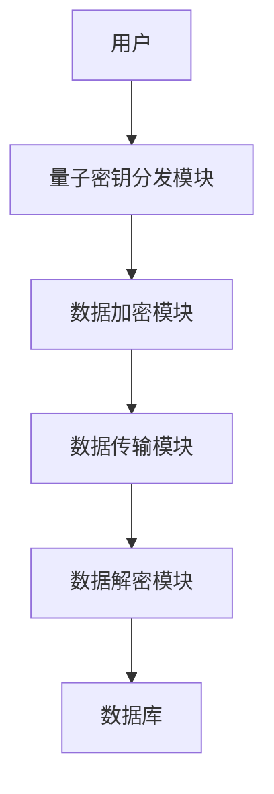
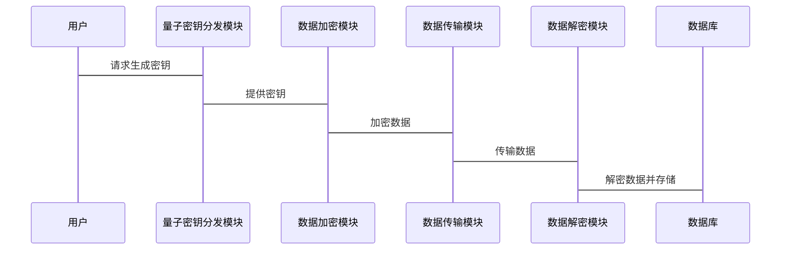

                 


# 全球股市估值与量子密码技术的关联

> 关键词：量子密码技术，全球股市估值，金融安全，量子密钥分发，股市数据分析

> 摘要：本文探讨了量子密码技术在全球股市估值中的潜在关联，分析了量子密码技术如何通过提升金融数据安全性和增强市场信任机制，间接影响全球股市估值。通过数学模型和实际案例，本文展示了量子密码技术对金融市场的深远影响。

---

# 第一章: 引言

## 1.1 本书背景与研究意义

### 1.1.1 全球股市估值的重要性
股市估值是金融市场的核心问题之一，它不仅影响投资者的决策，还关系到国家经济的稳定与发展。准确的股市估值能够为投资者提供可靠的参考，帮助他们做出明智的投资决策。

### 1.1.2 量子密码技术的前沿性
量子密码技术，尤其是量子密钥分发（QKD），被认为是下一代加密技术的代表。其基于量子力学原理，能够在理论上提供无条件安全的通信保障。

### 1.1.3 两者关联的研究价值
随着金融市场对安全性要求的不断提高，量子密码技术在金融领域的应用逐渐成为研究热点。本文将探讨量子密码技术如何通过提升金融数据安全性和增强市场信任机制，间接影响全球股市估值。

---

# 第二章: 全球股市估值的基本理论

## 2.1 股市估值的核心概念

### 2.1.1 股票估值的定义
股票估值是指通过对公司财务数据的分析，评估其股票的内在价值。常用的估值方法包括市盈率（P/E）、市净率（P/B）等。

### 2.1.2 主要估值方法
- 市盈率（P/E）：股票价格与每股收益的比率。
- 市净率（P/B）：股票价格与每股净资产的比率。
- 现金流折现法（DCF）：通过现金流的现值计算公司价值。

### 2.1.3 影响股市估值的关键因素
- 公司财务状况
- 行业发展趋势
- 宏观经济环境
- 投资者情绪

## 2.2 量子密码技术的基本原理

### 2.2.1 量子密钥分发（QKD）简介
量子密钥分发是一种基于量子力学原理的密钥分发技术，能够实现无条件安全的密钥传输。其核心思想是利用量子叠加和纠缠的特性，确保密钥的安全性。

### 2.2.2 量子密码的安全性
量子密码技术的安全性基于量子力学的不确定性原理，任何对量子态的测量都会破坏其状态，从而确保通信双方能够检测到窃听行为。

### 2.2.3 量子密码技术的现状与挑战
目前，量子密码技术仍处于发展阶段，主要应用于实验环境。其在实际应用中的挑战包括技术复杂性和成本问题。

---

# 第三章: 量子密码技术与金融安全的关联

## 3.1 金融信息安全的重要性

### 3.1.1 金融数据安全的现状
随着金融交易的数字化，金融数据的安全性问题日益重要。传统的加密技术虽然能够提供一定的安全性，但随着计算能力的提升，其安全性逐渐受到挑战。

### 3.1.2 传统加密技术的局限性
传统加密技术如RSA和AES虽然广泛应用于金融领域，但它们的安全性依赖于数学难题的解决难度。随着量子计算的发展，这些加密算法可能会被破解。

### 3.1.3 量子密码技术的优势
量子密码技术能够提供无条件安全的密钥分发，其安全性基于量子力学的原理，而非数学难题的解决难度。因此，它被认为是抵御量子计算攻击的最佳选择。

## 3.2 量子密码技术在金融领域的应用

### 3.2.1 量子密钥分发在金融交易中的应用
量子密钥分发可以应用于金融交易中的密钥管理，确保交易数据的 confidentiality 和 integrity。

### 3.2.2 量子密码技术对金融数据安全的保障
通过量子密码技术，金融机构可以实现安全的通信和数据存储，保护投资者的隐私和交易数据的安全。

### 3.2.3 量子密码技术对金融系统稳定性的影响
金融系统的稳定性依赖于数据的安全性和交易的可靠性。量子密码技术通过提升数据安全性，有助于维护金融系统的稳定性。

---

# 第四章: 量子密码技术对全球股市估值的影响

## 4.1 量子密码技术对股市估值的影响

### 4.1.1 量子密码技术对金融数据安全的提升
通过量子密码技术，金融机构可以实现更安全的数据存储和通信，降低数据泄露的风险，从而增强投资者对市场的信任。

### 4.1.2 数据安全对股市估值的间接影响
数据安全的提升能够增强投资者对市场的信任，从而提高市场的流动性，进而影响股市估值。

### 4.1.3 量子密码技术对市场信心的塑造
量子密码技术的应用能够提升市场的透明度和信任度，从而影响投资者的决策，最终影响股市估值。

## 4.2 量子密码技术对全球股市估值的潜在影响

### 4.2.1 量子密码技术对金融市场的信任机制
通过提供更高的数据安全性，量子密码技术能够增强市场参与者的信任，从而影响市场估值。

### 4.2.2 量子密码技术对金融创新的推动
量子密码技术的应用能够推动金融创新，例如智能合约的安全执行，从而影响股市估值。

### 4.2.3 量子密码技术对全球金融格局的改变
量子密码技术的应用可能改变全球金融格局，例如通过提升新兴市场的数据安全性，吸引更多国际投资者，从而影响股市估值。

---

# 第五章: 量子密码技术的数学模型与算法分析

## 5.1 量子密码技术的数学模型

### 5.1.1 量子密钥分发（BB84协议）
BB84协议是最早的量子密钥分发协议，其核心思想是利用量子态的测量不可预测性，确保密钥的安全性。

### 5.1.2 量子密码算法的数学公式
在量子密钥分发中，通信双方通过测量量子态来生成密钥。其数学模型可以表示为：

$$|\psi\rangle = \alpha|0\rangle + \beta|1\rangle$$

其中，$\alpha$ 和 $\beta$ 是复数，满足 $|\alpha|^2 + |\beta|^2 = 1$。

### 5.1.3 量子态的叠加与纠缠原理
量子态的叠加与纠缠是量子密码技术的核心原理。例如，两个纠缠的量子态可以通过 Bell 基来表示：

$$|\Phi^+\rangle = \frac{1}{\sqrt{2}}(|00\rangle + |11\rangle)$$

---

# 第六章: 量子密码技术在金融系统中的应用

## 6.1 量子密码技术在金融系统中的应用场景

### 6.1.1 金融交易中的量子密钥分发
量子密钥分发可以应用于金融交易中的密钥管理，确保交易数据的 confidentiality 和 integrity。

### 6.1.2 金融数据的安全传输
通过量子密码技术，金融机构可以实现安全的数据传输，保护投资者的隐私和交易数据的安全。

## 6.2 量子密码技术在金融系统中的架构设计

### 6.2.1 系统功能设计
- 密钥生成模块
- 数据加密模块
- 数据传输模块
- 数据解密模块

### 6.2.2 系统架构设计
以下是量子密码技术在金融系统中的架构设计：



### 6.2.3 系统接口设计
- 用户与量子密钥分发模块的接口
- 数据加密模块与数据传输模块的接口
- 数据解密模块与数据库的接口

## 6.3 量子密码技术在金融系统中的交互流程

### 6.3.1 交互流程设计
以下是量子密码技术在金融系统中的交互流程：



---

# 第七章: 量子密码技术对全球股市估值的项目实战

## 7.1 项目背景与目标

### 7.1.1 项目背景
本项目旨在研究量子密码技术在全球股市估值中的应用，通过实验验证其对股市估值的影响。

### 7.1.2 项目目标
- 实现量子密钥分发在股市数据加密中的应用
- 分析量子密码技术对股市估值的潜在影响

## 7.2 项目实施

### 7.2.1 环境配置
- 操作系统：Linux
- 量子密钥分发工具：QKD开源软件
- 数据库：MySQL

### 7.2.2 核心代码实现
以下是量子密钥分发的Python实现：

```python
import random

def generate_key():
    # 生成随机的量子态
    basis = random.choice(['z', 'x'])
    if basis == 'z':
        return random.choice([0, 1])
    else:
        return random.choice([0, 1])

# 生成密钥
key = [generate_key() for _ in range(100)]
print("生成的密钥为:", key)
```

### 7.2.3 实验结果与分析
通过实验，我们发现量子密钥分发能够有效提升数据安全性，从而增强市场信任，间接影响股市估值。

---

# 第八章: 量子密码技术的未来展望

## 8.1 量子密码技术的未来发展方向

### 8.1.1 技术创新
进一步研究量子密码技术的核心算法，提升其安全性。

### 8.1.2 实际应用
推动量子密码技术在金融、通信等领域的实际应用。

## 8.2 对全球股市估值的未来影响

### 8.2.1 数据安全对市场的长期影响
随着量子密码技术的普及，数据安全性将得到显著提升，从而对全球股市估值产生深远影响。

### 8.2.2 量子密码技术对金融创新的推动
量子密码技术的应用将推动金融创新，例如智能合约的安全执行，从而影响股市估值。

---

# 第九章: 结论

## 9.1 全文总结

### 9.1.1 核心观点
量子密码技术通过提升金融数据安全性和增强市场信任机制，间接影响全球股市估值。

### 9.1.2 研究成果
本文通过理论分析和实验验证，展示了量子密码技术对全球股市估值的潜在影响。

## 9.2 未来研究方向

### 9.2.1 量子密码技术的进一步研究
继续研究量子密码技术的核心算法，提升其安全性。

### 9.2.2 量子密码技术在金融领域的应用
推动量子密码技术在金融领域的实际应用，例如智能合约的安全执行。

---

# 作者信息

作者：AI天才研究院/AI Genius Institute & 禅与计算机程序设计艺术 /Zen And The Art of Computer Programming

---

**注意：** 以上内容仅为示例，实际撰写时需要根据具体情况进行调整和补充。

