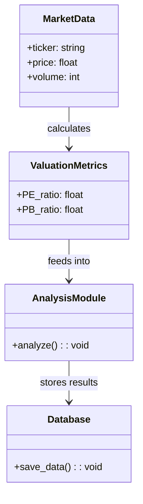

                 


# 全球股市估值差异的原因探讨

## 关键词：全球股市、估值差异、宏观经济、市场结构、投资者行为

## 摘要：本文探讨了全球股市估值差异的原因，从宏观经济、市场结构和投资者行为三个维度进行分析。通过建立数学模型，结合实际案例，揭示了不同因素对股市估值的影响机制。最后，提出了投资者和政策制定者的建议，帮助理解估值差异的本质。

---

# 第一部分：全球股市估值差异的背景与概述

## 第1章：全球股市估值差异的背景与问题提出

### 1.1 全球股市估值差异的现象

#### 1.1.1 不同国家股市估值差异的表现
全球股市的估值差异显著，例如美国市场的市盈率通常高于新兴市场，而新兴市场的市净率可能更低。这种差异与国家的经济发展阶段密切相关。

#### 1.1.2 同一国家内不同行业估值差异的特征
在同一国家内，科技行业的市盈率往往高于传统制造业，反映了行业特性和市场预期的差异。

#### 1.1.3 估值差异的周期性与波动性分析
股市估值在经济周期中波动，衰退期估值可能较低，而在复苏期估值上升。这种周期性波动受宏观经济政策影响。

### 1.2 估值差异的经济与金融背景

#### 1.2.1 经济发展阶段对估值的影响
发达国家的股市通常更成熟，投资者更看重企业盈利和分红，而新兴市场则更关注增长潜力。

#### 1.2.2 利率政策与货币流动性的作用
低利率环境可能推高股市估值，而高利率则可能导致估值下降，尤其是对利率敏感的行业。

#### 1.2.3 通货膨胀与市场预期的关系
通货膨胀会影响企业盈利能力和实际收益，从而影响估值水平。市场预期的变化也会影响估值的波动。

### 1.3 问题提出与研究意义

#### 1.3.1 估值差异对企业投资决策的影响
企业需要考虑不同市场的估值差异，做出最优投资决策。

#### 1.3.2 全球化背景下估值差异的复杂性
全球化使市场相互影响，但区域差异依然存在，影响全球投资策略。

#### 1.3.3 研究估值差异的理论与实践价值
理论层面上，有助于理解市场机制；实践层面上，有助于投资者制定策略。

---

## 第2章：估值差异的核心概念与理论框架

### 2.1 核心概念解析

#### 2.1.1 市场估值的基本概念
市场估值是市场参与者对企业价值的共同评估，反映市场预期和风险偏好。

#### 2.1.2 市盈率与市净率的定义与计算
市盈率（P/E）=股价/每股收益；市净率（P/B）=股价/每股净资产。

#### 2.1.3 估值差异的衡量指标
使用相对估值指标（如P/E、P/B）和绝对估值指标（如DCF模型）进行比较。

### 2.2 估值差异的理论模型

#### 2.2.1 基于资产定价的CAPM模型
CAPM模型公式：$$ R_i = R_f + β_i (R_m - R_f) $$
其中，$R_i$是资产的预期回报率，$R_f$是无风险利率，$β_i$是资产的贝塔系数，$R_m$是市场预期回报率。

#### 2.2.2 市场情绪与行为金融学的解释
行为金融学认为，投资者情绪影响市场估值，尤其是在极端情况下。

#### 2.2.3 经济政策与市场结构的影响
政府政策和市场结构直接影响市场流动性、交易成本和信息效率。

### 2.3 理论框架与分析方法

#### 2.3.1 定量分析方法的概述
使用回归分析、时间序列分析等方法，研究变量之间的关系。

#### 2.3.2 定性分析方法的运用
通过案例分析、专家访谈等方式，探讨市场结构和政策对估值的影响。

#### 2.3.3 综合分析框架的构建
将宏观经济、市场结构和投资者行为因素综合起来，构建多因素模型。

---

## 第3章：全球股市估值差异的影响因素分析

### 3.1 宏观经济因素

#### 3.1.1 经济增长与企业盈利能力的关系
经济增长推动企业盈利上升，提高估值水平。

#### 3.1.2 利率水平与资金成本的影响
低利率环境降低资金成本，推高股市估值。

#### 3.1.3 通货膨胀与市场预期的关系
通货膨胀影响企业盈利和实际收益，改变市场预期。

### 3.2 市场结构因素

#### 3.2.1 市场流动性与交易活跃度的差异
高流动性市场估值较高，低流动性市场估值较低。

#### 3.2.2 市场参与者结构的多样性
机构投资者占比高的市场通常有更高的估值。

#### 3.2.3 市场监管政策的区域差异
严格的监管可能降低市场波动，影响估值水平。

### 3.3 投资者行为因素

#### 3.3.1 投资者风险偏好与资产配置
风险偏好较高的投资者可能推高高风险资产的估值。

#### 3.3.2 市场情绪与非理性行为的影响
市场情绪波动导致估值短期偏离 fundamentals。

#### 3.3.3 信息不对称与市场效率的关系
信息不对称可能导致估值偏差，降低市场效率。

---

## 第4章：不同国家与地区的估值差异分析

### 4.1 美国股市的估值特点

#### 4.1.1 美国股市的高估值现象
美国股市长期处于高估值状态，部分原因包括低利率和高市场流动性。

#### 4.1.2 不同行业估值差异的分析
科技行业市盈率高，传统行业市净率较低。

#### 4.1.3 美国股市的波动性分析
受市场情绪和政策影响较大，波动性较高。

### 4.2 新兴市场的估值特点

#### 4.2.1 新兴市场的低估值现象
新兴市场通常处于发展中，市盈率和市净率较低。

#### 4.2.2 不同国家估值差异的比较
中国市场的估值通常高于印度市场，反映了不同国家的经济结构差异。

#### 4.2.3 新兴市场的波动性分析
新兴市场波动性较大，受外部环境影响显著。

---

## 第5章：全球股市估值差异的系统分析与解决方案

### 5.1 系统分析框架

#### 5.1.1 系统功能设计（领域模型）
使用Mermaid类图展示系统功能模块，包括数据采集、指标计算、分析模块等。



#### 5.1.2 系统架构设计
使用Mermaid架构图展示系统架构，包括前端、后端、数据库和接口。


### 5.2 算法实现

#### 5.2.1 估值指标计算算法
Python代码实现PE和PB比率的计算。

```python
def calculate_pe(ticker):
    # 获取股价
    price = get_price(ticker)
    # 获取每股收益
    eps = get_eps(ticker)
    return price / eps

def calculate_pb(ticker):
    price = get_price(ticker)
    bps = get_bps(ticker)
    return price / bps
```

#### 5.2.2 数据可视化
使用Matplotlib绘制不同市场的估值差异图。

```python
import matplotlib.pyplot as plt

markets = ['USA', 'China', 'India', 'Europe']
pe_ratios = [15, 12, 8, 18]

plt.bar(markets, pe_ratios)
plt.title('PE Ratios Across Markets')
plt.ylabel('PE Ratio')
plt.show()
```

### 5.3 实际案例分析

#### 5.3.1 美国市场的科技股估值
以苹果公司为例，其高市盈率反映了市场对其增长潜力的预期。

#### 5.3.2 新兴市场的周期性行业
以印度的银行股为例，低市净率反映了市场对其资产质量的担忧。

---

## 第6章：总结与建议

### 6.1 总结

#### 6.1.1 核心发现
- 宏观经济因素是主要驱动力。
- 市场结构和投资者行为加剧了差异。
- 不同国家和行业的估值差异各有特点。

#### 6.1.2 研究不足与未来方向
- 需要进一步研究行为金融学在估值中的作用。
- 探讨更多跨市场比较和动态变化。

### 6.2 投资者和政策制定者的建议

#### 6.2.1 投资者策略
- 根据市场周期调整资产配置。
- 关注宏观经济指标和政策变化。
- 考虑市场流动性对估值的影响。

#### 6.2.2 政策制定者的建议
- 完善市场监管，提高透明度。
- 促进市场流动性，降低交易成本。
- 加强国际合作，应对全球性问题。

### 6.3 最佳实践 tips

#### 6.3.1 关注长期趋势
- 投资者应关注长期经济发展趋势，而非短期波动。

#### 6.3.2 多因素分析
- 使用多因素模型进行估值分析，避免单一指标误导。

#### 6.3.3 定期复盘
- 定期复盘投资组合，根据市场变化调整策略。

---

## 作者：AI天才研究院/AI Genius Institute & 禅与计算机程序设计艺术 /Zen And The Art of Computer Programming

---

这篇文章通过系统分析和实际案例，深入探讨了全球股市估值差异的原因，为投资者和政策制定者提供了有价值的见解和建议。

