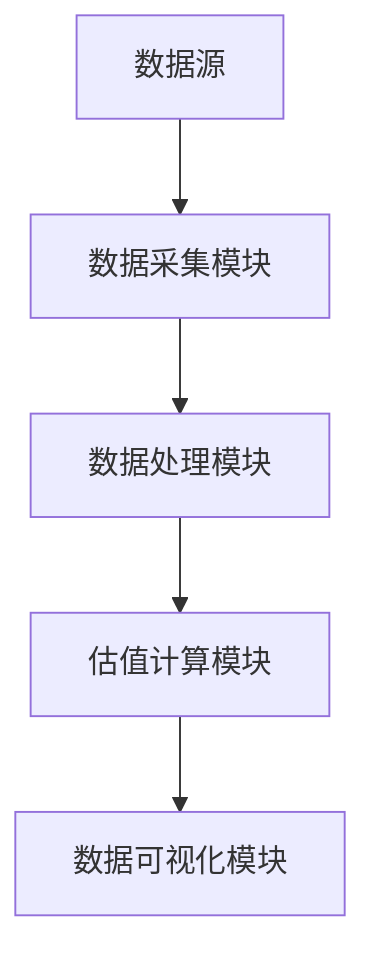

                 


# 全球股市估值的历史高低值分析

> 关键词：股市估值，市盈率，市净率，历史数据分析，投资策略

> 摘要：本文详细分析了全球股市估值的历史变化，重点探讨了市盈率、市净率等核心指标的计算与应用，结合实际案例，分析了低估值与高估值区域的投资机会与风险，并提出了基于历史数据分析的投资策略。

---

## 第1章: 股市估值的基本概念与背景介绍

### 1.1 股市估值的核心概念

#### 1.1.1 股票估值的定义与作用
股票估值是指通过对公司财务数据和市场情况的分析，对其股票的内在价值进行评估的过程。估值的目的是为了判断股票是否被市场高估或低估，从而为投资决策提供依据。

#### 1.1.2 市盈率、市净率等核心指标解析
- **市盈率（P/E）**：计算公式为 $$P/E = \frac{股票价格}{每股收益}$$。市盈率反映了投资者对股票未来收益的预期，低市盈率可能意味着低估，高市盈率可能意味着高风险。
- **市净率（P/B）**：计算公式为 $$P/B = \frac{股票价格}{每股净资产}$$。市净率适用于评估资产密集型行业，如银行和制造业。
- **股息率**：计算公式为 $$D/P = \frac{每股股息}{股票价格}$$。股息率高的股票通常被视为收益稳定的蓝筹股。

#### 1.1.3 股市估值的历史演变与现状
股市估值随着经济发展和市场环境的变化而波动。历史上，市盈率和市净率的高低变化反映了市场的繁荣与衰退。例如，2008年金融危机后，全球股市估值普遍下降，随后逐步恢复。

---

## 第2章: 股市估值的核心概念与联系

### 2.1 核心概念原理

#### 2.1.1 市盈率（P/E）的计算与应用
市盈率通过 $$P/E = \frac{P}{E}$$ 计算，其中P为股票价格，E为每股收益。市盈率的高低反映了市场对公司的未来盈利预期。例如，假设某公司股票价格为50元，每股收益为5元，则 $$P/E = 10$$，表明市场对其未来盈利的合理预期。

#### 2.1.2 市净率（P/B）的计算与应用
市净率通过 $$P/B = \frac{P}{B}$$ 计算，其中P为股票价格，B为每股净资产。市净率适用于评估资产密集型行业，如银行和制造业。例如，某公司股票价格为30元，每股净资产为15元，则 $$P/B = 2$$，表明股票价格合理。

#### 2.1.3 股息率与股息支付率的计算与应用
股息率 $$D/P = \frac{D}{P}$$ 反映了股票的分红能力，高股息率的股票通常被视为低风险投资。例如，某公司股息为2元，股票价格为50元，则 $$D/P = 4\%$$。

### 2.2 核心概念对比与特征分析

| 指标       | 计算公式       | 适用场景               | 优点                     | 缺点                     |
|------------|----------------|------------------------|--------------------------|--------------------------|
| 市盈率 (P/E)| $$P/E = P/E$$  | 评估盈利预期           | 反映市场对未来的预期     | 易受净利润 manipulation 影响 |
| 市净率 (P/B)| $$P/B = P/B$$  | 资产密集型行业         | 考虑资产价值             | 不适用于轻资产行业       |
| 股息率 (D/P)| $$D/P = D/P$$  | 评估分红能力           | 收益稳定                 | 受公司利润影响           |

---

## 第3章: 股市估值的算法原理与数学模型

### 3.1 常用估值方法的数学模型

#### 3.1.1 市盈率法
$$P/E = \frac{P}{E}$$
- 优点：简单易懂，反映市场对盈利的预期。
- 缺点：受净利润 manipulation 影响较大。

#### 3.1.2 市净率法
$$P/B = \frac{P}{B}$$
- 优点：适用于资产密集型行业。
- 缺点：不考虑盈利能力。

#### 3.1.3 股息率法
$$D/P = \frac{D}{P}$$
- 优点：反映分红能力。
- 缺点：受公司利润影响。

### 3.2 历史高低值分析的算法流程

1. **数据收集与清洗**：获取全球股市的历史数据，清洗缺失值和异常值。
2. **估值指标计算**：根据公式计算市盈率、市净率等指标。
3. **历史数据的可视化与趋势分析**：通过图表分析估值指标的波动趋势。

---

## 第4章: 系统分析与架构设计方案

### 4.1 问题场景介绍

- **问题背景**：全球股市数据多样且复杂，需要高效的系统进行分析。
- **系统需求**：支持多市场数据采集、估值计算和可视化。

### 4.2 系统功能设计

#### 4.2.1 数据采集模块
- 从金融数据源（如Yahoo Finance）获取数据。

#### 4.2.2 数据处理模块
- 清洗数据，处理缺失值。

#### 4.2.3 估值计算模块
- 计算市盈率、市净率等指标。

#### 4.2.4 数据可视化模块
- 生成估值趋势图。

### 4.3 系统架构设计



---

## 第5章: 项目实战与案例分析

### 5.1 环境安装与数据准备

- **工具安装**：安装Python和Pandas。
- **数据获取**：从Yahoo Finance获取全球股市数据。

### 5.2 核心算法实现

```python
import pandas as pd

# 数据获取与清洗
data = pd.read_csv('global_stock_data.csv')
data.dropna(inplace=True)

# 估值计算
data['P/E'] = data['Price'] / data['Earnings']
data['P/B'] = data['Price'] / data['Book Value']
```

### 5.3 实际案例分析

#### 5.3.1 美国股市的历史估值分析
- 美国股市在2008年金融危机后市盈率显著下降，随后逐步恢复。

#### 5.3.2 欧洲股市的历史估值分析
- 欧洲股市在2010年欧债危机期间市净率显著下降。

#### 5.3.3 亚洲股市的历史估值分析
- 亚洲股市在2020年新冠疫情期间市盈率显著波动。

---

## 第6章: 投资策略与最佳实践

### 6.1 基于历史估值的低买高卖策略

- **低估值区域的识别**：市盈率和市净率均低于历史平均水平的区域。
- **高估值区域的识别**：市盈率和市净率均高于历史平均水平的区域。

### 6.2 投资组合优化与风险管理

- **多市场估值比较**：分散投资以降低风险。
- **风险控制**：设置止损点，避免重大损失。

---

## 小结

本文详细分析了全球股市估值的历史变化，结合实际案例，提出了基于历史数据分析的投资策略。通过本文的分析，读者可以更好地理解股市估值的核心概念和实际应用。

---

作者：AI天才研究院/AI Genius Institute & 禅与计算机程序设计艺术 /Zen And The Art of Computer Programming

