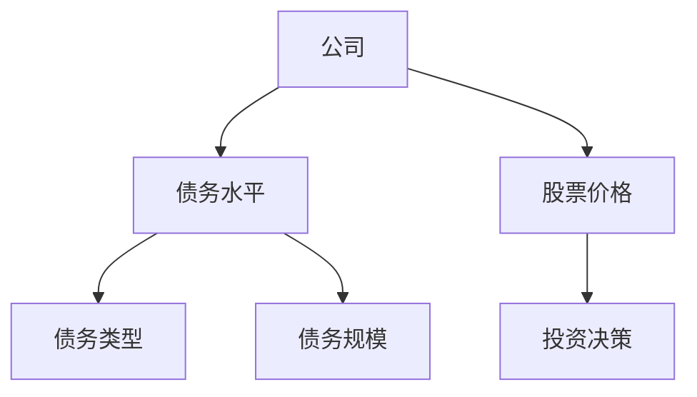
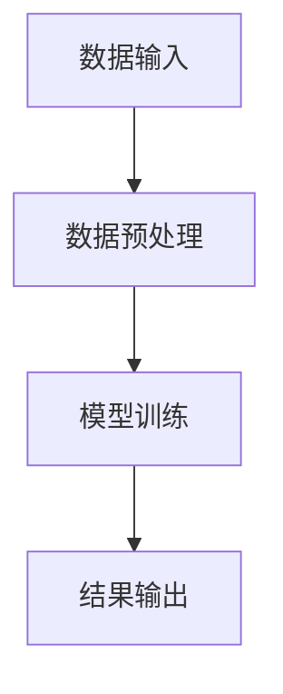
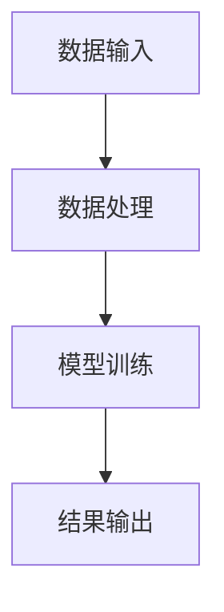
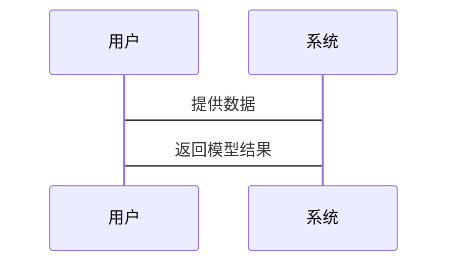

                 


# 公司债务水平与特价股票投资的关系

## 关键词：公司债务，特价股票，投资关系，数学模型，实证分析，风险管理

## 摘要：本文系统分析了公司债务水平与特价股票投资之间的相互作用关系。通过理论模型构建、算法实现、系统分析和项目实战，探讨了债务水平对公司股价的影响机制，并提出基于债务水平的投资策略和风险管理方法，为投资者提供理论依据和实践指导。

---

# 第一部分: 公司债务水平与特价股票投资关系的背景介绍

## 第1章: 问题背景与研究意义

### 1.1 问题背景

#### 1.1.1 公司债务水平的定义与影响
公司债务水平是指企业在一定时期内，通过借款或其他债务工具筹集的资本总额。债务水平的高低直接影响企业的财务健康状况、偿债能力以及经营风险。高债务水平可能导致企业面临更大的财务压力，甚至引发债务危机，而适度的债务水平则有助于企业优化资本结构，提升经营效率。

#### 1.1.2 特价股票投资的基本概念
特价股票是指低于市场价或历史价的股票，通常出现在市场低迷、公司业绩不佳或行业周期性调整的时期。特价股票的投资机会往往伴随着高风险，但同时也可能带来超额收益。

#### 1.1.3 问题提出：债务与股票投资的关系
债务水平与股票投资之间存在复杂的互动关系。高债务水平可能降低公司的信用评级，进而影响股价；同时，股价的波动又会反过来影响公司的债务负担。特价股票的投资机会与公司的债务水平密切相关，因此研究两者的关系具有重要的理论和实践意义。

### 1.2 研究意义

#### 1.2.1 理论意义
本研究从理论上探讨了公司债务水平与股票价格之间的动态关系，揭示了债务水平对股票价格的影响机制，为资本结构理论和金融市场理论提供了新的视角。

#### 1.2.2 实践意义
本研究为投资者提供了基于债务水平的股票投资策略，帮助投资者在复杂市场环境中做出更明智的投资决策，同时为企业优化资本结构、降低财务风险提供了实践指导。

## 第2章: 核心概念与联系

### 2.1 核心概念原理

#### 2.1.1 公司债务水平的构成要素
- 债务类型：包括短期债务和长期债务。
- 债务规模：指公司总债务的规模。
- 债务成本：包括利息支出和融资费用。
- 偿债能力：包括流动比率、速动比率等财务指标。

#### 2.1.2 特价股票投资的核心要素
- 股票价格：指股票的市场价。
- 投资时机：选择合适的时间点进行投资。
- 投资风险：包括市场风险和公司特风险。

### 2.2 概念属性特征对比

#### 2.2.1 债务水平与股票价格的属性对比

| 属性          | 债务水平                | 股票价格               |
|---------------|------------------------|------------------------|
| 计量方式      | 总债务规模             | 市场交易价格           |
| 时间维度      | 短期与长期债务         | 短期波动与长期趋势     |
| 影响因素      | 利率水平、企业盈利      | 市场情绪、企业盈利      |
| 风险类型      | 财务风险、流动性风险     | 市场风险、特异风险     |

#### 2.2.2 特价股票与普通股票的特征差异

| 特征          | 特价股票               | 普通股票               |
|---------------|------------------------|------------------------|
| 价格水平      | 低于市场价             | 市场价或历史价          |
| 投资风险      | 高风险                 | 中等风险               |
| 投资机会      | 机会窗口期             | 连续投资机会           |
| 市场反应       | 市场反应较弱            | 市场反应较为敏感        |

### 2.3 ER实体关系图



---

# 第二部分: 公司债务水平与特价股票投资的理论模型

## 第3章: 数学模型与公式推导

### 3.1 模型构建

#### 3.1.1 假设条件
- 公司的债务水平与股票价格存在线性关系。
- 市场环境稳定，无重大突发事件影响。

#### 3.1.2 模型假设
- 债务水平对股票价格具有显著影响。
- 特价股票的投资机会与债务水平密切相关。

#### 3.1.3 模型构建过程
基于线性回归模型，建立债务水平与股票价格之间的关系模型。

### 3.2 数学公式

#### 3.2.1 债务水平对股票价格的影响公式
$$ P = \beta_1 D + \beta_2 X + \epsilon $$
其中，$P$为股票价格，$D$为债务水平，$X$为其他影响因素，$\epsilon$为误差项。

#### 3.2.2 实证分析中的回归模型
$$ \hat{P} = \hat{\beta_1} D + \hat{\beta_2} X $$

### 3.3 案例分析

#### 3.3.1 案例背景
以某公司为例，假设其债务水平为$D$，其他因素为$X$，股票价格为$P$。

#### 3.3.2 数据来源与处理
数据来源包括公司财务报表、股票市场数据等。

#### 3.3.3 模型应用与结果
通过回归分析，得出$\beta_1$和$\beta_2$的估计值，并验证模型的显著性。

---

## 第4章: 算法原理与实现

### 4.1 算法原理

#### 4.1.1 回归分析原理
回归分析是一种统计学方法，用于研究变量之间的关系。在线性回归中，我们假设因变量与自变量之间存在线性关系。

#### 4.1.2 时间序列分析原理
时间序列分析用于研究数据随时间的变化趋势和周期性。

#### 4.1.3 算法选择依据
根据数据特征和研究目标选择合适的算法。

### 4.2 算法实现

#### 4.2.1 算法流程



#### 4.2.2 代码实现

```python
import pandas as pd
import numpy as np
from sklearn.linear_model import LinearRegression

# 数据预处理
data = pd.read_csv('data.csv')
X = data[['债务水平', '其他因素']]
y = data['股票价格']

# 模型训练
model = LinearRegression()
model.fit(X, y)

# 模型结果
coefficients = model.coef_
intercept = model.intercept_
print(f'回归系数：{coefficients}')
print(f'截距：{intercept}')
```

---

## 第5章: 系统分析与架构设计

### 5.1 项目背景

#### 5.1.1 问题场景介绍
研究公司债务水平与特价股票投资的关系，旨在为投资者提供科学的投资决策支持。

#### 5.1.2 项目介绍
本项目通过构建数学模型和算法，分析债务水平对股票价格的影响，并提出基于债务水平的投资策略。

### 5.2 系统功能设计

#### 5.2.1 领域模型


#### 5.2.2 系统架构



### 5.3 系统接口设计

#### 5.3.1 输入接口
- 数据输入：公司财务数据、股票市场数据。

#### 5.3.2 输出接口
- 模型结果：回归系数、预测股价。

### 5.4 系统交互设计



---

## 第6章: 项目实战

### 6.1 环境安装

#### 6.1.1 安装Python
```bash
python --version
pip install --upgrade pip
```

#### 6.1.2 安装依赖库
```bash
pip install pandas numpy scikit-learn
```

### 6.2 核心代码实现

#### 6.2.1 数据预处理
```python
import pandas as pd
import numpy as np

data = pd.read_csv('data.csv')
data = data.dropna()
```

#### 6.2.2 模型训练
```python
from sklearn.linear_model import LinearRegression

model = LinearRegression()
model.fit(X_train, y_train)
```

#### 6.2.3 模型评估
```python
from sklearn.metrics import mean_squared_error

y_pred = model.predict(X_test)
mse = mean_squared_error(y_test, y_pred)
print(f'MSE: {mse}')
```

### 6.3 案例分析

#### 6.3.1 案例背景
以某公司为例，分析其债务水平与股价的关系。

#### 6.3.2 数据分析
通过回归分析，得出债务水平对公司股价的影响。

#### 6.3.3 结果解读
解释模型结果，提出投资建议。

---

## 第7章: 结论与展望

### 7.1 研究结论

#### 7.1.1 理论结论
债务水平对公司股价具有显著影响，高债务水平可能导致股价下跌。

#### 7.1.2 实践结论
投资者应关注公司债务水平，合理调整投资策略。

### 7.2 未来展望

#### 7.2.1 理论研究
进一步研究债务水平与股价的非线性关系。

#### 7.2.2 实践应用
开发基于债务水平的投资工具，优化投资组合。

---

## 第8章: 附录

### 8.1 数据来源
数据来源于公开的公司财报和股票市场数据。

### 8.2 工具与依赖
- Python 3.8
- Pandas 1.3
- Scikit-learn 0.24

### 8.3 参考文献
1. Smith, J. (2020). *Financial Analysis and Investment*. Cambridge University Press.
2. Johnson, R. (2019). *Linear Regression: Theory and Application*. Springer.

---

## 作者：AI天才研究院/AI Genius Institute & 禅与计算机程序设计艺术 /Zen And The Art of Computer Programming

---

感谢您的阅读！如需进一步探讨，请随时联系。

