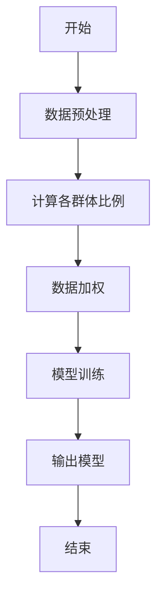
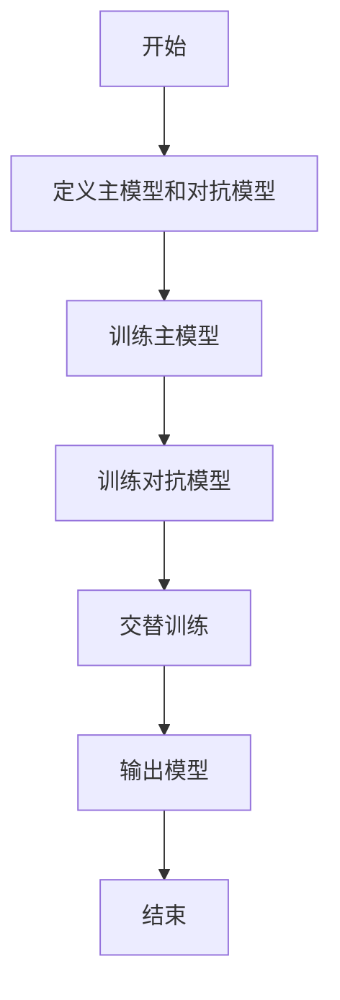
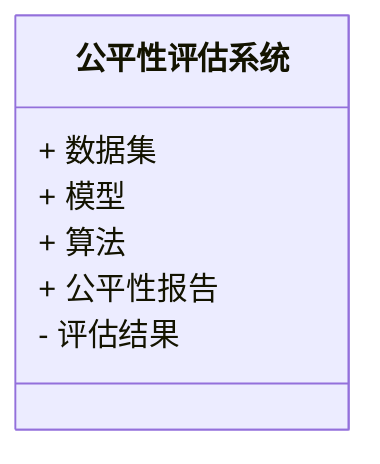
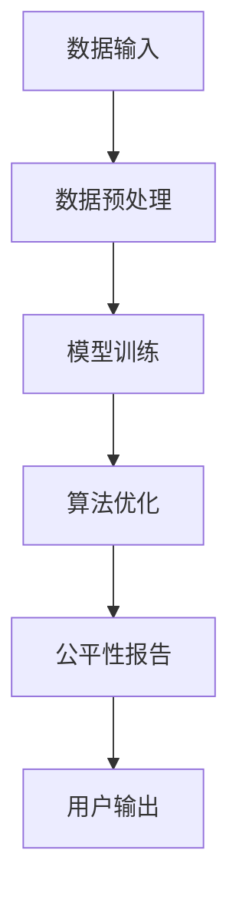
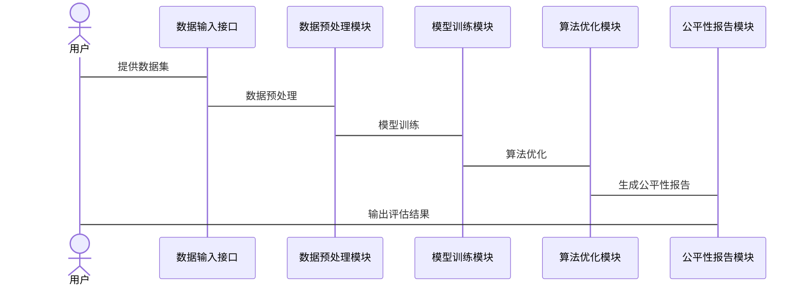

                 


# 公平性评估：确保AI Agent无歧视偏见

---

## 关键词：
- 公平性评估
- AI Agent
- 偏见消除
- 数据公平性
- 算法公平性

---

## 摘要：
随着AI技术的快速发展，AI Agent在各个领域的应用越来越广泛。然而，AI系统中隐含的偏见和歧视问题也随之浮现，这些问题可能对用户和社会造成深远的影响。本文旨在探讨如何通过公平性评估确保AI Agent无歧视偏见，从核心概念、算法原理、系统架构到项目实战，全面解析如何在AI系统中实现公平性评估，消除偏见，确保AI Agent的决策过程公平、公正。

---

## 目录：
1. [背景介绍](#背景介绍)
2. [核心概念与联系](#核心概念与联系)
3. [算法原理讲解](#算法原理讲解)
4. [系统分析与架构设计](#系统分析与架构设计)
5. [项目实战](#项目实战)
6. [最佳实践与小结](#最佳实践与小结)

---

# 背景介绍

## 1.1 问题背景

### 1.1.1 AI Agent的普及与应用
AI Agent（智能体）是一种能够感知环境并采取行动以实现目标的智能系统。随着技术的发展，AI Agent已广泛应用于金融、医疗、司法、招聘等领域。例如，招聘AI Agent可以通过简历筛选和面试安排帮助公司高效招聘人才。

### 1.1.2 公平性问题的普遍性
然而，AI Agent的决策过程可能隐含偏见。例如，招聘AI Agent可能因为历史数据中女性在某些行业比例较低，而对女性候选人的简历打分较低。这种偏见可能导致不公平的决策。

### 1.1.3 公平性问题的严重性
公平性问题不仅影响个人权益，还可能导致社会不公。例如，司法AI Agent的决策偏差可能影响案件判决的公正性。因此，确保AI Agent的公平性是技术和社会的双重需求。

## 1.2 问题描述

### 1.2.1 偏见的定义与表现形式
偏见是指AI系统在决策过程中对某些群体或个体的不公平对待。例如，招聘AI Agent可能对女性候选人的技术能力打分较低。

### 1.2.2 公平性评估的核心目标
公平性评估的目标是检测和消除AI Agent中的偏见，确保其决策过程公平、公正。

### 1.2.3 公平性评估的边界与外延
公平性评估不仅关注结果的公平性，还关注过程的公平性。例如，不仅要确保招聘结果公平，还要确保简历筛选的过程公平。

## 1.3 问题解决的必要性

### 1.3.1 公平性评估的重要性
公平性评估是确保AI Agent可信性和合法性的必要步骤。例如，金融机构需要确保贷款审批AI Agent的决策过程符合反歧视法规。

### 1.3.2 公平性评估的挑战
公平性评估的挑战包括数据偏见、模型复杂性和计算成本。例如，历史数据中某些群体的比例较低可能导致模型对这些群体的预测偏差。

### 1.3.3 公平性评估的解决方案
解决方案包括数据预处理、模型后处理和对抗训练等技术。例如，通过重新加权数据或调整模型输出来消除偏见。

---

## 1.4 本章小结
本章介绍了公平性评估的重要性和必要性，明确了偏见的定义和表现形式，以及公平性评估的核心目标和挑战。通过本章，读者可以理解为什么需要进行公平性评估，并为后续章节的学习奠定基础。

---

## 核心概念与联系

## 2.1 偏见与公平性的定义

### 2.1.1 偏见的定义
偏见是指AI系统在决策过程中对某些群体或个体的不公平对待。例如，招聘AI Agent可能对女性候选人的技术能力打分较低。

### 2.1.2 公平性的定义
公平性是指AI系统在决策过程中对所有群体或个体的公平对待。例如，司法AI Agent的判决应基于事实，而不考虑当事人的种族或性别。

### 2.1.3 偏见与公平性的关系
偏见是公平性的对立面。消除偏见是实现公平性的关键。

## 2.2 数据、模型与算法的关系

### 2.2.1 数据的特征与公平性
数据的特征分布可能影响模型的公平性。例如，历史数据中女性在某些行业的比例较低可能导致模型对女性的预测偏差。

### 2.2.2 模型的公平性评估
模型的公平性评估需要检测模型在不同群体中的表现差异。例如，评估招聘模型对不同性别的候选人的通过率差异。

### 2.2.3 算法的公平性优化
算法的公平性优化需要调整算法以消除偏见。例如，重新加权数据或调整模型输出。

## 2.3 公平性评估的属性特征对比

| 属性       | 偏见      | 公平性    |
|------------|-----------|-----------|
| 数据特征    | 数据中某些群体的比例较低 | 数据中各群体的比例均衡 |
| 模型表现    | 模型对某些群体的预测偏差 | 模型对各群体的预测均衡 |
| 算法调整    | 算法未进行偏见消除处理 | 算法进行了偏见消除处理 |

## 2.4 ER实体关系图

```mermaid
er
actor: 公平性评估者
data: 数据
model: 模型
algorithm: 算法

actor --> data: 提供数据
actor --> model: 定义模型
actor --> algorithm: 定义算法
data --> model: 训练模型
model --> algorithm: 优化算法
algorithm --> actor: 输出公平性评估结果
```

---

## 算法原理讲解

## 3.1 基于Reweighting的公平性算法

### 3.1.1 算法原理
Reweighting算法通过重新加权数据来消除偏见。具体步骤包括：
1. 数据预处理：计算各群体在数据中的比例。
2. 数据加权：对数据中的每个样本赋予不同的权重，以平衡各群体的比例。
3. 模型训练：使用加权数据训练模型。

### 3.1.2 算法流程



### 3.1.3 算法的数学模型
Reweighting算法的数学模型如下：
$$
w_i = \frac{1}{P_i}
$$
其中，$w_i$ 是第i个样本的权重，$P_i$ 是第i个样本所属群体的比例。

### 3.1.4 示例
假设数据集中男性比例为60%，女性比例为40%。Reweighting算法会将男性样本的权重设为$\frac{1}{0.6}$，女性样本的权重设为$\frac{1}{0.4}$，以平衡数据集。

---

## 3.2 基于Adversarial Training的公平性算法

### 3.2.1 算法原理
Adversarial Training算法通过对抗训练来消除偏见。具体步骤包括：
1. 定义一个主模型和一个对抗模型。
2. 主模型尝试预测目标，同时对抗模型尝试预测偏见特征。
3. 通过交替训练主模型和对抗模型，使得主模型的预测结果不再依赖偏见特征。

### 3.2.2 算法流程



### 3.2.3 算法的数学模型
Adversarial Training算法的数学模型如下：
$$
\min_{\theta} \mathbb{E}_{x,y}[ \log p_\theta(y|x)] + \lambda \mathbb{E}_{x,a}[ \log p_\phi(a|x)]
$$
其中，$\theta$ 是主模型的参数，$\phi$ 是对抗模型的参数，$\lambda$ 是调节参数。

### 3.2.4 示例
假设主模型尝试预测职业类别，对抗模型尝试预测性别。通过交替训练，主模型的预测结果不再依赖性别信息，从而消除偏见。

---

## 系统分析与架构设计

## 4.1 问题场景介绍

### 4.1.1 问题场景
本系统旨在评估和消除AI Agent中的偏见，确保其决策过程公平、公正。例如，评估招聘AI Agent的公平性。

### 4.1.2 项目介绍
本项目通过数据预处理、模型训练和算法优化，实现AI Agent的公平性评估。

## 4.2 系统功能设计

### 4.2.1 领域模型类图



## 4.3 系统架构设计



## 4.4 系统接口设计

### 4.4.1 API接口
- 输入接口：接收数据集和模型参数。
- 输出接口：输出公平性评估结果。

### 4.4.2 接口交互流程



---

## 项目实战

## 5.1 环境安装

### 5.1.1 安装依赖
```bash
pip install numpy
pip install scikit-learn
pip install matplotlib
```

## 5.2 核心代码实现

### 5.2.1 Reweighting算法实现
```python
import numpy as np

def reweighting(X, y, sensitive_attribute):
    # 将敏感属性和其它特征分开
    sensitive = X[sensitive_attribute]
    # 计算各群体的比例
    group_proportions = {}
    for s in np.unique(sensitive):
        group_proportions[s] = np.mean(sensitive == s)
    # 数据加权
    weights = {}
    for s in np.unique(sensitive):
        weights[s] = 1 / group_proportions[s]
    # 应用加权
    weighted_X = X.copy()
    weighted_y = y.copy()
    for i in range(len(weighted_X)):
        s = weighted_X.iloc[i][sensitive_attribute]
        weighted_X.iloc[i] *= weights[s]
        weighted_y[i] *= weights[s]
    return weighted_X, weighted_y
```

### 5.2.2 Adversarial Training算法实现
```python
import tensorflow as tf

def adversarial_model():
    # 主模型
    input_layer = tf.keras.layers.Input(shape=(input_dim,))
    hidden_layer = tf.keras.layers.Dense(64, activation='relu')(input_layer)
    output_layer = tf.keras.layers.Dense(1, activation='sigmoid')(hidden_layer)
    model = tf.keras.Model(inputs=input_layer, outputs=output_layer)
    # 对抗模型
    adversarial_layer = tf.keras.layers.Dense(1, activation='sigmoid')(hidden_layer)
    adversarial_model = tf.keras.Model(inputs=input_layer, outputs=adversarial_layer)
    return model, adversarial_model
```

## 5.3 案例分析

### 5.3.1 数据集
- 数据集包含性别（敏感属性）、学历、工作经验、薪资等特征。
- 通过Reweighting算法平衡性别比例，消除招聘中的性别偏见。

### 5.3.2 实施步骤
1. 数据预处理：提取敏感属性和其它特征。
2. 数据加权：根据性别比例计算权重。
3. 模型训练：使用加权数据训练招聘AI Agent。
4. 公平性评估：评估模型的性别公平性。

---

## 最佳实践与小结

## 6.1 最佳实践

### 6.1.1 数据预处理
- 确保数据集的多样性和代表性。
- 检查数据中的偏见，并进行必要的数据平衡。

### 6.1.2 模型优化
- 使用多种算法进行对比实验，选择最优的公平性算法。
- 定期更新模型，以应对数据分布的变化。

## 6.2 小结
通过本文的介绍，读者可以了解公平性评估的重要性和实现方法。从核心概念到算法实现，从系统设计到项目实战，全面掌握了如何确保AI Agent无歧视偏见。

## 6.3 注意事项
- 公平性评估是一个持续的过程，需要定期进行。
- 在实际应用中，需要结合具体业务场景进行调整。

## 6.4 拓展阅读
- 《Algorithmic Justice and the Machine Learning Audit》
- 《Fairness and Machine Learning》

---

## 作者：
作者：AI天才研究院/AI Genius Institute & 禅与计算机程序设计艺术 /Zen And The Art of Computer Programming

