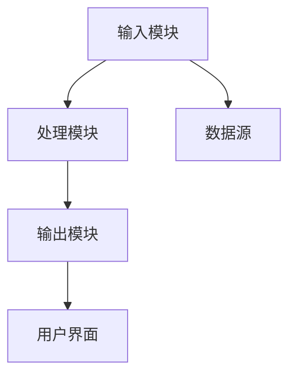

                 


# 内在价值的计算：价值投资者必备技能

## 关键词：内在价值、价值投资、DCF模型、投资决策、现金流折现、投资策略

## 摘要：  
本文深入探讨了内在价值的计算方法，为价值投资者提供了必备的技能和工具。通过分析现金流折现模型（DCF模型）和其他企业价值评估方法，本文详细讲解了内在价值的计算过程，并结合实际案例展示了如何将这些方法应用于投资决策。文章还探讨了内在价值计算中的挑战和未来趋势，为投资者提供了实用的建议。

---

# 第一部分：内在价值计算的核心概念与背景

## 第1章：内在价值的基本概念

### 1.1 内在价值的定义与重要性

#### 1.1.1 什么是内在价值  
内在价值是指资产或企业在未来能够产生的现金流的现值。它是价值投资的核心概念，帮助投资者识别被低估的投资标的。

#### 1.1.2 内在价值在投资中的作用  
内在价值是价值投资的基础，它帮助投资者确定资产的合理价格范围，避免被市场情绪左右。

#### 1.1.3 价值投资的核心理念  
价值投资强调以低于内在价值的价格买入优质资产，长期持有，等待市场重新评估其价值。

### 1.2 价值投资的定义与特点

#### 1.2.1 价值投资的定义  
价值投资是一种投资策略，强调以低于内在价值的价格买入资产，长期持有，追求资本增值。

#### 1.2.2 价值投资的核心特点  
- 长期导向：关注长期价值，而非短期波动。  
- 逆向思维：在市场恐慌时寻找低估机会。  
- 选股标准：注重基本面，寻找具有竞争优势的企业。

#### 1.2.3 价值投资与其他投资策略的区别  
价值投资与成长投资、趋势投资等策略的区别在于其对内在价值的执着追求。

### 1.3 内在价值计算的背景与现状

#### 1.3.1 内在价值计算的背景  
随着金融市场的发展，投资者需要更科学的方法来评估资产的价值，内在价值计算应运而生。

#### 1.3.2 当前内在价值计算的主要方法  
- 现金流折现模型（DCF模型）  
- 市盈率法（P/E）  
- 市净率法（P/B）  
- 股权自由现金流模型（FCFF）  

#### 1.3.3 内在价值计算的挑战与未来趋势  
- 数据获取的困难性  
- 模型假设的合理性  
- 技术与算法的不断进步

---

# 第二部分：内在价值计算的核心方法论

## 第2章：内在价值计算的核心模型

### 2.1 现金流折现模型（DCF模型）

#### 2.1.1 DCF模型的基本原理  
DCF模型通过将未来现金流折现到当前时点，计算资产的内在价值。公式如下：

$$ PV = \frac{CF}{(1 + r)^t} $$

其中，$CF$ 是未来现金流，$r$ 是折现率，$t$ 是时间。

#### 2.1.2 DCF模型的三种主要形式  
- 简单现金流折现模型  
- 加权平均资本成本（WACC）模型  
- 股权资本成本模型  

#### 2.1.3 DCF模型的应用场景与限制  
- 适用于稳定增长的企业  
- 依赖于合理的假设和数据  

### 2.2 企业价值评估的其他方法

#### 2.2.1 市盈率法  
市盈率法通过比较企业的市盈率与行业平均水平，评估其价值。公式如下：

$$ PE = \frac{P}{E} $$

其中，$P$ 是股价，$E$ 是每股收益。

#### 2.2.2 市净率法  
市净率法通过比较企业的市净率与行业平均水平，评估其价值。公式如下：

$$ PB = \frac{P}{B} $$

其中，$P$ 是股价，$B$ 是每股净资产。

#### 2.2.3 股权自由现金流模型  
股权自由现金流模型通过计算股权自由现金流的现值，评估企业的内在价值。

---

# 第三部分：内在价值计算的算法与数学模型

## 第3章：现金流折现模型的数学原理

### 3.1 现金流折现的基本公式

现金流折现的基本公式为：

$$ PV = \sum_{t=1}^{n} \frac{CF_t}{(1 + r)^t} $$

其中，$CF_t$ 是第$t$年的现金流，$r$ 是折现率，$n$ 是现金流的期限。

### 3.2 加权平均资本成本（WACC）的计算

WACC的计算公式为：

$$ WACC = \frac{D}{D+E} \times r_d \times (1 - t) + \frac{E}{D+E} \times r_e $$

其中，$D$ 是债务总额，$E$ 是股权总额，$r_d$ 是债务成本，$r_e$ 是股权成本，$t$ 是税率。

### 3.3 非正常年份现金流的处理

对于非正常年份的现金流，可以采用以下方法处理：

- 线性插值法  
- 平均法  
- 回归分析法  

---

# 第四部分：系统分析与架构设计

## 第4章：内在价值计算系统的架构设计

### 4.1 系统功能设计

#### 4.1.1 系统输入模块  
- 输入企业财务数据  
- 输入市场数据  

#### 4.1.2 系统处理模块  
- 计算现金流  
- 计算折现率  
- 计算内在价值  

#### 4.1.3 系统输出模块  
- 输出内在价值报告  
- 输出可视化图表  

### 4.2 系统架构设计

#### 4.2.1 系统架构图（Mermaid）



---

# 第五部分：项目实战与代码实现

## 第5章：项目实战

### 5.1 环境配置

#### 5.1.1 安装必要的库  
- pandas  
- numpy  
- matplotlib  

### 5.2 核心代码实现

#### 5.2.1 现金流折现的实现

```python
import numpy as np

def npv(cash_flows, discount_rate):
    return np.npv(discount_rate, *cash_flows)

cash_flows = [-100, 50, 60, 70]
discount_rate = 0.1
print(npv(cash_flows, discount_rate))
```

#### 5.2.2 WACC的实现

```python
def wacc(total_debt, total_equity, cost_debt, cost_equity, tax_rate):
    wacc = (total_debt / (total_debt + total_equity)) * cost_debt * (1 - tax_rate) + \
           (total_equity / (total_debt + total_equity)) * cost_equity
    return wacc

total_debt = 100
total_equity = 200
cost_debt = 0.05
cost_equity = 0.10
tax_rate = 0.20
print(wacc(total_debt, total_equity, cost_debt, cost_equity, tax_rate))
```

---

# 第六部分：最佳实践与总结

## 第6章：最佳实践

### 6.1 小结

内在价值的计算是价值投资者的核心技能，通过DCF模型和其他方法，投资者可以科学地评估资产的价值。

### 6.2 注意事项

- 数据的准确性  
- 假设的合理性  
- 模型的适用性  

### 6.3 未来趋势

- AI技术在价值评估中的应用  
- 大数据驱动的内在价值计算  

### 6.4 拓展阅读

- 《投资学》  
- 《价值投资实战策略》  

---

# 作者：AI天才研究院/AI Genius Institute & 禅与计算机程序设计艺术/Zen And The Art of Computer Programming

